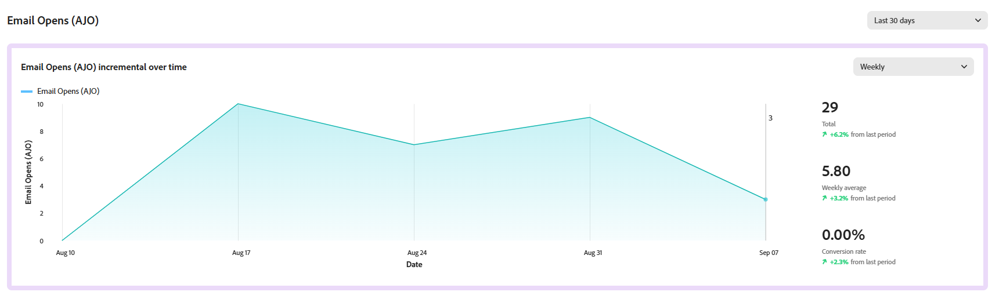

# Mesures {#experiment-accelerator-metrics}

La page **[!UICONTROL Mesures]** affiche les mesures de succès des expériences Journey Optimizer et Target en un même endroit, ce qui permet de surveiller les performances, de les comparer et d’obtenir des informations plus détaillées.

## Tableau de bord {#dashboard}

Lorsque vous accédez à l’onglet **[!UICONTROL Mesures]**, toutes les mesures de succès disponibles de Journey Optimizer et d’Adobe Target sont répertoriées dans une vue consolidée afin de vous aider à effectuer le suivi des performances de toutes les initiatives, à comparer les résultats et à identifier rapidement les domaines qui nécessitent votre attention.

Accédez aux filtres en cliquant sur , qui propose des options spécifiques au contexte, telles que le filtrage par **[!UICONTROL Source]** ou selon le critère **[!UICONTROL Utilisé dans des expériences actives]**.

Vous pouvez également rechercher rapidement une mesure en saisissant son nom dans la barre de recherche.

## Détails de la mesure {#metric-details}

### Évolution au fil du temps

Le graphique **[!UICONTROL Évolution au fil du temps]** fournit une répartition visuelle des tendances de la mesure sélectionnée sur une période donnée. Utilisez le menu déroulant pour basculer entre la vue quotidienne et la vue hebdomadaire afin d’ajuster le niveau de granularité.

Les valeurs de synthèse suivantes sont disponibles pour une référence rapide :

* **[!UICONTROL Total]** : valeur cumulée de la mesure sélectionnée au cours de la période de création de rapports.

* **[!UICONTROL Moyenne]** : valeur type de la mesure calculée sur la période sélectionnée. En équilibrant les fluctuations quotidiennes ou hebdomadaires, il fournit une image plus claire des performances normales et peut être utilisé comme référence pour la comparaison.

* **[!UICONTROL Taux de conversion]** : pourcentage de profils qui ont effectué l’action souhaitée (par exemple, achat, inscription) après avoir vu le traitement.

Chaque valeur inclut un pourcentage d’évolution par rapport à la période précédente, ce qui permet de voir facilement si les performances s’améliorent, diminuent ou restent stables.

### Effet d’expérience

Cette section affiche toutes les expériences actives au cours de la période sélectionnée (90 derniers jours, 30 derniers jours ou 7 derniers jours) et met en évidence leur contribution à la mesure.

Les mesures suivantes sont disponibles :

* **[!UICONTROL Effet élévateur]** : mesure de l’amélioration en pourcentage du taux de conversion d’un traitement donné par rapport à la ligne de base.

* **[!UICONTROL Confiance]** : preuves qu’un traitement donné est le même que le traitement de la ligne de base. [En savoir plus](../content-management/experiment-calculations.md#understand-confidence)

* **[!UICONTROL Contribution]** : proportion de la modification globale de la mesure qui peut être attribuée à une expérience ou à un traitement spécifique, ce qui permet d’identifier les initiatives qui ont le plus d’impact relatif.
