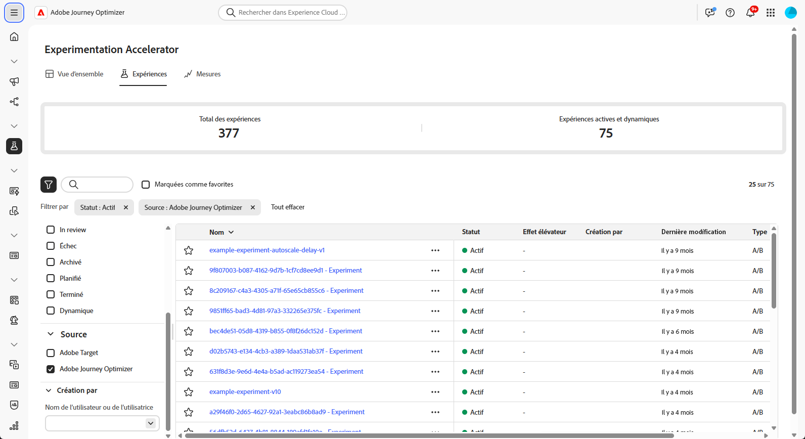
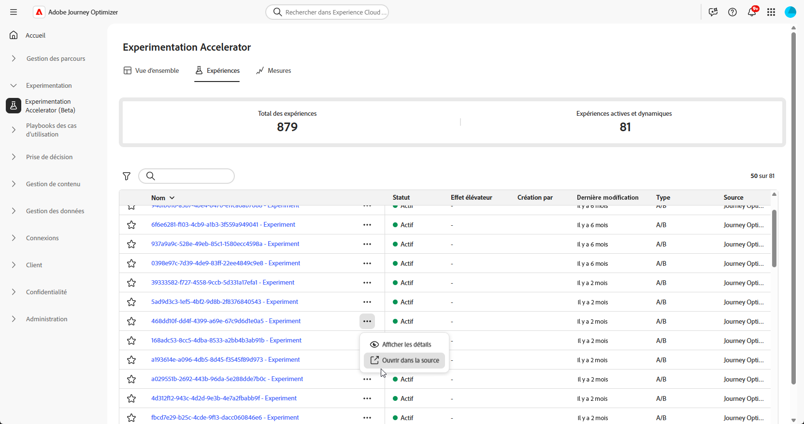
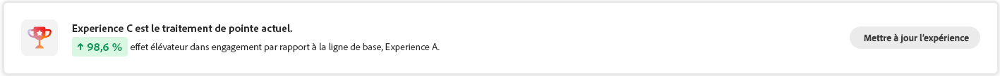
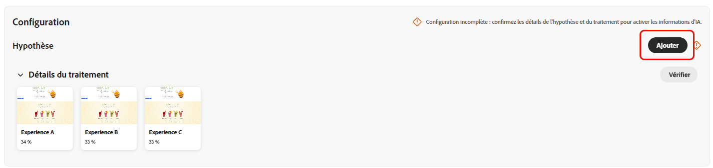
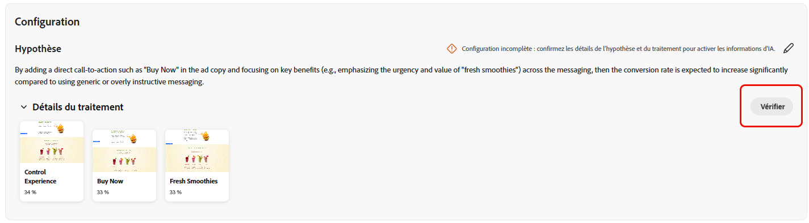
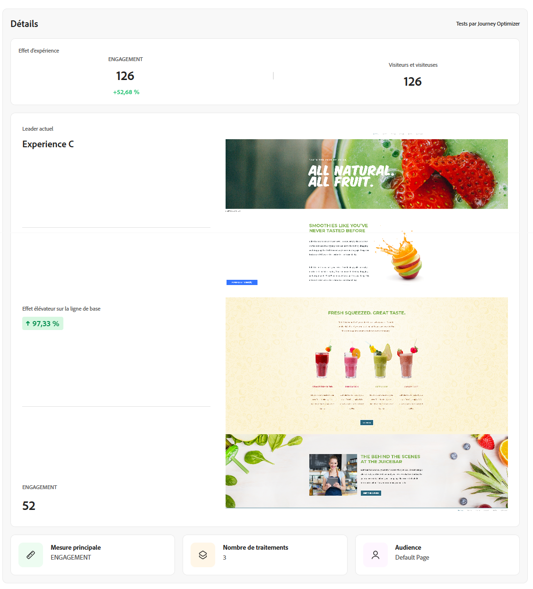
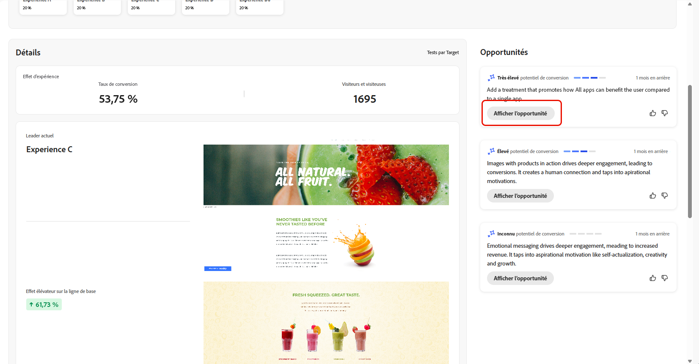
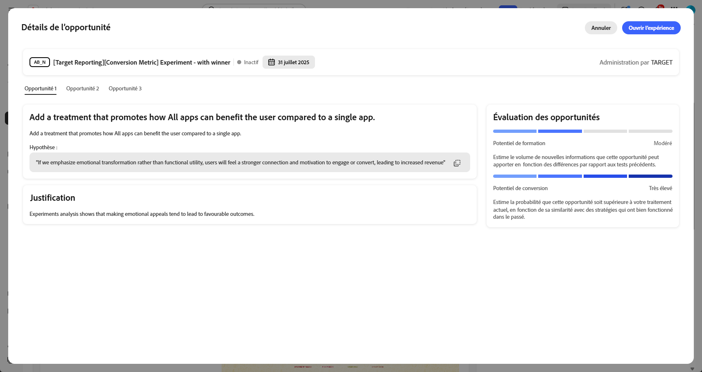
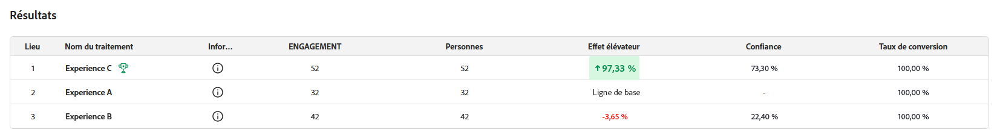
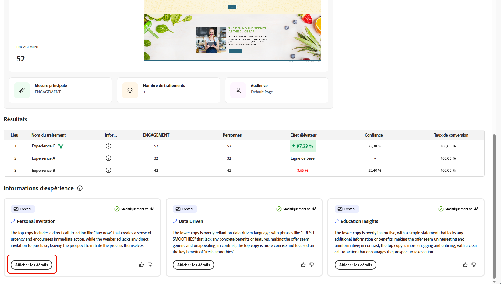

# Suivre les expériences {#monitor}

L’onglet **[!UICONTROL Expériences]** centralise le suivi et l’analyse des tests d’Adobe Journey Optimizer et d’Adobe Target. Vous pouvez afficher toutes les expériences, passer en revue les KPI et filtrer ou rechercher des tests spécifiques.

## Tableau de bord {#dashboard}

Lorsque vous accédez à l’onglet Expériences, toutes les expériences disponibles dans Journey Optimizer et Adobe Target sont répertoriées dans une vue consolidée. Vous pouvez ainsi examiner et comparer rapidement des expériences sur les deux plateformes en un même endroit.
La liste Expériences comprend les éléments suivants :

* Expériences Journey Optimizer créées dans des campagnes ou des parcours.

* Les expériences Adobe Target sont disponibles dans le sandbox de production par défaut de Journey Optimizer lié à la même organisation IMS.

La section KPI fournit des mesures clés, y compris le nombre total d’expériences créées et le nombre d’expériences en cours, offrant un instantané de l’activité d’expérimentation globale.

Accédez aux filtres en cliquant sur , qui propose des options spécifiques au contexte, telles que les filtres **[!UICONTROL Type]**, **[!UICONTROL Marqué comme favori]**, **[!UICONTROL Statut]** et **[!UICONTROL Source]**. Par exemple, vous pouvez utiliser un filtre pour afficher uniquement les expériences actives de Journey Optimizer.

Vous pouvez également trouver rapidement votre expérience en saisissant son nom dans la barre de recherche.

## Surveiller vos expériences {#monitor-page}

Pour accéder à vos expériences et les surveiller, sélectionnez l’expérience configurée précédemment dans votre liste d’expériences à partir de l’onglet **[!UICONTROL Expériences]** ou utilisez le menu avancé pour **[!UICONTROL Afficher les détails]** ou **[!UICONTROL Ouvrir dans la source]**.

La page des détails de l’expérience est divisée en plusieurs sections :

* [Résultat de l’expérience](#experiment-outcome)
* [Hypothèse](#hypothesis)
* [Détails](#details)
* [Opportunités](#opportunities)
* [Résultats](#results)
* [Informations sur l’expérience](#insights)

### Résultat de l’expérience {#experiment-outcome}

Le **[!UICONTROL résultat de l’expérience]** vous donne un aperçu rapide de la variation gagnante dans votre expérience.

### Configurer {#set-up}

L’**[!UICONTROL hypothèse]** capture les modifications prévues à tester et documente l’impact attendu sur la mesure principale. Définir une **[!UICONTROL hypothèse]** claire garantit que chaque expérience a un objectif mesurable, ce qui facilite l’évaluation des résultats et permet de déterminer si les modifications apportées conduisent à des améliorations significatives.

Notez que pour que les [informations d’expérience](#insights) soient générées, vous devez confirmer les détails de l’hypothèse et du traitement, ainsi que la signification statistique à atteindre.

1. Cliquez sur **[!UICONTROL Ajouter]** pour créer une **[!UICONTROL Hypothèse]** pour votre expérience.

   

1. Saisissez votre **[!UICONTROL hypothèse]** en détaillant les modifications apportées et la manière dont elles affecteront la mesure principale.

   Cliquez sur **[!UICONTROL Enregistrer]**.

1. Cliquez sur **[!UICONTROL Vérifier]** pour ajouter ou remplacer l’image pour chaque traitement.

   

1. Les images du traitement sont générées automatiquement, mais si nécessaire, vous pouvez sélectionner **[!UICONTROL Ajouter une image]** ou **[!UICONTROL Remplacer l’image]** pour charger une copie d’écran de vos fichiers locaux pour vos **[!UICONTROL Traitements]**.

   Notez que la copie d’écran doit capturer la page entière.

1. Cliquez sur l’icône  pour mettre à jour votre **[!UICONTROL hypothèse]** si nécessaire.

Une fois la configuration de votre **[!UICONTROL hypothèse]** terminée, vous obtiendrez des [informations](#insights) et des [opportunités](#opportunities) précieuses.

### Détails {#details}

Le widget **[!UICONTROL Effet d’expérience]** fournit une vue détaillée de la manière dont votre expérience a influencé les segments d’audience ciblés. Il présente des indicateurs clés de performance qui vous permettent d’évaluer l’engagement et le comportement, notamment :

* **[!UICONTROL Mesure de succès]** de Journey Optimizer ou **[!UICONTROL mesure principale]** d’Adobe Target en fonction de ce qui a été configuré lors de la création de l’expérience.

* **[!UICONTROL Visiteurs]** : nombre total de visiteurs et visiteuses uniques exposés à l’expérience.

Vous pouvez également afficher un instantané en temps réel des performances du traitement principal au moyen des mesures suivantes :

* **[!UICONTROL Leader actuel]** : identifie le traitement offrant actuellement les meilleures performances.

* **[!UICONTROL Effet élévateur sur la ligne de base]** : mesure l’amélioration en pourcentage du traitement principal par rapport au contrôle ou à la ligne de base.

* **[!UICONTROL Mesure de succès]** de Journey Optimizer ou **[!UICONTROL mesure principale]** d’Adobe Target en fonction de ce qui a été configuré lors de la création de l’expérience.

Au bas du widget, vous pouvez trouver un résumé concis de la configuration de votre expérience, notamment :

* **[!UICONTROL Mesure de succès]** de Journey Optimizer ou **[!UICONTROL mesure principale]** d’Adobe Target en fonction de ce qui a été configuré lors de la création de l’expérience.

* **[!UICONTROL Nombre de traitements]** : nombre total de variations testées.

* **[!UICONTROL Audience]** : segments utilisateurs définis ciblés pendant l’expérience.

### Opportunités {#opportunities}

>[!AVAILABILITY]
>
>La fonctionnalité Opportunités est limitée aux expériences avec des modifications textuelles.

Le panneau **[!UICONTROL Opportunités]** affiche des recommandations générées par l’IA conçues pour améliorer les performances de test et s’aligner sur les objectifs commerciaux et les KPI plus généraux.

Notez que pour que des opportunités d’expérience soient générées, vous devez d’abord [confirmer les détails de l’hypothèse et du traitement](#set-up).

1. Parcourez l’opportunité suggérée et cliquez sur **[!UICONTROL Afficher l’opportunité]**.

   

1. La sélection d’une opportunité ouvre la fenêtre **Détails de l’opportunité** qui décrit un traitement ou une variation spécifique suggéré par le Journey Optimizer Experimentation Accelerator. Cette vue comprend les éléments suivants :

   * **[!UICONTROL Hypothèse]** : hypothèse générée par l’IA qui explique le résultat attendu du traitement suggéré.

   * **[!UICONTROL Justification]** : explication de la raison pour laquelle le Journey Optimizer Experimentation Accelerator a suggéré cette opportunité.

   * **[!UICONTROL Évaluation des opportunités]** : double évaluation de la recommandation basée sur :

      * **[!UICONTROL Potentiel d’apprentissage]** : estimation de la valeur ajoutée que cette opportunité pourrait apporter, en fonction de son degré de différence par rapport à ce qui a déjà été testé auparavant.

      * **[!UICONTROL Potentiel de conversion]** : estimation de la probabilité que le traitement soit plus efficace que les traitements actuels, basée sur les similitudes avec des stratégies qui ont historiquement bien fonctionné.
   <!--
   * **[!UICONTROL New text treatment example]**: Words or phrases that demonstrate the style the AI recommends using.
   -->

   

1. Vous pouvez ensuite l’ajouter directement à votre expérience en sélectionnant **[!UICONTROL Ouvrir l’expérience]**.

1. Si l’expérience d’origine a été créée et gérée dans Adobe Journey Optimizer, cette action ouvre le **[!UICONTROL panneau d’expérimentation de contenu]** dans cette campagne.

   Pour les expériences provenant de **[!DNL Adobe Target]**, les modifications suggérées seront plutôt chargées dans le workflow d’expérimentation de **[!DNL Adobe Target]**.

   ➡️ [En savoir plus dans la documentation Adobe Target](https://experienceleague.adobe.com/fr/docs/target/using/activities/abtest/test-ab).

1. Dans la vue d’expérience, les mêmes IA **[!UICONTROL Opportunités d’expérimentation]** que celles affichées par le Journey Optimizer Experimentation Accelerator sont accessibles.

   Sélectionnez **[!UICONTROL Afficher]** pour ouvrir les détails de l’opportunité.

1. Pour appliquer les modifications suggérées, sélectionnez **[!UICONTROL Modifier l’expérience]** pour modifier directement l’expérience existante.

### Résultats {#results}

Le tableau **[!UICONTROL Résultats]** fournit une répartition détaillée des performances de chaque traitement au sein d’une expérience. Ces indicateurs permettent d’évaluer l’efficacité, l’interaction client et l’impact global sur les principaux résultats commerciaux :

* **[!UICONTROL Place]** : position dans le classement du traitement en fonction de ses performances par rapport à d’autres traitements.

* **[!UICONTROL Mesure de succès]** de Journey Optimizer ou **[!UICONTROL mesure principale]** d’Adobe Target en fonction de ce qui a été configuré lors de la création de l’expérience.

* **[!UICONTROL Personnes]** : nombre de profils d’utilisateurs et d’utilisatrices identifiés comme cibles de vos messages.

* **[!UICONTROL Effet élévateur]** : mesure de l’amélioration en pourcentage du taux de conversion d’un traitement donné par rapport à la ligne de base.

* **[!UICONTROL Confiance]** : preuves qu’un traitement donné est le même que le traitement de la ligne de base. [En savoir plus](../content-management/experiment-calculations.md#understand-confidence)

* **[!UICONTROL Taux de conversion]** : pourcentage de profils qui ont effectué l’action souhaitée (par exemple, achat, inscription) après avoir vu le traitement.

### Informations d’expérience {#insights}

>[!AVAILABILITY]
>
>La fonctionnalité Informations d’expérience est limitée aux expériences avec des modifications textuelles.

Les **[!UICONTROL informations d’expérience]** sont des enseignements générés par l’IA provenant de cette expérience. Ces informations sont disponibles une fois que l’expérience a atteint sa signification statistique et fournissent une compréhension contextuelle de ce qui a contribué à son succès. Elles mettent en évidence les caractéristiques clés présentes dans le traitement gagnant, distinctes du contrôle, qui ont probablement influencé le résultat.

Notez que pour que des informations d’expérience soient générées, vous devez d’abord [confirmer les détails de l’hypothèse et du traitement](#set-up) et la signification statistique à atteindre.

Cliquez sur **[!UICONTROL Afficher les détails]** pour en savoir plus sur chaque information.

 

