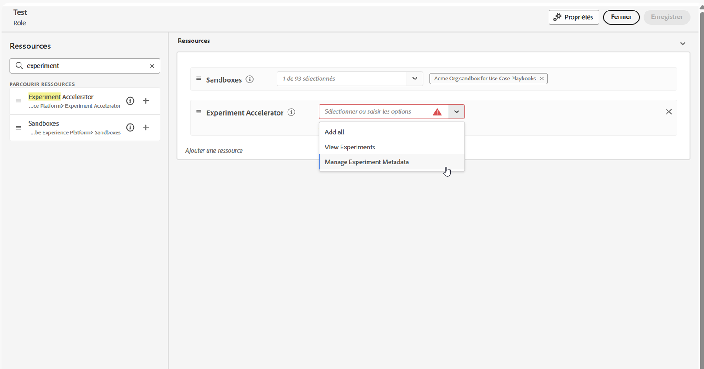

# Prise en main du Journey Optimizer Experimentation Accelerator {#content-experiment}

>[!BEGINSHADEBOX]

* **[Prise en main du Journey Optimizer Experimentation Accelerator](experiment-accelerator.md)**
* [Utilisation des données dans l’IA avec Journey Optimizer Experimentation Accelerator](experiment-accelerator-security.md)
* [Bonnes pratiques relatives à Journey Optimizer Experimentation Accelerator](experiment-accelerator-best-practices.md)
* [Surveiller les expériences](experiment-accelerator-monitor.md)
* [Mesures d’expérimentation](experiment-accelerator-metrics.md)

>[!ENDSHADEBOX]

>[!AVAILABILITY]
>
>**Journey Optimizer Experimentation Accelerator** nécessite que les clients disposent d&#39;une licence pour Adobe Target ou Adobe Journey Optimizer.

Le **Journey Optimizer Experimentation Accelerator** est un outil puissant conçu pour rationaliser et améliorer le processus d’expérimentation. En s’intégrant à Adobe Target et Adobe Journey Optimizer, il fournit une plateforme centralisée pour gérer, analyser et optimiser les expériences. Exploitant les informations basées sur l’IA et les tests adaptatifs, le Journey Optimizer Experimentation Accelerator vous permet de prendre des décisions basées sur les données, d’améliorer les stratégies marketing et de générer des résultats mesurables.

Les principaux avantages sont les suivants :

* **Expérimentation plus rapide** : exécutez des tests adaptatifs permanents avec des modèles qui s’ajustent au fil du temps.

* **Plateforme unifiée** : gérez toutes les expériences d’Adobe Target et de Journey Optimizer au même endroit.

* **Informations basées sur l’IA** : découvrez automatiquement les résultats clés, les facteurs de performance et les nouvelles opportunités.

* **Ciblage plus intelligent** : utilisez des données comportementales et de contenu pour donner la priorité aux expériences à fort impact.

* **Surveillance des KPI** : suivez les mesures telles que l’effet élévateur et le degré de confiance dans toutes les expériences.

* **Collaboration transparent** : partagez facilement les résultats et gérez les rôles d’équipe avec des alertes en temps réel.

## Accéder à Journey Optimizer Experimentation Accelerator

Après avoir [créé et configuré votre expérience](content-experiment.md) et envoyé vos campagnes ou parcours à vos profils, vous pouvez accéder au **[!UICONTROL Journey Optimizer Experimentation Accelerator]** pour mieux comprendre les performances de votre expérience.

Vous pouvez accéder à **[!UICONTROL Journey Optimizer Experimentation Accelerator]** à partir du menu de gauche de la liste déroulante [!UICONTROL Expérimentation] ou via le sélecteur d’applications. Notez que les utilisateurs disposant uniquement d’une licence Target peuvent y accéder uniquement par le biais du sélecteur d’applications.

Les expériences disponibles dépendent de votre configuration :

* **Pour les utilisateurs de Adobe Journey Optimizer** : les expériences configurées dans le sandbox de votre organisation activée sont automatiquement incluses.

* **Pour les utilisateurs d’Adobe Target avec Journey Optimizer** : toutes les activités A/B de Target apparaissent dans **[!UICONTROL Journey Optimizer Experimentation Accelerator]** dans le sandbox de production de Journey Optimizer.

* **Pour les utilisateurs Adobe Target uniquement** : toutes les activités A/B de votre organisation Target sont incluses dans le sandbox de production de Journey Optimizer.

Pour utiliser **[!UICONTROL Journey Optimizer Experimentation Accelerator]**, vous devez accéder au sandbox et disposer des autorisations associées suivantes :

* **[!UICONTROL Afficher les expériences]**
* **[!UICONTROL Gérer les métadonnées d’expérience]**

+++ Découvrez comment attribuer des autorisations liées à l’expérience

1. Dans le produit **[!DNL Permissions]**, accédez à l’onglet **[!UICONTROL Rôles]** et sélectionnez le **[!UICONTROL Rôle]** souhaité.

1. Cliquez sur **[!UICONTROL Modifier]** pour modifier les autorisations.

1. Ajoutez la ressource **[!UICONTROL Accélérateur d’expériences]**, puis sélectionnez **[!UICONTROL Afficher les expériences]** et/ou **[!UICONTROL Gérer les métadonnées d’expérience]** dans le menu déroulant.

   

1. Cliquez sur **[!UICONTROL Enregistrer]** pour appliquer vos modifications.

Les autorisations des personnes déjà affectées à ce rôle seront automatiquement mises à jour.

Pour attribuer ce rôle à de nouvelles personnes, procédez comme suit :

1. Accédez à l’onglet **[!UICONTROL Utilisateurs]** dans le tableau de bord Rôles et cliquez sur **[!UICONTROL Ajouter un utilisateur]**.

1. Saisissez le nom de la personne, son adresse e-mail ou choisissez dans la liste, puis cliquez sur **[!UICONTROL Enregistrer]**.

   Si le profil de l’utilisateur ou de l’utilisatrice n’a pas été créé auparavant, consultez cette [documentation](https://experienceleague.adobe.com/fr/docs/experience-platform/access-control/abac/permissions-ui/users).

La personne recevra un e-mail avec des instructions pour accéder à votre instance.

+++

<!--table style="table-layout:fixed"><tr style="border: 0;">
<td>

<strong><a href="experiment-accelerator-overview.md">Overview</a></strong>

</td>
<td>

<strong><a href="experiment-accelerator-monitor.md">Experiments</a></strong>

</td>
<td>

<strong><a href="experiment-accelerator-metrics.md">Metrics</a></strong>

</td>
</tr></table-->
