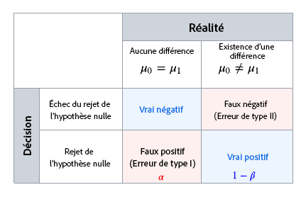
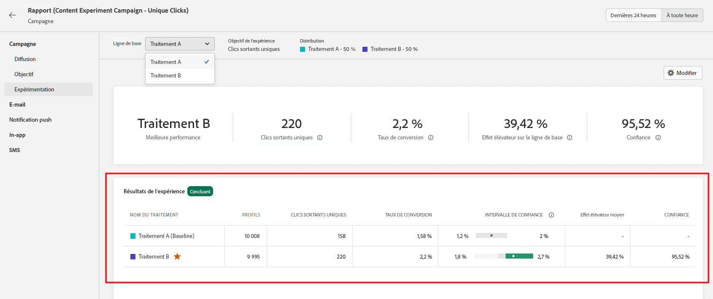

# Présentation des calculs statistiques {#experiment-calculations}

Cet article décrit les calculs statistiques utilisés lors de l’exécution d’expériences dans Adobe Journey Optimizer.

L’expérimentation utilise des [méthodes statistiques avancées](../content-management/assets/confidence_sequence_technical_details.pdf) pour calculer les **Séquences de confiance** et les degrés de **confiance**, qui vous permettent d’exécuter vos expériences aussi longtemps que nécessaire, ou encore de surveiller vos résultats en continu.

Cet article décrit le fonctionnement de l’expérimentation et présente de façon intuitive les **Séquences de confiance valides à tout moment** d’Adobe.

Pour les personnes expertes, les détails techniques et les références sont présentés sur [cette page](../content-management/assets/confidence_sequence_technical_details.pdf).

## Tests statistiques et erreurs de contrôle {#statistical-testing}

Lorsque vous exécutez une expérience, vous essayez de déterminer s’il existe une différence entre deux populations et la probabilité que cette différence soit due au hasard.

Il existe généralement deux hypothèses :

* la valeur **Hypothèse nulle** signifie qu’il n’y a aucun effet sur le traitement.
* la valeur **Autre hypothèse** signifie qu’il y a un effet sur le traitement.

Dans la signification statistique, l’objectif est d’évaluer la force des preuves pour rejeter l’hypothèse nulle. Un point important à noter est que la signification statistique est utilisée pour juger de la probabilité que les traitements soient différents, et non de la probabilité qu’ils soient réussis. C’est pourquoi la signification statistique est utilisée conjointement avec l’**effet élévateur**.

Une expérimentation efficace nécessite de prendre en compte différents types d’erreurs qui pourraient provoquer des inférences incorrectes.

Le tableau ci-dessus illustre les différents types d’erreurs :

* **Faux positifs (erreurs de type I)** : sont un rejet incorrect de l’hypothèse nulle, alors qu’en fait elle est vraie. Dans le contexte des expériences en ligne, cela signifie que nous concluons à tort que la mesure des résultats est différente entre chaque traitement, alors qu’elle est en réalité la même.
   Nous sélectionnons généralement un seuil avant de lancer l’expérience`\alpha`. Une fois l’expérience terminée, la valeur `p-value` est calculée et nous rejetons la valeur `null if p < \alpha`. Le choix d’une valeur `/alpha` est basé sur les conséquences liées à l’obtention de la mauvaise réponse. Par exemple, dans un essai clinique où la vie d’une personne pourrait être affectée, vous pourriez choisir la valeur `\alpha = 0.005`. Le seuil `\alpha = 0.05` est couramment utilisé dans l’expérimentation en ligne. Cela signifie qu’à long terme, nous nous attendons à ce que 5 expériences sur 100 soient des faux positifs.

* **Faux négatifs (erreurs de type II)** : signifie que nous ne parvenons pas à rejeter l’hypothèse nulle bien qu’elle soit fausse. Pour les expériences, cela signifie que nous ne rejetons pas l’hypothèse nulle, alors qu’en fait elle est différente. Pour contrôler ce type d’erreur, nous avons généralement besoin d’un nombre suffisant d’utilisateurs dans notre expérience pour garantir une certaine force, définie comme `1 - \beta`(soit 1 moins la probabilité d’erreur de type II).

La plupart des techniques d’inférence statistique nécessitent que vous fixiez préalablement la taille de l’échantillon, en fonction de la taille de l’effet que vous souhaitez déterminer, ainsi que votre tolérance d’erreur (`\alpha` et `\beta`) tout cela à l’avance. Toutefois, la méthodologie d’Adobe Journey Optimizer est conçue pour vous permettre d’examiner en permanence vos résultats, quelle que soit la taille de l’échantillon.

## Méthodologie statistique d’Adobe : séquences de confiance valides à tout moment

Une **Séquence de confiance** est l’analogie séquentielle d’un **Intervalle de confiance**, par exemple, si vous répétez vos expériences cent fois, et calculez une estimation de la mesure moyenne et de sa séquence de confiance de 95 % associée pour chaque nouvel utilisateur qui entre dans l’expérience, Une séquence de confiance de 95 % inclut la valeur réelle de la mesure dans 95 des 100 expériences exécutées. Un intervalle de confiance de 95 % ne pouvait être calculé qu’une seule fois par expérience afin de fournir la même garantie de couverture de 95 % ; et pas avec chaque nouvel utilisateur. Les séquences de confiance vous permettent donc de surveiller en permanence les expériences, sans augmenter les taux d’erreurs Faux Positifs.

La différence entre les séquences de confiance et les intervalles de confiance pour une seule expérience est illustrée dans l’animation ci-dessous :

Les **Séquences de confiance** réorientent l’objectif des expériences vers l’estimation plutôt que vers les tests d’hypothèse, c’est-à-dire qu’elles se concentrent sur une estimation précise de la différence de moyenne entre les traitements, plutôt que sur la nécessité de rejeter ou non une hypothèse nulle basée sur un seuil de signification statistique.

Toutefois, de la même manière qu’il existe une relation entre `p-values`, ou la **Confiance** et les **Intervalles de confiance**, il existe également une relation entre les **séquences de confiance** et les `p-values` valides à tout moment, ou la Confiance valide à tout moment. Étant donné la familiarité des quantités comme le degré de confiance, Adobe fournit dans ses rapports à la fois les **Séquences de confiance** et la Confiance valide à tout moment.

Les fondements théoriques des **Séquences de confiance** proviennent de l’étude de séquences de variables aléatoires connues sous le nom de martingales. Voici quelques-uns des principaux résultats pour les personnes expertes, mais les points essentiels à l’intention des praticiens et des praticiennes sont clairs :

>[!NOTE]
>
>Les séquences de confiance peuvent être interprétées comme des analogies séquentielles sécurisées d’intervalles de confiance. Avec des intervalles de confiance, vous ne pouvez interpréter l’expérience qu’une fois que vous avez atteint la taille d’échantillon prédéterminée. Toutefois, avec les séquences de confiance, vous pouvez consulter et interpréter les données de vos expériences à tout moment, et arrêter ou continuer les expériences en toute sécurité. L’attribut Confiance valide à tout moment correspondant, ou `p-value`, peut également être interprété en toute sécurité.

Il est important de noter que, puisque les séquences de confiance sont « valides à tout moment », elles seront plus conservatrices qu’une méthodologie d’horizon fixe utilisée à la même taille d’échantillon. Les limites de la séquence de confiance sont généralement plus larges qu’un calcul d’intervalle de confiance, tandis que le degré de confiance valide à tout moment sera plus petit qu’un calcul de confiance à horizon fixe. L’avantage de ce conventionnalisme est que vous pouvez en toute sécurité interpréter vos résultats à tout moment.

## Déclaration d’une expérience comme étant concluante

Chaque fois que vous consultez le rapport d’expérimentation, Adobe analyse les données accumulées jusqu’à présent dans l’expérience et déclare une expérience « concluante » lorsque le degré de confiance valide franchit un seuil de 95 % pour au moins un des traitements.

À ce stade, le traitement qui présente les meilleures performances (en fonction du taux de conversion ou de la valeur de mesure normalisée par le profil) est mis en surbrillance dans la partie supérieure de l’écran du rapport et signalé par une étoile dans le rapport tabulaire. Seuls les traitements dont le degré de confiance est supérieur à 95 %, ainsi que la ligne de base, sont pris en compte dans cette classification.

Lorsqu’il existe plus de deux traitements, le lien de correction Bonferroni est utilisé pour corriger les problèmes de comparaison multiples et contrôler le taux d’erreur par famille. Dans ce scénario, il est également possible qu’il existe plusieurs traitements dont le degré de confiance est supérieur à 95 % et dont les intervalles de confiance se chevauchent. Dans ce cas, Adobe Journey Optimizer déclarera celui qui a le taux de conversion le plus élevé (ou la valeur de mesure normalisée par le profil) comme le plus performant.
