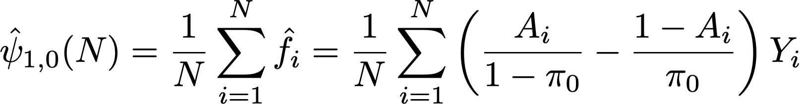

# Comprendre les calculs statistiques dans le rapport d’expérience {#experiment-report-calculations}

Cette page présente les calculs statistiques détaillés utilisés dans le rapport d’expérience pour les campagnes dans Adobe Journey Optimizer.

Notez que cette page est destinée aux utilisateurs et utilisatrices techniques.

## Taux de conversion

Le taux de conversion ou la **moyenne**, μν pour chaque traitement `ν` dans une expérience est défini(e) comme le rapport de la somme de la mesure par rapport au nombre de profils affectés à cette mesure, Nν :

{width="125" align="center"}

Ici, Yiν est la valeur de la mesure d’objectif pour chaque profil `i` qui a été affecté à une variante donnée *ν*. Lorsque la mesure de l’objectif est une mesure « unique », c’est-à-dire qu’il s’agit d’un décompte du nombre de profils effectuant une action particulière, il s’affiche sous forme de taux de conversion et est formaté en tant que pourcentage. Lorsque la mesure est une mesure « comptage » ou « valeur totale » (par exemple, ouvertures d’e-mails, chiffre d’affaires, respectivement), l’estimation moyenne de la mesure s’affiche sous la forme « Nombre par profil » ou « Valeur par profil ».

Si nécessaire, l’écart-type d’échantillon est utilisé avec l’expression :

{width="225" align="center"}

## Effet élévateur {#lift}

L’effet élévateur entre une variante *ν* et la variante de contrôle *ν0* est le rapport « delta » dans les taux de conversion, défini comme le calcul ci-dessous où les taux de conversion individuels sont tels que définis ci-dessus. Il est affiché sous la forme d’un pourcentage.

{width="125" align="center"}

 

## Intervalles de confiance valides à tout moment pour chaque traitement individuel

Le panneau Expérience de Parcours affiche des intervalles de confiance « valides à tout moment » (séquences de confiance) pour chaque traitement d’une expérience.

La séquence de confiance pour une variante individuelle `ν` est au cœur de la méthodologie statistique utilisée par Adobe. Vous trouverez sa définition sur [cette page](https://doi.org/10.48550/arXiv.2103.06476) (reproduite à partir de [Waudby-Smith et al.]).

Si vous souhaitez estimer un paramètre cible `ψ` comme le taux de conversion d’une variante dans une expérience, la dichotomie entre une séquence d’intervalles de confiance (CI) « à temps fixe » et une séquence de confiance uniforme (CS) peut être résumée comme suit :

{width="500" align="center"}

Pour un intervalle de confiance normal, la garantie probabiliste que le paramètre cible se trouve dans la plage des valeurs Ċn n’est valide qu’à une seule valeur fixe de `n` (où `n` est le nombre d’échantillons). Inversement, pour une séquence de confiance, il est garanti qu’à tout moment/toutes les valeurs de la taille de l’échantillon `t`, la valeur « true » du paramètre d’intérêt se trouve dans les limites.

Cela a quelques implications importantes qui sont cruciales pour les tests en ligne :

* La séquence de confiance peut éventuellement être mise à jour lorsque de nouvelles données sont disponibles.
* Les expériences peuvent être surveillées en permanence, arrêtées ou poursuivies de manière adaptative.
* L’erreur de type-I est contrôlée à tous les temps d’arrêt, y compris les temps dépendant des données.

Adobe utilise des séquences de confiance asymptotiques, qui, pour une variante individuelle avec une estimation moyenne `μ`, ont la forme suivante :

{width="300" align="center"}

où :

* `N` correspond au nombre d’unités pour cette variante.
* `σ` est un exemple d’estimation de l’écart type standard (défini ci-dessus).
* `α` est le niveau d’erreur type I souhaité (ou probabilité de méprise). Cette valeur est toujours définie sur 0,05.
* ρ2 est une constante qui ajuste la taille d’échantillon à laquelle la séquence de confiance est la plus serrée. Adobe a choisi une valeur universelle de ρ2 = 10-2.8 qui convient aux types de taux de conversion observés dans les expériences en ligne.

## Confiance {#confidence}

Le degré de confiance utilisé par Adobe est un degré de confiance « valide à tout moment » qui est obtenu en inversant la séquence de confiance pour l’effet de traitement moyen.

Pour être précis, dans un test entre deux échantillons *t* pour connaître la différence de moyennes entre deux variantes, il existe un mappage 1:1 entre la valeur-*p* pour ce test et l’intervalle de confiance pour la différence de moyennes. Par analogie, une valeur-*p* valide à tout moment peut être obtenue en inversant la séquence de confiance (valide à tout moment) de l’estimateur d’effet de traitement moyen :

{width="200" align="center"}

Ici, *E* est une attente. L’estimateur utilisé est un estimateur de propension pondéré (IPW) inverse. Considérez que N = N0 +N1 unités, les affectations de variantes pour chaque unité `i` étiquetée par Ai=0,1 si l’unité est affectée à la variante `ν`=0,1. Si les utilisateurs et utilisatrices sont affectés avec une probabilité fixe (propension) π0, (1-π0), et leur mesure de résultat est Yi, l’estimateur de l’IPW pour l’effet de traitement moyen est :

{width="400" align="center"}

Constatant que *f* est la fonction d’influence, Waudby-Smith et al. ont montré que la séquence de confiance pour cet estimateur est :

{width="500" align="center"}

Remplaçant la probabilité d’affectation par ses estimations empiriques : π0 = N0/N, le terme de variance peut être exprimé en termes d’estimations moyennes d’échantillons individuels μ0,1 et les estimations d’écart type, σ0,1 comme :

{width="500" align="center"}

Ensuite, rappelez-vous que pour un test d’hypothèse normal avec la statistique de test z = (μA-μ0/σp) il existe une correspondance entre les valeurs-`p` et les intervalles de confiance :

{width="500" align="center"}

où `Φ` est la distribution cumulée de la normale standard. Pour les valeurs-`p` valides à tout moment, étant donné la séquence de confiance de l’effet de traitement moyen défini ci-dessus, nous pouvons inverser cette relation :

{width="600" align="center"}

Enfin, le **degré de confiance valide à tout moment** est :

{width="200" align="center"}

## Déclaration d’une expérience comme étant concluante

Pour une expérience avec deux bras, le panneau Expérience de Journey Optimizer affiche un message indiquant qu’une expérience est **concluante** lorsque le degré de confiance valide à tout moment dépasse 95 % (c’est-à-dire lorsque la valeur-`p` valide à tout moment est inférieure à 5 %).

Lorsque plus de deux variantes sont présentes, la correction de Bonferonni est appliquée pour contrôler le taux d’erreur par famille. Pour une expérience avec les traitements `K` et un traitement de la ligne de base unique (contrôle), il y a `K-1` tests d’hypothèse indépendants. La correction de Bonferonni signifie que nous rejetons l’hypothèse nulle que le contrôle et une variante donnée ont des moyennes égales, si la valeur-`p` valide à tout moment (définie ci-dessus) est inférieure à un seuil de `α/(K-1)`.

## Bras le plus performant

Lorsqu’une expérience est déclarée concluante, le bras le plus performant s’affiche. Il s’agit du bras le plus performant (moyenne la plus élevée ou taux de conversion), parmi l’ensemble qui comprend la commande et tous les bras ayant une valeur-`p` qui est inférieure au seuil de Bonferonni.
