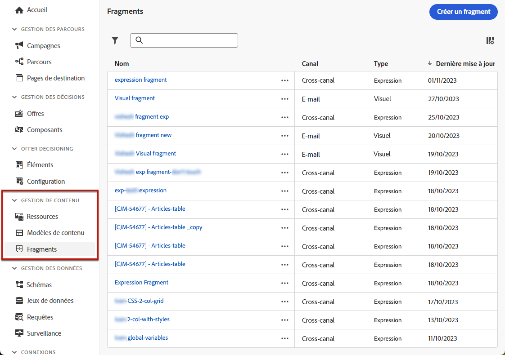

# Commencer avec les fragments {#fragments}

>[!CONTEXTUALHELP]
>id="ajo_create_fragment"
>title="Définir vos propres fragments"
>abstract="Créez et gérez des fragments autonomes pour rendre votre contenu réutilisable sur plusieurs parcours et campagnes."
>additional-url="https://experienceleague.adobe.com/fr/docs/journey-optimizer/using/content-management/fragments/create-fragments" text="Créer des fragments"

Un fragment est un composant réutilisable pouvant être référencé dans un ou plusieurs e-mails dans des campagnes et des parcours [!DNL Journey Optimizer]. Cette fonctionnalité vous permet de créer en avance plusieurs blocs de contenu personnalisés qui peuvent être utilisés par des personnes chargées du marketing pour assembler rapidement des contenus d’e-mails avec un processus de conception amélioré.

➡️ [Découvrez comment gérer, créer et utiliser des fragments dans ces vidéos.](#video-fragments)

Pour optimiser l’utilisation des fragments, procédez comme suit :

* **Créer vos propres fragments** : créez des fragments visuels ou des fragments d’expression, à partir de zéro ou en enregistrant du contenu en tant que fragment. [Découvrez comment créer un fragment](#create-fragments). En outre, vous pouvez tirer parti de l’**API REST de contenu** Journey Optimizer pour gérer les fragments de contenu. Pour plus d’informations à ce sujet, consultez la [documentation relative aux API Journey Optimizer](https://developer.adobe.com/journey-optimizer-apis/references/content/){target="_blank"}.
* **Réutilisez vos fragments :** utilisez-les autant de fois que nécessaire dans votre contenu. Voir [Ajouter des fragments visuels](../email/use-visual-fragments.md) et [Utiliser des fragments d’expression](../personalization/use-expression-fragments.md)

## Avant de commencer {#fragment-prerequisites}

Pour créer, modifier, archiver et publier des fragments, vous avez besoin des autorisations **[!DNL Manage library items]** et **[Publier le fragment]** incluses dans le profil de produit **[!DNL Content Library Manager]**. [En savoir plus](../administration/ootb-product-profiles.md#content-library-manager)

Dans cette version, les restrictions suivantes s’appliquent :

* Les **fragments visuels** ne sont disponibles que pour le canal e-mail.
* Les **fragments d’expression** ne sont pas disponibles pour le canal in-app.

## Fragments visuels et fragments d’expression {#visual-expression}

Deux types de fragments sont disponibles :

* Les **Fragments visuels** sont des blocs visuels prédéfinis que vous pouvez réutiliser dans plusieurs diffusions e-mail à l’aide du [Concepteur d’e-mail](../email/get-started-email-design.md)ou dans des [modèles de contenu](../email/use-email-templates.md).
* Les **Fragments d’expression** sont des expressions prédéfinies disponibles à partir d’une entrée dédiée dans l’[éditeur de personnalisation](../personalization/personalization-build-expressions.md).

Tous les fragments sont accessibles à partir du menu de gauche **[!UICONTROL Gestion de contenu]** > **[!UICONTROL Fragments]**. [Découvrir comment gérer les fragments](../content-management/manage-fragments.md)

## Vidéo pratique {#video-fragments}

Découvrez comment gérer, créer et utiliser des **fragments visuels** dans [!DNL Journey Optimizer].

>[!VIDEO](https://video.tv.adobe.com/v/3419932/?quality=12)

Découvrez comment gérer, créer et utiliser des **fragments d’expression** dans [!DNL Journey Optimizer].

>[!VIDEO](https://video.tv.adobe.com/v/3424587/?quality=12)
