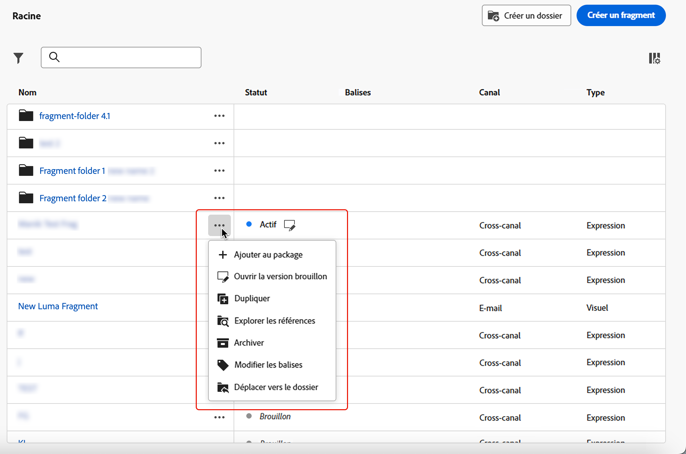
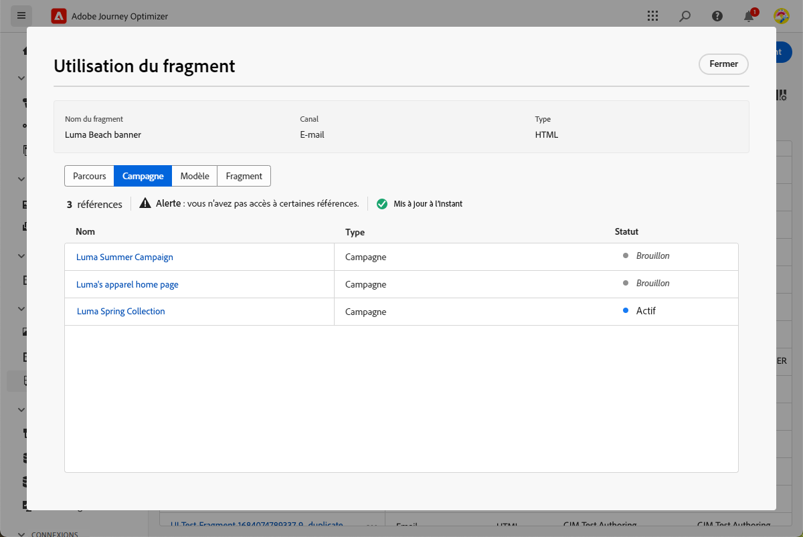
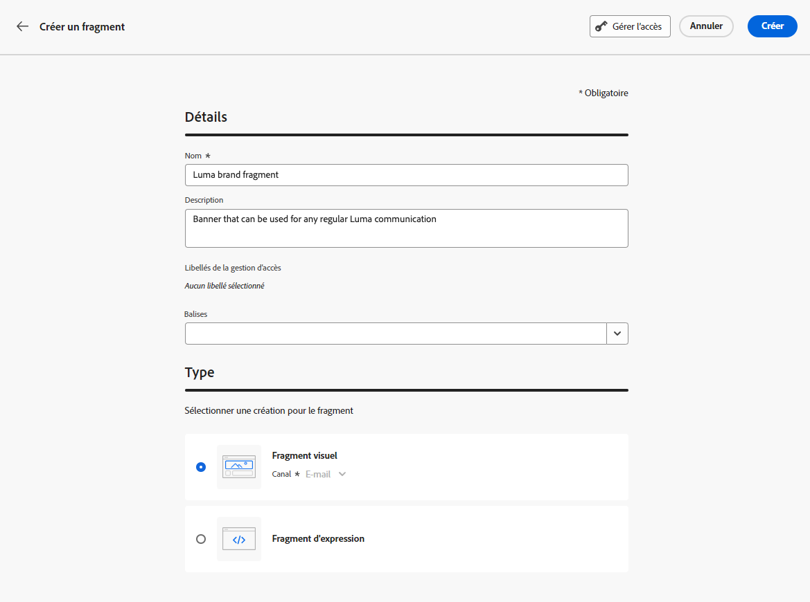
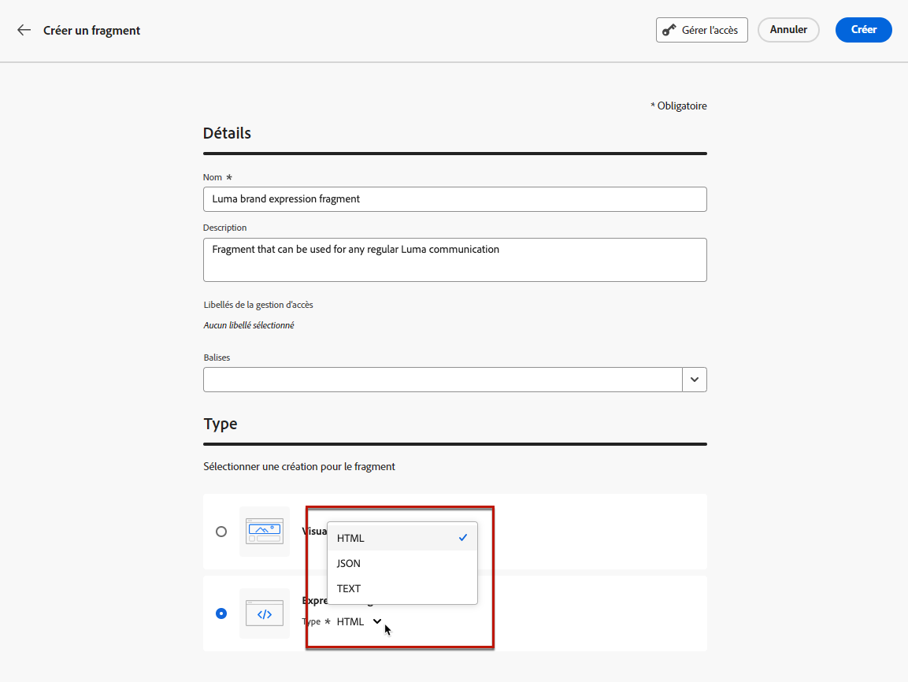

# Utiliser les fragments {#fragments}

>[!CONTEXTUALHELP]
>id="ajo_create_fragment"
>title="Définir vos propres fragments"
>abstract="Créez et gérez des fragments autonomes pour rendre votre contenu réutilisable sur plusieurs parcours et campagnes."
>additional-url="https://experienceleague.adobe.com/docs/journey-optimizer/using/content-management/reusable-content/fragments.html?lang=fr#create-fragments" text="Créer des fragments"

Un fragment est un composant réutilisable pouvant être référencé dans un ou plusieurs e-mails dans des campagnes et parcours [!DNL Journey Optimizer].

Cette fonctionnalité permet de précréer plusieurs blocs de contenu personnalisés qui peuvent être utilisés par des personnes chargées du marketing pour assembler rapidement les contenus d’e-mail dans un processus de conception amélioré.

➡️ [Découvrez comment gérer, créer et utiliser des fragments dans ces vidéos.](#video-fragments)

Pour optimiser l’utilisation des fragments :

* Créez vos propres fragments. Vous pouvez créer des fragments visuels ou des fragments d’expression. [En savoir plus](#create-fragments)

* Utilisez-les autant de fois que nécessaire dans votre contenu. Voir [Ajouter des fragments visuels](../email/use-visual-fragments.md) et [Utiliser des fragments d’expression](../personalization/use-expression-fragments.md)

>[!NOTE]
>
>**Fragments visuels** peut être utilisé dans la variable [Concepteur d&#39;email](../email/get-started-email-design.md), alors que **fragment d’expression** sont accessibles par le biais du [éditeur de personnalisation](../personalization/personalization-build-expressions.md).

En outre, vous pouvez tirer parti de l’**API REST de contenu** Journey Optimizer pour gérer les fragments de contenu. Pour plus d’informations à ce sujet, consultez la [documentation relative aux API Journey Optimizer](https://developer.adobe.com/journey-optimizer-apis/references/content/){target="_blank"}.

## Avant de commencer {#fragment-prerequisites}

>[!CAUTION]
>
>Pour créer, modifier et archiver des fragments, vous devez disposer de l’autorisation **[!DNL Manage library items]** incluse dans le profil de produit **[!DNL Content Library Manager]**. [En savoir plus](../administration/ootb-product-profiles.md#content-library-manager)

Dans cette version, les restrictions suivantes s’appliquent :

* Les fragments visuels ne sont disponibles que pour le canal E-mail.

* Les fragments d’expression ne sont pas disponibles pour le canal in-app

## Accéder aux fragments et les gérer {#access-manage-fragments}

Pour accéder à la liste des fragments, sélectionnez **[!UICONTROL Gestion de contenu]** > **[!UICONTROL Fragments]** dans le menu de gauche.

Tous les fragments qui ont été créés sur le sandbox actuel, soit [à partir du menu **[!UICONTROL Fragments]**](#create-fragments), soit à l’aide de l’option [Enregistrer en tant que fragment](#save-as-fragment), s’affichent.

Vous pouvez filtrer les fragments selon leur :

* Type : **[!UICONTROL visuel]** ou d’**[!UICONTROL expression]**
* Balises
* Date de création ou de modification

Vous pouvez choisir d’afficher tous les fragments ou uniquement les éléments créés ou modifiés par la personne actuelle.

Vous pouvez également afficher les fragments **[!UICONTROL archivés]**. [En savoir plus](#archive-fragments).

Cliquez sur le bouton **[!UICONTROL Plus d’actions]** en regard de chaque fragment pour effectuer les opérations suivantes :

* Dupliquer un fragment.

* Utilisez l’option **[!UICONTROL Explorer les références]** pour afficher les parcours, les campagnes ou les modèles dans lesquels ils sont utilisés. [En savoir plus](#explore-references).

* Archiver un fragment. [En savoir plus](#archive-fragments).

* Modifier les [balises](../start/search-filter-categorize.md#tags) d’un fragment.

### Modifier des fragments {#edit-fragments}

Pour modifier un fragment, procédez comme suit.

1. Cliquez sur l’élément de votre choix dans la liste **[!UICONTROL Fragments]**.
1. À partir des propriétés du fragment, vous pouvez [explorer les références](#explore-references), [gérer son accès](../administration/object-based-access.md) et mettre à jour les détails du fragment, y compris les [balises](../start/search-filter-categorize.md#tags).

   

1. Sélectionnez le bouton correspondant pour modifier le contenu comme vous le feriez lors de la création d’un fragment à partir de zéro. [En savoir plus](#create-from-scratch).

>[!NOTE]
>
>Lorsque vous modifiez un fragment, les modifications sont automatiquement propagées à tous les contenus à l’aide de ce fragment, à l’exception du contenu utilisé dans les parcours ou campagnes **[!UICONTROL dynamiques]**. Vous pouvez également rompre l’héritage du fragment d’origine. En savoir plus dans les sections [Ajouter des fragments visuels à vos e-mails](../email/use-visual-fragments.md#break-inheritance) et [Utiliser des fragments d’expression](../personalization/use-expression-fragments.md#break-inheritance).

### Explorer les références {#explore-references}

Vous pouvez afficher la liste des parcours, campagnes et modèles de contenu qui utilisent actuellement un fragment.

Pour ce faire, sélectionnez **[!UICONTROL Explorer les références]**, soit à partir du menu **[!UICONTROL Autres actions]** dans la liste des fragments ou dans l’écran des propriétés du fragment.

Sélectionnez un onglet pour basculer entre les parcours, les campagnes, les modèles et les fragments. Vous pouvez voir leur statut et cliquer sur un nom pour le rediriger vers l’élément correspondant où le fragment est référencé.

>[!NOTE]
>
>Si le fragment est utilisé dans un parcours, une campagne ou un modèle dont le libellé vous empêche l’accès, un message d’alerte s’affiche en haut de l’onglet sélectionné. [En savoir plus sur le contrôle d’accès au niveau de l’objet (OLAC)](../administration/object-based-access.md)

### Archiver des fragments {#archive-fragments}

Vous pouvez supprimer de la liste des fragments des éléments qui ne sont plus pertinents pour votre marque.

Pour ce faire, cliquez sur l’icône **[!UICONTROL Plus d’actions]** en regard du fragment souhaité, puis sélectionnez **[!UICONTROL Archiver]**. Il disparaîtra de la liste des fragments, ce qui empêche leur utilisation dans les futurs e-mails ou modèles.

>[!NOTE]
>
>Si vous archivez un fragment utilisé dans un contenu, <!--it will remain in the email or template, but you won't be able to select it from the fragment list to edit it-->ce contenu ne sera pas affecté.

Pour désarchiver un fragment, filtrez sur les éléments **[!UICONTROL archivés]** et sélectionnez **[!UICONTROL Désarchiver]** dans le menu **[!UICONTROL Autres actions]**. Le fragment est à nouveau accessible à partir de la liste des fragments et peut être utilisé dans n’importe quel e-mail ou modèle.

## Créer des fragments {#create-fragments}

Vous pouvez créer des fragments de deux manières :

* Créez un fragment à partir de zéro, à l’aide du menu dédié **[!UICONTROL Fragments]**. [Voici comment procéder.](#create-from-scratch)

* Lors de la conception de contenu, enregistrez une partie de votre contenu en tant que fragment. [Voici comment procéder.](#save-as-fragment)

Une fois enregistré, votre fragment peut être utilisé dans un parcours, une campagne ou un modèle. Que ce fragment soit créé à partir de zéro ou à partir d’un contenu existant, vous pouvez désormais l’utiliser lors de la création d’un contenu dans [!DNL Journey Optimizer]. Voir [Ajouter des fragments visuels](../email/use-visual-fragments.md) et [Utiliser des fragments d’expression](../personalization/use-expression-fragments.md)

### Créer à partir de zéro {#create-from-scratch}

Pour créer un fragment à partir de zéro, procédez comme suit.

1. Accédez à la liste des fragments via le menu de gauche **[!UICONTROL Gestion de contenu]** > **[!UICONTROL Fragments]**.

1. Sélectionnez **[!UICONTROL Créer un fragment]**.

1. Renseignez les détails du fragment, c’est-à-dire le nom et la description (si nécessaire).

   

1. Sélectionnez le type de fragment : [Fragment visuel](#create-visual-fragment) ou [Fragment d’expression](#create-expression-fragment).

1. Pour attribuer des libellés d’utilisation des données personnalisés ou de base au fragment, sélectionnez **[!UICONTROL Gérer l’accès]**. [En savoir plus sur le contrôle d’accès au niveau de l’objet (OLAC)](../administration/object-based-access.md).

1. Sélectionnez ou créez des balises Adobe Experience Platform à partir du champ **[!UICONTROL Balises]** pour classer votre fragment en vue d’une recherche améliorée. [En savoir plus](../start/search-filter-categorize.md#tags)

1. Cliquez sur **[!UICONTROL Créer]**.

### Créer un fragment visuel {#create-visual-fragment}

>[!CONTEXTUALHELP]
>id="ajo_create_visual_fragment"
>title="Sélectionner le type Visuel"
>abstract="Créez un fragment visuel autonome pour rendre votre contenu réutilisable dans un e-mail au sein d’un parcours ou d’une campagne, ou dans un modèle de contenu."
>additional-url="https://experienceleague.adobe.com/docs/journey-optimizer/using/email/design-email/add-content/use-visual-fragments.html?lang=fr" text="Ajouter des fragments visuels à vos e-mails"

1. [Créez un fragment](#create-from-scratch) depuis le menu de gauche **[!UICONTROL Gestion de contenu]** > **[!UICONTROL Fragments]**, puis sélectionnez le type **[!UICONTROL Fragment visuel]**.

   >[!NOTE]
   >
   >Actuellement, seul le canal **E-mail** est pris en charge pour les fragments visuels.

1. Le [concepteur d’e-mail](../email/get-started-email-design.md) s’affiche. Modifiez votre contenu selon vos besoins, de la même manière que pour tout e-mail contenu dans un parcours ou une campagne.

   >[!NOTE]
   >
   >Vous pouvez ajouter des champs de personnalisation et du contenu dynamique, mais les attributs contextuels ne sont pas pris en charge dans les fragments.

   

1. Une fois votre fragment prêt, cliquez sur **[!UICONTROL Enregistrer]**. Il est ajouté à la [liste de fragments](#access-manage-fragments).

1. Si nécessaire, cliquez sur la flèche en regard du nom du fragment pour revenir à l’écran **[!UICONTROL Détails]** et le modifier.

   

Ce fragment est maintenant prêt à être utilisé lors de la création d’un [e-mail](../email/get-started-email-design.md) ou [modèle de contenu](content-templates.md) dans [!DNL Journey Optimizer]. [Voici comment procéder.](../email/use-visual-fragments.md)

### Créer un fragment d’expression {#create-expression-fragment}

>[!CONTEXTUALHELP]
>id="ajo_create_expression_fragment"
>title="Sélectionner le type Expression"
>abstract="Créez un fragment d’expression autonome à partir de zéro pour rendre votre contenu réutilisable sur plusieurs parcours et campagnes. Lors de l’utilisation de l’éditeur de personnalisation, vous pouvez exploiter tous les fragments d’expression créés sur l’environnement de test actuel."
>additional-url="https://experienceleague.adobe.com/docs/journey-optimizer/using/content-management/personalization/expression-editor/use-expression-fragments.html?lang=fr" text="Utiliser des fragments d’expression"

1. [Créez un fragment](#create-from-scratch) depuis le menu de gauche **[!UICONTROL Gestion de contenu]** > **[!UICONTROL Fragments]**, puis sélectionnez le type **[!UICONTROL Fragment d’expression]**.

1. Sélectionnez le type de code à utiliser : **[!UICONTROL HTML]**, **[!UICONTROL JSON]** ou **[!UICONTROL Texte]**.

   

   <!--Expression fragments can be used in any channel.-->

1. Cliquez sur **[!UICONTROL Créer]**. L’éditeur de personnalisation s’ouvre.

1. Vous pouvez utiliser la variable [!DNL Journey Optimizer] éditeur de personnalisation avec toutes ses fonctionnalités de personnalisation et de création. [En savoir plus](../personalization/personalization-build-expressions.md)

   

1. Une fois votre fragment prêt, cliquez sur **[!UICONTROL Enregistrer]**. Il est ajouté à la [liste de fragments](#access-manage-fragments).

1. Si nécessaire, cliquez sur la flèche en regard du nom du fragment pour revenir à l’écran **[!UICONTROL Détails]** et le modifier.

Ce fragment est maintenant prêt à être utilisé lors de la création d’un contenu dans le [!DNL Journey Optimizer] éditeur de personnalisation. [Voici comment procéder.](../personalization/use-expression-fragments.md)

## Enregistrer en tant que fragment {#save-as-fragment}

Lors de la modification de contenu dans [!DNL Journey Optimizer], vous pouvez enregistrer tout ou une partie de votre contenu en tant que fragment pour une réutilisation ultérieure.

### Enregistrer en tant que fragment visuel {#save-as-visual-fragment}

Lors de la conception d’un [modèle de contenu](content-templates.md) ou d’un [e-mail](../email/get-started-email-design.md) dans une campagne ou un parcours, vous pouvez enregistrer une partie de votre contenu en tant que fragment visuel. Pour ce faire, suivez les étapes ci-après.

1. Dans le [concepteur d’e-mail](../email/get-started-email-design.md), cliquez sur les points de suspension en haut à droite de l’écran.

1. Sélectionnez **[!UICONTROL Enregistrer en tant que fragment]** dans le menu déroulant.

   

1. L’écran **[!UICONTROL Enregistrer en tant que fragment]** s’affiche. Sélectionnez ensuite les éléments à inclure dans votre fragment, notamment les champs de personnalisation et le contenu dynamique. Notez que les attributs contextuels ne sont pas pris en charge dans les fragments.

   >[!CAUTION]
   >
   >Vous pouvez uniquement sélectionner des sections adjacentes. Vous ne pouvez pas sélectionner une structure vide ou un autre fragment.

   

1. Cliquez sur **[!UICONTROL Créer]**. Renseignez les détails du fragment, c’est-à-dire le nom et la description (si nécessaire).

1. Pour attribuer des libellés d’utilisation des données personnalisés ou de base au fragment, sélectionnez **[!UICONTROL Gérer l’accès]**. [En savoir plus sur le contrôle d’accès au niveau de l’objet (OLAC)](../administration/object-based-access.md).

1. Sélectionnez ou créez des balises Adobe Experience Platform à partir du champ **Balises** pour classer votre modèle en vue d’une recherche améliorée. [En savoir plus](../start/search-filter-categorize.md#tags)

1. Cliquez de nouveau sur **[!UICONTROL Créer]**. Le fragment est enregistré dans la [liste de fragments](#access-manage-fragments), accessible à partir du menu dédié [!DNL Journey Optimizer].

   Il devient alors un modèle de contenu autonome [accessible](#access-manage-fragments) pouvant être [édité](#edit-fragments) et [archivé](#archive-fragments) comme tout autre élément de cette liste.

Ce fragment est maintenant prêt à être utilisé lors de la création d’un [e-mail](../email/get-started-email-design.md) ou [modèle de contenu](content-templates.md) dans [!DNL Journey Optimizer]. [Voici comment procéder.](../email/use-visual-fragments.md)

>[!NOTE]
>
>Toute modification apportée à ce nouveau fragment n’est pas propagée dans l’e-mail ou le modèle d’où il provient. De même, lorsque le contenu d’origine est modifié dans cet e-mail ou modèle, le nouveau fragment n’est pas modifié.

### Enregistrer en tant que fragment d’expression {#save-as-expression-fragment}

>[!CONTEXTUALHELP]
>id="ajo_perso_library"
>title="Enregistrer en tant que fragment d’expression"
>abstract="La variable [!DNL Journey Optimizer] l&#39;éditeur de personnalisation permet d&#39;enregistrer le contenu en tant que fragments d&#39;expression. Ces expressions sont ensuite disponibles pour créer du contenu personnalisé."

La variable [!DNL Journey Optimizer] l&#39;éditeur de personnalisation permet d&#39;enregistrer le contenu en tant que fragments d&#39;expression. Ces expressions sont ensuite disponibles pour créer du contenu personnalisé.

Pour enregistrer du contenu en tant que fragment d’expression, procédez comme suit.

1. Dans le [éditeur de personnalisation](../personalization/personalization-build-expressions.md) , créez une expression, puis cliquez sur **[!UICONTROL Enregistrer en tant que fragment]**.

1. Dans le volet de droite, saisissez un nom et une description pour l’expression afin d’aider les personnes à la trouver plus facilement.

   

1. Cliquez sur **[!UICONTROL Enregistrer le fragment]**.

   <!--An expression fragment cannot be nested inside another fragment.-->

1. Le fragment d’expression est ajouté à la [liste de fragments](#access-manage-fragments). Vous pouvez désormais l’utiliser pour créer du contenu personnalisé.

>[!NOTE]
>
>Les expressions ne doivent pas dépasser 200 Ko.

## Vidéo pratique {#video-fragments}

Découvrez comment gérer, créer et utiliser des fragments visuels dans [!DNL Journey Optimizer].

>[!VIDEO](https://video.tv.adobe.com/v/3419932/?quality=12)

Découvrez comment gérer, créer et utiliser des fragments d’expression dans [!DNL Journey Optimizer].

>[!VIDEO](https://video.tv.adobe.com/v/3424587/?quality=12)
