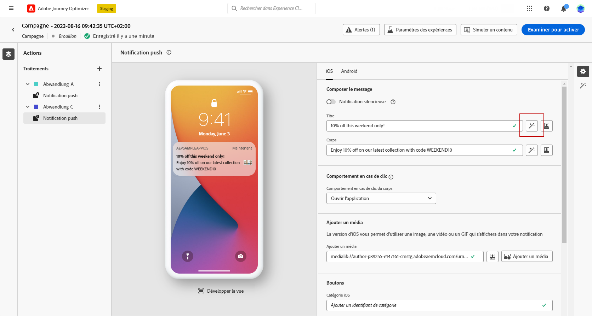
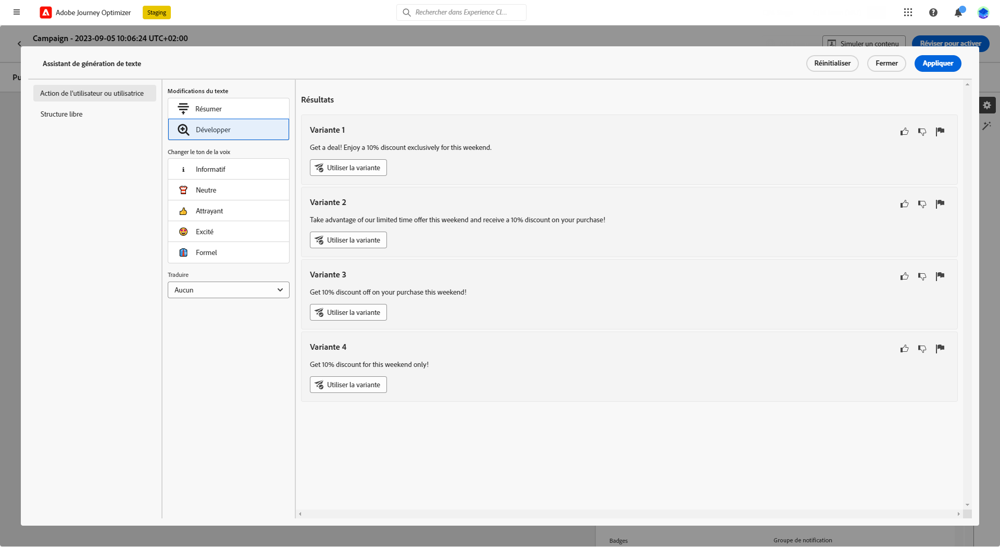
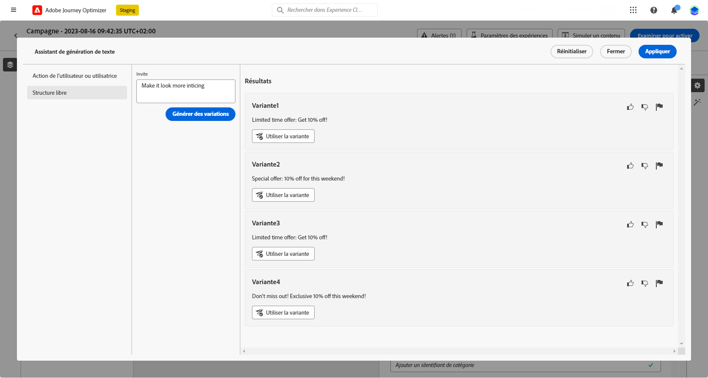
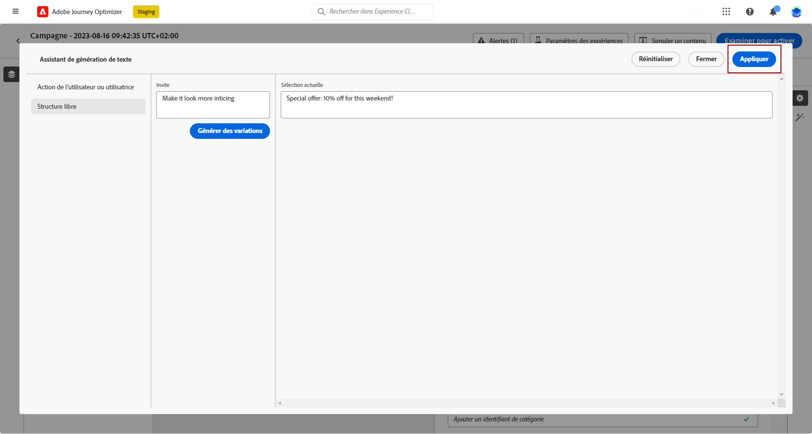
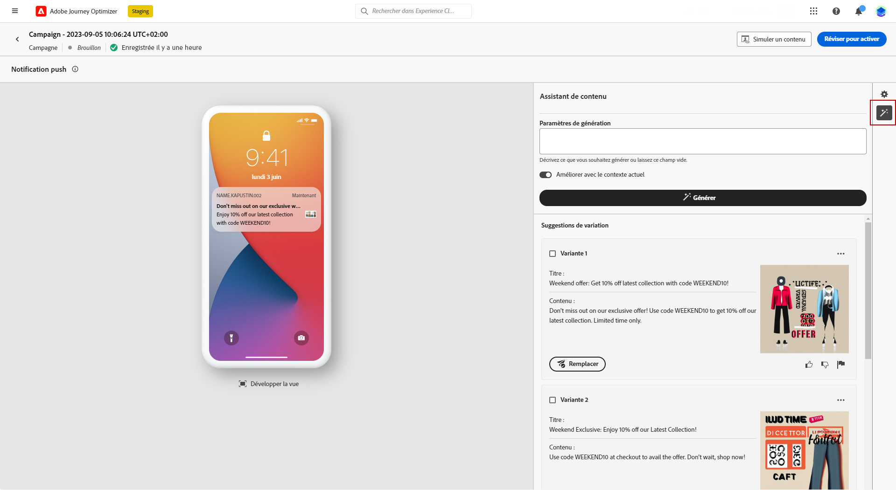
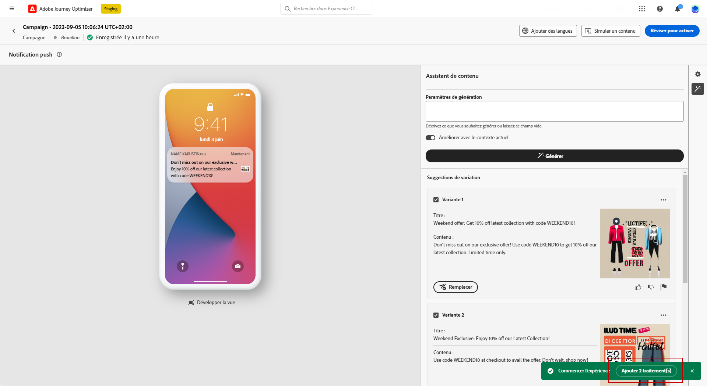
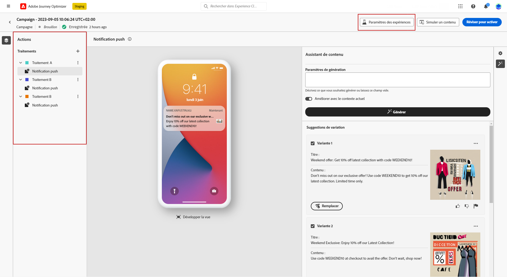

# Génération de contenu avec l’Assistant IA {#title-content-assistant}

>[!BEGINSHADEBOX]

**Table des matières**

* [Commencer avec l’Assistant IA](gs-generative.md)
* **[Générer du contenu avec l’Assistant IA](generative-content.md)**
* [Générer des images avec l’Assistant IA](generative-image.md)

>[!ENDSHADEBOX]

Une fois que vous avez créé et personnalisé vos messages, améliorez la qualité de votre contenu avec l’Assistant IA de Journey Optimizer.

En utilisant l’Assistant IA, vous avez la possibilité d’optimiser l’impact de votre message en testant différents contenus. Chaque variante est considérée comme un traitement unique, qui permet de mesurer et de comparer le contenu qui génère le plus de clics.

Dans cet exemple particulier, apprenez à envoyer une notification push accrocheuse à l’aide de l’expérience de contenu. Procédez de la façon suivante :

1. Après avoir créé et configuré votre campagne de notification push, cliquez sur **[!UICONTROL Créer du contenu]**.

1. Utilisez l’assistant de génération pour modifier le **[!UICONTROL Titre]**.

   En regard de votre champ **[!UICONTROL En-tête]**, cliquez sur **[!UICONTROL Modifier avec l’assistant de génération de texte]**.

   

1. Dans le menu **[!UICONTROL Action de l’utilisateur ou de l’utilisatrice]**, sélectionnez **[!UICONTROL Affinement du texte]** :

   * **[!UICONTROL Résumer]** : utilisez cette option pour raccourcir un texte afin de ne conserver que l’essentiel.

   * **[!UICONTROL Élaborer]** : utilisez cette option pour développer votre contenu avec des variantes créatives supplémentaires de l’Assistant IA.

   

1. Choisissez le ton de vos variantes avec le menu **[!UICONTROL Changer le ton de voix]**.

1. Dans le menu **[!UICONTROL Formulaire libre]**, vous pouvez également choisir de fournir une invite afin d’affiner davantage vos résultats.

   

1. Une fois la variante appropriée trouvée, cliquez sur **[!UICONTROL Variante de l’utilisateur ou de l’utilisatrice]**, puis sur **[!UICONTROL Appliquer]**.

   

1. Après avoir personnalisé le **[!UICONTROL Corps]** de votre notification push, sélectionnez **[!UICONTROL Afficher l’Assistant IA]**.

   Ici, une liste de variations est déjà disponible, qui utilise votre contenu d’origine.

   

1. Ajustez le contenu en décrivant ce que vous souhaitez générer.

   Activez l’option **[!UICONTROL Améliorer le contenu actuel]** pour l’Assistant IA afin de personnaliser le nouveau contenu en fonction de votre message, du nom de la campagne et de l’audience sélectionnée.

1. Cliquez sur **[!UICONTROL Remplacer]** pour modifier votre contenu ou sélectionnez plusieurs **[!UICONTROL Variantes]** en vue de créer des **[!UICONTROL Traitements]** pour votre expérience, puis cliquez sur **Ajouter X traitement(s)**.

   

1. Accédez aux **[!UICONTROL Paramètres d’expérience]** ou aux **[!UICONTROL Actions]** pour personnaliser davantage votre expérience. [En savoir plus](../campaigns/content-experiment.md)

   

1. Après avoir défini le contenu de votre message, cliquez sur le bouton **[!UICONTROL Simuler du contenu]** pour contrôler le rendu et vérifier les paramètres de personnalisation avec les profils de test. [En savoir plus](../content-management/preview-test.md)

1. Lorsque votre expérience de contenu est prête, depuis votre page de résumé de la campagne, cliquez sur **[!UICONTROL Examiner pour activer]** afin d’afficher un résumé de la campagne. Des alertes s’affichent si un paramètre est incorrect ou manquant.

1. Avant de lancer votre campagne, vérifiez que toutes les configurations sont correctes, puis cliquez sur **[!UICONTROL Activer]**.

Une fois l’expérimentation et la campagne configurées, vous pouvez suivre votre campagne dans le rapport de campagne. [En savoir plus](../reports/campaign-global-report.md#experimentation-report)
