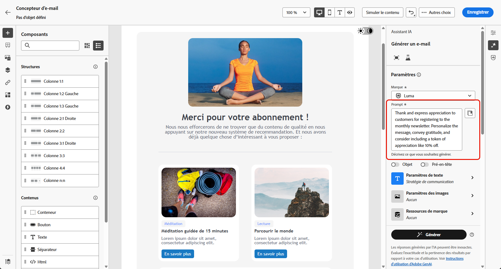
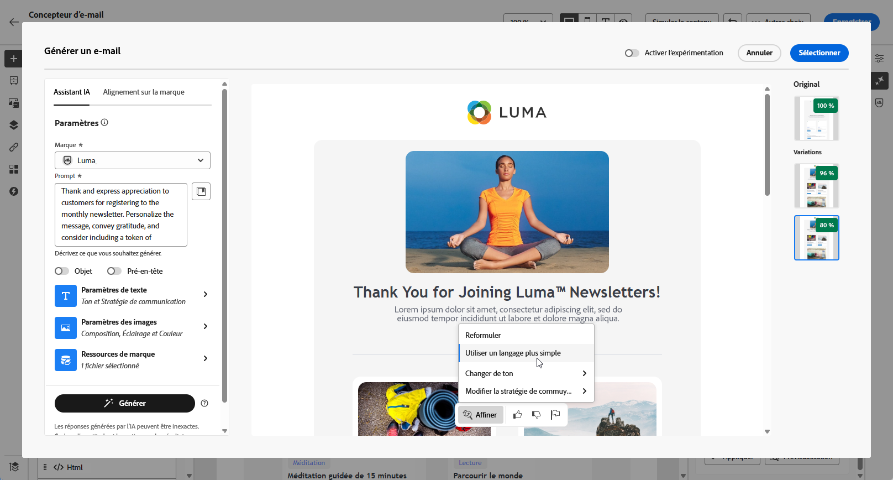
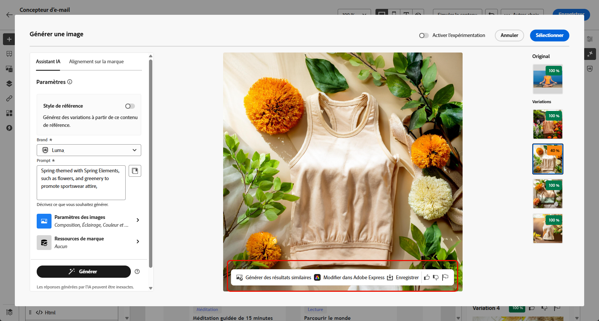

# Génération d’e-mails avec l’assistant IA {#generative-email}

>[!BEGINSHADEBOX]

**Table des matières**

* [Commencer avec l’assistant IA](gs-generative.md)
* Génération d’e-mails avec l’assistant IA
* [Génération de SMS avec l’assistant IA](generative-sms.md)
* [Génération de notifications push avec l’assistant IA](generative-push.md)
* [Expérience de contenu avec l’assistant IA](generative-experimentation.md)

>[!ENDSHADEBOX]

>[!NOTE]
>
>Avant de commencer à utiliser cette fonctionnalité, lisez la section connexe [Mécanismes de sécurisation et limitations](gs-generative.md#generative-guardrails).

Après avoir conçu et personnalisé vos e-mails, utilisez la puissance de l’assistant IA dans Journey Optimizer, alimenté par l’IA générative, pour améliorer votre contenu.

Utilisez l’assistant IA pour améliorer l’efficacité de vos campagnes en créant des e-mails complets, des fragments de texte personnalisés et des images personnalisées qui s’adressent directement à votre audience, ce qui stimule l’engagement et l’interaction.

Explorez les onglets ci-dessous pour savoir comment utiliser l’assistant IA dans Journey Optimizer.

>[!BEGINTABS]

>[!TAB Génération d’e-mail complet]

Dans l’exemple suivant, nous utiliserons l’assistant IA pour peaufiner un modèle d’e-mail existant.

1. Après avoir créé et configuré votre campagne par e-mail, cliquez sur **[!UICONTROL Modifier le contenu]**.

   Pour plus d’informations sur la configuration de votre campagne par e-mail, consultez [cette page](../campaigns/create-campaign.md).

1. Personnalisez votre e-mail selon vos besoins et accédez au menu **[!UICONTROL Assistant IA]**.

   {zoomable="yes"}

1. Activez l’option **[!UICONTROL Utiliser le contenu original]** de l’assistant IA afin de personnaliser le nouveau contenu en fonction du contenu de votre campagne, du nom de la campagne et de l’audience sélectionnée.

   Votre invite doit toujours être liée à votre contenu actuel.

1. Affinez le contenu en décrivant ce que vous souhaitez générer dans le champ **[!UICONTROL Invite]**.

   Si vous avez besoin d’aide pour concevoir votre invite, accédez à la **[!UICONTROL Bibliothèque d’invites]** qui offre un large éventail d’idées d’invites pour améliorer vos campagnes.

   {zoomable="yes"}

1. Vous pouvez activer les options **[!UICONTROL Objet]** et **[!UICONTROL Pré-en-tête]** pour les inclure à la génération des variantes.

1. Sélectionnez **[!UICONTROL Charger une ressource de marque]** pour ajouter toute ressource de marque incluant du contenu pouvant fournir du contexte supplémentaire à l’assistant IA ou sélectionnez-en une chargée précédemment.

   {zoomable="yes"}

1. Adaptez votre invite avec les différentes options :

   * **[!UICONTROL Stratégie de communication]** : choisissez le style de communication le plus adapté au texte généré.
   * **[!UICONTROL Langue]** : sélectionnez la langue dans laquelle vous souhaitez générer votre contenu.
   * **[!UICONTROL Ton]** : le ton de votre e-mail doit résonner auprès de votre audience. Que vous souhaitiez communiquer de façon informative, ludique ou convaincante, l’assistant IA peut adapter le message en conséquence.

   {zoomable="yes"}

1. Lorsque votre texte descriptif est prêt, cliquez sur **[!UICONTROL Générer]**.

1. Parcourez les **[!UICONTROL variations]** générées et cliquez sur **[!UICONTROL Prévisualisation]** pour afficher une version plein écran de la variation sélectionnée.

1. Naviguez vers l’option **[!UICONTROL Affiner]** dans la fenêtre **[!UICONTROL Aperçu]** pour accéder à d’autres fonctionnalités de personnalisation :

   * **[!UICONTROL Reformuler]** : l’assistant IA peut reformuler votre message de différentes manières en conservant une écriture soignée et attrayante pour diverses audiences.

   * **[!UICONTROL Utiliser un langage simplifié]** : utilisez l’assistant IA pour simplifier votre langage, garantissant ainsi clarté et accessibilité pour une audience plus large.

   {zoomable="yes"}

1. Cliquez sur **[!UICONTROL Sélectionner]** une fois que vous avez trouvé le contenu approprié.

   Vous pouvez également activer l’expérience pour votre contenu. [En savoir plus](generative-experimentation.md)

1. Insérez des champs de personnalisation pour personnaliser le contenu de votre e-mail en fonction des données de profil. Cliquez ensuite sur le bouton **[!UICONTROL Simuler le contenu]** pour contrôler le rendu et vérifier les paramètres de personnalisation avec les profils de test. [En savoir plus](../personalization/personalize.md)

Lorsque vous avez défini le contenu, l’audience et le planning, vous pouvez préparer votre campagne par e-mail. [En savoir plus](../campaigns/review-activate-campaign.md)

>[!TAB Génération de texte]

Dans l’exemple suivant, nous utiliserons l’assistant IA afin d’améliorer le contenu de notre e-mail.

1. Après avoir créé et configuré votre campagne par e-mail, cliquez sur **[!UICONTROL Modifier le contenu]**.

   Pour plus d’informations sur la configuration de votre campagne par e-mail, consultez [cette page](../email/create-email.md).

1. Sélectionnez un **[!UICONTROL composant de texte]** pour cibler uniquement un contenu spécifique. Accédez au menu **[!UICONTROL Assistant IA]**.

   {zoomable="yes"}

1. Activez l’option **[!UICONTROL Utiliser le contenu original]** de l’assistant IA afin de personnaliser le nouveau contenu en fonction du contenu de votre campagne, du nom de la campagne et de l’audience sélectionnée.

   Votre invite doit toujours être liée à votre contenu actuel.

1. Affinez le contenu en décrivant ce que vous souhaitez générer dans le champ **[!UICONTROL Invite]**.

   Si vous avez besoin d’aide pour concevoir votre invite, accédez à la **[!UICONTROL Bibliothèque d’invites]** qui offre un large éventail d’idées d’invites pour améliorer vos campagnes.

   {zoomable="yes"}

1. Sélectionnez **[!UICONTROL Charger une ressource de marque]** pour ajouter toute ressource de marque incluant du contenu pouvant fournir du contexte supplémentaire à l’assistant IA.

   {zoomable="yes"}

1. Adaptez votre invite avec les différentes options :

   * **[!UICONTROL Stratégie de communication]** : sélectionnez l’approche de communication souhaitée pour le texte généré.
   * **[!UICONTROL Langue]** : choisissez la langue du contenu de la variante.
   * **[!UICONTROL Ton]** : assurez-vous que le texte est adapté à votre audience et à votre objectif.
   * **[!UICONTROL Longueur]** : sélectionnez la longueur de votre contenu à l’aide du curseur de plage.

   {zoomable="yes"}

1. Lorsque votre texte descriptif est prêt, cliquez sur **[!UICONTROL Générer]**.

1. Parcourez les **[!UICONTROL variations]** générées et cliquez sur **[!UICONTROL Prévisualisation]** pour afficher une version plein écran de la variation sélectionnée.

1. Naviguez vers l’option **[!UICONTROL Affiner]** dans la fenêtre **[!UICONTROL Aperçu]** pour accéder à d’autres fonctionnalités de personnalisation :

   * **[!UICONTROL Utiliser comme contenu de référence]** : la variante choisie servira de contenu de référence pour générer d’autres résultats.

   * **[!UICONTROL Élaborer]** : l’assistant IA peut vous aider à développer des sujets spécifiques, en fournissant des détails supplémentaires pour une meilleure compréhension et un meilleur engagement.

   * **[!UICONTROL Résumé]** : de longues informations peuvent embrouiller les personnes destinataires des e-mails. Utilisez l’assistant IA pour condenser des points clés en résumés clairs et concis qui attirent l’attention et pour les encourager à lire davantage.

   * **[!UICONTROL Reformuler]** : l’assistant IA peut reformuler votre message de différentes manières en conservant une écriture soignée et attrayante pour diverses audiences.

   * **[!UICONTROL Utiliser un langage simplifié]** : utilisez l’assistant IA pour simplifier votre langage, garantissant ainsi clarté et accessibilité pour une audience plus large.

   {zoomable="yes"}

1. Cliquez sur **[!UICONTROL Sélectionner]** une fois que vous avez trouvé le contenu approprié.

   Vous pouvez également activer l’expérience pour votre contenu. [En savoir plus](generative-experimentation.md)

1. Insérez des champs de personnalisation pour personnaliser le contenu de votre e-mail en fonction des données de profil. Cliquez ensuite sur le bouton **[!UICONTROL Simuler le contenu]** pour contrôler le rendu et vérifier les paramètres de personnalisation avec les profils de test. [En savoir plus](../personalization/personalize.md)

Lorsque vous avez défini le contenu, l’audience et le planning, vous pouvez préparer votre campagne par e-mail. [En savoir plus](../campaigns/review-activate-campaign.md)

>[!TAB Génération d’images]

Dans l’exemple ci-dessous, découvrez comment tirer parti de l’assistant IA pour optimiser et améliorer vos ressources, afin d’offrir une expérience plus conviviale.

1. Après avoir créé et configuré votre campagne par e-mail, cliquez sur **[!UICONTROL Modifier le contenu]**.

   Pour plus d’informations sur la configuration de votre campagne par e-mail, consultez [cette page](../email/create-email.md).

1. Renseignez les **[!UICONTROL Détails de base]** de votre campagne. Une fois terminé, cliquez sur **[!UICONTROL Modifier le contenu de l’e-mail]**.

1. Sélectionnez la ressource que vous souhaitez modifier à l’aide de l’assistant IA.

1. Dans le menu de droite, sélectionnez **[!UICONTROL Assistant IA]**.

   {zoomable="yes"}

1. Activez l’option **[!UICONTROL Style de référence]** pour l’assistant IA afin de personnaliser le nouveau contenu en fonction du contenu de référence. Vous pouvez également charger une image pour ajouter du contexte à votre variation.

   Votre invite doit toujours être liée à votre contenu actuel.

1. Affinez le contenu en décrivant ce que vous souhaitez générer dans le champ **[!UICONTROL Invite]**.

   Si vous avez besoin d’aide pour concevoir votre invite, accédez à la **[!UICONTROL Bibliothèque d’invites]** qui offre un large éventail d’idées d’invites pour améliorer vos campagnes.

   {zoomable="yes"}

1. Sélectionnez **[!UICONTROL Charger une ressource de marque]** pour ajouter toute ressource de marque incluant du contenu pouvant fournir du contexte supplémentaire à l’assistant IA.

1. Adaptez votre invite avec les différentes options :

   * **[!UICONTROL Format]** : déterminez la largeur et la hauteur de la ressource. Vous avez la possibilité de choisir parmi des formats courants tels que 16:9, 4:3, 3:2 ou 1:1, ou vous pouvez saisir une taille personnalisée.
   * **[!UICONTROL Couleur et ton]** : aspect général des couleurs dans une image et humeur ou ambiance qu’elles véhiculent.
   * **[!UICONTROL Type de contenu]** : cette propriété classe la nature de l’élément visuel en faisant la distinction entre les différentes formes de représentation visuelle, telles que les photos, les graphiques ou les illustrations.
   * **[!UICONTROL Éclairage]** : fait référence à l’éclairage présent dans une image qui forme son atmosphère et met en évidence des éléments spécifiques.
   * **[!UICONTROL Composition]** : fait référence à la disposition des éléments dans le cadre d’une image.

   {zoomable="yes"}

1. Quand la configuration de votre invite vous satisfait, cliquez sur **[!UICONTROL Générer]**.

1. Parcourez les **[!UICONTROL Suggestions de variation]** pour trouver la ressource souhaitée.

   Cliquez sur **[!UICONTROL Aperçu]** pour afficher une version plein écran de la variation sélectionnée.

   {zoomable="yes"}

1. Choisissez **[!UICONTROL Afficher les images similaires]** si vous souhaitez afficher les images associées à cette variante.

   {zoomable="yes"}

1. Cliquez sur **[!UICONTROL Sélectionner]** une fois que vous avez trouvé le contenu approprié.

   Vous pouvez également activer l’expérience pour votre contenu. [En savoir plus](generative-experimentation.md)

1. Après avoir défini le contenu de votre message, cliquez sur le bouton **[!UICONTROL Simuler du contenu]** pour contrôler le rendu et vérifier les paramètres de personnalisation avec les profils de test. [En savoir plus](../personalization/personalize.md)

1. Lorsque vous avez défini le contenu, l’audience et le planning, vous pouvez préparer votre campagne par e-mail. [En savoir plus](../campaigns/review-activate-campaign.md)

>[!ENDTABS]

## Vidéo pratique {#video}

Découvrez comment utiliser l’assistant IA pour générer des e-mails, du texte ou des images complets.

>[!VIDEO](https://video.tv.adobe.com/v/3428341)
