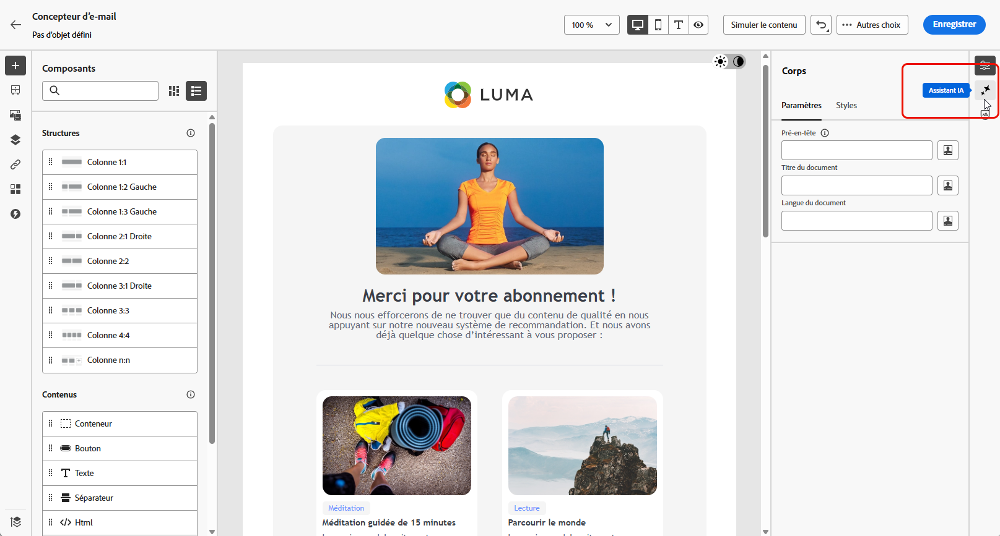
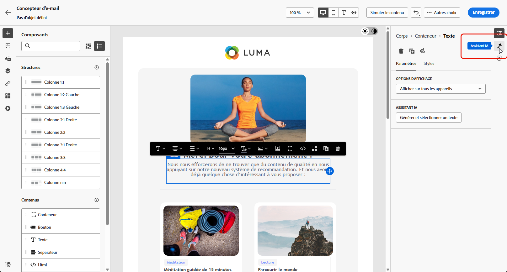
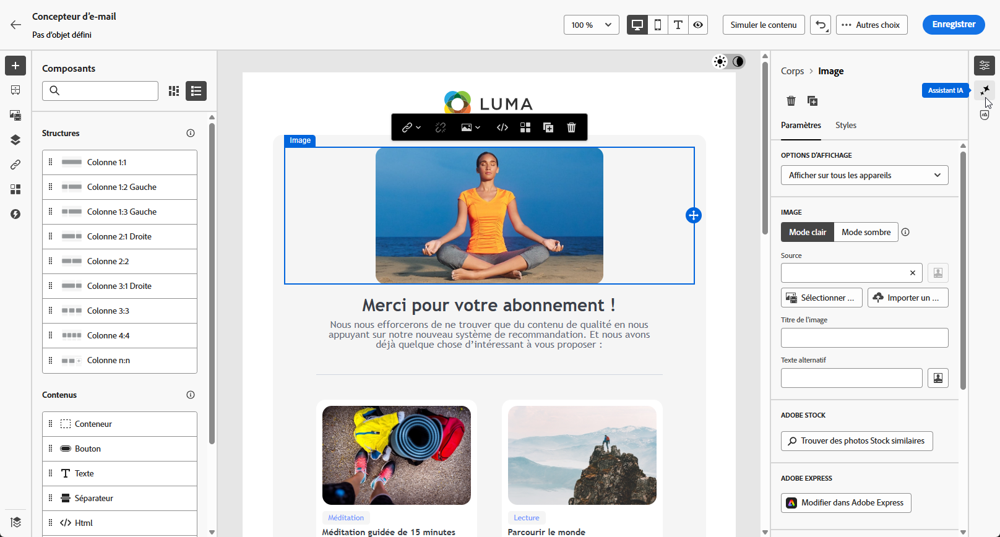
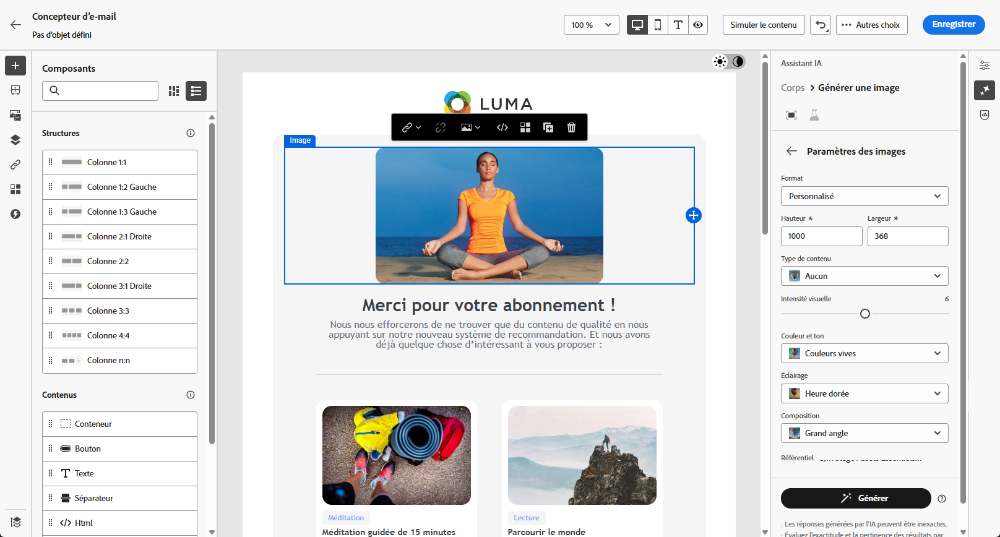

# Génération d’emails à l’aide de l’assistant d’IA dans Journey Optimizer - Content Accelerator {#generative-email}

>[!IMPORTANT]
>
>Avant de commencer à utiliser cette fonctionnalité, lisez la section connexe [Mécanismes de sécurisation et limitations](gs-generative.md#generative-guardrails).
> 
>
>Vous devez accepter un [contrat utilisateur](https://www.adobe.com/legal/licenses-terms/adobe-dx-gen-ai-user-guidelines.html) avant de pouvoir utiliser l’assistant d’IA dans Journey Optimizer pour l’accélération du contenu. Pour en savoir plus, contactez votre représentant ou représentante Adobe.

Après avoir conçu et personnalisé vos emails, utilisez la puissance de l’assistant d’IA dans Journey Optimizer pour l’accélération du contenu, alimentée par l’IA générative, pour élever votre contenu.

Utilisez l’assistant d’IA dans Journey Optimizer pour l’accélération du contenu afin d’améliorer l’efficacité de vos campagnes en créant des emails complets, des fragments de texte personnalisés et des images personnalisées qui s’adressent directement à votre audience, ce qui renforce l’engagement et l’interaction.

Consultez les onglets ci-dessous pour savoir comment utiliser l’assistant d’IA dans Journey Optimizer pour l’accélération du contenu.

>[!BEGINTABS]

>[!TAB Génération d’e-mail complet]

Dans l’exemple suivant, nous utiliserons l’assistant d’IA pour l’accélération du contenu afin d’affiner un modèle de courrier électronique existant.

1. Après avoir créé et configuré votre campagne par e-mail, cliquez sur **[!UICONTROL Modifier le contenu]**.

   Pour plus d’informations sur la configuration de votre campagne par e-mail, consultez [cette page](../campaigns/create-campaign.md).

1. Personnalisez votre mise en page selon vos besoins et accédez au menu **[!UICONTROL Assistant IA]**.

   {zoomable="yes"}

1. Activez l’option **[!UICONTROL Utiliser le contenu d’origine]** de l’assistant d’IA pour l’accélération du contenu pour personnaliser le nouveau contenu en fonction du contenu sélectionné.

1. Affinez le contenu en décrivant ce que vous souhaitez générer dans le champ **[!UICONTROL Invite]**.

   Si vous avez besoin d’aide pour concevoir votre invite, accédez à la **[!UICONTROL Bibliothèque d’invites]** qui offre un large éventail d’idées d’invites pour améliorer vos campagnes.

   {zoomable="yes"}

1. Vous pouvez activer les options **[!UICONTROL Objet]** et **[!UICONTROL Pré-en-tête]** pour les inclure à la génération des variantes.

1. Personnalisez votre invite avec l’option **[!UICONTROL Paramètres de texte]** :

   * **[!UICONTROL Stratégie de communication]** : choisissez le style de communication le plus adapté au texte généré.
   * **[!UICONTROL Ton]** : le ton de votre e-mail doit résonner auprès de votre audience. Que vous souhaitiez communiquer de façon informative, ludique ou convaincante, l’assistant IA peut adapter le message en conséquence.

   {zoomable="yes"}

1. Sélectionnez vos **[!UICONTROL paramètres d&#39;image]** :

   * **[!UICONTROL Type de contenu]** : cette propriété classe la nature de l’élément visuel en faisant la distinction entre les différentes formes de représentation visuelle, telles que les photos, les graphiques ou les illustrations.
   * **[!UICONTROL Intensité visuelle]** : vous pouvez contrôler l’impact de l’image en ajustant son intensité. Un paramètre inférieur (2) crée un aspect plus modéré et plus modéré, tandis qu’un paramètre supérieur (10) rend l’image plus vivante et visuellement plus puissante.
   * **[!UICONTROL Couleur et ton]** : aspect général des couleurs dans une image et humeur ou ambiance qu’elles véhiculent.
   * **[!UICONTROL Éclairage]** : fait référence à l’éclairage présent dans une image qui forme son atmosphère et met en évidence des éléments spécifiques.
   * **[!UICONTROL Composition]** : fait référence à la disposition des éléments dans le cadre d’une image.

   {zoomable="yes"}

1. Dans le menu **[!UICONTROL Ressources de marque]**, cliquez sur **[!UICONTROL Télécharger une ressource de marque]** pour ajouter toute ressource de marque qui contient du contenu pouvant fournir un contexte supplémentaire à l’assistant d’IA ou en sélectionner une précédemment téléchargée.

   Les fichiers précédemment téléchargés sont disponibles dans la liste déroulante **[!UICONTROL Ressources de marque téléchargées]** . Il vous suffit d’activer/désactiver les ressources que vous souhaitez inclure dans votre génération.

   {zoomable="yes"}

1. Lorsque votre texte descriptif est prêt, cliquez sur **[!UICONTROL Générer]**.

1. Parcourez les **[!UICONTROL variations]** générées et cliquez sur **[!UICONTROL Prévisualisation]** pour afficher une version plein écran de la variation sélectionnée.

1. Naviguez vers l’option **[!UICONTROL Affiner]** dans la fenêtre **[!UICONTROL Aperçu]** pour accéder à d’autres fonctionnalités de personnalisation :

   * **[!UICONTROL Reformuler]** : l’assistant IA peut reformuler votre message de différentes manières en conservant une écriture soignée et attrayante pour diverses audiences.

   * **[!UICONTROL Utiliser un langage simplifié]** : utilisez l’assistant IA pour simplifier votre langage, garantissant ainsi clarté et accessibilité pour une audience plus large.

   Vous pouvez également modifier les **[!UICONTROL tons]** et la **[!UICONTROL stratégie de communication]** de votre texte.

   {zoomable="yes"}

1. Cliquez sur **[!UICONTROL Sélectionner]** une fois que vous avez trouvé le contenu approprié.

   Vous pouvez également activer l’expérience pour votre contenu. [En savoir plus](generative-experimentation.md)

1. Insérez des champs de personnalisation pour personnaliser le contenu de votre e-mail en fonction des données de profil. Cliquez ensuite sur le bouton **[!UICONTROL Simuler le contenu]** pour contrôler le rendu et vérifier les paramètres de personnalisation avec les profils de test. [En savoir plus](../personalization/personalize.md)

Lorsque vous avez défini le contenu, l’audience et le planning, vous pouvez préparer votre campagne par e-mail. [En savoir plus](../campaigns/review-activate-campaign.md)

>[!TAB Génération de texte uniquement]

Dans l’exemple suivant, nous utiliserons l’assistant d’IA pour l’accélération du contenu afin d’améliorer le contenu de notre email.

1. Après avoir créé et configuré votre campagne par e-mail, cliquez sur **[!UICONTROL Modifier le contenu]**.

   Pour plus d’informations sur la configuration de votre campagne par e-mail, consultez [cette page](../email/create-email.md).

1. Sélectionnez un **[!UICONTROL composant de texte]** pour cibler uniquement un contenu spécifique. Accédez au menu **[!UICONTROL Assistant IA]**.

   {zoomable="yes"}

1. Activez l’option **[!UICONTROL Utiliser le contenu d’origine]** de l’assistant d’IA pour l’accélération du contenu pour personnaliser le nouveau contenu en fonction du contenu sélectionné.

1. Affinez le contenu en décrivant ce que vous souhaitez générer dans le champ **[!UICONTROL Invite]**.

   Si vous avez besoin d’aide pour concevoir votre invite, accédez à la **[!UICONTROL Bibliothèque d’invites]** qui offre un large éventail d’idées d’invites pour améliorer vos campagnes.

   {zoomable="yes"}

1. Personnalisez votre invite avec l’option **[!UICONTROL Paramètres de texte]** :

   * **[!UICONTROL Stratégie de communication]** : choisissez le style de communication le plus adapté au texte généré.
   * **[!UICONTROL Ton]** : le ton de votre e-mail doit résonner auprès de votre audience. Que vous souhaitiez communiquer de façon informative, ludique ou convaincante, l’assistant IA peut adapter le message en conséquence.
   * **Longueur de texte** : utilisez le curseur pour sélectionner la longueur souhaitée de votre texte.

   {zoomable="yes"}

1. Dans le menu **[!UICONTROL Ressources de marque]**, cliquez sur **[!UICONTROL Télécharger une ressource de marque]** pour ajouter toute ressource de marque qui contient du contenu pouvant fournir un contexte supplémentaire à l’assistant d’IA ou en sélectionner une précédemment téléchargée.

   Les fichiers précédemment téléchargés sont disponibles dans la liste déroulante **[!UICONTROL Ressources de marque téléchargées]** . Il vous suffit d’activer/désactiver les ressources que vous souhaitez inclure dans votre génération.

   {zoomable="yes"}

1. Lorsque votre texte descriptif est prêt, cliquez sur **[!UICONTROL Générer]**.

1. Parcourez les **[!UICONTROL variations]** générées et cliquez sur **[!UICONTROL Prévisualisation]** pour afficher une version plein écran de la variation sélectionnée.

1. Naviguez vers l’option **[!UICONTROL Affiner]** dans la fenêtre **[!UICONTROL Aperçu]** pour accéder à d’autres fonctionnalités de personnalisation :

   * **[!UICONTROL Utiliser comme contenu de référence]** : la variante choisie servira de contenu de référence pour générer d’autres résultats.

   * **[!UICONTROL Élaborer]** : l’assistant IA peut vous aider à développer des sujets spécifiques, en fournissant des détails supplémentaires pour une meilleure compréhension et un meilleur engagement.

   * **[!UICONTROL Résumé]** : de longues informations peuvent embrouiller les personnes destinataires des e-mails. Utilisez l’assistant IA pour condenser des points clés en résumés clairs et concis qui attirent l’attention et pour les encourager à lire davantage.

   * **[!UICONTROL Reformuler]** : l’assistant IA peut reformuler votre message de différentes manières en conservant une écriture soignée et attrayante pour diverses audiences.

   * **[!UICONTROL Utiliser un langage simplifié]** : utilisez l’assistant IA pour simplifier votre langage, garantissant ainsi clarté et accessibilité pour une audience plus large.

   Vous pouvez également modifier les **[!UICONTROL tons]** et la **[!UICONTROL stratégie de communication]** de votre texte.

   {zoomable="yes"}

1. Cliquez sur **[!UICONTROL Sélectionner]** une fois que vous avez trouvé le contenu approprié.

   Vous pouvez également activer l’expérience pour votre contenu. [En savoir plus](generative-experimentation.md)

1. Insérez des champs de personnalisation pour personnaliser le contenu de votre e-mail en fonction des données de profil. Cliquez ensuite sur le bouton **[!UICONTROL Simuler le contenu]** pour contrôler le rendu et vérifier les paramètres de personnalisation avec les profils de test. [En savoir plus](../personalization/personalize.md)

Lorsque vous avez défini le contenu, l’audience et le planning, vous pouvez préparer votre campagne par e-mail. [En savoir plus](../campaigns/review-activate-campaign.md)

>[!TAB Génération d’images uniquement]

Dans l’exemple ci-dessous, découvrez comment tirer parti de l’assistant d’IA pour l’accélération du contenu afin d’optimiser et d’améliorer vos ressources, ce qui vous permet d’offrir une expérience plus conviviale.

1. Après avoir créé et configuré votre campagne par e-mail, cliquez sur **[!UICONTROL Modifier le contenu]**.

   Pour plus d’informations sur la configuration de votre campagne par e-mail, consultez [cette page](../email/create-email.md).

1. Sélectionnez la ressource que vous souhaitez modifier à l’aide de l’assistant AI pour l’accélération du contenu.

1. Dans le menu de droite, sélectionnez **[!UICONTROL Assistant IA]**.

   {zoomable="yes"}

1. Activez l’option **[!UICONTROL Style de référence]** de l’assistant d’IA pour l’accélération du contenu afin de personnaliser le nouveau contenu en fonction du contenu de référence. Vous pouvez également charger une image pour ajouter du contexte à votre variation.

1. Affinez le contenu en décrivant ce que vous souhaitez générer dans le champ **[!UICONTROL Invite]**.

   Si vous avez besoin d’aide pour concevoir votre invite, accédez à la **[!UICONTROL Bibliothèque d’invites]** qui offre un large éventail d’idées d’invites pour améliorer vos campagnes.

   {zoomable="yes"}

1. Personnalisez votre invite avec l’option **[!UICONTROL Paramètres d’image]** :

   * **[!UICONTROL Format]** : déterminez la largeur et la hauteur de la ressource. Vous avez la possibilité de choisir parmi des formats courants tels que 16:9, 4:3, 3:2 ou 1:1, ou vous pouvez saisir une taille personnalisée.
   * **[!UICONTROL Type de contenu]** : cette propriété classe la nature de l’élément visuel en faisant la distinction entre les différentes formes de représentation visuelle, telles que les photos, les graphiques ou les illustrations.
   * **[!UICONTROL Intensité visuelle]** : vous pouvez contrôler l’impact de l’image en ajustant son intensité. Un paramètre inférieur (2) crée un aspect plus modéré et plus modéré, tandis qu’un paramètre supérieur (10) rend l’image plus vivante et visuellement plus puissante.
   * **[!UICONTROL Couleur et ton]** : aspect général des couleurs dans une image et humeur ou ambiance qu’elles véhiculent.
   * **[!UICONTROL Éclairage]** : fait référence à l’éclairage présent dans une image qui forme son atmosphère et met en évidence des éléments spécifiques.
   * **[!UICONTROL Composition]** : fait référence à la disposition des éléments dans le cadre d’une image.

   {zoomable="yes"}

1. Dans le menu **[!UICONTROL Ressources de marque]**, cliquez sur **[!UICONTROL Télécharger une ressource de marque]** pour ajouter toute ressource de marque qui contient du contenu pouvant fournir un contexte supplémentaire à l’assistant d’IA ou en sélectionner une précédemment téléchargée.

   Les fichiers précédemment téléchargés sont disponibles dans la liste déroulante **[!UICONTROL Ressources de marque téléchargées]** . Il vous suffit d’activer/désactiver les ressources que vous souhaitez inclure dans votre génération.

1. Quand la configuration de votre invite vous satisfait, cliquez sur **[!UICONTROL Générer]**.

1. Parcourez les **[!UICONTROL Suggestions de variation]** pour trouver la ressource souhaitée.

   Cliquez sur **[!UICONTROL Aperçu]** pour afficher une version plein écran de la variation sélectionnée.

1. Sélectionnez **[!UICONTROL Générer le même]** si vous souhaitez afficher les images associées à cette variante.

1. Cliquez sur **[!UICONTROL Sélectionner]** une fois que vous avez trouvé le contenu approprié.

   Vous pouvez également activer l’expérience pour votre contenu. [En savoir plus](generative-experimentation.md)

1. Après avoir défini le contenu de votre message, cliquez sur le bouton **[!UICONTROL Simuler du contenu]** pour contrôler le rendu et vérifier les paramètres de personnalisation avec les profils de test. [En savoir plus](../personalization/personalize.md)

1. Lorsque vous avez défini le contenu, l’audience et le planning, vous pouvez préparer votre campagne par e-mail. [En savoir plus](../campaigns/review-activate-campaign.md)

>[!ENDTABS]

## Vidéo pratique {#video}

Découvrez comment utiliser l’assistant d’IA dans Journey Optimizer pour l’accélération du contenu afin de générer des courriers électroniques, du texte ou des images complets.

>[!VIDEO](https://video.tv.adobe.com/v/3433552)
