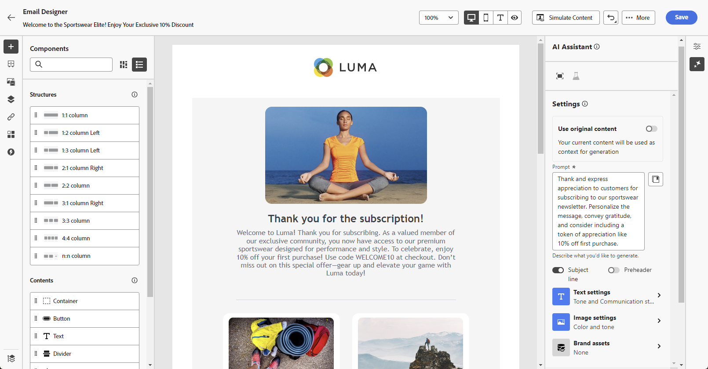
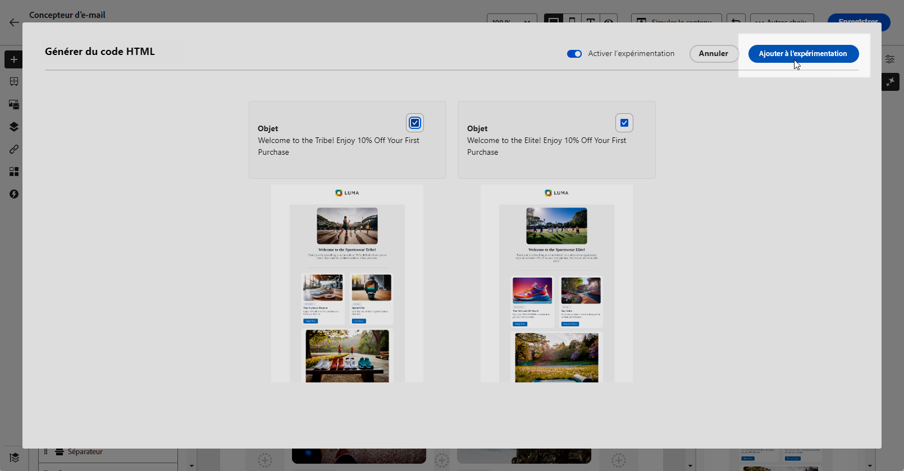

# Expérience de contenu avec l’Assistant IA{#generative-experimentation}

>[!BEGINSHADEBOX]

**Sur cette page :** découvrez comment utiliser l’assistant AI dans Adobe Journey Optimizer pour générer des variations de contenu et les transformer en traitements expérimentaux qui mesurent les performances sur l’ensemble de votre audience cible.

>[!ENDSHADEBOX]

>[!IMPORTANT]
>
>Avant de commencer à utiliser cette fonctionnalité, lisez les [Mécanismes de sécurisation et limites](gs-generative.md#generative-guardrails) associés.
> 
>
>Vous devez accepter un [contrat d’utilisation](https://www.adobe.com/fr/legal/licenses-terms/adobe-dx-gen-ai-user-guidelines.html) avant de pouvoir utiliser l’Assistant IA dans Journey Optimizer. Pour plus d’informations, contactez votre représentant ou représentante Adobe.

Une fois que vous avez conçu et personnalisé vos messages, améliorez votre contenu avec l’Assistant IA dans Adobe Journey Optimizer, qui inclut la fonctionnalité d’expérience de contenu. Cet outil vous permet de définir plusieurs traitements de diffusion, différents contenus, afin de mesurer les performances de votre audience cible.

1. Créez votre campagne et utilisez l’Assistant IA pour générer des variantes.

   Dans cet exemple, nous avons généré un e-mail de confirmation d’abonnement avec un code promotionnel.

   

1. Parcourez les **[!UICONTROL variations]** générées et cliquez sur **[!UICONTROL Prévisualisation]** pour afficher une version plein écran de la variation sélectionnée.

   

1. Sélectionnez **[!UICONTROL Activer l’expérience]** pour commencer à créer des **[!UICONTROL Traitements]** pour votre expérimentation.

1. Sélectionnez les variations que vous souhaitez inclure dans votre expérience.

1. Cliquez sur **Ajouter à l’expérience**.

   

1. À partir de votre expérience de contenu, vous pouvez maintenant commencer à configurer votre expérimentation de contenu. [En savoir plus sur l’expérience de contenu](../content-management/content-experiment.md)

1. Lorsque votre expérience de contenu est prête, vous pouvez cliquer, depuis votre page de résumé de la campagne, sur **[!UICONTROL Examiner pour activer]** pour afficher un résumé de la campagne. Des alertes s’affichent si un paramètre est incorrect ou manquant. [En savoir plus](../content-management/content-experiment.md#treatment-experiment)

1. Avant de lancer votre campagne, vérifiez que toutes les configurations sont correctes, puis cliquez sur **[!UICONTROL Activer]**.

Une fois la campagne configurée et personnalisée, vous pouvez suivre votre campagne dans le rapport de campagne. [En savoir plus](../reports/campaign-global-report-cja.md)
