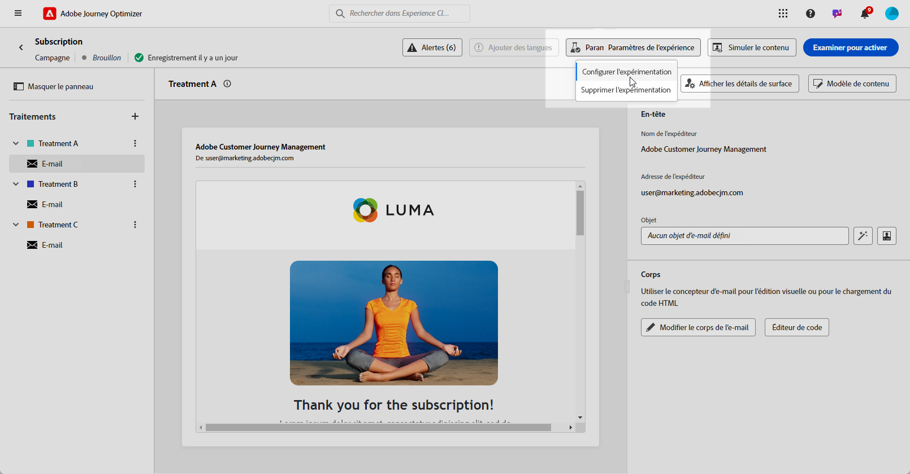

# Expérience de contenu avec l’assistant d’IA {#generative-experimentation}

>[!BEGINSHADEBOX]

**Table des matières**

* [Commencer avec l’Assistant IA](gs-generative.md)
* [Génération d’e-mails avec l’assistant IA](generative-email.md)
* [Génération de SMS avec l’assistant IA](generative-sms.md)
* [Génération des notifications push à l’aide de l’assistant d’IA](generative-push.md)
* Expérience de contenu avec l’assistant d’IA

>[!ENDSHADEBOX]

Une fois que vous avez conçu et personnalisé vos messages, développez votre contenu à l’aide de l’assistant d’IA dans Adobe Journey Optimizer, qui inclut la fonctionnalité Expérience de contenu . Cet outil vous permet de définir plusieurs traitements de diffusion, différents contenus, afin de mesurer les performances de votre audience cible.

1. Créez votre campagne et utilisez l’assistant d’IA pour générer vos variantes.

   Dans cet exemple, nous avons généré un email de confirmation d&#39;abonnement avec un code promotion.

   

1. Parcourez les **[!UICONTROL variations]** générées et cliquez sur **[!UICONTROL Aperçu]** pour afficher une version plein écran de la variation sélectionnée.

   

1. Sélectionner **[!UICONTROL Activation de l’expérience]** pour commencer à créer **[!UICONTROL Traitement]** pour votre expérience.

1. Sélectionnez les variations à inclure à votre expérience.

1. Cliquez sur **Ajouter un ou plusieurs traitements X**.

   

1. Dans la fenêtre Expérience de contenu , accédez à la **[!UICONTROL Paramètres d’expérience]** pour configurer votre expérience. [En savoir plus sur l’expérience de contenu](../campaigns/content-experiment.md)

   

1. Lorsque votre expérience de contenu est prête, dans la page de résumé de votre campagne, vous pouvez cliquer sur **[!UICONTROL Réviser pour activer]** pour afficher un résumé de l&#39;opération. Les alertes s’affichent si un paramètre est incorrect ou manquant. [En savoir plus](../campaigns/content-experiment.md#treatment-experiment)

1. Avant de lancer votre campagne, vérifiez que toutes les configurations sont correctes, puis cliquez sur **[!UICONTROL Activer]**.

Une fois la configuration et la personnalisation de votre campagne effectuées, vous pouvez en assurer le suivi dans le rapport de campagne. [En savoir plus](../reports/campaign-global-report.md)
