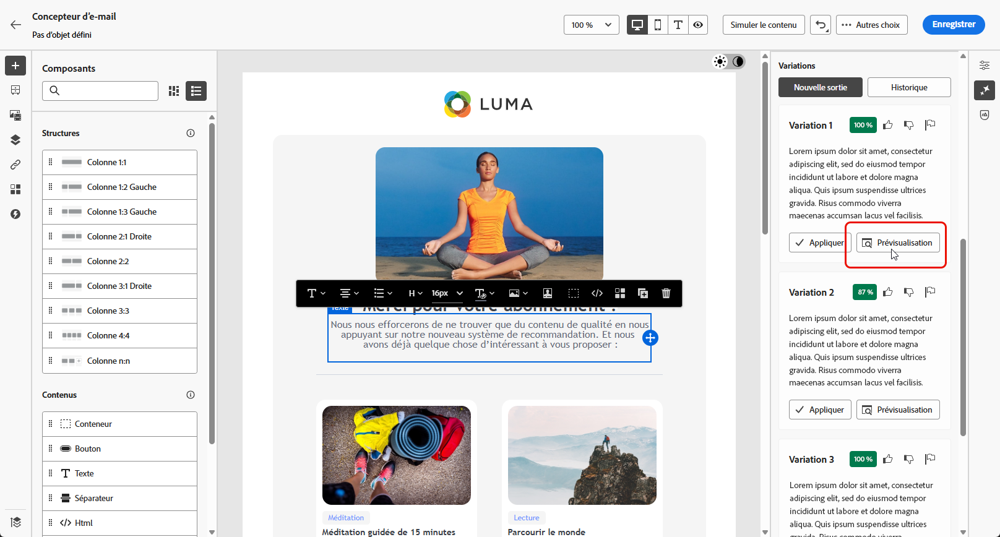

# Expérience de contenu avec l’assistant IA {#generative-experimentation}

>[!BEGINSHADEBOX]

**Table des matières**

* [Commencer avec l’assistant IA](gs-generative.md)
* [Génération d’e-mails avec l’assistant IA](generative-email.md)
* [Génération de SMS avec l’assistant IA](generative-sms.md)
* [Génération de notifications push avec l’assistant IA](generative-push.md)
* Expérience de contenu avec l’assistant IA

>[!ENDSHADEBOX]

Une fois que vous avez conçu et personnalisé vos messages, développez votre contenu avec l’assistant IA dans Adobe Journey Optimizer, qui inclut la fonctionnalité d’expérience de contenu. Cet outil vous permet de définir plusieurs traitements de diffusion, différents contenus, afin de mesurer les performances de votre audience cible.

1. Créez votre campagne et utilisez l’assistant IA pour générer vos variantes.

   Dans cet exemple, nous avons généré un e-mail de confirmation d’abonnement avec un code promotionnel.

   

1. Parcourez les **[!UICONTROL variations]** générées et cliquez sur **[!UICONTROL Prévisualisation]** pour afficher une version plein écran de la variation sélectionnée.

   

1. Sélectionnez **[!UICONTROL Activer l’expérience]** pour commencer à créer des **[!UICONTROL Traitements]** pour votre expérimentation.

1. Sélectionnez les variations que vous souhaitez inclure dans votre expérience.

1. Cliquez sur **Ajouter X traitement(s)**.

   

1. Dans la fenêtre Expérience de contenu, cliquez sur le bouton **[!UICONTROL Paramètres de l’expérience]** pour configurer votre expérience. [En savoir plus sur l’expérience de contenu](../campaigns/content-experiment.md)

   

1. Lorsque votre expérience de contenu est prête, vous pouvez cliquer, depuis votre page de résumé de la campagne, sur **[!UICONTROL Examiner pour activer]** pour afficher un résumé de la campagne. Des alertes s’affichent si un paramètre est incorrect ou manquant. [En savoir plus](../campaigns/content-experiment.md#treatment-experiment)

1. Avant de lancer votre campagne, vérifiez que toutes les configurations sont correctes, puis cliquez sur **[!UICONTROL Activer]**.

Une fois la campagne configurée et personnalisée, vous pouvez suivre votre campagne dans le rapport de campagne. [En savoir plus](../reports/campaign-global-report.md)
