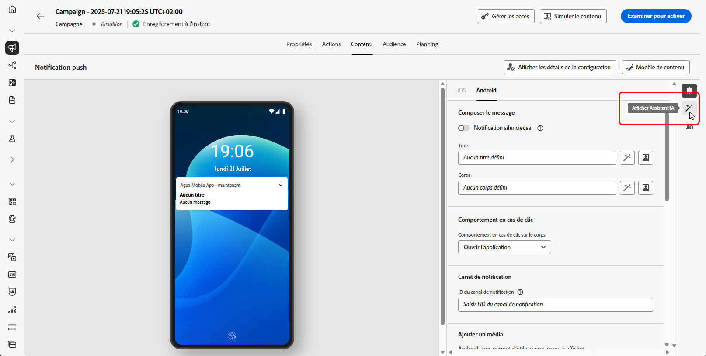

# Générer du contenu complet avec l’assistant d’IA {#generative-full-content}

>[!IMPORTANT]
>
>Avant de commencer à utiliser cette fonctionnalité, lisez la section connexe [Mécanismes de sécurisation et limitations](gs-generative.md#generative-guardrails).
> 
>
>Vous devez accepter un [contrat d’utilisation](https://www.adobe.com/fr/legal/licenses-terms/adobe-dx-gen-ai-user-guidelines.html) avant de pouvoir utiliser l’Assistant IA dans Journey Optimizer. Pour plus d’informations, contactez votre représentant ou représentante Adobe.

Utilisez l’assistant AI dans Journey Optimizer pour générer des expériences de contenu complètes sur vos canaux d’e-mail, web, de page de destination et de notification push. L’assistant d’IA vous aide à optimiser l’impact de vos diffusions en créant un contenu complet qui trouve un écho auprès de votre audience.

## Pour les canaux e-mail et web {#email-web-channels}

L’assistant AI peut produire des expériences de contenu complètes pour vos campagnes par e-mail, pages web et pages de destination, générant du texte et des images. Cette fonctionnalité robuste vous permet de créer du contenu attrayant et sur la marque qui se connecte à votre audience à travers tous les points de contact numériques.

### Accès et configuration {#access-configure}

Avant de commencer à créer du contenu avec l’assistant AI, vous devez configurer votre campagne ou votre parcours et ouvrir l’éditeur de contenu. Suivez les étapes ci-dessous pour préparer votre espace de travail et accéder au panneau de l’assistant AI.

1. Créez et configurez votre campagne ou votre parcours :
   * **E-mail** : après avoir créé et configuré votre campagne par e-mail, cliquez sur **[!UICONTROL Modifier le contenu]**. [En savoir plus](../campaigns/create-campaign.md)
   * **Web** : après avoir créé et configuré votre page web, cliquez sur **[!UICONTROL Modifier la page web]**. [En savoir plus](../web/create-web.md)
   * **Page de destination** : après avoir créé et configuré votre page de destination, cliquez sur **[!UICONTROL Ouvrir le concepteur]**. [En savoir plus](../landing-pages/create-lp.md)

1. Dans le menu de droite, sélectionnez **[!UICONTROL Assistant AI]** (ou **[!UICONTROL Afficher l’assistant de contenu]** pour le web).

   {zoomable="yes"}

### Générer le contenu {#generate-content}

Une fois l’assistant d’IA ouvert, vous pouvez configurer les paramètres de génération pour créer du contenu correspondant aux objectifs de votre marque et de votre campagne. Personnalisez les paramètres de texte et d’image, ajoutez des ressources de marque et fournissez des invites pour guider l’IA dans la génération de variations pertinentes pour votre audience.

1. Sélectionnez votre **[!UICONTROL Marque]** pour vous assurer que le contenu généré par l’IA correspond aux spécifications de celle-ci. [En savoir plus](brands.md) sur les marques.

1. Affinez le contenu en décrivant ce que vous souhaitez générer dans le champ **[!UICONTROL Prompt]**.

   Si vous recherchez de l’aide pour concevoir votre invite, accédez à la **[!UICONTROL bibliothèque d’invites]** qui fournit un large éventail d’idées d’invites pour améliorer vos campagnes. [En savoir plus sur les bonnes pratiques relatives aux invites](ai-assistant-prompting-guide.md)

   {zoomable="yes"}

1. **Pour les e-mails**, vous pouvez activer les options **[!UICONTROL Objet]** et **[!UICONTROL Pré-titre]** pour les inclure dans la génération de la variante.

1. Adaptez votre prompt avec l’option **[!UICONTROL Paramètres de texte]** :

   * **[!UICONTROL Stratégie de communication]** : choisissez le style de communication le plus adapté au texte généré.
   * **[!UICONTROL Langues]** : sélectionnez la langue du contenu généré.
   * **[!UICONTROL Ton]** : Le ton doit résonner auprès de votre audience. Que vous souhaitiez communiquer de façon informative, ludique ou convaincante, l’Assistant IA peut adapter le message en conséquence.

     {zoomable="yes"}

1. Sélectionnez vos **[!UICONTROL paramètres d’image]** :

   * **[!UICONTROL Type de contenu]** : cette propriété classe la nature de l’élément visuel en faisant la distinction entre les différentes formes de représentation visuelle, telles que les photos, les graphiques ou les illustrations.
   * **[!UICONTROL Intensité visuelle]** : vous pouvez contrôler l’impact de l’image en ajustant son intensité. Un paramètre inférieur (2) crée un aspect plus doux et plus modéré, tandis qu’un paramètre supérieur (10) rend l’image plus vivante et visuellement plus puissante.
   * **[!UICONTROL Couleur et ton]** : aspect général des couleurs dans une image et humeur ou ambiance qu’elles véhiculent.
   * **[!UICONTROL Éclairage]** : fait référence à l’éclairage présent dans une image qui forme son atmosphère et met en évidence des éléments spécifiques.
   * **[!UICONTROL Composition]** : fait référence à la disposition des éléments dans le cadre d’une image.

     {zoomable="yes"}

1. Dans le menu **[!UICONTROL Contenu de référence]**, cliquez sur **[!UICONTROL Télécharger le fichier]** pour ajouter une ressource de marque contenant du contenu pouvant fournir un assistant d’IA contextuel supplémentaire ou sélectionnez-en une précédemment chargée.

   Les fichiers précédemment chargés sont disponibles dans le menu déroulant **[!UICONTROL Contenu de référence chargé]**. Activez simplement les ressources que vous souhaitez inclure dans votre génération.

   {zoomable="yes"}

1. Lorsque votre prompt est prêt, cliquez sur **[!UICONTROL Générer]**.

### Affiner et finaliser {#refine-finalize}

Après avoir généré des variations de contenu, vous pouvez affiner les résultats pour vous assurer qu’ils répondent exactement à vos besoins. Examinez l’alignement de la marque, ajustez le ton et la langue, puis préparez le contenu pour l’activation dans votre campagne ou votre parcours.

1. Après la génération, parcourez les **[!UICONTROL Variations]**.

1. Cliquez sur l’icône de pourcentage pour afficher votre **[!UICONTROL score d’alignement sur la marque]** et identifier tout décalage avec votre marque.

   En savoir plus sur le [score d’alignement sur la marque](brands-score.md).

   {zoomable="yes"}

1. Cliquez sur **[!UICONTROL Aperçu]** pour afficher une version en plein écran de la variation sélectionnée ou cliquez sur **[!UICONTROL Appliquer]** pour remplacer votre contenu actuel.

1. Accédez à l’option **[!UICONTROL Affiner]** dans la fenêtre **[!UICONTROL Aperçu]** pour accéder à d’autres fonctionnalités de personnalisation :

   * **[!UICONTROL Reformuler]** : réécrivez le message tout en préservant sa signification. Cette option vous permet de générer une autre formulation, d’améliorer le flux ou d’ajuster les expressions sans modifier le message principal.

   * **[!UICONTROL Utiliser un langage simplifié]** : utilisez l’Assistant IA pour simplifier votre langage, garantissant ainsi clarté et accessibilité pour une audience plus large.

   * **[!UICONTROL Traduire]** : simplifiez votre langue pour garantir la clarté et l’accessibilité pour une audience plus large.

   * **[!UICONTROL Changer de ton]** : ajustez le ton du message pour mieux correspondre à votre style de communication, c’est-à-dire le rendre plus convivial, professionnel, urgent ou inspirant.

   * **[!UICONTROL Modifier la stratégie de communication]** : modifiez l’approche de messagerie en fonction de vos objectifs, tels que créer une urgence ou mettre l’accent sur un appel passionnant.

     {zoomable="yes"}

1. Ouvrez l’onglet **[!UICONTROL Alignement sur la marque]** pour voir comment votre contenu s’aligne sur vos [directives de marque](brands.md).

1. Cliquez sur **[!UICONTROL Sélectionner]** une fois que vous avez trouvé le contenu approprié.

   Vous pouvez également activer l’expérience pour votre contenu. [En savoir plus](generative-experimentation.md)

1. Insérez des champs de personnalisation pour personnaliser votre contenu en fonction des données de profil. Cliquez ensuite sur le bouton **[!UICONTROL Simuler le contenu]** pour contrôler le rendu et vérifier les paramètres de personnalisation avec les profils de test. [En savoir plus](../personalization/personalize.md)

1. Examinez et activez votre contenu :
   * **E-mail** : lorsque vous avez défini le contenu, l’audience et le planning, vous êtes prêt à préparer votre campagne par e-mail. [En savoir plus](../campaigns/review-activate-campaign.md)
   * **Web** : une fois que vous avez défini vos paramètres de campagne web et modifié votre contenu selon vos besoins, vous pouvez examiner et activer votre campagne web. [En savoir plus](../web/create-web.md#activate-web-campaign)
   * **Page de destination** : une fois votre page de destination prête, vous pouvez la publier pour la rendre disponible pour une utilisation dans un message. [En savoir plus](../landing-pages/create-lp.md#publish-landing-page)

## Pour les canaux mobiles {#mobile-channels}

L’assistant AI prend également en charge la génération de contenu pour les notifications push mobiles, ce qui vous permet de créer des titres, des messages et des images attrayants pour vos applications mobiles. Vous pouvez ainsi maintenir une communication cohérente et de haute qualité entre tous les points de contact des clients, y compris les appareils mobiles.

### Accès et configuration {#mobile-access-configure}

Pour utiliser l’assistant AI pour les notifications push, commencez par configurer votre campagne push et ouvrez l’éditeur de contenu. Les étapes ci-dessous vous guideront tout au long de la préparation de votre campagne et de l’accès aux outils de l’assistant AI.

1. Après avoir créé et configuré votre campagne de notifications push, cliquez sur **[!UICONTROL Modifier le contenu]**.

   Pour plus d’informations sur la configuration de votre campagne de notifications push, consultez [cette page](../push/create-push.md).

1. Renseignez les **[!UICONTROL Détails de base]** de votre campagne. Une fois terminé, cliquez sur **[!UICONTROL Modifier le contenu]**.

1. Personnalisez vos notifications push selon vos besoins. [En savoir plus](../push/design-push.md)

1. Accédez au menu **[!UICONTROL Afficher l’assistant IA]**.

   {zoomable="yes"}

### Générer le contenu {#mobile-generate-content}

Une fois que vous avez accédé à l’assistant AI pour les notifications push, vous pouvez configurer les paramètres de génération afin de créer du contenu mobile attrayant. Définissez vos préférences de texte et d’image, sélectionnez les ressources de la marque et utilisez les invites pour générer des variations de notification push qui impliquent vos utilisateurs mobiles.

1. Activez l’option **[!UICONTROL Utiliser le contenu original]** pour que l’Assistant IA personnalise le nouveau contenu en fonction du contenu sélectionné.

1. Sélectionnez votre **[!UICONTROL Marque]** pour vous assurer que le contenu généré par l’IA correspond aux spécifications de celle-ci. [En savoir plus](brands.md) sur les marques.

   Notez que cette fonctionnalité est disponible en version Private Beta et sera progressivement disponible pour l’ensemble de la clientèle dans les versions ultérieures.

1. Affinez le contenu en décrivant ce que vous souhaitez générer dans le champ **[!UICONTROL Prompt]**.

   Si vous avez besoin d’aide pour concevoir votre prompt, accédez à la **[!UICONTROL Bibliothèque de prompts]** qui offre un large éventail d’idées d’invites pour améliorer vos campagnes.

   {zoomable="yes"}

1. Sélectionnez le champ à générer : **[!UICONTROL Titre]**, **[!UICONTROL Message]** et/ou **[!UICONTROL Image]**.

1. Adaptez votre prompt avec l’option **[!UICONTROL Paramètres de texte]** :

   * **[!UICONTROL Stratégie de communication]** : choisissez le style de communication le plus adapté au texte généré.
   * **[!UICONTROL Langues]** : sélectionnez la langue du contenu généré.
   * **[!UICONTROL Ton]** : le ton de votre notification push doit résonner auprès de votre audience. Que vous souhaitiez communiquer de façon informative, ludique ou convaincante, l’Assistant IA peut adapter le message en conséquence.

     {zoomable="yes"}

1. Sélectionnez vos **[!UICONTROL paramètres d’image]** :

   * **[!UICONTROL Type de contenu]** : cette propriété classe la nature de l’élément visuel en faisant la distinction entre les différentes formes de représentation visuelle, telles que les photos, les graphiques ou les illustrations.
   * **[!UICONTROL Intensité visuelle]** : vous pouvez contrôler l’impact de l’image en ajustant son intensité. Un paramètre inférieur (2) crée un aspect plus doux et plus modéré, tandis qu’un paramètre supérieur (10) rend l’image plus vivante et visuellement plus puissante.
   * **[!UICONTROL Couleur et ton]** : aspect général des couleurs dans une image et humeur ou ambiance qu’elles véhiculent.
   * **[!UICONTROL Éclairage]** : fait référence à l’éclairage présent dans une image qui forme son atmosphère et met en évidence des éléments spécifiques.
   * **[!UICONTROL Composition]** : fait référence à la disposition des éléments dans le cadre d’une image.

     {zoomable="yes"}

1. Dans le menu **[!UICONTROL Contenu de référence]**, cliquez sur **[!UICONTROL Télécharger le fichier]** pour ajouter une ressource de marque contenant du contenu pouvant fournir un assistant d’IA contextuel supplémentaire ou sélectionnez-en une précédemment chargée.

   Les fichiers précédemment chargés sont disponibles dans le menu déroulant **[!UICONTROL Contenu de référence chargé]**. Activez simplement les ressources que vous souhaitez inclure dans votre génération.

1. Lorsque votre prompt est prêt, cliquez sur **[!UICONTROL Générer]**.

### Affiner et finaliser {#mobile-refine-finalize}

Après avoir examiné les variations de notification push générées, vous pouvez parfaire le contenu. Utilisez des outils de perfectionnement pour ajuster la langue et le ton, vérifier l’alignement de la marque et personnaliser le contenu avant d’activer votre campagne push.

1. Parcourez les **[!UICONTROL variations]** générées.

1. Cliquez sur l’icône de pourcentage pour afficher votre **[!UICONTROL score d’alignement sur la marque]** et identifier tout décalage avec votre marque.

   En savoir plus sur le [score d’alignement sur la marque](brands-score.md).

   {zoomable="yes"}

1. Cliquez sur **[!UICONTROL Aperçu]** pour afficher une version en plein écran de la variation sélectionnée ou cliquez sur **[!UICONTROL Appliquer]** pour remplacer votre contenu actuel.

1. Accédez à l’option **[!UICONTROL Affiner]** dans la fenêtre **[!UICONTROL Aperçu]** pour accéder à d’autres fonctionnalités de personnalisation :

   * **[!UICONTROL Utiliser comme contenu de référence]** : la variante choisie servira de contenu de référence pour générer d’autres résultats.

   * **[!UICONTROL Reformuler]** : réécrivez le message tout en préservant sa signification. Cette option vous permet de générer une autre formulation, d’améliorer le flux ou d’ajuster les expressions sans modifier le message principal.

   * **[!UICONTROL Utiliser un langage simplifié]** : utilisez l’Assistant IA pour simplifier votre langage, garantissant ainsi clarté et accessibilité pour une audience plus large.

   * **[!UICONTROL Changer de ton]** : ajustez le ton du message pour mieux correspondre à votre style de communication, c’est-à-dire le rendre plus convivial, professionnel, urgent ou inspirant.

   * **[!UICONTROL Modifier la stratégie de communication]** : modifiez l’approche de messagerie en fonction de vos objectifs, tels que créer une urgence ou mettre l’accent sur un appel passionnant.

     {zoomable="yes"}

1. Ouvrez l’onglet **[!UICONTROL Alignement sur la marque]** pour voir comment votre contenu s’aligne sur vos [directives de marque](brands.md).

1. Cliquez sur **[!UICONTROL Sélectionner]** une fois que vous avez trouvé le contenu approprié.

   Vous pouvez également activer l’expérience pour votre contenu. [En savoir plus](generative-experimentation.md)

1. Insérez des champs de personnalisation pour personnaliser le contenu de vos notifications push en fonction des données de profil. Cliquez ensuite sur le bouton **[!UICONTROL Simuler le contenu]** pour contrôler le rendu et vérifier les paramètres de personnalisation avec les profils de test. [En savoir plus](../personalization/personalize.md)

Lorsque vous avez défini le contenu, l’audience et le planning, vous pouvez préparer votre campagne de notifications push. [En savoir plus](../campaigns/review-activate-campaign.md)

## Vidéo pratique {#video}

Découvrez comment utiliser l’assistant AI dans Journey Optimizer pour générer des expériences de contenu complètes.

>[!VIDEO](https://video.tv.adobe.com/v/3433552)
