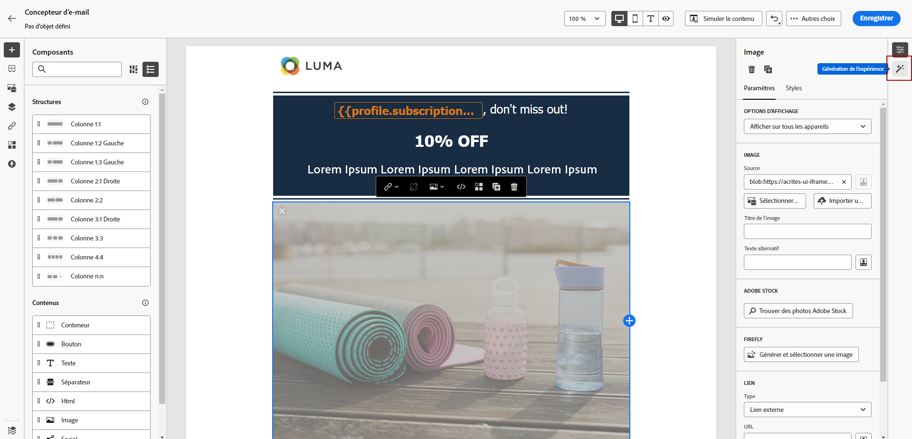
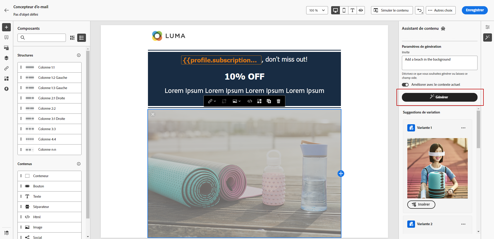
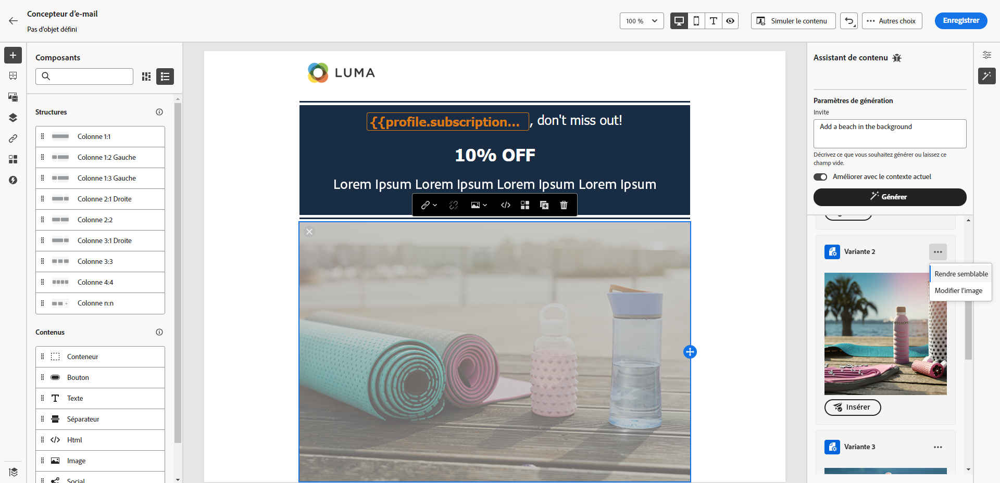
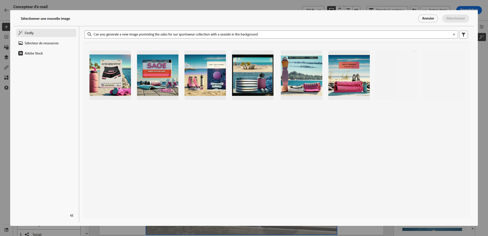
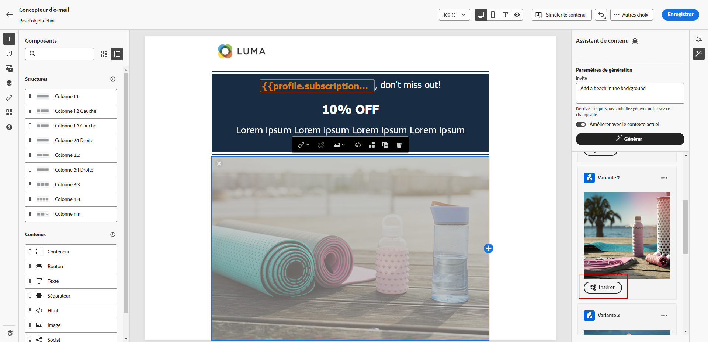
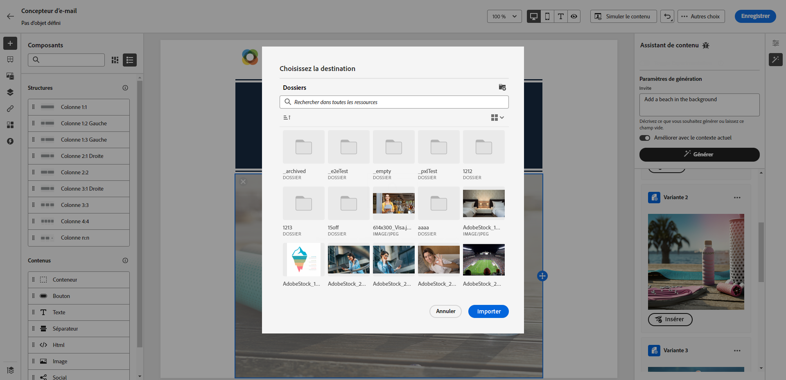

# Génération d’images avec l’assistant de contenu {#image-content-assistant}

>[!BEGINSHADEBOX]

**Table des matières**

* [Commencer avec l’assistant de contenu](gs-generative.md)
* [Générer du texte avec l’assistant de contenu](generative-content.md)
* **[Générer des images avec l’assistant de contenu](generative-image.md)**

>[!ENDSHADEBOX]

Une fois que vous avez créé et personnalisé vos e-mails ou pages web, améliorez la qualité de votre contenu avec l’assistant de contenu. Cet outil puissant vous permet de personnaliser et d’améliorer votre contenu sans effort.

Dans l’exemple ci-dessous, découvrez comment utiliser l’assistant de contenu pour mettre à jour et améliorer vos ressources, afin d’offrir une meilleure expérience à vos clientes et clients. Procédez de la façon suivante :

1. Après avoir créé et configuré votre message, cliquez sur **[!UICONTROL Créer du contenu]** et personnalisez-le selon vos besoins.

1. Sélectionnez la ressource que vous souhaitez modifier à l’aide de l’assistant de contenu.

1. Dans le menu de droite, sélectionnez **[!UICONTROL Génération d’expériences]**.

   

1. Ajoutez une invite pour optimiser les résultats et cliquez sur **[!UICONTROL Générer]**.

   Activez l’option **[!UICONTROL Améliorer le contenu actuel]** pour l’assistant de contenu afin de personnaliser les nouvelles ressources en fonction de votre message, du nom de la campagne et de l’audience sélectionnée.

   

1. Parcourez les **[!UICONTROL Suggestions de variation]** pour trouver la ressource souhaitée.

1. Une fois que vous avez choisi votre **[!UICONTROL Variante]**, accédez au menu avancé de la ressource sélectionnée.

   

1. Vous pouvez choisir **[!UICONTROL Rendre similaire]** pour générer plus de variantes en fonction de la variante sélectionnée.

1. Cliquez sur **[!UICONTROL Modifier l’image]** pour accéder au menu **[!UICONTROL Sélectionner une nouvelle image]**.

1. Dans ce menu, vous pouvez générer une nouvelle ressource ou choisir d’en utiliser une existante à partir de vos dossiers de ressources.

   

1. Cliquez sur **[!UICONTROL Insérer]** pour ajouter la ressource générée à votre contenu.

   

1. Sélectionnez dans quel dossier enregistrer la ressource générée et cliquez sur **[!UICONTROL Importer]**.

   

1. Après avoir défini le contenu de votre message, cliquez sur le bouton **[!UICONTROL Simuler du contenu]** pour contrôler le rendu et vérifier les paramètres de personnalisation avec les profils de test. [En savoir plus](../email/preview.md)

1. Lorsque votre message est prêt, vous pouvez cliquer, depuis votre page de résumé de la campagne, sur **[!UICONTROL Examiner pour activer]** pour afficher un résumé de la campagne. Des alertes s’affichent si un paramètre est incorrect ou manquant.

1. Avant de lancer votre campagne, vérifiez que toutes les configurations sont correctes, puis cliquez sur **[!UICONTROL Activer]**.

Une fois l’expérimentation et la campagne configurées, vous pouvez suivre votre campagne dans le rapport de campagne. [En savoir plus](../reports/campaign-global-report.md#experimentation-report)
