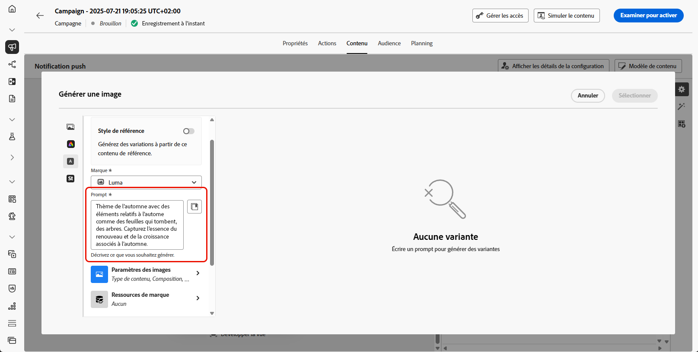

# Générer des images avec l’assistant d’IA {#generative-image}

>[!IMPORTANT]
>
>Avant de commencer à utiliser cette fonctionnalité, lisez la section connexe [Mécanismes de sécurisation et limitations](gs-generative.md#generative-guardrails).
> 
>
>Vous devez accepter un [contrat d’utilisation](https://www.adobe.com/fr/legal/licenses-terms/adobe-dx-gen-ai-user-guidelines.html) avant de pouvoir utiliser l’Assistant IA dans Journey Optimizer. Pour plus d’informations, contactez votre représentant ou représentante Adobe.

Utilisez l’assistant AI dans Journey Optimizer pour générer du contenu visuel attrayant qui améliore vos messages sur les e-mails, le web, les pages de destination et les notifications push. L’assistant d’IA vous aide à optimiser et à améliorer vos ressources, offrant ainsi une expérience plus conviviale et attrayante à votre audience.

## Pour les canaux e-mail et web {#email-web-channels}

L’assistant AI peut générer des expériences visuelles complètes pour vos campagnes par e-mail, expériences web et pages de destination. Cette fonctionnalité vous permet de produire des images de marque attrayantes qui résonnent avec votre audience à travers les points de contact numériques.

### Accès et configuration {#access-configure}

Pour commencer à générer des images avec l’assistant AI, commencez par configurer votre campagne ou votre parcours et ouvrez l’éditeur de contenu. Suivez les étapes ci-dessous pour préparer votre espace de travail et accéder au panneau de l’assistant AI.

1. Créez et configurez votre campagne ou votre parcours :
   * **E-mail** : après avoir créé et configuré votre campagne par e-mail, cliquez sur **[!UICONTROL Modifier le contenu]**. [En savoir plus](../email/create-email.md)
   * **Web** : après avoir créé et configuré votre page web, cliquez sur **[!UICONTROL Modifier la page web]**. [En savoir plus](../web/create-web.md)
   * **Page de destination** : après avoir créé et configuré votre page de destination, cliquez sur **[!UICONTROL Ouvrir le concepteur]**. [En savoir plus](../landing-pages/create-lp.md)

1. Sélectionnez la ressource que vous souhaitez modifier à l’aide de l’Assistant IA.

1. Dans le menu de droite, sélectionnez **[!UICONTROL Assistant AI]** (ou **[!UICONTROL Afficher l’assistant de contenu]** pour le web).

   {zoomable="yes"}

### Générer le contenu {#generate-content}

Découvrez comment créer des invites efficaces et configurer les paramètres d&#39;image pour générer des images visuellement attrayantes avec l&#39;assistant AI. Personnalisez des paramètres tels que le rapport L/H, l’intensité visuelle et l’éclairage pour créer des images conformes aux objectifs de votre marque et de votre campagne.

1. Activez l’option **[!UICONTROL Style de référence]** pour que l’Assistant IA personnalise le nouveau contenu en fonction du contenu de référence. Vous pouvez également charger une image pour ajouter du contexte à votre variation.

1. Sélectionnez votre **[!UICONTROL Marque]** pour vous assurer que le contenu généré par l’IA correspond aux spécifications de celle-ci. [En savoir plus](brands.md) sur les marques.

1. Affinez le contenu en décrivant ce que vous souhaitez générer dans le champ **[!UICONTROL Prompt]**.

   Si vous avez besoin d’aide pour concevoir votre prompt, accédez à la **[!UICONTROL Bibliothèque de prompts]** qui offre un large éventail d’idées d’invites pour améliorer vos campagnes.

   {zoomable="yes"}

1. Adaptez votre prompt avec l’option **[!UICONTROL Paramètres des images]** :

   * **[!UICONTROL Format]** : déterminez la largeur et la hauteur de la ressource. Vous avez la possibilité de choisir parmi des formats courants tels que 16:9, 4:3, 3:2 ou 1:1, ou vous pouvez saisir une taille personnalisée.
   * **[!UICONTROL Type de contenu]** : cette propriété classe la nature de l’élément visuel en faisant la distinction entre les différentes formes de représentation visuelle, telles que les photos, les graphiques ou les illustrations.
   * **[!UICONTROL Intensité visuelle]** : vous pouvez contrôler l’impact de l’image en ajustant son intensité. Un paramètre inférieur (2) crée un aspect plus doux et plus modéré, tandis qu’un paramètre supérieur (10) rend l’image plus vivante et visuellement plus puissante.
   * **[!UICONTROL Couleur et ton]** : aspect général des couleurs dans une image et humeur ou ambiance qu’elles véhiculent.
   * **[!UICONTROL Éclairage]** : fait référence à l’éclairage présent dans une image qui forme son atmosphère et met en évidence des éléments spécifiques.
   * **[!UICONTROL Composition]** : fait référence à la disposition des éléments dans le cadre d’une image.

     {zoomable="yes"}

1. Dans le menu **[!UICONTROL Contenu de référence]**, cliquez sur **[!UICONTROL Télécharger le fichier]** pour ajouter une ressource de marque contenant du contenu pouvant fournir un assistant d’IA contextuel supplémentaire ou sélectionnez-en une précédemment chargée.

   Les fichiers précédemment chargés sont disponibles dans le menu déroulant **[!UICONTROL Contenu de référence chargé]**. Activez simplement les ressources que vous souhaitez inclure dans votre génération.

1. Quand la configuration de votre prompt vous satisfait, cliquez sur **[!UICONTROL Générer]**.

### Affiner et finaliser {#refine-finalize}

Après avoir généré des variations d’image, vous pouvez consulter les résultats, vérifier l’alignement des marques, effectuer des modifications dans Adobe Express et sélectionner la meilleure option pour votre contenu.

1. Parcourez les **[!UICONTROL Suggestions de variation]** pour trouver la ressource souhaitée.

1. Cliquez sur l’icône de pourcentage pour afficher votre **[!UICONTROL score d’alignement sur la marque]** et identifier tout décalage avec votre marque.

   En savoir plus sur le [score d’alignement sur la marque](brands-score.md).

   {zoomable="yes"}

1. Cliquez sur **[!UICONTROL Aperçu]** pour afficher une version en plein écran de la variation sélectionnée ou cliquez sur **[!UICONTROL Appliquer]** pour remplacer votre contenu actuel.

1. Accédez à l’option **[!UICONTROL Affiner]** dans la fenêtre **[!UICONTROL Aperçu]** pour accéder à d’autres fonctionnalités de personnalisation :

   * **[!UICONTROL Générer des résultats similaires]** : permet d’afficher les images associées à cette variante.
   * **[!UICONTROL Modifier dans Adobe Express]** : permet de personnaliser davantage votre ressource.

[En savoir plus sur l’intégration d’Adobe Express](../integrations/express.md)

   * **[!UICONTROL Enregistrer]** : permet de stocker les ressources en vue d’un accès ultérieur.

     {zoomable="yes"}

1. Cliquez sur **[!UICONTROL Sélectionner]** une fois que vous avez trouvé le contenu approprié.

   Vous pouvez également activer l’expérience pour votre contenu. [En savoir plus](generative-experimentation.md)

1. Après avoir défini le contenu de votre message, cliquez sur le bouton **[!UICONTROL Simuler du contenu]** pour contrôler le rendu et vérifier les paramètres de personnalisation avec les profils de test. [En savoir plus](../personalization/personalize.md)

1. Examinez et activez votre contenu :
   * **E-mail** : lorsque vous avez défini le contenu, l’audience et le planning, vous êtes prêt à préparer votre campagne par e-mail. [En savoir plus](../campaigns/review-activate-campaign.md)
   * **Web** : une fois que vous avez défini vos paramètres de campagne web et modifié votre contenu selon vos besoins, vous pouvez examiner et activer votre campagne web. [En savoir plus](../web/create-web.md#activate-web-campaign)
   * **Page de destination** : une fois votre page de destination prête, vous pouvez la publier pour la rendre disponible pour une utilisation dans un message. [En savoir plus](../landing-pages/create-lp.md#publish-landing-page)

## Pour les canaux mobiles {#mobile-channels}

L’assistant AI vous permet de générer des images attrayantes pour les notifications push, ce qui vous permet de créer des communications mobiles visuellement attrayantes qui captent l’attention et résonnent avec votre audience.

### Accès et configuration {#mobile-access-configure}

Pour utiliser l’assistant AI pour les notifications push, vous devez configurer votre diffusion push et accéder à l’éditeur de contenu. Ces étapes vous guideront tout au long de la création de votre diffusion et de l’accès aux fonctionnalités de l’assistant AI.

1. Après avoir créé et configuré votre diffusion de notifications push, cliquez sur **[!UICONTROL Modifier le contenu]**.

   Pour plus d’informations sur la configuration de votre diffusion de notifications push, consultez [cette page](../push/create-push.md).

1. Personnalisez vos notifications push selon vos besoins. [En savoir plus](../push/design-push.md)

1. Accédez au menu **[!UICONTROL Afficher l’assistant IA]**.

   {zoomable="yes"}

### Générer le contenu {#mobile-generate-content}

Après avoir accédé à l&#39;assistant AI, vous pouvez ajuster les paramètres de génération pour créer des images qui s&#39;alignent sur votre marque et prennent en charge vos objectifs de notification push. Configurez les paramètres d’invite et d’image pour générer des visuels optimisés pour les affichages mobiles.

1. Sélectionnez votre **[!UICONTROL Marque]** pour vous assurer que le contenu généré par l’IA correspond aux spécifications de celle-ci. [En savoir plus](brands.md) sur les marques.

   Notez que cette fonctionnalité est disponible en version Private Beta et sera progressivement disponible pour l’ensemble de la clientèle dans les versions ultérieures.

1. Affinez le contenu en décrivant ce que vous souhaitez générer dans le champ **[!UICONTROL Prompt]**.

   Si vous avez besoin d’aide pour concevoir votre prompt, accédez à la **[!UICONTROL Bibliothèque de prompts]** qui offre un large éventail d’idées d’invites pour améliorer vos campagnes.

   {zoomable="yes"}

1. Sélectionnez **[!UICONTROL Image]** comme champ à générer.

1. Sélectionnez vos **[!UICONTROL paramètres d’image]** :

   * **[!UICONTROL Type de contenu]** : cette propriété classe la nature de l’élément visuel en faisant la distinction entre les différentes formes de représentation visuelle, telles que les photos, les graphiques ou les illustrations.
   * **[!UICONTROL Intensité visuelle]** : vous pouvez contrôler l’impact de l’image en ajustant son intensité. Un paramètre inférieur (2) crée un aspect plus doux et plus modéré, tandis qu’un paramètre supérieur (10) rend l’image plus vivante et visuellement plus puissante.
   * **[!UICONTROL Couleur et ton]** : aspect général des couleurs dans une image et humeur ou ambiance qu’elles véhiculent.
   * **[!UICONTROL Éclairage]** : fait référence à l’éclairage présent dans une image qui forme son atmosphère et met en évidence des éléments spécifiques.
   * **[!UICONTROL Composition]** : fait référence à la disposition des éléments dans le cadre d’une image.

     {zoomable="yes"}

1. Dans le menu **[!UICONTROL Contenu de référence]**, cliquez sur **[!UICONTROL Télécharger le fichier]** pour ajouter une ressource de marque contenant du contenu pouvant fournir un assistant d’IA contextuel supplémentaire ou sélectionnez-en une précédemment chargée.

   Les fichiers précédemment chargés sont disponibles dans le menu déroulant **[!UICONTROL Contenu de référence chargé]**. Activez simplement les ressources que vous souhaitez inclure dans votre génération.

1. Lorsque votre prompt est prêt, cliquez sur **[!UICONTROL Générer]**.

### Affiner et finaliser {#mobile-refine-finalize}

Après avoir généré des variations d’image pour vos notifications push, vous pouvez affiner les résultats pour vous assurer qu’ils répondent exactement à vos besoins. Vérifiez l’alignement de la marque, modifiez-la dans Adobe Express si nécessaire, puis sélectionnez l’image la plus adaptée à votre campagne mobile.

1. Parcourez les **[!UICONTROL variations]** générées.

1. Cliquez sur l’icône de pourcentage pour afficher votre **[!UICONTROL score d’alignement sur la marque]** et identifier tout décalage avec votre marque.

   En savoir plus sur le [score d’alignement sur la marque](brands-score.md).

   {zoomable="yes"}

1. Cliquez sur **[!UICONTROL Aperçu]** pour afficher une version en plein écran de la variation sélectionnée ou cliquez sur **[!UICONTROL Appliquer]** pour remplacer votre contenu actuel.

1. Ouvrez l’onglet **[!UICONTROL Alignement sur la marque]** pour voir comment votre contenu s’aligne sur vos [directives de marque](brands.md).

1. Cliquez sur **[!UICONTROL Sélectionner]** une fois que vous avez trouvé le contenu approprié.

   Vous pouvez également activer l’expérience pour votre contenu. [En savoir plus](generative-experimentation.md)

Lorsque vous avez défini le contenu, l’audience et le planning, vous pouvez préparer votre campagne de notifications push. [En savoir plus](../campaigns/review-activate-campaign.md)

