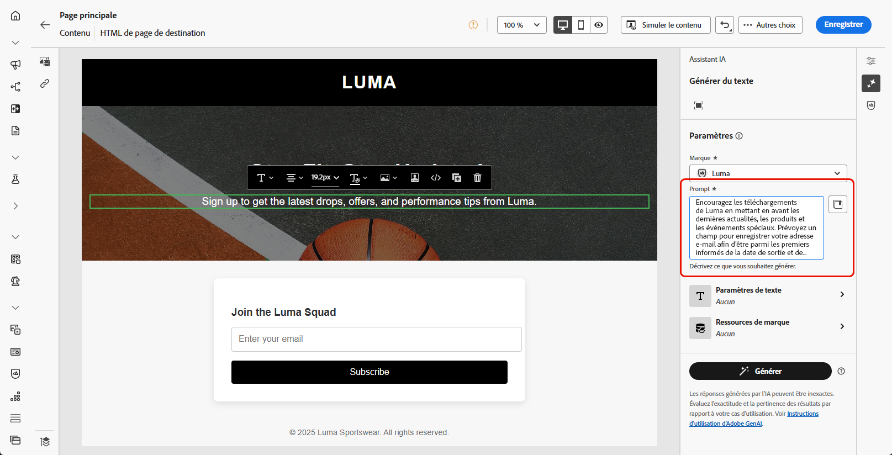
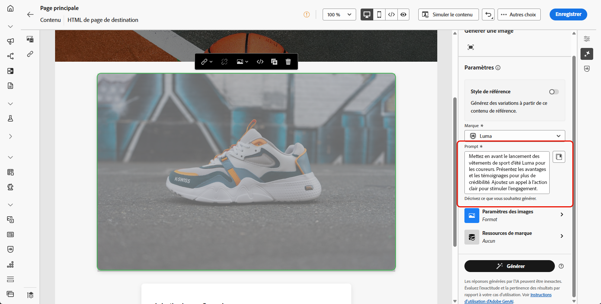

# Génération de pages de destination avec l’Assistant IA {#generative-lp}

>[!IMPORTANT]
>
>* Avant de commencer à utiliser cette fonctionnalité, lisez la section connexe [Mécanismes de sécurisation et limitations](gs-generative.md#generative-guardrails).
>
>
>* Vous devez accepter un [contrat d’utilisation](https://www.adobe.com/fr/legal/licenses-terms/adobe-dx-gen-ai-user-guidelines.html) avant d’utiliser l’Assistant IA dans Journey Optimizer. Pour plus d’informations, contactez votre représentant ou représentante Adobe.

Transformez vos pages de destination avec l’Assistant IA dans Journey Optimizer, optimisé par l’IA générative.

Créez sans effort du contenu à fort impact, y compris des pages complètes, des fragments de texte et des visuels personnalisés qui correspondent à votre audience, ce qui entraîne un engagement et une interaction accrus.

Explorez les onglets ci-dessous pour savoir comment utiliser l’Assistant IA dans Journey Optimizer.

>[!BEGINTABS]

>[!TAB Génération complète d’une page de destination]

Dans l’exemple suivant, nous allons utiliser l’Assistant IA pour affiner un modèle de page de destination existant.

1. Après avoir créé et configuré votre page de destination, cliquez sur **[!UICONTROL Modifier le contenu]**.

   Pour plus d’informations sur la configuration de votre page de destination, consultez [cette page](../landing-pages/create-lp.md).

1. Personnalisez votre disposition selon vos besoins et accédez au menu **[!UICONTROL Assistant IA]**.

   {zoomable="yes"}

1. Activez l’option **[!UICONTROL Utiliser le contenu original]** pour que l’Assistant IA personnalise le nouveau contenu en fonction du contenu sélectionné.

1. Affinez le contenu en décrivant ce que vous souhaitez générer dans le champ **[!UICONTROL Prompt]**.

   Si vous avez besoin d’aide pour concevoir votre prompt, accédez à la **[!UICONTROL Bibliothèque de prompts]** qui propose un large éventail d’idées de prompts pour améliorer votre page de destination.

   {zoomable="yes"}

1. Adaptez votre prompt avec l’option **[!UICONTROL Paramètres de texte]** :

   * **[!UICONTROL Stratégie de communication]** : choisissez le style de communication le plus adapté au texte généré.
   * **[!UICONTROL Langues]** : sélectionnez la langue du contenu généré.
   * **[!UICONTROL Ton]** : le ton de votre page de destination doit correspondre à votre audience. Que vous souhaitiez communiquer de façon informative, ludique ou convaincante, l’Assistant IA peut adapter le message en conséquence.

   {zoomable="yes"}

1. Sélectionnez vos **[!UICONTROL paramètres d’image]** :

   * **[!UICONTROL Type de contenu]** : cette propriété classe la nature de l’élément visuel en faisant la distinction entre les différentes formes de représentation visuelle, telles que les photos, les graphiques ou les illustrations.
   * **[!UICONTROL Intensité visuelle]** : vous pouvez contrôler l’impact de l’image en ajustant son intensité. Un paramètre inférieur (2) crée un aspect plus doux et plus modéré, tandis qu’un paramètre supérieur (10) rend l’image plus vivante et visuellement plus puissante.
   * **[!UICONTROL Couleur et ton]** : aspect général des couleurs dans une image et humeur ou ambiance qu’elles véhiculent.
   * **[!UICONTROL Éclairage]** : fait référence à l’éclairage présent dans une image qui forme son atmosphère et met en évidence des éléments spécifiques.
   * **[!UICONTROL Composition]** : fait référence à la disposition des éléments dans le cadre d’une image.

   {zoomable="yes"}

1. Depuis le menu **[!UICONTROL Ressources de marque]**, cliquez sur **[!UICONTROL Charger une ressource de marque]** pour ajouter toute ressource de marque incluant du contenu pouvant fournir du contexte supplémentaire à l’Assistant IA ou sélectionnez-en une chargée précédemment.

   Les fichiers précédemment chargés sont disponibles dans la liste déroulante **[!UICONTROL Ressources de marque chargées]**. Activez simplement les ressources que vous souhaitez inclure dans votre génération.

1. Lorsque votre prompt est prêt, cliquez sur **[!UICONTROL Générer]**.

1. Parcourez les **[!UICONTROL variations]** générées.

   Cliquez sur **[!UICONTROL Aperçu]** pour afficher une version en plein écran de la variation sélectionnée ou cliquez sur **[!UICONTROL Appliquer]** pour remplacer votre contenu actuel.

1. Cliquez sur l’icône de pourcentage pour afficher votre **[!UICONTROL score d’alignement sur la marque]** et identifier tout décalage avec votre marque.

   En savoir plus sur le [score d’alignement sur la marque](brands-score.md).

   {zoomable="yes"}

1. Accédez à l’option **[!UICONTROL Affiner]** dans la fenêtre **[!UICONTROL Aperçu]** pour accéder à d’autres fonctionnalités de personnalisation :

   * **[!UICONTROL Reformuler]** : l’assistant IA peut reformuler votre message de différentes manières en conservant une écriture soignée et attrayante pour diverses audiences.

   * **[!UICONTROL Utiliser un langage simplifié]** : utilisez l’Assistant IA pour simplifier votre langage, garantissant ainsi clarté et accessibilité pour une audience plus large.

   Vous pouvez également modifier le **[!UICONTROL ton]** et la **[!UICONTROL stratégie de communication]** de votre texte.

   {zoomable="yes"}

1. Ouvrez l’onglet **[!UICONTROL Alignement sur la marque]** pour voir comment votre contenu s’aligne sur vos [directives de marque](brands.md).

1. Cliquez sur **[!UICONTROL Sélectionner]** une fois que vous avez trouvé le contenu approprié.

1. Insérez des champs de personnalisation pour personnaliser le contenu de votre page de destination en fonction des données des profils. Cliquez ensuite sur le bouton **[!UICONTROL Simuler le contenu]** pour contrôler le rendu et vérifier les paramètres de personnalisation avec les profils de test. [En savoir plus](../personalization/personalize.md)

Une fois votre page de destination prête, vous pouvez la publier afin de pouvoir l’utiliser dans un message. [En savoir plus](../landing-pages/create-lp.md#publish-landing-page)

>[!TAB Génération de texte uniquement]

Dans l’exemple suivant, nous allons utiliser l’Assistant IA pour améliorer le contenu de notre page de destination.

1. Après avoir créé et configuré votre page de destination, cliquez sur **[!UICONTROL Modifier le contenu]**.

   Pour plus d’informations sur la configuration de votre page de destination, consultez [cette page](../landing-pages/create-lp.md).

1. Sélectionnez un **[!UICONTROL composant de texte]** pour cibler uniquement un contenu spécifique. Accédez au menu **[!UICONTROL Assistant IA]**.

   {zoomable="yes"}

1. Activez l’option **[!UICONTROL Utiliser le contenu original]** pour que l’Assistant IA personnalise le nouveau contenu en fonction du contenu sélectionné.

1. Affinez le contenu en décrivant ce que vous souhaitez générer dans le champ **[!UICONTROL Prompt]**.

   Si vous avez besoin d’aide pour concevoir votre prompt, accédez à la **[!UICONTROL Bibliothèque de prompts]** qui propose un large éventail d’idées de prompts pour améliorer vos pages de destination.

   {zoomable="yes"}

1. Adaptez votre prompt avec l’option **[!UICONTROL Paramètres de texte]** :

   * **[!UICONTROL Stratégie de communication]** : choisissez le style de communication le plus adapté au texte généré.
   * **[!UICONTROL Langues]** : sélectionnez la langue du contenu généré.
   * **[!UICONTROL Ton]** : le ton de votre page de destination doit correspondre à votre audience. Que vous souhaitiez communiquer de façon informative, ludique ou convaincante, l’Assistant IA peut adapter le message en conséquence.
   * **Longueur de texte** : utilisez le curseur pour sélectionner la longueur souhaitée de votre texte.

   {zoomable="yes"}

1. Depuis le menu **[!UICONTROL Ressources de marque]**, cliquez sur **[!UICONTROL Charger une ressource de marque]** pour ajouter toute ressource de marque incluant du contenu pouvant fournir du contexte supplémentaire à l’Assistant IA ou sélectionnez-en une chargée précédemment.

   Les fichiers précédemment chargés sont disponibles dans la liste déroulante **[!UICONTROL Ressources de marque chargées]**. Activez simplement les ressources que vous souhaitez inclure dans votre génération.

1. Lorsque votre prompt est prêt, cliquez sur **[!UICONTROL Générer]**.

1. Parcourez les **[!UICONTROL variations]** générées.

   Cliquez sur **[!UICONTROL Aperçu]** pour afficher une version en plein écran de la variation sélectionnée ou cliquez sur **[!UICONTROL Appliquer]** pour remplacer votre contenu actuel.

1. Cliquez sur l’icône de pourcentage pour afficher votre **[!UICONTROL score d’alignement sur la marque]** et identifier tout décalage avec votre marque.

   En savoir plus sur le [score d’alignement sur la marque](brands-score.md).

   {zoomable="yes"}

1. Accédez à l’option **[!UICONTROL Affiner]** dans la fenêtre **[!UICONTROL Aperçu]** pour accéder à d’autres fonctionnalités de personnalisation :

   * **[!UICONTROL Utiliser comme contenu de référence]** : la variante choisie servira de contenu de référence pour générer d’autres résultats.

   * **[!UICONTROL Élaborer]** : l’assistant IA peut vous aider à développer des sujets spécifiques, en fournissant des détails supplémentaires pour une meilleure compréhension et un meilleur engagement.

   * **[!UICONTROL Résumer]** : des informations trop longues peuvent déconcerter les destinataires de la page de destination. Utilisez l’Assistant IA pour condenser des points clés en résumés clairs et concis qui attirent l’attention et incitent à poursuivre la lecture.

   * **[!UICONTROL Reformuler]**:The : l’Assistant IA peut reformuler votre message de différentes manières en conservant une écriture soignée et attrayante pour diverses audiences.

   * **[!UICONTROL Utiliser un langage simplifié]** : utilisez l’Assistant IA pour simplifier votre langage, garantissant ainsi clarté et accessibilité pour une audience plus large.

   Vous pouvez également modifier le **[!UICONTROL ton]** et la **[!UICONTROL stratégie de communication]** de votre texte.

   {zoomable="yes"}

1. Ouvrez l’onglet **[!UICONTROL Alignement sur la marque]** pour voir comment votre contenu s’aligne sur vos [directives de marque](brands.md).

1. Cliquez sur **[!UICONTROL Sélectionner]** une fois que vous avez trouvé le contenu approprié.

1. Insérez des champs de personnalisation pour personnaliser le contenu de votre page de destination en fonction des données des profils. Cliquez ensuite sur le bouton **[!UICONTROL Simuler le contenu]** pour contrôler le rendu et vérifier les paramètres de personnalisation avec les profils de test. [En savoir plus](../personalization/personalize.md)

Une fois votre page de destination prête, vous pouvez la publier afin de pouvoir l’utiliser dans un message. [En savoir plus](../landing-pages/create-lp.md#publish-landing-page)

>[!TAB Génération d’images uniquement]

Dans l’exemple ci-dessous, découvrez comment tirer parti de l’Assistant IA pour optimiser et améliorer vos ressources, afin d’offrir une expérience plus conviviale.

1. Après avoir créé et configuré votre page de destination, cliquez sur **[!UICONTROL Modifier le contenu]**.

   Pour plus d’informations sur la configuration de votre page de destination, consultez [cette page](../landing-pages/create-lp.md).

1. Sélectionnez la ressource que vous souhaitez modifier à l’aide de l’Assistant IA.

1. Dans le menu de droite, sélectionnez **[!UICONTROL Assistant IA]**.

   {zoomable="yes"}

1. Activez l’option **[!UICONTROL Style de référence]** pour que l’Assistant IA personnalise le nouveau contenu en fonction du contenu de référence. Vous pouvez également charger une image pour ajouter du contexte à votre variation.

1. Affinez le contenu en décrivant ce que vous souhaitez générer dans le champ **[!UICONTROL Prompt]**.

   Si vous avez besoin d’aide pour concevoir votre prompt, accédez à la **[!UICONTROL Bibliothèque de prompts]** qui propose un large éventail d’idées de prompts pour améliorer vos pages de destination.

   {zoomable="yes"}

1. Adaptez votre prompt avec l’option **[!UICONTROL Paramètres des images]** :

   * **[!UICONTROL Format]** : déterminez la largeur et la hauteur de la ressource. Vous avez la possibilité de choisir parmi des formats courants tels que 16:9, 4:3, 3:2 ou 1:1, ou vous pouvez saisir une taille personnalisée.
   * **[!UICONTROL Type de contenu]** : cette propriété classe la nature de l’élément visuel en faisant la distinction entre les différentes formes de représentation visuelle, telles que les photos, les graphiques ou les illustrations.
   * **[!UICONTROL Intensité visuelle]** : vous pouvez contrôler l’impact de l’image en ajustant son intensité. Un paramètre inférieur (2) crée un aspect plus doux et plus modéré, tandis qu’un paramètre supérieur (10) rend l’image plus vivante et visuellement plus puissante.
   * **[!UICONTROL Couleur et ton]** : aspect général des couleurs dans une image et humeur ou ambiance qu’elles véhiculent.
   * **[!UICONTROL Éclairage]** : fait référence à l’éclairage présent dans une image qui forme son atmosphère et met en évidence des éléments spécifiques.
   * **[!UICONTROL Composition]** : fait référence à la disposition des éléments dans le cadre d’une image.

   {zoomable="yes"}

1. Depuis le menu **[!UICONTROL Ressources de marque]**, cliquez sur **[!UICONTROL Charger une ressource de marque]** pour ajouter toute ressource de marque incluant du contenu pouvant fournir du contexte supplémentaire à l’Assistant IA ou sélectionnez-en une chargée précédemment.

   Les fichiers précédemment chargés sont disponibles dans la liste déroulante **[!UICONTROL Ressources de marque chargées]**. Activez simplement les ressources que vous souhaitez inclure dans votre génération.

1. Quand la configuration de votre prompt vous satisfait, cliquez sur **[!UICONTROL Générer]**.

1. Parcourez les **[!UICONTROL variations]** générées.

   Cliquez sur **[!UICONTROL Aperçu]** pour afficher une version en plein écran de la variation sélectionnée ou cliquez sur **[!UICONTROL Appliquer]** pour remplacer votre contenu actuel.

1. Cliquez sur l’icône de pourcentage pour afficher votre **[!UICONTROL score d’alignement sur la marque]** et identifier tout décalage avec votre marque.

   En savoir plus sur le [score d’alignement sur la marque](brands-score.md).

   {zoomable="yes"}

1. Accédez à l’option **[!UICONTROL Affiner]** dans la fenêtre **[!UICONTROL Aperçu]** pour accéder à d’autres fonctionnalités de personnalisation :

   * **[!UICONTROL Générer des résultats similaires]** : permet d’afficher les images associées à cette variante.
   * **[!UICONTROL Modifier dans Adobe Express]** : permet de personnaliser davantage votre ressource.

[En savoir plus sur l’intégration d’Adobe Express](../integrations/express.md)

   * **[!UICONTROL Enregistrer]** : permet de stocker les ressources en vue d’un accès ultérieur.

   {zoomable="yes"}

1. Ouvrez l’onglet **[!UICONTROL Alignement sur la marque]** pour voir comment votre contenu s’aligne sur vos [directives de marque](brands.md).

1. Cliquez sur **[!UICONTROL Sélectionner]** une fois que vous avez trouvé le contenu approprié.

1. Après avoir défini le contenu de votre message, cliquez sur le bouton **[!UICONTROL Simuler du contenu]** pour contrôler le rendu et vérifier les paramètres de personnalisation avec les profils de test. [En savoir plus](../personalization/personalize.md)

Une fois votre page de destination prête, vous pouvez la publier afin de pouvoir l’utiliser dans un message. [En savoir plus](../landing-pages/create-lp.md#publish-landing-page)

>[!ENDTABS]
