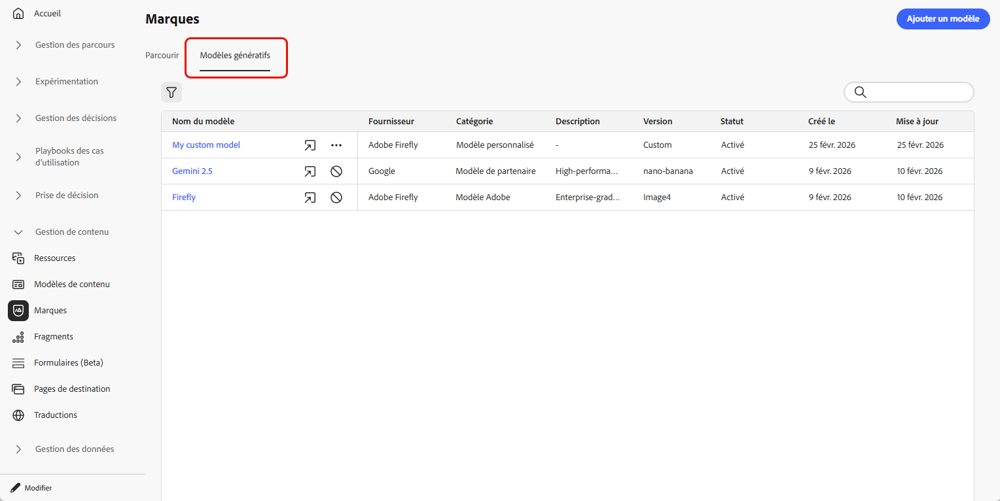
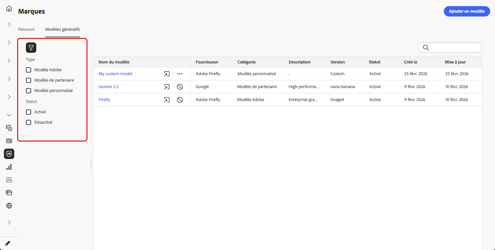
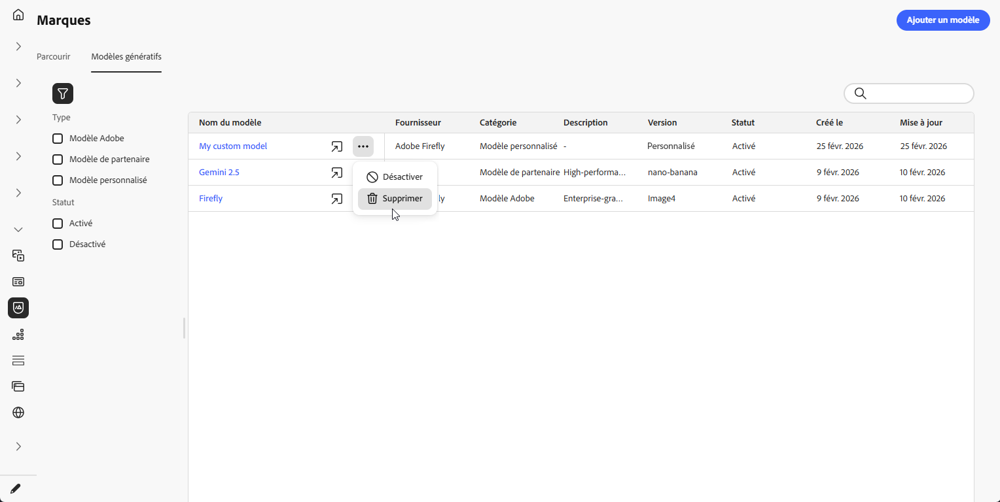
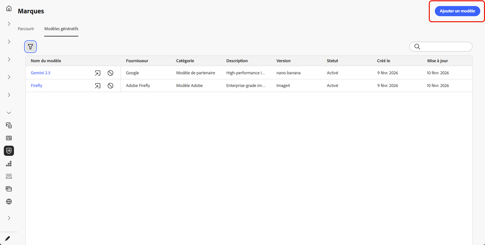
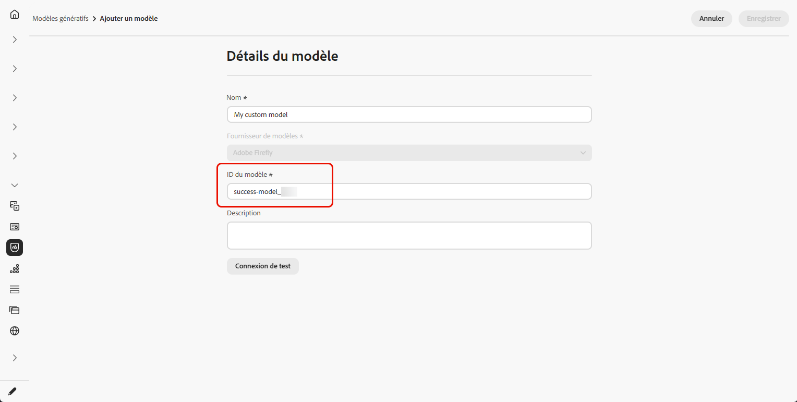
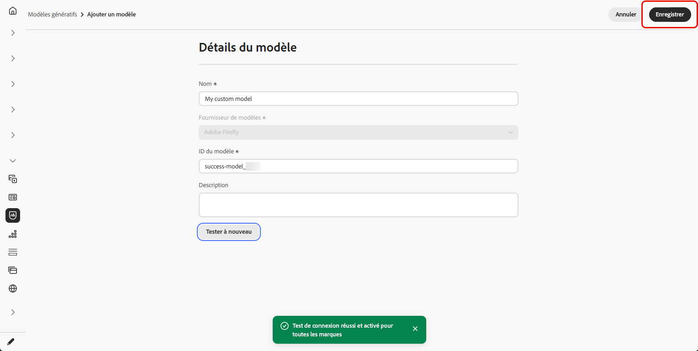
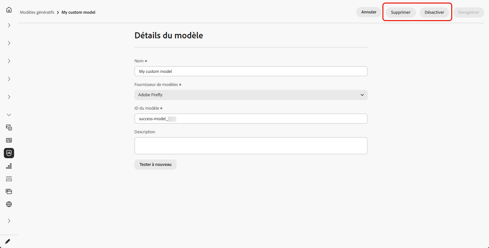
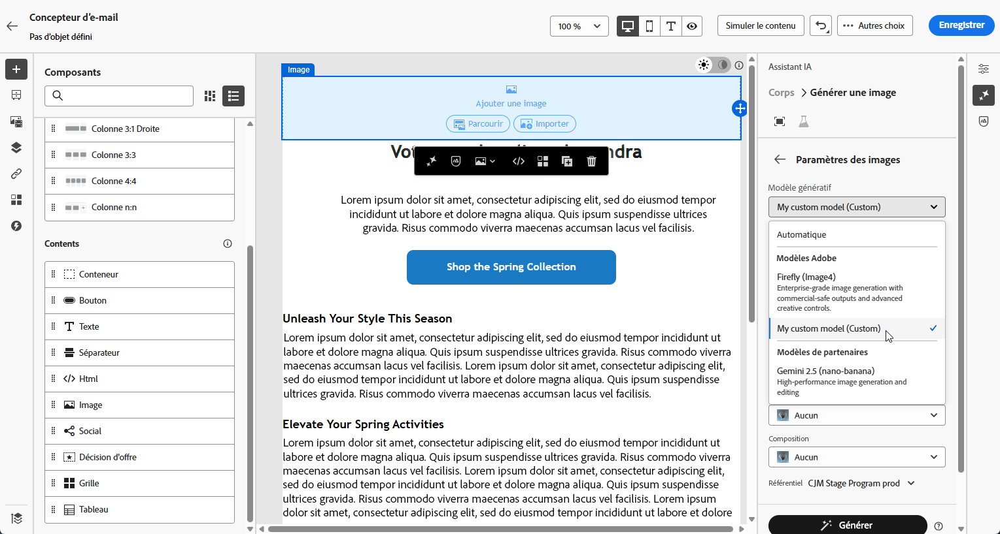

# Création et gestion de modèles génératifs {#generative-models}

Développez vos fonctionnalités de création d’images par l’IA avec des modèles intégrés, des modèles Firefly personnalisés et des fournisseurs de génération d’images tiers pour répondre à vos besoins spécifiques et améliorer l’alignement de la marque.

Choisissez le modèle adapté à vos besoins :

- **[!UICONTROL Adobe model]**, optimisé par Firefly Image Model 4, est fourni prêt à l’emploi et prêt à être utilisé pour la génération immédiate d’images sans configuration supplémentaire.
- Le **[!UICONTROL modèle partenaire]**, optimisé par Gemini 2.5 Flash, offre des fonctionnalités spécialisées pour des cas d’utilisation spécifiques.
- Les **[!UICONTROL modèles personnalisés]** sont des modèles spécifiques à la marque, entraînés sur vos propres ressources et ajoutés par votre entreprise.

  En savoir plus sur les **[!UICONTROL modèles personnalisés]** dans la documentation d’[Adobe Firefly](https://helpx.adobe.com/firefly/web/work-with-enterprise-features/train-custom-models/custom-models-overview.html)

Une fois configurés, vous pouvez sélectionner n’importe lequel de vos modèles génératifs lors de la création d’images dans votre contenu. [En savoir plus sur la génération d’images](generative-image.md).

## Gestion des modèles génératifs

Gérez vos modèles génératifs depuis un emplacement centralisé. Affichez tous les modèles disponibles, filtrez et recherchez des modèles spécifiques et configurez leurs paramètres pour vos marques.

1. Dans le menu **[!UICONTROL Marques]**, sélectionnez l’onglet **[!UICONTROL Modèles génératifs]**.

   {zoomable="yes"}

1. Cliquez sur l’icône  pour accéder au menu de filtrage. Filtrez les modèles par **[!UICONTROL Type]** ou **[!UICONTROL Statut]**.

   {zoomable="yes"}

1. Utilisez la barre de recherche pour rechercher un modèle génératif spécifique par nom.

1. Cliquez sur l’icône  pour accéder au menu avancé, dans lequel vous pouvez activer ou désactiver votre modèle, ou le supprimer.

   Notez que seuls les **[!UICONTROL modèles personnalisés]** peuvent être supprimés.

   {zoomable="yes"}

1. Cliquez sur **[!UICONTROL Ajouter un modèle]** pour créer un nouveau modèle génératif à partir de zéro.

Vous pouvez désormais sélectionner n’importe lequel de vos modèles génératifs lors de la création d’images dans votre contenu. [En savoir plus sur la génération d’images](generative-image.md).

## Ajouter un modèle génératif

>[!IMPORTANT]
>
>La création de modèles Firefly personnalisés nécessite un contrat Firefly ETLA.

Les modèles Firefly personnalisés sont des modèles d’IA spécifiques à la marque, entraînés sur vos propres ressources. Ils vous permettent de générer des images qui s’alignent précisément sur l’identité, le style et les directives visuelles de votre marque.

En créant des fournisseurs de modèles Firefly personnalisés, vous pouvez étendre vos fonctionnalités d’IA au-delà des modèles par défaut et vous assurer que le contenu généré reflète de manière cohérente l’esthétique et les exigences uniques de votre marque.

➡️ [Découvrez comment entraîner votre modèle personnalisé](https://helpx.adobe.com/firefly/web/work-with-enterprise-features/train-custom-models/train-firefly-custom-models.html)

1. Dans le menu **[!UICONTROL Marques]**, accédez à l’onglet **[!UICONTROL Modèles génératifs]** et cliquez sur **[!UICONTROL Ajouter un modèle]**.

   {zoomable="yes"}

1. Saisissez un **[!UICONTROL Nom]** pour votre modèle.

1. Saisissez votre **[!UICONTROL ID de modèle]**.

   Pour trouver votre identifiant de modèle Firefly, accédez au site web Firefly et à vos modèles formés. L’identifiant unique est disponible dans la section de gestion du modèle une fois publié. Pour plus d&#39;informations, consultez la documentation sur les modèles personnalisés Firefly .

   {zoomable="yes"}

1. Vous pouvez éventuellement saisir une **[!UICONTROL Description]** pour vous aider à identifier le modèle.

1. Cliquez sur **[!UICONTROL Tester la connexion]** pour vérifier la configuration du modèle.

1. Une fois le test de connexion réussi, cliquez sur **[!UICONTROL Enregistrer]** pour enregistrer la configuration de votre modèle.

   {zoomable="yes"}

1. Après l’enregistrement, votre modèle personnalisé est ajouté à votre liste de modèles. Vous pouvez la désactiver ou la supprimer à tout moment.

   {zoomable="yes"}

<!--
1. Once the connection test is successful, choose whether to enable the model for selected brands.

1. Enable or disable the option to connect the model to all brands.

    If disabled, select which brands this model should be applied to.
-->

Une fois configurés, vous pouvez sélectionner n’importe lequel de vos modèles génératifs personnalisés lors de la création d’images dans votre contenu. [En savoir plus sur la génération d’images](generative-image.md).

{zoomable="yes"}
