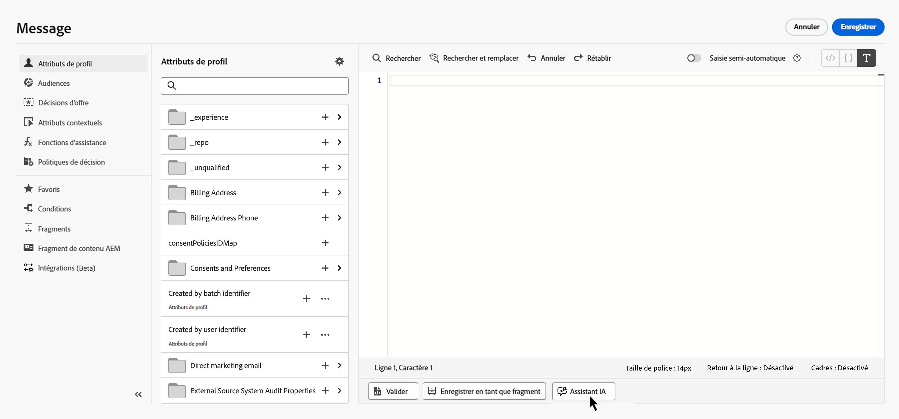
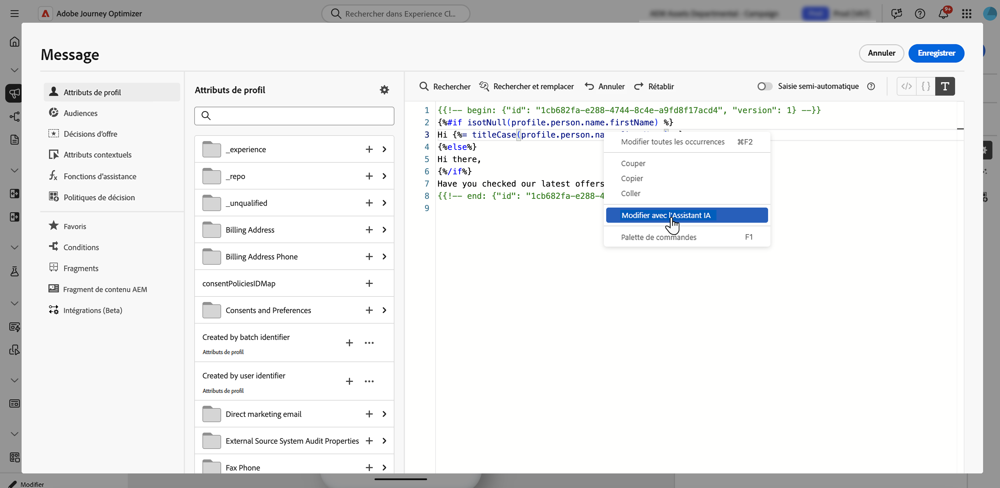
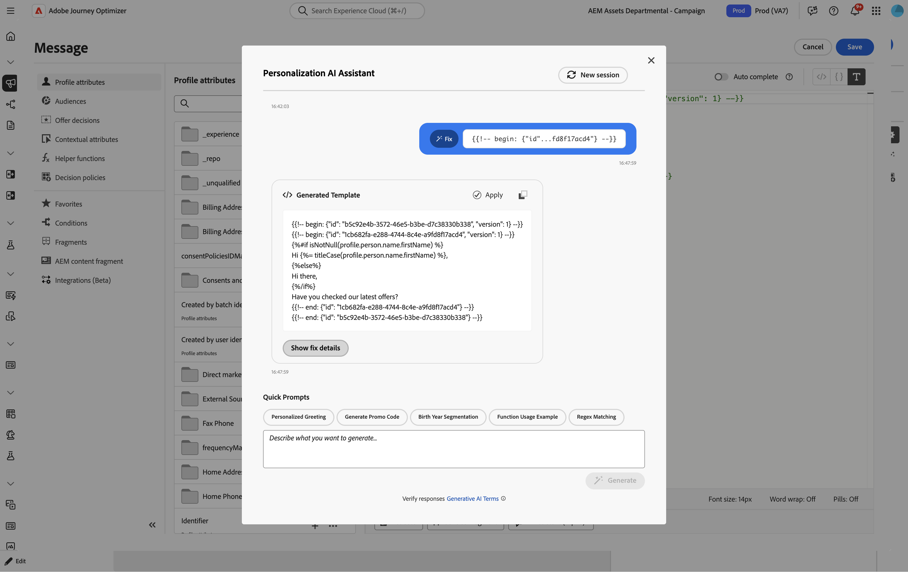
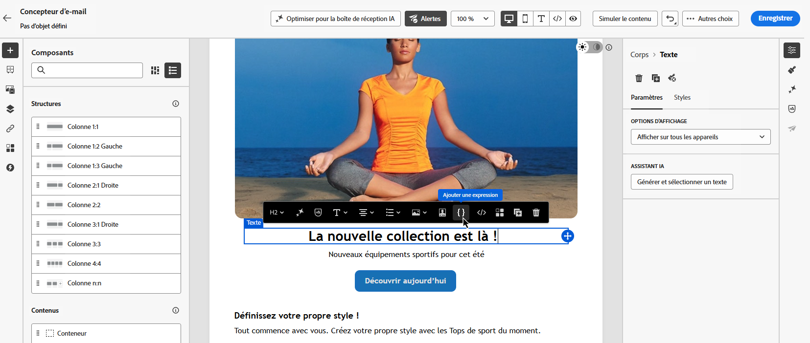

# Assistant IA pour les expressions de personnalisation{#generative-personalization-expressions}

>[!BEGINSHADEBOX]

**Sur cette page :** Découvrez comment utiliser l’assistant AI dans Adobe Journey Optimizer pour générer, corriger et expliquer des expressions de personnalisation en langage naturel dans l’éditeur de Personalization et le Designer d’e-mail.

>[!ENDSHADEBOX]

>[!IMPORTANT]
>
>Avant de commencer à utiliser cette fonctionnalité, lisez la section connexe [Mécanismes de sécurisation et limitations](gs-generative.md#generative-guardrails).
>
>Vous devez accepter un [contrat d’utilisation](https://www.adobe.com/fr/legal/licenses-terms/adobe-dx-gen-ai-user-guidelines.html) avant de pouvoir utiliser l’Assistant IA dans Journey Optimizer. Pour plus d’informations, contactez votre représentant ou représentante Adobe.

## Vue d’ensemble {#where-available}

L’[!UICONTROL assistant AI] vous permet de générer une nouvelle personnalisation à partir d’un langage clair, d’expliquer le rôle des expressions existantes et de résoudre les problèmes liés au code sélectionné, de sorte que vous passiez moins de temps sur la syntaxe et la découverte manuelle des champs. Vous pouvez également effectuer une itération sur une sélection ou demander d’autres modifications dans la conversation. Elle est disponible de deux manières :

* **[!UICONTROL Éditeur Personalization]** — l&#39;endroit où l&#39;éditeur est disponible sur plusieurs canaux (objet, corps et autres champs qui l&#39;ouvrent). Il s’agit du chemin général de la personnalisation assistée par l’IA. Pour savoir où et comment ouvrir l’éditeur, voir [&#x200B; Ajouter une personnalisation &#x200B;](../personalization/personalization-build-expressions.md#where).
* **Barre d’outils Designer d’e-mail** — lorsque vous créez des e-mails dans le Designer d’e-mail, sélectionnez un composant et utilisez **[!UICONTROL Ajouter une expression]** dans la barre d’outils contextuelle pour ouvrir l’assistant dans une boîte à outils sans ouvrir l’éditeur complet au préalable. Ce point d’entrée n’est pas disponible en dehors de la création d’e-mails. Voir [Générer à partir du Designer d’e-mail](#generate-email-designer).

Pour en savoir plus sur la configuration et les langages de l’assistant AI, voir [Prise en main de l’assistant AI](gs-generative.md). Pour connaître les concepts de personnalisation, voir [Prise en main de la personnalisation](../personalization/personalize.md). Pour écrire des invites qui produisent des expressions utilisables, voir [Écrire des invites efficaces pour les expressions de personnalisation](#prompt-best-practices). Pour obtenir des idées d’invite de génération de contenu (ton, style, marque), consultez [Bonnes pratiques d’invite d’IA](ai-assistant-prompting-guide.md).

Selon le contexte de votre campagne ou de votre parcours, l’assistant peut utiliser les données et construire les éléments déjà exposés par [!UICONTROL l’éditeur de Personalization] par exemple les attributs de profil, l’appartenance à un segment, les fonctions d’assistance et les sources de personnalisation associées.

>[!NOTE]
>
>L’assistant conserve le contexte de vos invites uniquement pendant que [!UICONTROL l’assistant AI] reste ouvert dans cette session. La fermeture de l&#39;assistant ou de l&#39;éditeur efface la conversation ; la prochaine fois que vous ouvrez l&#39;assistant, vous démarrez une nouvelle conversation.

## Générer des expressions de personnalisation {#generate}

Ces étapes couvrent la génération à partir de zéro d’expressions de personnalisation. Pour utiliser du code déjà présent dans l’éditeur, voir [Modifier, corriger ou expliquer le code existant](#edit-existing).

1. Dans votre message ou contenu, ouvrez l&#39;éditeur Personalization **&#x200B;**.

1. Placez le curseur dans l’éditeur à l’endroit où vous souhaitez insérer le code de personnalisation généré, puis cliquez sur le bouton **[!UICONTROL Assistant IA]**.

   

1. Dans le champ de texte, décrivez l’expression de personnalisation de votre choix en langage clair (par exemple, les attributs de profil, les segments ou la logique dont vous avez besoin), puis cliquez sur **[!UICONTROL Générer]**.

   Vous pouvez également utiliser des invites prêtes à l&#39;emploi de la section **[!UICONTROL Invites rapides]** telles qu&#39;un message de salutations personnalisé, la génération d&#39;un code promotion, etc.

   

   >[!NOTE]
   >
   >Toute invite ou question non liée renvoie une erreur hors de portée. Ajustez votre invite et posez une question pertinente sur la personnalisation dont vous avez besoin.

1. Vous pouvez continuer à discuter avec l&#39;assistant dans une conversation à plusieurs tours : cela conserve le contexte de vos invites afin que vous puissiez affiner la même expression étape par étape. Pour recommencer, cliquez sur le bouton **[!UICONTROL Nouvelle session]**.

   

1. Après avoir généré une expression, cliquez sur **[!UICONTROL Afficher les aperçus pour les profils types]** pour voir comment l’expression est évaluée par rapport à **un** profil type synthétique et pour afficher la payload associée au format JSON. L’aperçu est un contrôle ponctuel **unique** qui vous permet de vous assurer que votre code se résout comme prévu. Il ne simule **pas** plusieurs destinataires, des données variées ou une couverture complète. Les exemples de données ne sont pas enregistrés ou stockés dans votre organisation.

   Si vous avez besoin d’ajuster l’échantillon (par exemple, en mettant différents attributs en évidence), décrivez ce dont vous avez besoin dans la discussion avec l’assistant et incluez le mot-clé **preview** dans votre invite.

   

   +++Exemple de prévisualisation

   

   >[!NOTE]
   >
   >Ne vous attendez pas à plusieurs lignes d’aperçu ou scénarios exhaustifs ici. Le contrôle est délibérément limité à **une** évaluation d’échantillon pour une vérification rapide du code, et non à une couverture partielle sur de nombreux profils. La demande d’un ensemble d’aperçus trop volumineux pour être réaliste peut entraîner l’échec de la requête.

   +++

   >[!NOTE]
   >
   >Ce contrôle permet de vérifier rapidement votre code de personnalisation dans l’éditeur, et non de prévisualiser entièrement le contenu du message. Pour une validation complète de l’expérience, utilisez votre flux de simulation habituel. [Découvrir comment prévisualiser et tester votre contenu](../content-management/preview-test.md)

1. Pour implémenter la sortie dans votre expression de personnalisation, cliquez sur **[!UICONTROL Appliquer]**. La sortie de l’assistant est insérée à l’emplacement du curseur dans l’éditeur de personnalisation. Pour remplacer le code qui est déjà là, sélectionnez d’abord ce code dans l’éditeur, puis utilisez **[!UICONTROL Modifier avec l’assistant AI]** (voir [Modifier, corriger ou expliquer le code existant](#edit-existing)).

   Vous pouvez également copier la sortie et la coller où vous en avez besoin à l’aide de l’icône  .

## Modifier, corriger ou expliquer le code existant {#edit-existing}

Vous pouvez sélectionner une expression de personnalisation existante et utiliser l’assistant AI pour résoudre les problèmes de personnalisation, expliquer le fonctionnement du code ou demander d’autres modifications.

1. Sélectionnez le code de personnalisation existant dans l’éditeur.

1. Cliquez avec le bouton droit sur la sélection et choisissez **[!UICONTROL Modifier avec l’assistant AI]** afin que l’assistant utilise votre sélection comme contexte.

   

1. **[!UICONTROL Assistant AI]** s’ouvre. Dans **[!UICONTROL Commandes rapides]**, cliquez sur **[!UICONTROL Expliquer]** ou **[!UICONTROL Corriger]**, ou utilisez le champ de texte pour demander d’autres modifications et démarrer une conversation.

   

1. Lorsque vous utilisez **[!UICONTROL Correctif]**, cliquez sur **[!UICONTROL Afficher les détails du correctif]** dans la discussion pour afficher une explication du correctif et une liste ligne par ligne avant et après l’aperçu.

   

1. Comme lorsque vous générez une expression de personnalisation, cliquez sur **[!UICONTROL Appliquer]** pour implémenter la sortie de l’assistant. Il remplace le code que vous avez sélectionné dans l’éditeur de personnalisation. Par exemple, si vous avez demandé une explication du code, l’application ajoutera des commentaires dans l’expression qui décrivent sa fonction.

## Générer à partir de la barre d’outils Designer d’e-mail {#generate-email-designer}

>[!NOTE]
>
>Cette section s’applique uniquement lorsque vous modifiez le contenu **e-mail** dans le Designer d’e-mail. Pour les autres canaux, utilisez l’éditeur **&#x200B;**.

Dans le Designer d’e-mail, vous pouvez utiliser l’assistant [!UICONTROL AI] pour les expressions de personnalisation, à partir de la barre d’outils contextuelle, sans ouvrir l’[!UICONTROL Éditeur Personalization] complet au préalable.

1. Dans le Designer d’e-mail, sélectionnez le composant à personnaliser, puis cliquez à l’emplacement où vous souhaitez insérer l’expression.

1. Dans la barre d’outils contextuelle, cliquez sur **[!UICONTROL Ajouter une expression]**.

   

1. Une boîte à outils s’ouvre dans laquelle vous pouvez demander à l’assistant AI de vous personnaliser. Saisissez vos besoins en langage clair et simple, l’assistant vous suggère des champs de profil et d’autres attributs correspondant à votre invite afin que vous puissiez créer l’expression plus rapidement.

1. L’assistant génère l’expression.

   

   Vous pouvez ainsi :

   * Validez la sortie de l’expression avec un exemple de valeur. Utilisez l’onglet **[!UICONTROL Aperçu]**.
   * Générez une autre suggestion à partir de la même invite - utilisez **[!UICONTROL Régénérer]**.
   * Effacez la discussion et recommencez - utilisez **[!UICONTROL Réinitialiser]**.
   * Affinez l’expression dans l’éditeur complet. Cliquez sur l’icône  pour ouvrir l’éditeur **[!UICONTROL Personalization]**.

1. Lorsque le résultat vous convient, cliquez sur **[!UICONTROL Insérer]** pour ajouter l’expression à votre contenu.

## Écrire des invites efficaces pour les expressions de personnalisation {#prompt-best-practices}

Les invites d&#39;expressions de personnalisation diffèrent des invites de génération de contenu, qui sont centrées sur le ton, le style et la marque. Étant donné que l’assistant crée une logique de modèle qui se résout par rapport aux données de profil et contextuelles, votre invite doit décrire cette logique avec précision. Partez de l’expérience client que vous souhaitez fournir, puis exprimez-la en termes que l’assistant peut traduire en expression.

Une invite efficace définit généralement quatre éléments :

* **Source de données** — Attribut de profil, données contextuelles, segment, offre ou autre ressource à évaluer. Incluez le chemin d’accès exact du champ lorsque vous le connaissez, par exemple `profile.person.name.firstName`.
* **Condition** : logique à appliquer, par exemple si une valeur existe ou correspond à un critère spécifique.
* **Sortie** — Éléments à afficher lorsque la condition est remplie, y compris le format requis.
* **Secours** — Ce qui s&#39;affiche lorsque les données sont manquantes ou que la condition n&#39;est pas remplie.

Par exemple, une demande pour *prendre la date de renouvellement du client, ajouter une année, la formater en MM/jj/aa et n&#39;afficher rien lorsque la date de renouvellement est manquante* fournit une source de données, une transformation, un format de sortie et un basculement ; tout ce dont l&#39;assistant a besoin pour produire une expression utilisable.

### Recommandations {#prompt-recommendations}

Pour obtenir les résultats les plus pertinents :

* Veillez à ce que chaque invite soit axée sur une seule règle de personnalisation au lieu de combiner plusieurs règles non liées dans une seule demande.
* Référencez uniquement les champs, fragments, offres et jeux de données qui existent dans votre environnement. L’assistant fonctionne avec ce que l’éditeur expose et ne crée pas de sources de données pour vous.
* Décrivez le comportement de secours pour les données facultatives ou potentiellement manquantes, de sorte que l’expression soit résolue correctement pour chaque profil.
* Indiquez explicitement la structure de sortie attendue lorsqu’elle est importante (par exemple, les clés qu’un payload d’offre doit renvoyer au format JSON).
* Lorsque vous modifiez du code existant, fournissez uniquement l’expression appropriée comme contexte au lieu d’un message entier, et utilisez **[!UICONTROL Expliquer]** pour comprendre le code avant d’appliquer un **[!UICONTROL Correctif]** ou une autre modification.

## Exigences en matière de données et de configuration {#requirements}

L&#39;assistant génère des expressions à partir des ressources que l&#39;éditeur de Personalization  expose déjà, de sorte que les données sous-jacentes doivent être configurées et disponibles. Si une invite ne renvoie pas d’expression utilisable, confirmez que :

* le champ que vous avez référencé appartient à un schéma actif dans votre environnement,
* tout fragment que vous souhaitez réutiliser est publié,
* tout jeu de données utilisé pour une recherche est activé pour les recherches, et
* votre demande porte sur la personnalisation de modèle plutôt que sur une autre tâche.

Lorsque la configuration est correcte, affinez l’invite en clarifiant la source de données, la condition, la sortie et la version de secours, puis générez à nouveau.
