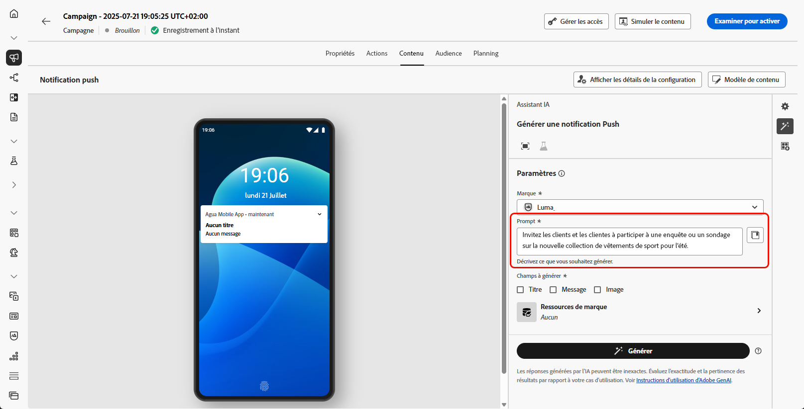
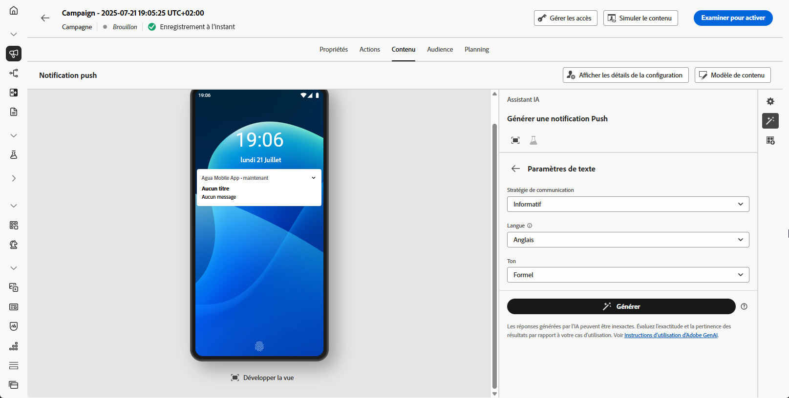
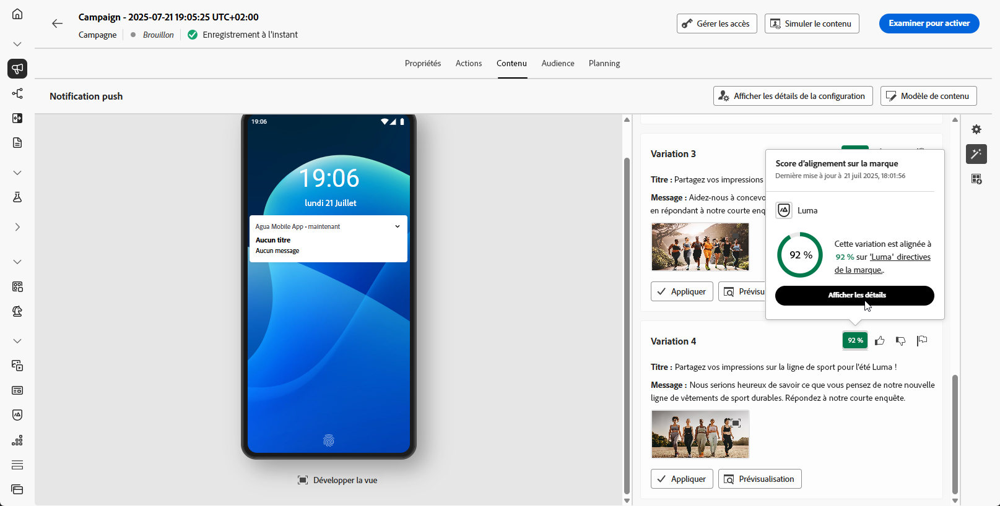
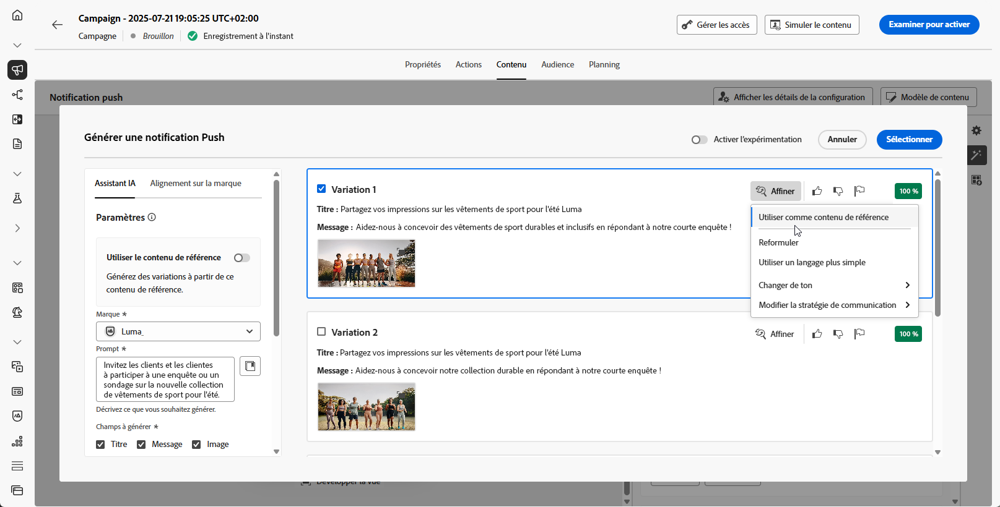
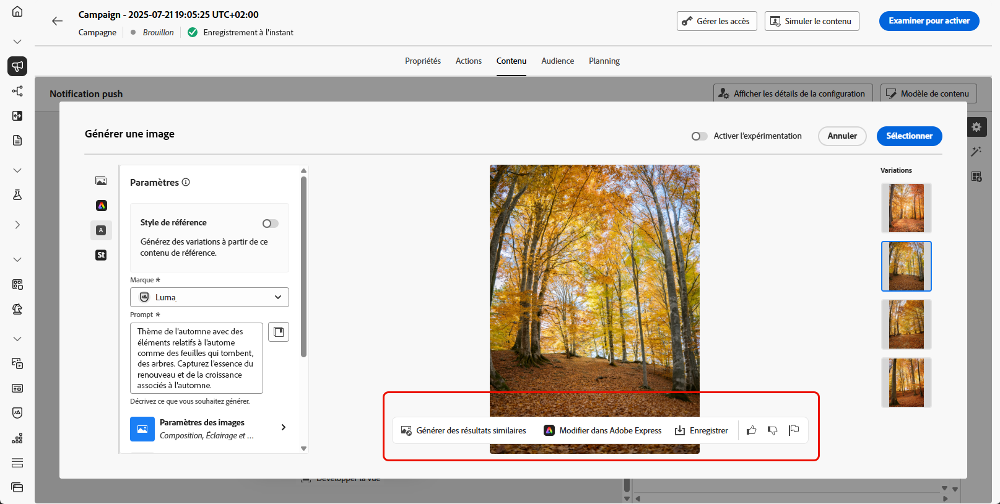

# Génération de notifications push avec l’Assistant IA {#generative-push}

>[!IMPORTANT]
>
>Avant de commencer à utiliser cette fonctionnalité, lisez la section connexe [Mécanismes de sécurisation et limitations](gs-generative.md#generative-guardrails).
> 
>
>Vous devez accepter un [contrat d’utilisation](https://www.adobe.com/fr/legal/licenses-terms/adobe-dx-gen-ai-user-guidelines.html) avant de pouvoir utiliser l’Assistant IA dans Journey Optimizer. Pour plus d’informations, contactez votre représentant ou représentante Adobe.

Une fois que vous avez créé et personnalisé vos messages, améliorez la qualité du contenu de votre notification push avec l’Assistant IA dans Journey Optimizer.

Explorez les onglets ci-dessous pour savoir comment utiliser l’Assistant IA dans Journey Optimizer.

>[!BEGINTABS]

>[!TAB Génération de notifications push complètes]

Dans cet exemple particulier, découvrez comment envoyer une notification push accrocheuse à l’aide de l’Assistant IA dans Journey Optimizer.

Procédez comme suit :

1. Après avoir créé et configuré votre campagne de notifications push, cliquez sur **[!UICONTROL Modifier le contenu]**.

   Pour plus d’informations sur la configuration de votre campagne de notifications push, consultez [cette page](../push/create-push.md).

1. Renseignez les **[!UICONTROL Détails de base]** de votre campagne. Une fois terminé, cliquez sur **[!UICONTROL Modifier le contenu]**.

1. Personnalisez vos notifications push selon vos besoins. [En savoir plus](../push/design-push.md)

1. Accédez au menu **[!UICONTROL Afficher l’assistant IA]**.

   {zoomable="yes"}

1. Activez l’option **[!UICONTROL Utiliser le contenu original]** pour que l’Assistant IA personnalise le nouveau contenu en fonction du contenu sélectionné.

1. Sélectionnez votre **[!UICONTROL Marque]** pour vous assurer que le contenu généré par l’IA correspond aux spécifications de celle-ci. [En savoir plus](brands.md) sur les marques.

   Notez que cette fonctionnalité est disponible en version Private Beta et sera progressivement disponible pour l’ensemble de la clientèle dans les versions ultérieures.

1. Affinez le contenu en décrivant ce que vous souhaitez générer dans le champ **[!UICONTROL Prompt]**.

   Si vous avez besoin d’aide pour concevoir votre prompt, accédez à la **[!UICONTROL Bibliothèque de prompts]** qui offre un large éventail d’idées d’invites pour améliorer vos campagnes.

   {zoomable="yes"}

1. Sélectionnez le champ à générer : **[!UICONTROL Titre]**, **[!UICONTROL Message]** et/ou **[!UICONTROL Image]**.

1. Adaptez votre prompt avec l’option **[!UICONTROL Paramètres de texte]** :

   * **[!UICONTROL Stratégie de communication]** : choisissez le style de communication le plus adapté au texte généré.
   * **[!UICONTROL Langues]** : sélectionnez la langue du contenu généré.
   * **[!UICONTROL Ton]** : le ton de votre notification push doit résonner auprès de votre audience. Que vous souhaitiez communiquer de façon informative, ludique ou convaincante, l’Assistant IA peut adapter le message en conséquence.

   {zoomable="yes"}

1. Sélectionnez vos **[!UICONTROL paramètres d’image]** :

   * **[!UICONTROL Type de contenu]** : cette propriété classe la nature de l’élément visuel en faisant la distinction entre les différentes formes de représentation visuelle, telles que les photos, les graphiques ou les illustrations.
   * **[!UICONTROL Intensité visuelle]** : vous pouvez contrôler l’impact de l’image en ajustant son intensité. Un paramètre inférieur (2) crée un aspect plus doux et plus modéré, tandis qu’un paramètre supérieur (10) rend l’image plus vivante et visuellement plus puissante.
   * **[!UICONTROL Couleur et ton]** : aspect général des couleurs dans une image et humeur ou ambiance qu’elles véhiculent.
   * **[!UICONTROL Éclairage]** : fait référence à l’éclairage présent dans une image qui forme son atmosphère et met en évidence des éléments spécifiques.
   * **[!UICONTROL Composition]** : fait référence à la disposition des éléments dans le cadre d’une image.

   {zoomable="yes"}

1. Depuis le menu **[!UICONTROL Ressources de marque]**, cliquez sur **[!UICONTROL Charger une ressource de marque]** pour ajouter toute ressource de marque incluant du contenu pouvant fournir du contexte supplémentaire à l’Assistant IA ou sélectionnez-en une chargée précédemment.

   Les fichiers précédemment chargés sont disponibles dans la liste déroulante **[!UICONTROL Ressources de marque chargées]**. Activez simplement les ressources que vous souhaitez inclure dans votre génération.

1. Lorsque votre prompt est prêt, cliquez sur **[!UICONTROL Générer]**.

1. Parcourez les **[!UICONTROL variations]** générées.

   Cliquez sur **[!UICONTROL Aperçu]** pour afficher une version en plein écran de la variation sélectionnée ou cliquez sur **[!UICONTROL Appliquer]** pour remplacer votre contenu actuel.

1. Cliquez sur l’icône de pourcentage pour afficher votre **[!UICONTROL score d’alignement sur la marque]** et identifier tout décalage avec votre marque.

   En savoir plus sur le [score d’alignement sur la marque](brands-score.md).

   {zoomable="yes"}

1. Accédez à l’option **[!UICONTROL Affiner]** dans la fenêtre **[!UICONTROL Aperçu]** pour accéder à d’autres fonctionnalités de personnalisation :

   * **[!UICONTROL Utiliser comme contenu de référence]** : la variante choisie servira de contenu de référence pour générer d’autres résultats.

   * **[!UICONTROL Reformuler]** : l’assistant IA peut reformuler votre message de différentes manières en conservant une écriture soignée et attrayante pour diverses audiences.

   * **[!UICONTROL Utiliser un langage simplifié]** : utilisez l’Assistant IA pour simplifier votre langage, garantissant ainsi clarté et accessibilité pour une audience plus large.

   Vous pouvez également modifier le **[!UICONTROL ton]** et la **[!UICONTROL stratégie de communication]** de votre texte.

   {zoomable="yes"}

1. Ouvrez l’onglet **[!UICONTROL Alignement sur la marque]** pour voir comment votre contenu s’aligne sur vos [directives de marque](brands.md).

1. Cliquez sur **[!UICONTROL Sélectionner]** une fois que vous avez trouvé le contenu approprié.

   Vous pouvez également activer l’expérience pour votre contenu. [En savoir plus](generative-experimentation.md)

1. Insérez des champs de personnalisation pour personnaliser le contenu de vos notifications push en fonction des données de profil. Cliquez ensuite sur le bouton **[!UICONTROL Simuler le contenu]** pour contrôler le rendu et vérifier les paramètres de personnalisation avec les profils de test. [En savoir plus](../personalization/personalize.md)

Lorsque vous avez défini le contenu, l’audience et le planning, vous pouvez préparer votre campagne de notifications push. [En savoir plus](../campaigns/review-activate-campaign.md)

>[!TAB Génération de texte uniquement]

Dans cet exemple particulier, découvrez comment utiliser l’Assistant IA dans Journey Optimizer pour du contenu spécifique. Procédez comme suit :

1. Après avoir créé et configuré votre campagne de notifications push, cliquez sur **[!UICONTROL Modifier le contenu]**.

   Pour plus d’informations sur la configuration de votre campagne de notifications push, consultez [cette page](../push/create-push.md).

1. Renseignez les **[!UICONTROL Détails de base]** de votre campagne. Une fois terminé, cliquez sur **[!UICONTROL Modifier le contenu]**.

1. Personnalisez vos notifications push selon vos besoins. [En savoir plus](../push/design-push.md)

1. Accédez au menu **[!UICONTROL Modifier le texte avec l’assistant IA]** en regard de votre champ **[!UICONTROL Titre]** ou **[!UICONTROL Message]**.

   {zoomable="yes"}

1. Activez l’option **[!UICONTROL Utiliser le contenu de référence]** pour que l’Assistant IA personnalise le nouveau contenu en fonction du contenu sélectionné.

1. Sélectionnez votre **[!UICONTROL Marque]** pour vous assurer que le contenu généré par l’IA correspond aux spécifications de celle-ci. [En savoir plus](brands.md) sur les marques.

   Notez que cette fonctionnalité est disponible en version Private Beta et sera progressivement disponible pour l’ensemble de la clientèle dans les versions ultérieures.

1. Affinez le contenu en décrivant ce que vous souhaitez générer dans le champ **[!UICONTROL Prompt]**.

   Si vous avez besoin d’aide pour concevoir votre prompt, accédez à la **[!UICONTROL Bibliothèque de prompts]** qui offre un large éventail d’idées d’invites pour améliorer vos campagnes.

   {zoomable="yes"}

1. Adaptez votre prompt avec l’option **[!UICONTROL Paramètres de texte]** :

   * **[!UICONTROL Stratégie de communication]** : choisissez le style de communication le plus adapté au texte généré.
   * **[!UICONTROL Langues]** : sélectionnez la langue du contenu généré.
   * **[!UICONTROL Ton]** : le ton de votre notification push doit résonner auprès de votre audience. Que vous souhaitiez communiquer de façon informative, ludique ou convaincante, l’Assistant IA peut adapter le message en conséquence.
   * **[!UICONTROL Longueur]** : sélectionnez la longueur de votre contenu à l’aide du curseur de plage.

   {zoomable="yes"}

1. Depuis le menu **[!UICONTROL Ressources de marque]**, cliquez sur **[!UICONTROL Charger une ressource de marque]** pour ajouter toute ressource de marque incluant du contenu pouvant fournir du contexte supplémentaire à l’Assistant IA ou sélectionnez-en une chargée précédemment.

   Les fichiers précédemment chargés sont disponibles dans la liste déroulante **[!UICONTROL Ressources de marque chargées]**. Activez simplement les ressources que vous souhaitez inclure dans votre génération.

1. Lorsque votre prompt est prêt, cliquez sur **[!UICONTROL Générer]**.

1. Parcourez les **[!UICONTROL variations]** générées.

1. Cliquez sur l’icône de pourcentage pour afficher votre **[!UICONTROL score d’alignement sur la marque]** et identifier tout décalage avec votre marque.

   En savoir plus sur le [score d’alignement sur la marque](brands-score.md).

   {zoomable="yes"}

1. Accédez à l’option **[!UICONTROL Affiner]** dans la fenêtre **[!UICONTROL Aperçu]** pour accéder à d’autres fonctionnalités de personnalisation :

   * **[!UICONTROL Utiliser comme contenu de référence]** : la variante choisie servira de contenu de référence pour générer d’autres résultats.

   * **[!UICONTROL Élaborer]** : l’assistant IA peut vous aider à développer des sujets spécifiques, en fournissant des détails supplémentaires pour une meilleure compréhension et un meilleur engagement.

   * **[!UICONTROL Résumé]** : de longues informations peuvent embrouiller les personnes destinataires. Utilisez l’Assistant IA pour condenser des points clés en résumés clairs et concis qui attirent l’attention et incitent à poursuivre la lecture.

   * **[!UICONTROL Reformuler]**:The : l’Assistant IA peut reformuler votre message de différentes manières en conservant une écriture soignée et attrayante pour diverses audiences.

   * **[!UICONTROL Utiliser un langage simplifié]** : utilisez l’Assistant IA pour simplifier votre langage, garantissant ainsi clarté et accessibilité pour une audience plus large.

   Vous pouvez également modifier le **[!UICONTROL ton]** et la **[!UICONTROL stratégie de communication]** de votre texte.

   {zoomable="yes"}

1. Ouvrez l’onglet **[!UICONTROL Alignement sur la marque]** pour voir comment votre contenu s’aligne sur vos [directives de marque](brands.md).

1. Cliquez sur **[!UICONTROL Sélectionner]** une fois que vous avez trouvé le contenu approprié.

   Vous pouvez également activer l’expérience pour votre contenu. [En savoir plus](generative-experimentation.md)

1. Insérez des champs de personnalisation pour personnaliser le contenu de vos notifications push en fonction des données de profil. Cliquez ensuite sur le bouton **[!UICONTROL Simuler le contenu]** pour contrôler le rendu et vérifier les paramètres de personnalisation avec les profils de test. [En savoir plus](../personalization/personalize.md)

Lorsque vous avez défini le contenu, l’audience et le planning, vous pouvez préparer votre campagne de notifications push. [En savoir plus](../campaigns/review-activate-campaign.md)

>[!TAB Génération d’images uniquement]

1. Après avoir créé et configuré votre campagne de notifications push, cliquez sur **[!UICONTROL Modifier le contenu]**.

   Pour plus d’informations sur la configuration de votre campagne de notifications push, consultez [cette page](../push/create-push.md).

1. Renseignez les **[!UICONTROL Détails de base]** de votre campagne. Une fois terminé, cliquez sur **[!UICONTROL Modifier le contenu]**.

1. Personnalisez vos notifications push selon vos besoins. [En savoir plus](../push/design-push.md)

1. Accédez au menu **[!UICONTROL Ajouter un média]**.

   {zoomable="yes"}

1. Activez l’option **[!UICONTROL Style de référence]** pour que l’Assistant IA personnalise le nouveau contenu en fonction du contenu de référence. Vous pouvez également charger une image pour ajouter du contexte à votre variation.

1. Sélectionnez votre **[!UICONTROL Marque]** pour vous assurer que le contenu généré par l’IA correspond aux spécifications de celle-ci. [En savoir plus](brands.md) sur les marques.

   Notez que cette fonctionnalité est disponible en version Private Beta et sera progressivement disponible pour l’ensemble de la clientèle dans les versions ultérieures.

1. Affinez le contenu en décrivant ce que vous souhaitez générer dans le champ **[!UICONTROL Prompt]**.

   Si vous avez besoin d’aide pour concevoir votre prompt, accédez à la **[!UICONTROL Bibliothèque de prompts]** qui offre un large éventail d’idées d’invites pour améliorer vos campagnes.

   {zoomable="yes"}

1. Sélectionnez vos **[!UICONTROL paramètres d’image]** :

   * **[!UICONTROL Type de contenu]** : cette propriété classe la nature de l’élément visuel en faisant la distinction entre les différentes formes de représentation visuelle, telles que les photos, les graphiques ou les illustrations.
   * **[!UICONTROL Intensité visuelle]** : vous pouvez contrôler l’impact de l’image en ajustant son intensité. Un paramètre inférieur (2) crée un aspect plus doux et plus modéré, tandis qu’un paramètre supérieur (10) rend l’image plus vivante et visuellement plus puissante.
   * **[!UICONTROL Couleur et ton]** : aspect général des couleurs dans une image et humeur ou ambiance qu’elles véhiculent.
   * **[!UICONTROL Éclairage]** : fait référence à l’éclairage présent dans une image qui forme son atmosphère et met en évidence des éléments spécifiques.
   * **[!UICONTROL Composition]** : fait référence à la disposition des éléments dans le cadre d’une image.

1. Depuis le menu **[!UICONTROL Ressources de marque]**, cliquez sur **[!UICONTROL Charger une ressource de marque]** pour ajouter toute ressource de marque incluant du contenu pouvant fournir du contexte supplémentaire à l’assistant IA ou sélectionnez-en une chargée précédemment.

   Les fichiers précédemment chargés sont disponibles dans la liste déroulante **[!UICONTROL Ressources de marque chargées]**. Activez simplement les ressources que vous souhaitez inclure dans votre génération.

1. Lorsque votre prompt est prêt, cliquez sur **[!UICONTROL Générer]**.

1. Parcourez les **[!UICONTROL variations]** générées.

1. Cliquez sur l’icône de pourcentage pour afficher votre **[!UICONTROL score d’alignement sur la marque]** et identifier tout décalage avec votre marque.

   En savoir plus sur le [score d’alignement sur la marque](brands-score.md).

1. Accédez à l’option **[!UICONTROL Affiner]** dans la fenêtre **[!UICONTROL Aperçu]** pour accéder à d’autres fonctionnalités de personnalisation :

   * **[!UICONTROL Générer des résultats similaires]** : permet d’afficher les images associées à cette variante.
   * **[!UICONTROL Modifier dans Adobe Express]** : permet de personnaliser davantage votre ressource.

[En savoir plus sur l’intégration d’Adobe Express](../integrations/express.md)

   * **[!UICONTROL Enregistrer]** : permet de stocker les ressources en vue d’un accès ultérieur.

   {zoomable="yes"}

1. Ouvrez l’onglet **[!UICONTROL Alignement sur la marque]** pour voir comment votre contenu s’aligne sur vos [directives de marque](brands.md).

1. Cliquez sur **[!UICONTROL Sélectionner]** une fois que vous avez trouvé le contenu approprié.

   Vous pouvez également activer l’expérience pour votre contenu. [En savoir plus](generative-experimentation.md)

Lorsque vous avez défini le contenu, l’audience et le planning, vous pouvez préparer votre campagne de notifications push. [En savoir plus](../campaigns/review-activate-campaign.md)

>[!ENDTABS]
