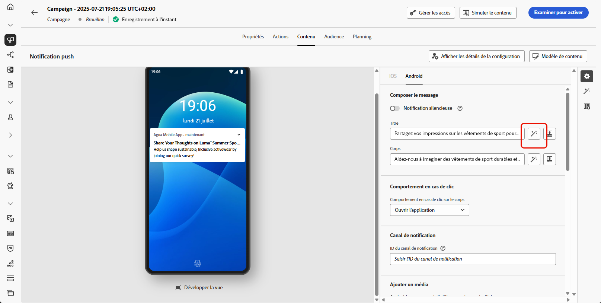

# Génération des notifications push à l’aide de l’assistant d’IA {#generative-push}

>[!BEGINSHADEBOX]

**Table des matières**

* [Commencer avec l’Assistant IA](gs-generative.md)
* [Génération d’e-mails avec l’assistant IA](generative-email.md)
* [Génération de SMS avec l’assistant IA](generative-sms.md)
* **[Génération des notifications push à l’aide de l’assistant d’IA](generative-push.md)**
* [Expérience de contenu avec l’assistant d’IA](generative-experimentation.md)

>[!ENDSHADEBOX]

>[!NOTE]
>
>Avant de commencer à utiliser cette fonctionnalité, lisez la section connexe [Mécanismes de sécurisation et limitations](gs-generative.md#generative-guardrails).

Une fois vos messages créés et personnalisés, repositionnez leur contenu avec l&#39;assistant Journey Optimizer AI.

Consultez les onglets ci-dessous pour savoir comment utiliser l’assistant d’IA dans Journey Optimizer.

>[!BEGINTABS]

>[!TAB Génération complète de notifications push]

Dans cet exemple particulier, découvrez comment envoyer une notification push attrayante à l’aide de l’assistant d’IA.

Procédez de la façon suivante :

1. Après avoir créé et configuré votre campagne de notification push, cliquez sur **[!UICONTROL Modifier le contenu]**.

   Pour plus d&#39;informations sur le paramétrage de votre campagne de notification push, voir [cette page](../push/create-push.md).

1. Renseignez les **[!UICONTROL Détails de base]** pour votre campagne. Une fois terminé, cliquez sur **[!UICONTROL Modifier le contenu]**.

1. Personnalisez vos notifications push selon vos besoins. [En savoir plus](../push/design-push.md)

1. Accédez au menu **[!UICONTROL Afficher l’assistant IA]**.

   {zoomable=&quot;yes&quot;}

1. Activez la variable **[!UICONTROL Utiliser le contenu d’origine]** de l’assistant d’IA afin de personnaliser le nouveau contenu en fonction du contenu, du nom et de l’audience de votre campagne.

   Votre invite doit toujours être liée à un contexte spécifique.

1. Ajustez le contenu en décrivant ce que vous souhaitez générer dans le champ **[!UICONTROL Invite]**.

   Si vous avez besoin d’aide pour concevoir votre invite, accédez au **[!UICONTROL Invite Library]** qui offre un large éventail d’idées pour améliorer vos campagnes.

   {zoomable=&quot;yes&quot;}

1. Sélectionnez **[!UICONTROL Charger une ressource de marque]** pour ajouter toute ressource de marque incluant du contenu pouvant fournir du contexte supplémentaire à l’assistant IA.

1. Sélectionnez le champ à générer : **[!UICONTROL Titre]** et/ou **[!UICONTROL Message]**.

1. Adaptez votre invite avec les différentes options :

   * **[!UICONTROL Stratégie de communication]** : choisissez le style de communication le plus adapté au texte généré.
   * **[!UICONTROL Langue]** : sélectionnez la langue dans laquelle vous souhaitez générer votre contenu.
   * **[!UICONTROL Ton]** : le ton de votre e-mail doit résonner auprès de votre audience. Que vous souhaitiez communiquer de façon informative, ludique ou convaincante, l’assistant IA peut adapter le message en conséquence.

   {zoomable=&quot;yes&quot;}

1. Lorsque votre texte descriptif est prêt, cliquez sur **[!UICONTROL Générer]**.

1. Parcourez les **[!UICONTROL variations]** générées et cliquez sur **[!UICONTROL Aperçu]** pour afficher une version plein écran de la variation sélectionnée.

1. Naviguez vers l’option **[!UICONTROL Affiner]** dans la fenêtre **[!UICONTROL Aperçu]** pour accéder à d’autres fonctionnalités de personnalisation :

   * **[!UICONTROL Utiliser comme contenu de référence]** : la variante choisie servira de contenu de référence pour générer d’autres résultats.

   * **[!UICONTROL Reformuler]** : l’assistant IA peut reformuler votre message de différentes manières en conservant une écriture soignée et attrayante pour diverses audiences.

   * **[!UICONTROL Utiliser un langage simple]** : utilisez l’assistant IA pour simplifier votre langage en assurant clarté et accessibilité pour une audience plus large.

   {zoomable=&quot;yes&quot;}

1. Cliquez sur **[!UICONTROL Sélectionner]** une fois que vous avez trouvé le contenu approprié.

   Vous pouvez également activer l’expérience pour votre contenu. [En savoir plus](generative-experimentation.md)

1. Insérez des champs de personnalisation pour personnaliser le contenu de votre e-mail en fonction des données de profil. Cliquez ensuite sur le bouton **[!UICONTROL Simuler le contenu]** pour contrôler le rendu et vérifier les paramètres de personnalisation avec les profils de test. [En savoir plus](../personalization/personalize.md)

Une fois que vous avez défini votre contenu, votre audience et votre planning, vous êtes prêt à préparer votre campagne push. [En savoir plus](../campaigns/review-activate-campaign.md)

>[!TAB Génération de texte]

Dans cet exemple particulier, découvrez comment utiliser l’assistant d’IA pour du contenu spécifique. Procédez de la façon suivante :

1. Après avoir créé et configuré votre campagne de notification push, cliquez sur **[!UICONTROL Modifier le contenu]**.

   Pour plus d&#39;informations sur le paramétrage de votre campagne push, reportez-vous à la section [cette page](../push/create-push.md).

1. Renseignez les **[!UICONTROL Détails de base]** pour votre campagne. Une fois terminé, cliquez sur **[!UICONTROL Modifier le contenu]**.

1. Personnalisez vos notifications push selon vos besoins. [En savoir plus](../push/design-push.md)

1. Accédez au **[!UICONTROL Afficher l’assistant d’IA]** en regard de votre **[!UICONTROL Titre]** ou **[!UICONTROL Message]** des champs.

   {zoomable=&quot;yes&quot;}

1. Activez la variable **[!UICONTROL Utiliser le contenu de référence]** de l’assistant d’IA afin de personnaliser le nouveau contenu en fonction du contenu, du nom et de l’audience de votre campagne.

   Votre invite doit toujours être liée à un contexte spécifique.

1. Ajustez le contenu en décrivant ce que vous souhaitez générer dans le champ **[!UICONTROL Invite]**.

   Si vous avez besoin d’aide pour concevoir votre invite, accédez au **[!UICONTROL Invite Library]** qui offre un large éventail d’idées pour améliorer vos campagnes.

   {zoomable=&quot;yes&quot;}

1. Sélectionnez **[!UICONTROL Charger une ressource de marque]** pour ajouter toute ressource de marque incluant du contenu pouvant fournir du contexte supplémentaire à l’assistant IA.

   {zoomable=&quot;yes&quot;}

1. Adaptez votre invite avec les différentes options :

   * **[!UICONTROL Stratégie de communication]** : choisissez le style de communication le plus adapté au texte généré.
   * **[!UICONTROL Langue]** : sélectionnez la langue dans laquelle vous souhaitez générer votre contenu.
   * **[!UICONTROL Ton]** : le ton de votre e-mail doit résonner auprès de votre audience. Que vous souhaitiez communiquer de façon informative, ludique ou convaincante, l’assistant IA peut adapter le message en conséquence.
   * **[!UICONTROL Longueur]** : sélectionnez la longueur de votre contenu à l’aide du curseur de plage.

   {zoomable=&quot;yes&quot;}

1. Lorsque votre texte descriptif est prêt, cliquez sur **[!UICONTROL Générer]**.

1. Parcourez les **[!UICONTROL variations]** générées et cliquez sur **[!UICONTROL Aperçu]** pour afficher une version plein écran de la variation sélectionnée.

1. Naviguez vers l’option **[!UICONTROL Affiner]** dans la fenêtre **[!UICONTROL Aperçu]** pour accéder à d’autres fonctionnalités de personnalisation :

   * **[!UICONTROL Utiliser comme contenu de référence]** : la variante choisie servira de contenu de référence pour générer d’autres résultats.

   * **[!UICONTROL Élaborer]** : l’assistant IA peut vous aider à développer des sujets spécifiques, en fournissant des détails supplémentaires pour une meilleure compréhension et un meilleur engagement.

   * **[!UICONTROL Résumé]** : de longues informations peuvent embrouiller les personnes destinataires des e-mails. Utilisez l’assistant IA pour condenser des points clés en résumés clairs et concis qui attirent l’attention et pour les encourager à lire davantage.

   * **[!UICONTROL Reformuler]** : l’assistant IA peut reformuler votre message de différentes manières en conservant une écriture soignée et attrayante pour diverses audiences.

   * **[!UICONTROL Utiliser un langage plus simple]**: utilisez l’assistant d’IA pour simplifier votre langue, en assurant clarté et accessibilité pour une audience plus large.

   {zoomable=&quot;yes&quot;}

1. Cliquez sur **[!UICONTROL Sélectionner]** une fois que vous avez trouvé le contenu approprié.

   Vous pouvez également activer l’expérience pour votre contenu. [En savoir plus](generative-experimentation.md)

1. Insérez des champs de personnalisation pour personnaliser le contenu de votre e-mail en fonction des données de profil. Cliquez ensuite sur le bouton **[!UICONTROL Simuler le contenu]** pour contrôler le rendu et vérifier les paramètres de personnalisation avec les profils de test. [En savoir plus](../personalization/personalize.md)

Une fois que vous avez défini votre contenu, votre audience et votre planning, vous êtes prêt à préparer votre campagne push. [En savoir plus](../campaigns/review-activate-campaign.md)

>[!ENDTABS]
