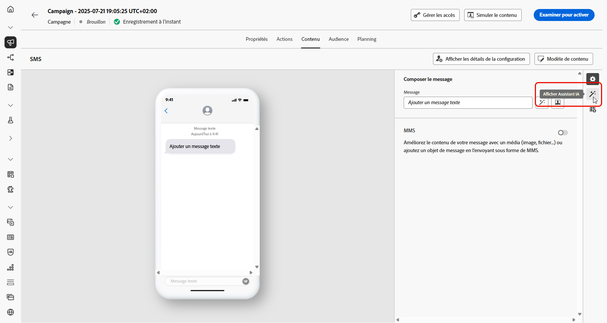
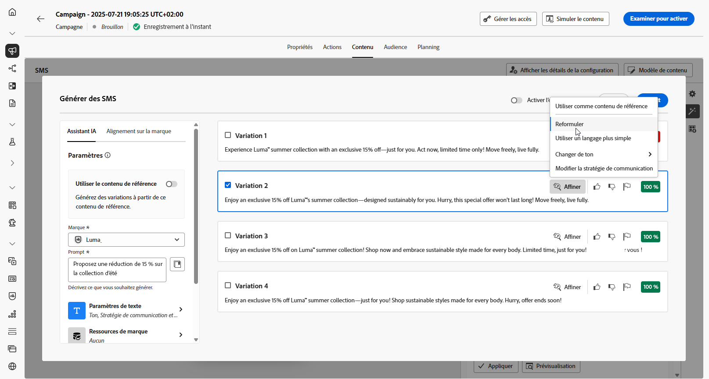

# Génération de SMS avec l’assistant IA {#generative-sms}

>[!BEGINSHADEBOX]

**Table des matières**

* [Commencer avec l’Assistant IA](gs-generative.md)
* [Génération d’e-mails avec l’assistant IA](generative-email.md)
* [Génération de SMS avec l’assistant IA](generative-sms.md)
* **[Génération des notifications push à l’aide de l’assistant d’IA](generative-push.md)**
* [Expérience de contenu avec l’assistant d’IA](generative-experimentation.md)

>[!ENDSHADEBOX]

Après avoir conçu et adapté vos SMS en fonction des préférences de votre audience, augmentez votre communication avec l’assistant d’IA dans Journey Optimizer.

Cette ressource offre des recommandations pertinentes pour affiner votre contenu, en aidant vos messages à résonner et à générer un engagement maximal.

Consultez les onglets ci-dessous pour savoir comment utiliser l’assistant d’IA dans Journey Optimizer.

>[!NOTE]
>
>Avant de commencer à utiliser cette fonctionnalité, lisez la section connexe [Mécanismes de sécurisation et limitations](gs-generative.md#generative-guardrails).

>[!BEGINTABS]

>[!TAB Génération complète de SMS]

1. Après avoir créé et configuré votre campagne SMS, cliquez sur **[!UICONTROL Modifier le contenu]**.

   Pour plus d&#39;informations sur le paramétrage de votre campagne SMS, reportez-vous à la section [cette page](../sms/create-sms.md).

1. Renseignez les **[!UICONTROL Détails de base]** pour votre campagne. Une fois terminé, cliquez sur **[!UICONTROL Modifier le contenu]**.

1. Personnalisez votre SMS selon vos besoins. [En savoir plus](../sms/create-sms.md)

1. Accédez au menu **[!UICONTROL Afficher l’assistant IA]**.

   {zoomable=&quot;yes&quot;}

1. Activez la variable **[!UICONTROL Utiliser le contenu d’origine]** de l’assistant d’IA afin de personnaliser le nouveau contenu en fonction du contenu, du nom et de l’audience de votre campagne.

   Votre invite doit toujours être liée à un contexte spécifique.

1. Ajustez le contenu en décrivant ce que vous souhaitez générer dans le champ **[!UICONTROL Invite]**.

   Si vous avez besoin d’aide pour concevoir votre invite, accédez au **[!UICONTROL Invite Library]** qui offre un large éventail d’idées pour améliorer vos campagnes.

   {zoomable=&quot;yes&quot;}

1. Sélectionnez **[!UICONTROL Charger une ressource de marque]** pour ajouter toute ressource de marque incluant du contenu pouvant fournir du contexte supplémentaire à l’assistant IA.

1. Adaptez votre invite avec les différentes options :

   * **[!UICONTROL Stratégie de communication]** : sélectionnez l’approche de communication souhaitée pour le texte généré.
   * **[!UICONTROL Langue]** : choisissez la langue du contenu de la variante.
   * **[!UICONTROL Ton]** : assurez-vous que le texte est adapté à votre audience et à votre objectif.
   * **[!UICONTROL Longueur]** : sélectionnez la longueur de votre contenu à l’aide du curseur de plage.

   {zoomable=&quot;yes&quot;}

1. Lorsque votre texte descriptif est prêt, cliquez sur **[!UICONTROL Générer]**.

1. Parcourez les **[!UICONTROL Variations]** générées et cliquez sur **[!UICONTROL Aperçu]** pour afficher une version plein écran de la variation sélectionnée.

1. Accédez à l’option **[!UICONTROL Affiner]** dans la fenêtre **[!UICONTROL Aperçu]** pour accéder à d’autres fonctionnalités de personnalisation et affiner votre variation en fonction de vos préférences :

   * **[!UICONTROL Utiliser comme contenu de référence]** : la variante choisie servira de contenu de référence pour générer d’autres résultats.

   * **[!UICONTROL Reformuler]** : l’assistant IA peut reformuler votre message de différentes manières en conservant une écriture soignée et attrayante pour diverses audiences.

   * **[!UICONTROL Utiliser un langage plus simple]**: utilisez l’assistant d’IA pour simplifier votre langue, en assurant clarté et accessibilité pour une audience plus large.

   {zoomable=&quot;yes&quot;}

1. Cliquez sur **[!UICONTROL Sélectionner]** une fois que vous avez trouvé le contenu approprié.

   Vous pouvez également activer l’expérience pour votre contenu. [En savoir plus](generative-experimentation.md)

1. Insérez des champs de personnalisation pour personnaliser le contenu de vos SMS en fonction des données de profil. [En savoir plus sur la personnalisation de contenu](../personalization/personalize.md)

1. Après avoir défini le contenu de votre message, cliquez sur le bouton **[!UICONTROL Simuler du contenu]** pour contrôler le rendu et vérifier les paramètres de personnalisation avec les profils de test. [En savoir plus](../personalization/personalize.md)

Une fois que vous avez défini votre contenu, votre audience et votre planning, vous êtes prêt à préparer votre campagne SMS. [En savoir plus](../campaigns/review-activate-campaign.md)

>[!TAB Génération de texte]

1. Après avoir créé et configuré votre campagne SMS, cliquez sur **[!UICONTROL Modifier le contenu]**.

   Pour plus d&#39;informations sur le paramétrage de votre campagne SMS, reportez-vous à la section [cette page](../sms/create-sms.md).

1. Renseignez les **[!UICONTROL Détails de base]** pour votre campagne. Une fois terminé, cliquez sur **[!UICONTROL Modifier le contenu]**.

1. Personnalisez votre SMS selon vos besoins. [En savoir plus](../sms/create-sms.md)

1. Accédez au **[!UICONTROL Modification de texte à l’aide de l’assistant AI]** en regard de votre **[!UICONTROL Message]** champ .

   {zoomable=&quot;yes&quot;}

1. Activez la variable **[!UICONTROL Utiliser le contenu de référence]** de l’assistant d’IA afin de personnaliser le nouveau contenu en fonction du contenu, du nom et de l’audience de votre campagne.

   Votre invite doit toujours être liée à un contexte spécifique.

1. Ajustez le contenu en décrivant ce que vous souhaitez générer dans le champ **[!UICONTROL Invite]**.

   Si vous avez besoin d’aide pour concevoir votre invite, accédez au **[!UICONTROL Invite Library]** qui offre un large éventail d’idées pour améliorer vos campagnes.

   {zoomable=&quot;yes&quot;}

1. Sélectionnez **[!UICONTROL Charger une ressource de marque]** pour ajouter toute ressource de marque incluant du contenu pouvant fournir du contexte supplémentaire à l’assistant IA.

1. Adaptez votre invite avec les différentes options :

   * **[!UICONTROL Stratégie de communication]** : sélectionnez l’approche de communication souhaitée pour le texte généré.
   * **[!UICONTROL Langue]** : choisissez la langue du contenu de la variante.
   * **[!UICONTROL Ton]** : assurez-vous que le texte est adapté à votre audience et à votre objectif.
   * **[!UICONTROL Longueur]** : sélectionnez la longueur de votre contenu à l’aide du curseur de plage.

   {zoomable=&quot;yes&quot;}

1. Lorsque votre texte descriptif est prêt, cliquez sur **[!UICONTROL Générer]**.

1. Parcourez les **[!UICONTROL Variations]** générées et cliquez sur **[!UICONTROL Aperçu]** pour afficher une version plein écran de la variation sélectionnée.

1. Accédez à l’option **[!UICONTROL Affiner]** dans la fenêtre **[!UICONTROL Aperçu]** pour accéder à d’autres fonctionnalités de personnalisation et affiner votre variation en fonction de vos préférences :

   * **[!UICONTROL Utiliser comme contenu de référence]** : la variante choisie servira de contenu de référence pour générer d’autres résultats.

   * **[!UICONTROL Reformuler]** : l’assistant IA peut reformuler votre message de différentes manières en conservant une écriture soignée et attrayante pour diverses audiences.

   * **[!UICONTROL Utiliser un langage plus simple]**: utilisez l’assistant d’IA pour simplifier votre langue, en assurant clarté et accessibilité pour une audience plus large.

   {zoomable=&quot;yes&quot;}

1. Cliquez sur **[!UICONTROL Sélectionner]** une fois que vous avez trouvé le contenu approprié.

   Vous pouvez également activer l’expérience pour votre contenu. [En savoir plus](generative-experimentation.md)

1. Insérez des champs de personnalisation pour personnaliser le contenu de vos SMS en fonction des données de profil. [En savoir plus sur la personnalisation de contenu](../personalization/personalize.md)

1. Après avoir défini le contenu de votre message, cliquez sur le bouton **[!UICONTROL Simulation du contenu]** pour contrôler le rendu et vérifier les paramètres de personnalisation avec les profils de test.

Une fois que vous avez défini votre contenu, votre audience et votre planning, vous êtes prêt à préparer votre campagne SMS. [En savoir plus](../campaigns/review-activate-campaign.md)

>[!ENDTABS]
