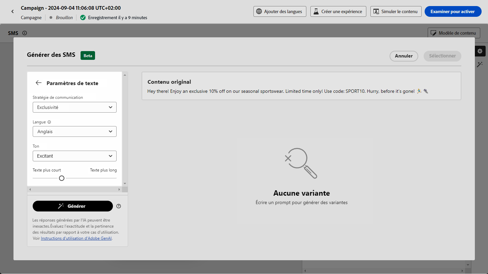

# Génération de SMS avec l’assistant d’IA dans Journey Optimizer - Content Accelerator  {#generative-sms}

>[!IMPORTANT]
>
>Avant de commencer à utiliser cette fonctionnalité, lisez la section connexe [Mécanismes de sécurisation et limitations](gs-generative.md#generative-guardrails).
> 
>
>Vous devez accepter un [contrat utilisateur](https://www.adobe.com/legal/licenses-terms/adobe-dx-gen-ai-user-guidelines.html) avant de pouvoir utiliser l’assistant d’IA dans Journey Optimizer pour l’accélération du contenu. Pour en savoir plus, contactez votre représentant ou représentante Adobe.

Après avoir conçu et adapté vos SMS en fonction des préférences de votre audience, augmentez votre communication avec l’assistant d’IA dans Journey Optimizer pour l’accélération du contenu.

Cette ressource offre des recommandations pertinentes pour affiner votre contenu, permettant à vos messages d’avoir un impact et de générer un engagement maximal.

Consultez les onglets ci-dessous pour savoir comment utiliser l’assistant d’IA dans Journey Optimizer pour l’accélération du contenu.

>[!BEGINTABS]

>[!TAB Génération de SMS complet]

1. Après avoir créé et configuré votre campagne par SMS, cliquez sur **[!UICONTROL Modifier le contenu]**.

   Pour plus d’informations sur la configuration de votre campagne par SMS, consultez [cette page](../sms/create-sms.md).

1. Renseignez les **[!UICONTROL Détails de base]** de votre campagne. Une fois terminé, cliquez sur **[!UICONTROL Modifier le contenu]**.

1. Personnalisez votre SMS selon vos besoins. [En savoir plus](../sms/create-sms.md)

1. Accédez au menu **[!UICONTROL Afficher l’assistant IA]**.

   {zoomable="yes"}

1. Affinez le contenu en décrivant ce que vous souhaitez générer dans le champ **[!UICONTROL Invite]**.

   Si vous avez besoin d’aide pour concevoir votre invite, accédez à la **[!UICONTROL Bibliothèque d’invites]** qui offre un large éventail d’idées d’invites pour améliorer vos campagnes.

   {zoomable="yes"}

1. Personnalisez votre invite avec l’option **[!UICONTROL Paramètres de texte]** :

   * **[!UICONTROL Stratégie de communication]** : sélectionnez l’approche de communication souhaitée pour le texte généré.
   * **[!UICONTROL Langue]** : choisissez la langue du contenu de la variante.
   * **[!UICONTROL Ton]** : assurez-vous que le texte est adapté à votre audience et à votre objectif.
   * **[!UICONTROL Longueur]** : sélectionnez la longueur de votre contenu à l’aide du curseur de plage.

   {zoomable="yes"}

1. Dans le menu **[!UICONTROL Ressources de marque]**, cliquez sur **[!UICONTROL Télécharger une ressource de marque]** pour ajouter toute ressource de marque qui contient du contenu pouvant fournir un contexte supplémentaire à l’assistant d’IA ou en sélectionner une précédemment téléchargée.

   Les fichiers précédemment téléchargés sont disponibles dans la liste déroulante **[!UICONTROL Ressources de marque téléchargées]** . Il vous suffit d’activer/désactiver les ressources que vous souhaitez inclure dans votre génération.

1. Lorsque votre texte descriptif est prêt, cliquez sur **[!UICONTROL Générer]**.

1. Parcourez les **[!UICONTROL Variations]** générées.

1. Accédez à l’option **[!UICONTROL Affiner]** dans la fenêtre **[!UICONTROL Aperçu]** pour accéder à d’autres fonctionnalités de personnalisation et affiner votre variation en fonction de vos préférences :

   * **[!UICONTROL Utiliser comme contenu de référence]** : la variante choisie servira de contenu de référence pour générer d’autres résultats.

   * **[!UICONTROL Reformuler]** : l’assistant IA peut reformuler votre message de différentes manières en conservant une écriture soignée et attrayante pour diverses audiences.

   * **[!UICONTROL Utiliser un langage simplifié]** : utilisez l’assistant IA pour simplifier votre langage, garantissant ainsi clarté et accessibilité pour une audience plus large.

   Vous pouvez également modifier les **[!UICONTROL tons]** et la **[!UICONTROL stratégie de communication]** de votre texte.

   {zoomable="yes"}

1. Cliquez sur **[!UICONTROL Sélectionner]** une fois que vous avez trouvé le contenu approprié.

   Vous pouvez également activer l’expérience pour votre contenu. [En savoir plus](generative-experimentation.md)

1. Insérez des champs de personnalisation pour personnaliser le contenu de vos SMS en fonction des données de profil. [En savoir plus sur la personnalisation de contenu](../personalization/personalize.md)

1. Après avoir défini le contenu de votre message, cliquez sur le bouton **[!UICONTROL Simuler du contenu]** pour contrôler le rendu et vérifier les paramètres de personnalisation avec les profils de test. [En savoir plus](../personalization/personalize.md)

Lorsque vous avez défini le contenu, l’audience et le planning, vous pouvez préparer votre campagne par SMS. [En savoir plus](../campaigns/review-activate-campaign.md)

>[!TAB Génération de texte uniquement]

1. Après avoir créé et configuré votre campagne par SMS, cliquez sur **[!UICONTROL Modifier le contenu]**.

   Pour plus d’informations sur la configuration de votre campagne par SMS, consultez [cette page](../sms/create-sms.md).

1. Renseignez les **[!UICONTROL Détails de base]** de votre campagne. Une fois terminé, cliquez sur **[!UICONTROL Modifier le contenu]**.

1. Personnalisez votre SMS selon vos besoins. [En savoir plus](../sms/create-sms.md)

1. Accédez au menu **[!UICONTROL Modifier le texte avec l’assistant IA]** en regard du champ **[!UICONTROL Message]**.

   {zoomable="yes"}

1. Activez l’option **[!UICONTROL Utiliser le contenu de référence]** de l’assistant d’IA pour l’accélération du contenu pour personnaliser le nouveau contenu en fonction du contenu sélectionné.

1. Affinez le contenu en décrivant ce que vous souhaitez générer dans le champ **[!UICONTROL Invite]**.

   Si vous avez besoin d’aide pour concevoir votre invite, accédez à la **[!UICONTROL Bibliothèque d’invites]** qui offre un large éventail d’idées d’invites pour améliorer vos campagnes.

   {zoomable="yes"}

1. Personnalisez votre invite avec l’option **[!UICONTROL Paramètres de texte]** :

   * **[!UICONTROL Stratégie de communication]** : sélectionnez l’approche de communication souhaitée pour le texte généré.
   * **[!UICONTROL Langue]** : choisissez la langue du contenu de la variante.
   * **[!UICONTROL Ton]** : assurez-vous que le texte est adapté à votre audience et à votre objectif.
   * **[!UICONTROL Longueur]** : sélectionnez la longueur de votre contenu à l’aide du curseur de plage.

   {zoomable="yes"}

1. Dans le menu **[!UICONTROL Ressources de marque]**, cliquez sur **[!UICONTROL Télécharger une ressource de marque]** pour ajouter toute ressource de marque qui contient du contenu pouvant fournir un contexte supplémentaire à l’assistant d’IA ou en sélectionner une précédemment téléchargée.

   Les fichiers précédemment téléchargés sont disponibles dans la liste déroulante **[!UICONTROL Ressources de marque téléchargées]** . Il vous suffit d’activer/désactiver les ressources que vous souhaitez inclure dans votre génération.

1. Lorsque votre texte descriptif est prêt, cliquez sur **[!UICONTROL Générer]**.

1. Parcourez les **[!UICONTROL variations]** générées et cliquez sur **[!UICONTROL Prévisualisation]** pour afficher une version plein écran de la variation sélectionnée.

1. Accédez à l’option **[!UICONTROL Affiner]** dans la fenêtre **[!UICONTROL Aperçu]** pour accéder à d’autres fonctionnalités de personnalisation et affiner votre variation en fonction de vos préférences :

   * **[!UICONTROL Utiliser comme contenu de référence]** : la variante choisie servira de contenu de référence pour générer d’autres résultats.

   * **[!UICONTROL Reformuler]** : l’assistant IA peut reformuler votre message de différentes manières en conservant une écriture soignée et attrayante pour diverses audiences.

   * **[!UICONTROL Utiliser un langage simplifié]** : utilisez l’assistant IA pour simplifier votre langage, garantissant ainsi clarté et accessibilité pour une audience plus large.

   {zoomable="yes"}

1. Cliquez sur **[!UICONTROL Sélectionner]** une fois que vous avez trouvé le contenu approprié.

   Vous pouvez également activer l’expérience pour votre contenu. [En savoir plus](generative-experimentation.md)

1. Insérez des champs de personnalisation pour personnaliser le contenu de vos SMS en fonction des données de profil. [En savoir plus sur la personnalisation de contenu](../personalization/personalize.md)

1. Après avoir défini le contenu de votre message, cliquez sur le bouton **[!UICONTROL Simuler du contenu]** pour contrôler le rendu et vérifier les paramètres de personnalisation avec les profils de test.

Lorsque vous avez défini le contenu, l’audience et le planning, vous pouvez préparer votre campagne par SMS. [En savoir plus](../campaigns/review-activate-campaign.md)

>[!ENDTABS]
