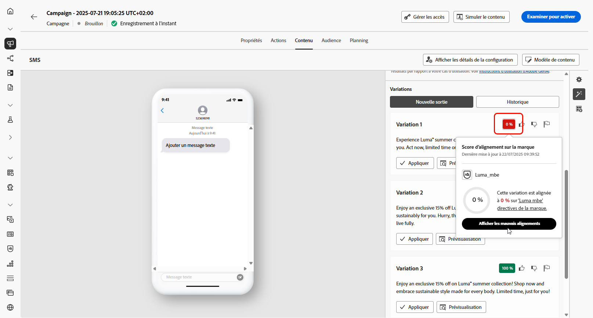

# Génération de SMS avec l’Assistant IA dans Journey Optimizer {#generative-sms}

>[!IMPORTANT]
>
>Avant de commencer à utiliser cette fonctionnalité, lisez la section connexe [Mécanismes de sécurisation et limitations](gs-generative.md#generative-guardrails).
> 
>
>Vous devez accepter un [contrat d’utilisation](https://www.adobe.com/fr/legal/licenses-terms/adobe-dx-gen-ai-user-guidelines.html) avant de pouvoir utiliser l’Assistant IA dans Journey Optimizer. Pour plus d’informations, contactez votre représentant ou représentante Adobe.

Après avoir conçu et personnalisé vos SMS en fonction des préférences de votre audience, améliorez vos communications avec l’Assistant IA dans Journey Optimizer.

Cette ressource offre des recommandations pertinentes pour affiner votre contenu, permettant à vos messages d’avoir un impact et de générer un engagement maximal.

1. Après avoir créé et configuré votre campagne par SMS, cliquez sur **[!UICONTROL Modifier le contenu]**.

   Pour plus d’informations sur la configuration de votre campagne par SMS, consultez [cette page](../sms/create-sms.md).

1. Renseignez les **[!UICONTROL Détails de base]** de votre campagne. Une fois terminé, cliquez sur **[!UICONTROL Modifier le contenu]**.

1. Personnalisez votre SMS selon vos besoins. [En savoir plus](../sms/create-sms.md)

1. Accédez au menu **[!UICONTROL Afficher l’assistant IA]**.

   {zoomable="yes"}

1. Sélectionnez votre **[!UICONTROL Marque]** pour vous assurer que le contenu généré par l’IA correspond aux spécifications de celle-ci. [En savoir plus](brands.md) sur les marques.

   Notez que cette fonctionnalité est disponible en version Private Beta et sera progressivement disponible pour l’ensemble de la clientèle dans les versions ultérieures.

1. Affinez le contenu en décrivant ce que vous souhaitez générer dans le champ **[!UICONTROL Prompt]**.

   Si vous avez besoin d’aide pour concevoir votre prompt, accédez à la **[!UICONTROL Bibliothèque de prompts]** qui offre un large éventail d’idées d’invites pour améliorer vos campagnes.

   {zoomable="yes"}

1. Adaptez votre prompt avec l’option **[!UICONTROL Paramètres de texte]** :

   * **[!UICONTROL Stratégie de communication]** : sélectionnez l’approche de communication souhaitée pour le texte généré.
   * **[!UICONTROL Langues]** : sélectionnez la langue du contenu généré.
   * **[!UICONTROL Ton]** : assurez-vous que le texte est adapté à votre audience et à votre objectif.
   * **[!UICONTROL Longueur]** : sélectionnez la longueur de votre contenu à l’aide du curseur de plage.

   {zoomable="yes"}

1. Depuis le menu **[!UICONTROL Ressources de marque]**, cliquez sur **[!UICONTROL Charger une ressource de marque]** pour ajouter toute ressource de marque incluant du contenu pouvant fournir du contexte supplémentaire à l’Assistant IA ou sélectionnez-en une chargée précédemment.

   Les fichiers précédemment chargés sont disponibles dans la liste déroulante **[!UICONTROL Ressources de marque chargées]**. Activez simplement les ressources que vous souhaitez inclure dans votre génération.

1. Lorsque votre prompt est prêt, cliquez sur **[!UICONTROL Générer]**.

1. Parcourez les **[!UICONTROL variations]** générées.

   Cliquez sur **[!UICONTROL Aperçu]** pour afficher une version en plein écran de la variation sélectionnée ou cliquez sur **[!UICONTROL Appliquer]** pour remplacer votre contenu actuel.

1. Cliquez sur l’icône de pourcentage pour afficher votre **[!UICONTROL score d’alignement sur la marque]** et identifier tout décalage avec votre marque.

   En savoir plus sur le [score d’alignement sur la marque](brands-score.md).

   {zoomable="yes"}

1. Accédez à l’option **[!UICONTROL Affiner]** dans la fenêtre **[!UICONTROL Aperçu]** pour accéder à d’autres fonctionnalités de personnalisation et affiner votre variation en fonction de vos préférences :

   * **[!UICONTROL Utiliser comme contenu de référence]** : la variante choisie servira de contenu de référence pour générer d’autres résultats.

   * **[!UICONTROL Reformuler]**:The : l’Assistant IA peut reformuler votre message de différentes manières en conservant une écriture soignée et attrayante pour diverses audiences.

   * **[!UICONTROL Utiliser un langage simplifié]** : utilisez l’Assistant IA pour simplifier votre langage, garantissant ainsi clarté et accessibilité pour une audience plus large.

   Vous pouvez également modifier le **[!UICONTROL ton]** et la **[!UICONTROL stratégie de communication]** de votre texte.

   {zoomable="yes"}

1. Ouvrez l’onglet **[!UICONTROL Alignement sur la marque]** pour voir comment votre contenu s’aligne sur vos [directives de marque](brands.md).

1. Cliquez sur **[!UICONTROL Sélectionner]** une fois que vous avez trouvé le contenu approprié.

   Vous pouvez également activer l’expérience pour votre contenu. [En savoir plus](generative-experimentation.md)

1. Insérez des champs de personnalisation pour personnaliser le contenu de vos SMS en fonction des données de profil. [En savoir plus sur la personnalisation de contenu](../personalization/personalize.md)

1. Après avoir défini le contenu de votre message, cliquez sur le bouton **[!UICONTROL Simuler du contenu]** pour contrôler le rendu et vérifier les paramètres de personnalisation avec les profils de test. [En savoir plus](../personalization/personalize.md)

Lorsque vous avez défini le contenu, l’audience et le planning, vous pouvez préparer votre campagne par SMS. [En savoir plus](../campaigns/review-activate-campaign.md)
