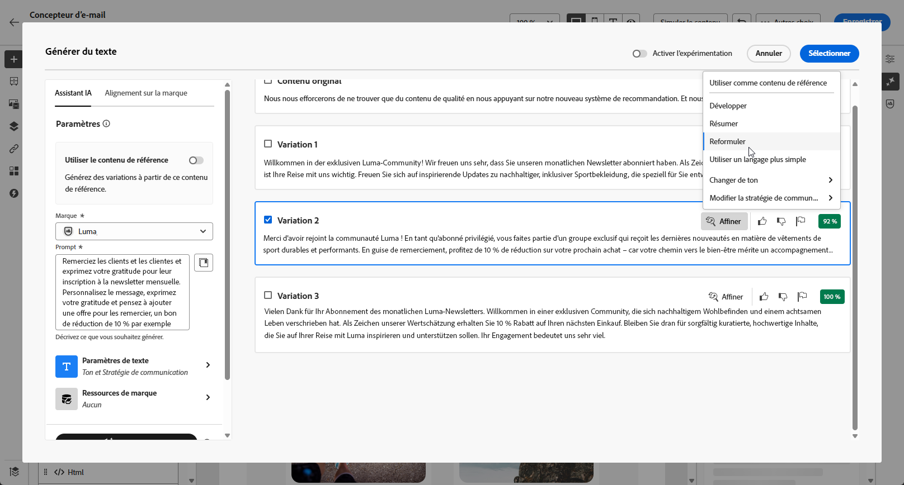
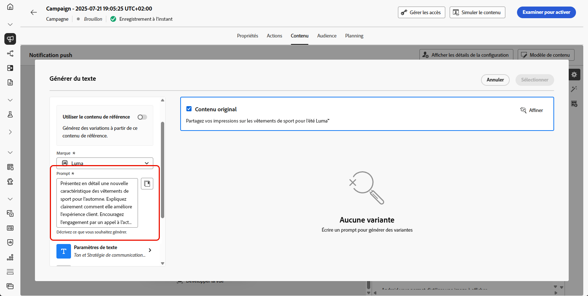
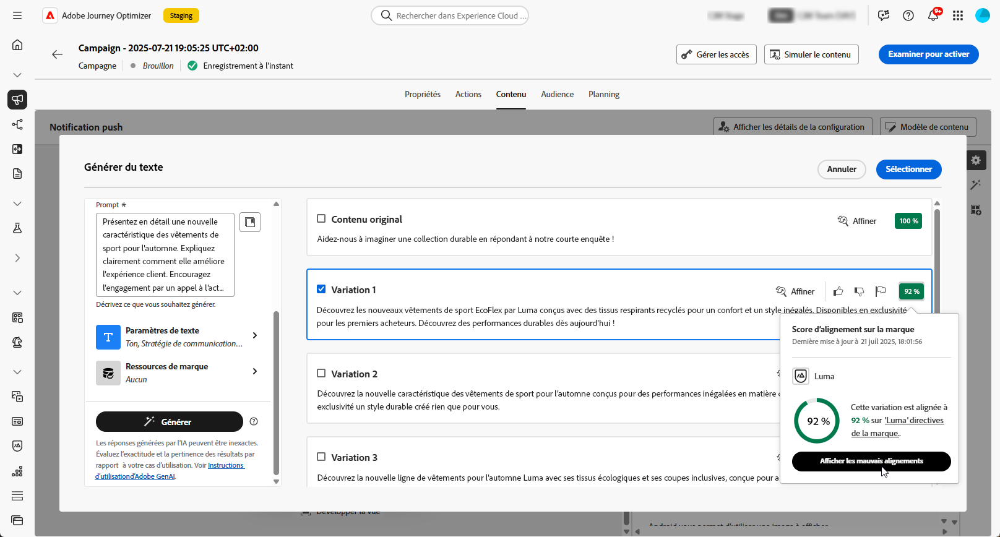

# Générer du texte avec l’assistant d’IA {#generative-text}

>[!IMPORTANT]
>
>Avant de commencer à utiliser cette fonctionnalité, lisez la section connexe [Mécanismes de sécurisation et limitations](gs-generative.md#generative-guardrails).
> 
>
>Vous devez accepter un [contrat d’utilisation](https://www.adobe.com/fr/legal/licenses-terms/adobe-dx-gen-ai-user-guidelines.html) avant de pouvoir utiliser l’Assistant IA dans Journey Optimizer. Pour plus d’informations, contactez votre représentant ou représentante Adobe.

Utilisez l’assistant d’IA dans Journey Optimizer pour générer du contenu textuel attrayant qui résonne avec votre audience. Que vous ayez besoin d’améliorer la copie des e-mails, de créer du contenu web attrayant, de concevoir un texte de page de destination convaincant, d’écrire des messages de notification push ou de composer des SMS, l’assistant IA vous aide à diffuser du texte percutant.

## Pour les canaux e-mail et web {#email-web-channels}

L’assistant AI peut générer du contenu texte de haute qualité pour vos campagnes par e-mail, vos expériences web et vos pages de destination. Cette fonctionnalité vous permet de créer des messages attrayants sur la marque, qui se connectent à votre audience à travers les points de contact numériques.

### Accès et configuration {#access-configure}

Avant de pouvoir commencer à générer du contenu texte avec l’assistant AI, vous devez configurer votre campagne ou votre parcours et accéder à l’éditeur de contenu. Pour préparer votre espace de travail et ouvrir le panneau de l’assistant AI, procédez comme suit.

1. Créez et configurez votre campagne ou votre parcours :

   * **E-mail** : après avoir créé et configuré votre campagne par e-mail, cliquez sur **[!UICONTROL Modifier le contenu]**. [En savoir plus](../email/create-email.md)
   * **Web** : après avoir créé et configuré votre page web, cliquez sur **[!UICONTROL Modifier la page web]**. [En savoir plus](../web/create-web.md)
   * **Page de destination** : après avoir créé et configuré votre page de destination, cliquez sur **[!UICONTROL Ouvrir le concepteur]**. [En savoir plus](../landing-pages/create-lp.md)

1. Sélectionnez un **[!UICONTROL composant de texte]** pour cibler uniquement un contenu spécifique et accéder au menu **[!UICONTROL Assistant IA]** (ou **[!UICONTROL Afficher l’assistant IA]** pour le web).

   {zoomable="yes"}

### Générer le contenu {#generate-content}

Découvrez comment créer des invites claires, affiner les paramètres et générer du texte personnalisé à l’aide de l’assistant AI, en veillant à ce que votre messagerie s’aligne sur vos objectifs de marque et de communication.

1. Activez l’option **[!UICONTROL Utiliser le contenu original]** pour que l’Assistant IA personnalise le nouveau contenu en fonction du contenu sélectionné.

1. Sélectionnez votre **[!UICONTROL Marque]** pour vous assurer que le contenu généré par l’IA correspond aux spécifications de celle-ci. [En savoir plus](brands.md) sur les marques.

1. Affinez le contenu en décrivant ce que vous souhaitez générer dans le champ **[!UICONTROL Prompt]**.

   Si vous avez besoin d’aide pour concevoir votre prompt, accédez à la **[!UICONTROL Bibliothèque de prompts]** qui offre un large éventail d’idées d’invites pour améliorer vos campagnes.

   Panneau de génération de texte de l’assistant {zoomable="yes"}

1. Adaptez votre prompt avec l’option **[!UICONTROL Paramètres de texte]** :

   * **[!UICONTROL Stratégie de communication]** : choisissez le style de communication le plus adapté au texte généré.
   * **[!UICONTROL Langues]** : sélectionnez la langue du contenu généré.
   * **[!UICONTROL Ton]** : Le ton doit résonner auprès de votre audience. Que vous souhaitiez communiquer de façon informative, ludique ou convaincante, l’Assistant IA peut adapter le message en conséquence.
   * **Longueur de texte** : utilisez le curseur pour sélectionner la longueur souhaitée de votre texte.

   {zoomable="yes"}

1. Depuis le menu **[!UICONTROL Ressources de marque]**, cliquez sur **[!UICONTROL Charger une ressource de marque]** pour ajouter toute ressource de marque incluant du contenu pouvant fournir du contexte supplémentaire à l’Assistant IA ou sélectionnez-en une chargée précédemment.

   Les fichiers précédemment chargés sont disponibles dans la liste déroulante **[!UICONTROL Ressources de marque chargées]**. Activez simplement les ressources que vous souhaitez inclure dans votre génération.

   {zoomable="yes"}

1. Lorsque votre prompt est prêt, cliquez sur **[!UICONTROL Générer]**.

### Affiner et finaliser {#refine-finalize}

Découvrez comment réviser le texte généré, apporter des améliorations et appliquer une personnalisation pour finaliser votre contenu, créer des messages soignés et attrayants prêts à être diffusés.

1. Parcourez les **[!UICONTROL variations]** générées.

   Cliquez sur **[!UICONTROL Aperçu]** pour afficher une version en plein écran de la variation sélectionnée ou cliquez sur **[!UICONTROL Appliquer]** pour remplacer votre contenu actuel.

1. Cliquez sur l’icône de pourcentage pour afficher votre **[!UICONTROL score d’alignement sur la marque]** et identifier tout décalage avec votre marque.

   En savoir plus sur le [score d’alignement sur la marque](brands-score.md).

   {zoomable="yes"}

1. Accédez à l’option **[!UICONTROL Affiner]** dans la fenêtre **[!UICONTROL Aperçu]** pour accéder à d’autres fonctionnalités de personnalisation :

   * **[!UICONTROL Utiliser comme contenu de référence]** : la variante choisie servira de contenu de référence pour générer d’autres résultats.

   * **[!UICONTROL Reformuler]** : réécrivez le message tout en préservant sa signification. Cette option vous permet de générer une autre formulation, d’améliorer le flux ou d’ajuster les expressions sans modifier le message principal.

   * **[!UICONTROL Utiliser un langage simplifié]** : utilisez l’Assistant IA pour simplifier votre langage, garantissant ainsi clarté et accessibilité pour une audience plus large.

   * **[!UICONTROL Changer de ton]** : ajustez le ton du message pour mieux correspondre à votre style de communication, c’est-à-dire le rendre plus convivial, professionnel, urgent ou inspirant.

   * **[!UICONTROL Modifier la stratégie de communication]** : modifiez l’approche de messagerie en fonction de vos objectifs, tels que créer une urgence ou mettre l’accent sur un appel passionnant.

   {zoomable="yes"}

1. Ouvrez l’onglet **[!UICONTROL Alignement sur la marque]** pour voir comment votre contenu s’aligne sur vos [directives de marque](brands.md).

1. Cliquez sur **[!UICONTROL Sélectionner]** une fois que vous avez trouvé le contenu approprié.

   Vous pouvez également activer l’expérience pour votre contenu. [En savoir plus](generative-experimentation.md)

1. Insérez des champs de personnalisation pour personnaliser votre contenu en fonction des données de profil. Cliquez ensuite sur le bouton **[!UICONTROL Simuler le contenu]** pour contrôler le rendu et vérifier les paramètres de personnalisation avec les profils de test. [En savoir plus](../personalization/personalize.md)

1. Examinez et activez votre contenu :
   * **E-mail** : lorsque vous avez défini le contenu, l’audience et le planning, vous êtes prêt à préparer votre campagne par e-mail. [En savoir plus](../campaigns/review-activate-campaign.md)
   * **Web** : une fois que vous avez défini vos paramètres de campagne web et modifié votre contenu selon vos besoins, vous pouvez examiner et activer votre campagne web. [En savoir plus](../web/create-web.md#activate-web-campaign)
   * **Page de destination** : une fois votre page de destination prête, vous pouvez la publier pour la rendre disponible pour une utilisation dans un message. [En savoir plus](../landing-pages/create-lp.md#publish-landing-page)

## Pour les canaux mobiles {#mobile-channels}

L’assistant AI peut générer du contenu texte attrayant pour vos notifications push et vos SMS, ce qui vous permet de créer des communications mobiles attrayantes qui résonnent avec votre audience à travers tous les points de contact mobiles.

### Accès et configuration {#mobile-access-configure}

Avant de commencer à générer du texte avec l’assistant AI pour les canaux mobiles, vous devez configurer votre campagne et accéder à l’assistant AI. La méthode d&#39;accès varie légèrement entre les notifications push et les SMS.

1. Créez et configurez votre campagne mobile :
   * **Notifications push** : après avoir créé et configuré votre campagne de notification push, cliquez sur **[!UICONTROL Modifier le contenu]**. [En savoir plus](../push/create-push.md)
   * **SMS** : après avoir créé et configuré votre campagne par SMS, cliquez sur **[!UICONTROL Modifier le contenu]**. [En savoir plus](../sms/create-sms.md)

1. Renseignez les **[!UICONTROL Détails de base]** de votre campagne. Une fois terminé, cliquez sur **[!UICONTROL Modifier le contenu]**.

1. Personnalisez votre message selon vos besoins :
   * **Notifications push** : [En savoir plus](../push/design-push.md)
   * **SMS** : [En savoir plus](../sms/create-sms.md)

1. Accéder à l’assistant d’IA :
   * **Pour les notifications push** : cliquez sur le menu **[!UICONTROL Modifier le texte avec l’assistant AI]** en regard de vos champs **[!UICONTROL Titre]** ou **[!UICONTROL Message]**. Vous pouvez également accéder directement au menu **Assistant IA**.

     {zoomable="yes"}

   * **Pour les SMS** : cliquez sur le menu **[!UICONTROL Modifier le texte avec l’assistant AI]** en regard de votre **[!UICONTROL Message]** ou accédez au menu **[!UICONTROL Afficher l’assistant AI]**.

     {zoomable="yes"}

### Générer le contenu {#mobile-generate-content}

Une fois que vous avez accédé à l’assistant d’IA, vous pouvez configurer les paramètres de génération afin de créer du contenu mobile correspondant aux objectifs de votre marque et de votre campagne. Personnalisez les paramètres de texte, ajoutez des ressources de marque et fournissez des invites pour guider l&#39;IA dans la génération de variations pertinentes.

1. Sélectionnez votre **[!UICONTROL Marque]** pour vous assurer que le contenu généré par l’IA correspond aux spécifications de celle-ci. [En savoir plus](brands.md) sur les marques.

   Notez que cette fonctionnalité est disponible en version Private Beta et sera progressivement disponible pour l’ensemble de la clientèle dans les versions ultérieures.

1. Affinez le contenu en décrivant ce que vous souhaitez générer dans le champ **[!UICONTROL Prompt]**.

   Si vous recherchez de l’aide pour concevoir votre invite, accédez à la **[!UICONTROL bibliothèque d’invites]** qui fournit un large éventail d’idées d’invites pour améliorer vos campagnes. [En savoir plus sur les bonnes pratiques relatives aux invites](ai-assistant-prompting-guide.md)

   {zoomable="yes"}

1. **Pour les notifications push**, sélectionnez le champ à générer : Titre et/ou Message.

1. Adaptez votre prompt avec l’option **[!UICONTROL Paramètres de texte]** :

   * **[!UICONTROL Stratégie de communication]** : choisissez le style de communication le plus adapté au texte généré.
   * **[!UICONTROL Langues]** : sélectionnez la langue du contenu généré.
   * **[!UICONTROL Ton]** : Le ton doit résonner auprès de votre audience. Que vous souhaitiez communiquer de façon informative, ludique ou convaincante, l’Assistant IA peut adapter le message en conséquence.

     {zoomable="yes"}

1. Dans le menu **[!UICONTROL Contenu de référence]**, cliquez sur **[!UICONTROL Télécharger le fichier]** pour ajouter une ressource de marque contenant du contenu pouvant fournir un assistant d’IA contextuel supplémentaire ou sélectionnez-en une précédemment chargée.

   Les fichiers précédemment chargés sont disponibles dans le menu déroulant **[!UICONTROL Contenu de référence chargé]**. Activez simplement les ressources que vous souhaitez inclure dans votre génération.

1. Lorsque votre prompt est prêt, cliquez sur **[!UICONTROL Générer]**.

### Affiner et finaliser {#mobile-refine-finalize}

Après avoir généré des variations de texte pour vos messages mobiles, vous pouvez affiner les résultats pour vous assurer qu’ils répondent exactement à vos besoins. Examinez l’alignement de la marque, ajustez le ton et la langue, puis préparez le contenu pour l’activation.

1. Après la génération, parcourez les **[!UICONTROL Variations]**.

1. Cliquez sur l’icône de pourcentage pour afficher votre **[!UICONTROL score d’alignement sur la marque]** et identifier tout décalage avec votre marque.

   En savoir plus sur le [score d’alignement sur la marque](brands-score.md).

   {zoomable="yes"}

1. Cliquez sur **[!UICONTROL Aperçu]** pour afficher une version en plein écran de la variation sélectionnée ou cliquez sur **[!UICONTROL Appliquer]** pour remplacer votre contenu actuel.

1. Accédez à l’option **[!UICONTROL Affiner]** dans la fenêtre **[!UICONTROL Aperçu]** pour accéder à d’autres fonctionnalités de personnalisation :

   * **[!UICONTROL Utiliser comme contenu de référence]** : la variante choisie servira de contenu de référence pour générer d’autres résultats.

   * **[!UICONTROL Reformuler]** : réécrivez le message tout en préservant sa signification. Cette option vous permet de générer une autre formulation, d’améliorer le flux ou d’ajuster les expressions sans modifier le message principal.

   * **[!UICONTROL Utiliser un langage simplifié]** : utilisez l’Assistant IA pour simplifier votre langage, garantissant ainsi clarté et accessibilité pour une audience plus large.

   * **[!UICONTROL Traduire]** : simplifiez votre langue pour garantir la clarté et l’accessibilité pour une audience plus large.

   * **[!UICONTROL Changer de ton]** : ajustez le ton du message pour mieux correspondre à votre style de communication, c’est-à-dire le rendre plus convivial, professionnel, urgent ou inspirant.

   * **[!UICONTROL Modifier la stratégie de communication]** : modifiez l’approche de messagerie en fonction de vos objectifs, tels que créer une urgence ou mettre l’accent sur un appel passionnant.

     {zoomable="yes"}

1. Ouvrez l’onglet **[!UICONTROL Alignement sur la marque]** pour voir comment votre contenu s’aligne sur vos [directives de marque](brands.md).

1. Cliquez sur **[!UICONTROL Sélectionner]** une fois que vous avez trouvé le contenu approprié.

   Vous pouvez également activer l’expérience pour votre contenu. [En savoir plus](generative-experimentation.md)

1. Insérez des champs de personnalisation pour personnaliser votre contenu en fonction des données de profil. Cliquez ensuite sur le bouton **[!UICONTROL Simuler le contenu]** pour contrôler le rendu et vérifier les paramètres de personnalisation avec les profils de test. [En savoir plus](../personalization/personalize.md)

Lorsque vous avez défini le contenu, l’audience et le planning, vous êtes prêt(e) à préparer votre campagne mobile. [En savoir plus](../campaigns/review-activate-campaign.md)

