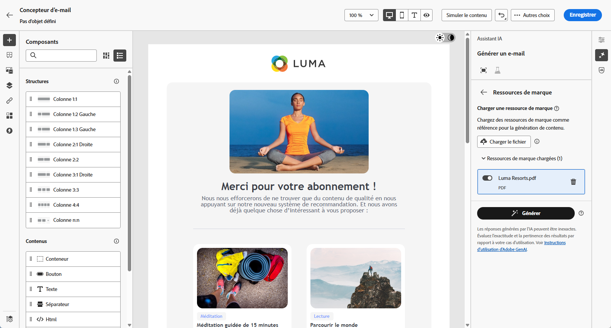
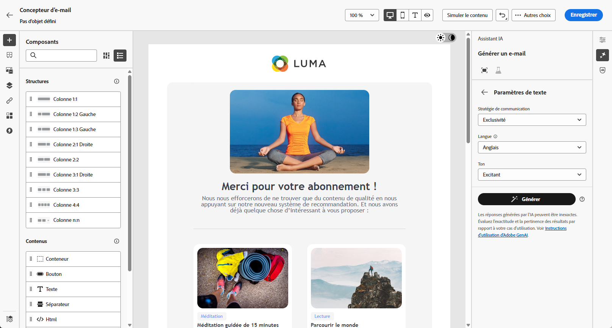
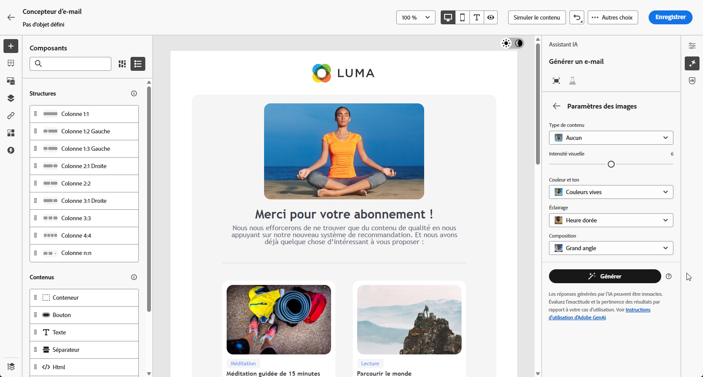

# Génération web à l’aide de l’assistant d’IA {#generative-web}

>[!BEGINSHADEBOX]

**Table des matières**

* [Commencer avec l’Assistant IA](gs-generative.md)
* [Génération d’e-mails avec l’assistant IA](generative-email.md)
* [Génération de SMS avec l’assistant IA](generative-SMS.md)
* [Génération des notifications push à l’aide de l’assistant d’IA](generative-push.md)
* **[Génération de pages web avec l’assistant d’IA](generative-web.md)**
* [Expérience de contenu avec l’assistant d’IA](generative-experimentation.md)

>[!ENDSHADEBOX]

Une fois que vous avez créé et personnalisé vos emails, utilisez l’assistant d’IA dans Adobe Journey Optimizer, optimisé par l’IA générative, pour passer votre contenu au niveau supérieur.

L’assistant IA peut vous aider à optimiser l’impact de vos diffusions en suggérant un contenu différent et davantage susceptible de résonner auprès de votre audience.

>[!NOTE]
>
>Avant de commencer à utiliser cette fonctionnalité, lisez la section connexe [Mécanismes de sécurisation et limitations](generative-gs.md#guardrails-and-limitations).

>[!BEGINTABS]

>[!TAB Génération complète de pages web]

Dans l’exemple suivant, nous utiliserons l’assistant IA pour peaufiner un e-mail existant en le personnalisant pour un événement spécial.

1. Après avoir créé et configuré votre diffusion e-mail, cliquez sur **[!UICONTROL Modifier le contenu]**.

   Pour plus d’informations sur la configuration de votre diffusion e-mail, consultez [cette page](../email/create-email-content.md).

1. Personnalisez votre e-mail selon vos besoins et accédez au menu **[!UICONTROL Assistant IA]**.

   {zoomable=&quot;yes&quot;}

1. Activez l’option **[!UICONTROL Utiliser le contenu original]** de l’assistant IA afin de personnaliser le nouveau contenu en fonction de votre diffusion, du nom de la diffusion et de l’audience sélectionnée.

   Votre invite doit toujours être liée à un contexte spécifique.

1. Ajustez le contenu en décrivant ce que vous souhaitez générer dans le champ **[!UICONTROL Invite]**.

   Si vous avez besoin d’aide pour concevoir votre invite, accédez à la **[!UICONTROL Bibliothèque d’invites]** qui dispose d’un large éventail d’idées d’invites pour améliorer vos diffusions.

   {zoomable=&quot;yes&quot;}

1. Vous pouvez activer l’**[!UICONTROL Objet]** ou le **[!UICONTROL Pré-en-tête]** pour les inclure à la génération des variantes.

1. Sélectionnez **[!UICONTROL Charger une ressource de marque]** pour ajouter toute ressource de marque incluant du contenu pouvant fournir du contexte supplémentaire à l’assistant IA ou sélectionnez-en une chargée précédemment.

   {zoomable=&quot;yes&quot;}

1. Adaptez votre invite avec les différentes options :

   * **[!UICONTROL Stratégie de communication]** : choisissez le style de communication le plus adapté au texte généré.
   * **[!UICONTROL Langue]** : sélectionnez la langue dans laquelle vous souhaitez générer votre contenu.
   * **[!UICONTROL Ton]** : le ton de votre e-mail doit résonner auprès de votre audience. Que vous souhaitiez communiquer de façon informative, ludique ou convaincante, l’assistant IA peut adapter le message en conséquence.
   * **[!UICONTROL Longueur]** : choisissez la longueur souhaitée de votre contenu à l’aide du curseur de plage.

   {zoomable=&quot;yes&quot;}

1. Lorsque votre texte descriptif est prêt, cliquez sur **[!UICONTROL Générer]**.

1. Parcourez les **[!UICONTROL variations]** générées et cliquez sur **[!UICONTROL Aperçu]** pour afficher une version plein écran de la variation sélectionnée.

1. Naviguez vers l’option **[!UICONTROL Affiner]** dans la fenêtre **[!UICONTROL Aperçu]** pour accéder à d’autres fonctionnalités de personnalisation :

   * **[!UICONTROL Reformuler]** : l’assistant IA peut reformuler votre message de différentes manières en conservant une écriture soignée et attrayante pour diverses audiences.

   * **[!UICONTROL Utiliser un langage simple]** : utilisez l’assistant IA pour simplifier votre langage en assurant clarté et accessibilité pour une audience plus large.

   {zoomable=&quot;yes&quot;}

1. Cliquez sur **[!UICONTROL Sélectionner]** une fois que vous avez trouvé le contenu approprié.

1. Insérez des champs de personnalisation pour personnaliser le contenu de votre e-mail en fonction des données de profil. Cliquez ensuite sur le bouton **[!UICONTROL Simuler le contenu]** pour contrôler le rendu et vérifier les paramètres de personnalisation avec les profils de test. [En savoir plus](../preview-test/preview-content.md)

   {zoomable=&quot;yes&quot;}

Lorsque vous avez défini le contenu, l’audience et le planning, vous pouvez préparer votre diffusion e-mail. [En savoir plus](../monitor/prepare-send.md)

>[!TAB Génération de texte de page web]

Dans l’exemple suivant, nous utiliserons l’assistant IA afin d’améliorer le contenu de notre e-mail d’invitation pour notre événement à venir.

1. Après avoir créé et configuré votre diffusion e-mail, cliquez sur **[!UICONTROL Modifier le contenu]**.

   Pour plus d’informations sur la configuration de votre diffusion e-mail, consultez [cette page](../email/create-email-content.md).

1. Sélectionnez un **[!UICONTROL composant de texte]** pour cibler uniquement un contenu spécifique. Accédez au menu **[!UICONTROL Assistant IA]**.

   {zoomable=&quot;yes&quot;}

1. Activez l’option **[!UICONTROL Utiliser le contenu original]** de l’assistant IA afin de personnaliser le nouveau contenu en fonction de votre diffusion, du nom de la diffusion et de l’audience sélectionnée.

   Votre invite doit toujours être liée à un contexte spécifique.

1. Ajustez le contenu en décrivant ce que vous souhaitez générer dans le champ **[!UICONTROL Invite]**.

   Si vous avez besoin d’aide pour concevoir votre invite, accédez à la **[!UICONTROL Bibliothèque d’invites]** qui dispose d’un large éventail d’idées d’invites pour améliorer vos diffusions.

   {zoomable=&quot;yes&quot;}

1. Sélectionnez **[!UICONTROL Charger une ressource de marque]** pour ajouter toute ressource de marque incluant du contenu pouvant fournir du contexte supplémentaire à l’assistant IA.

   {zoomable=&quot;yes&quot;}

1. Adaptez votre invite avec les différentes options :

   * **[!UICONTROL Stratégie de communication]** : sélectionnez l’approche de communication souhaitée pour le texte généré.
   * **[!UICONTROL Langue]** : choisissez la langue du contenu de la variante.
   * **[!UICONTROL Ton]** : assurez-vous que le texte est adapté à votre audience et à votre objectif.
   * **[!UICONTROL Longueur]** : sélectionnez la longueur de votre contenu à l’aide du curseur de plage.

   {zoomable=&quot;yes&quot;}

1. Lorsque votre texte descriptif est prêt, cliquez sur **[!UICONTROL Générer]**.

1. Parcourez les **[!UICONTROL variations]** générées et cliquez sur **[!UICONTROL Aperçu]** pour afficher une version plein écran de la variation sélectionnée.

1. Naviguez vers l’option **[!UICONTROL Affiner]** dans la fenêtre **[!UICONTROL Aperçu]** pour accéder à d’autres fonctionnalités de personnalisation :

   * **Utiliser comme contenu de référence** : la variante choisie servira de contenu de référence pour générer d’autres résultats.

   * **Élaborer** : l’assistant IA peut vous aider à développer des sujets spécifiques, en fournissant des détails supplémentaires pour une meilleure compréhension et un meilleur engagement.

   * **Résumé** : de longues informations peuvent embrouiller les personnes destinataires des e-mails. Utilisez l’assistant IA pour condenser des points clés en résumés clairs et concis qui attirent l’attention et pour les encourager à lire davantage.

   * **Reformuler** : l’assistant IA peut reformuler votre message de différentes manières en conservant une écriture soignée et attrayante pour diverses audiences.

   * **Utiliser un langage simple** : utilisez l’assistant IA pour simplifier votre langage en assurant clarté et accessibilité pour une audience plus large.

   {zoomable=&quot;yes&quot;}

1. Cliquez sur **[!UICONTROL Sélectionner]** une fois que vous avez trouvé le contenu approprié.

1. Insérez des champs de personnalisation pour personnaliser le contenu de votre e-mail en fonction des données de profil. Cliquez ensuite sur le bouton **[!UICONTROL Simuler le contenu]** pour contrôler le rendu et vérifier les paramètres de personnalisation avec les profils de test. [En savoir plus](../preview-test/preview-content.md)

   {zoomable=&quot;yes&quot;}

Lorsque vous avez défini le contenu, l’audience et le planning, vous pouvez préparer votre diffusion e-mail. [En savoir plus](../monitor/prepare-send.md)

>[!TAB Génération d&#39;images de page web]

Dans l’exemple ci-dessous, découvrez comment tirer parti de l’assistant IA pour optimiser et améliorer vos ressources, afin d’offrir une expérience plus conviviale.

1. Après avoir créé et configuré votre diffusion e-mail, cliquez sur **[!UICONTROL Modifier le contenu]**.

   Pour plus d’informations sur la configuration de votre diffusion e-mail, consultez [cette page](../email/create-email-content.md).

1. Renseignez les **[!UICONTROL détails de base]** de votre diffusion. Une fois terminé, cliquez sur **[!UICONTROL Modifier le contenu de l’e-mail]**.

1. Sélectionnez la ressource que vous souhaitez modifier à l’aide de l’Assistant IA.

1. Dans le menu de droite, sélectionnez **[!UICONTROL Assistant IA]**.

   {zoomable=&quot;yes&quot;}

1. Ajustez le contenu en décrivant ce que vous souhaitez générer dans le champ **[!UICONTROL Invite]**.

   Si vous avez besoin d’aide pour concevoir votre invite, accédez à la **[!UICONTROL Bibliothèque d’invites]** qui dispose d’un large éventail d’idées d’invites pour améliorer vos diffusions.

   {zoomable=&quot;yes&quot;}

1. Sélectionnez **[!UICONTROL Charger une ressource de marque]** pour ajouter toute ressource de marque incluant du contenu pouvant fournir du contexte supplémentaire à l’assistant IA.

   Votre invite doit toujours être liée à un contexte spécifique.

1. Adaptez votre invite avec les différentes options :

   * **[!UICONTROL Format]** : déterminez la largeur et la hauteur de la ressource. Vous avez la possibilité de choisir parmi des formats courants tels que 16:9, 4:3, 3:2 ou 1:1, ou vous pouvez saisir une taille personnalisée.
   * **[!UICONTROL Couleur et ton]** : aspect général des couleurs dans une image et humeur ou ambiance qu’elles véhiculent.
   * **[!UICONTROL Type de contenu]** : cette propriété classe la nature de l’élément visuel en faisant la distinction entre les différentes formes de représentation visuelle, telles que les photos, les graphiques ou les illustrations.
   * **[!UICONTROL Éclairage]** : fait référence à l’éclairage présent dans une image qui forme son atmosphère et met en évidence des éléments spécifiques.
   * **[!UICONTROL Composition]** : fait référence à la disposition des éléments dans le cadre d’une image.

   {zoomable=&quot;yes&quot;}

1. Quand la configuration de votre invite vous satisfait, cliquez sur **[!UICONTROL Générer]**.

1. Parcourez les **[!UICONTROL Suggestions de variation]** pour trouver la ressource souhaitée.

   Cliquez sur **[!UICONTROL Aperçu]** pour afficher une version plein écran de la variation sélectionnée.

   {zoomable=&quot;yes&quot;}

1. Choisissez **[!UICONTROL Afficher les images similaires]** si vous souhaitez afficher les images associées à cette variante.

1. Cliquez sur **[!UICONTROL Sélectionner]** une fois que vous avez trouvé le contenu approprié.

   {zoomable=&quot;yes&quot;}

1. Après avoir défini le contenu de votre message, cliquez sur le bouton **[!UICONTROL Simuler le contenu]** pour contrôler le rendu et vérifier les paramètres de personnalisation avec les profils de test.  [En savoir plus](../preview-test/preview-content.md)

   {zoomable=&quot;yes&quot;}

1. Lorsque vous avez défini le contenu, l’audience et le planning, vous pouvez préparer votre diffusion e-mail. [En savoir plus](../monitor/prepare-send.md)

>[!ENDTABS]

