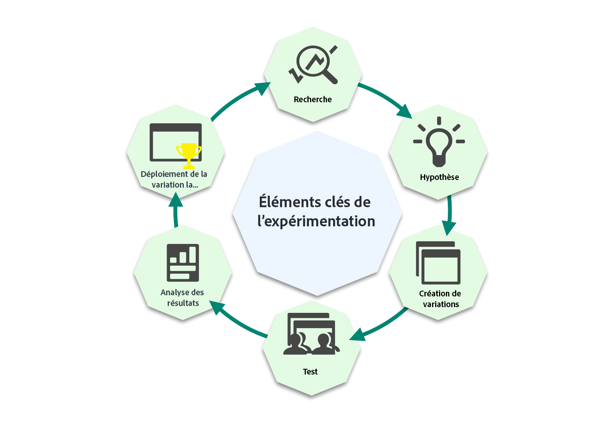
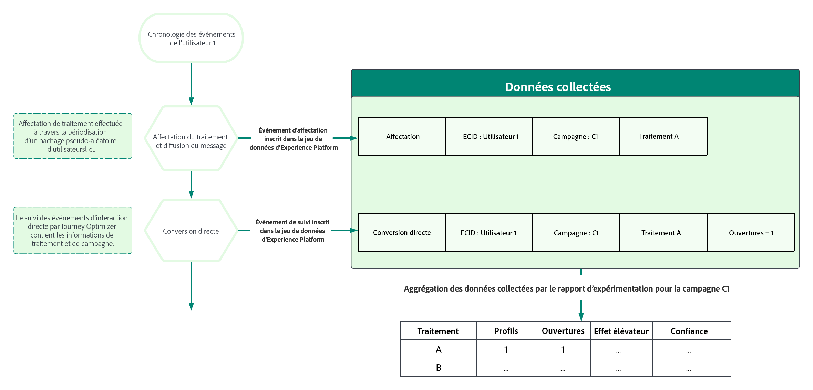
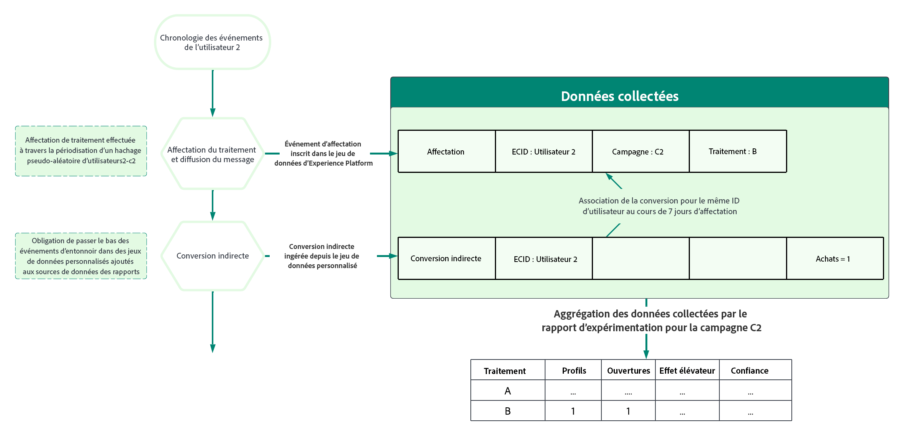
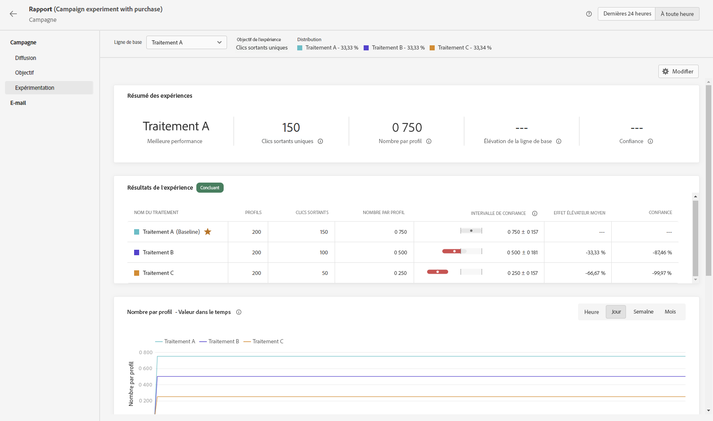

# Prise en main des expériences de contenu {#get-started-experiment}

## Qu’est-ce qu’une expérience de contenu ?

Les expériences de contenu vous permettent d’optimiser le contenu pour les actions de vos campagnes.

Les expériences sont un ensemble d’essais randomisés, ce qui, dans le cadre des tests en ligne, signifie que certains utilisateurs sélectionnés de manière aléatoire sont exposés à une variante donnée d’un message et un autre ensemble d’utilisateurs sélectionnés de manière aléatoire à un autre traitement. Après l’envoi du message, vous pouvez ensuite évaluer les mesures de résultats qui vous intéressent, par exemple les ouvertures d’e-mails ou les clics.

➡️ Un cas d’utilisation complet montrant comment utiliser des expériences de contenu pour comparer des décisions avec le canal d’expérience basé sur du code est présenté dans [cette section](../experience-decisioning/experience-decisioning-uc.md).

## Pourquoi exécuter des expériences ?

Les expériences vous permettent d’isoler les modifications qui entraînent des améliorations de vos mesures. Comme illustré dans l’image ci-dessus : certains utilisateurs sélectionnés de manière aléatoire sont exposés à chaque groupe de traitement, ce qui signifie qu’en moyenne, les groupes partagent les mêmes caractéristiques. Ainsi, toute différence de résultats peut être interprétée comme étant due aux différences dans les traitements reçus, c’est-à-dire que vous pouvez établir un lien de cause à effet entre les modifications que vous avez apportées et les résultats qui vous intéressent.

Cela vous permet de prendre des décisions axées sur les données pour optimiser vos objectifs commerciaux.

Pour des expériences de contenu dans Adobe Journey Optimizer, vous pouvez tester des idées telles que :

* **Ligne d’objet** : quel pourrait être l’impact d’une modification du ton ou du degré de personnalisation d’une ligne d’objet ?
* **Contenu du message** : la modification de la disposition visuelle d’un e-mail entraînera-t-elle un plus grand nombre de clics sur l’e-mail ?

## Comment fonctionne l’expérience de contenu ? {#content-experiment-work}

### Attribution aléatoire

L’expérimentation de contenu dans Adobe Journey Optimizer utilise un hachage pseudo-aléatoire de l’identité du visiteur pour affecter de manière aléatoire les utilisateurs de votre audience cible à l’un des traitements que vous avez définis. Le mécanisme de hachage garantit que, dans les scénarios où le visiteur entre plusieurs fois dans une campagne, il bénéficie du même traitement de manière déterministe.

En détail, l’algorithme MumurHash3 32 bits est utilisé pour hacher la chaîne d’identité de l’utilisateur dans l’un des 10 000 compartiments. Dans une expérience de contenu avec 50 % du trafic affecté à chaque traitement, les personnes qui entrent dans les compartiments 1 à 5 000 recevront le premier traitement, tandis que les utilisateurs qui se trouvent dans les compartiments 5 001 à 10 000 recevront le second traitement. Comme le hachage pseudo-aléatoire est utilisé, les divisions du visiteur que vous observez peuvent ne pas être exactement de 50 % d’une part et de l’autre ; néanmoins, le partage sera statistiquement équivalent à votre pourcentage de partage cible.

Notez que dans le cadre de la configuration de chaque campagne avec une expérience de contenu, vous devez choisir un espace de noms d’identité à partir duquel l’identifiant d’utilisateur sera sélectionné pour l’algorithme de randomisation. Cela est indépendant des [adresses d’exécution](../configuration/primary-email-addresses.md).

### Collecte et analyse de données

Au moment de l’affectation, c’est-à-dire lorsque le message est envoyé dans les canaux sortants, ou lorsque l’utilisateur accède à la campagne dans les canaux entrants, un « enregistrement d’affectation » est consigné dans le jeu de données système approprié. Cette action enregistre le traitement auquel l’utilisateur a été affecté, ainsi que les identifiants d’expérience et de campagne.

Les mesures d’objectif peuvent être regroupées en deux classes principales :

* Mesures directes : l’utilisateur réagit directement au traitement, par exemple en ouvrant un e-mail ou en cliquant sur un lien.
* Mesures indirectes ou « au bas de l’entonnoir », qui se produisent une fois que l’utilisateur a été exposé au traitement.

Pour les mesures objectives directes dans lesquelles Adobe Journey Optimizer effectue le suivi de vos messages, les événements de réponse des utilisateurs finaux sont automatiquement balisés avec les identifiants de la campagne et du traitement, ce qui permet une association directe de la mesure de réponse à un traitement. [En savoir plus sur le tracking](../email/message-tracking.md).

Pour les objectifs indirects ou en « bas d’entonnoir » tels que les achats, les événements de réponse des utilisateurs finaux ne sont pas balisés avec des identifiants de campagne et de traitement, c’est-à-dire qu’un événement d’achat se produit après l’exposition à un traitement, il n’y a aucune association directe de cet achat avec une affectation de traitement préalable. Pour ces mesures, Adobe associe le traitement à l’événement de conversion en bas d’entonnoir si :

* L’identité de l’utilisateur est la même au moment de l’affectation et de l’événement de conversion.
* La conversion se produit dans les sept jours qui suivent l’affectation du traitement.

Adobe Journey Optimizer utilise ensuite des méthodes statistiques avancées « lorsqu’elles sont valides » pour interpréter ces données de rapport brutes, ce qui vous permet d’interpréter vos rapports d’expérience. Pour plus d’informations, consultez [cette page](../content-management/experiment-calculations.md).

## Conseils pour exécuter des expériences

Lors de l’exécution d’expériences, il est important de suivre certaines des bonnes pratiques. Voici quelques conseils pour exécuter ces expériences :

+++Isolez les variables que vous essayez de tester.

Formulez une hypothèse que vous avez l’intention de tester et limitez cette hypothèse au minimum de modifications possibles afin de déterminer ce qui a eu un impact sur votre diffusion.

Par exemple, une bonne hypothèse peut être de savoir si la personnalisation de lignes d’objets des e-mails entraîne de meilleurs taux d’ouverture. Cependant, l’ajout d’une modification de contenu du message ou des images peut entraîner un résultat confus.
+++

+++Vérifiez que vous utilisez la mesure appropriée.

Déterminez la mesure que vous souhaitez cibler et si les modifications que vous apportez peuvent avoir un impact direct sur cette mesure.

Par exemple, il est peu probable que la modification du contenu du corps du message affecte les taux d’ouverture des e-mails.
+++

+++Effectuez votre test sur la bonne taille d’audience ou pour une durée suffisante.

Si vous exécutez vos tests plus longtemps, vous pourrez détecter de plus petites différences dans la mesure d’objectif entre les traitements. Cependant, si la valeur de base de votre mesure d’objectif est faible, vous aurez besoin de tailles d’échantillon plus grandes.
Le nombre d’utilisateurs qui doivent être inclus dans votre expérience dépend de la taille de l’effet que vous souhaitez détecter, de l&#39;écart ou de la propagation de votre mesure d’objectif, ainsi que de votre tolérance pour les erreurs Faux positifs et Faux négatifs. Dans les expériences classiques, vous pouvez utiliser une [calculatrice de taille d’échantillons](https://experienceleague.adobe.com/tools/calculator/testcalculator.html?lang=fr){_blank} pour déterminer la durée pendant laquelle vous devez exécuter votre test.
+++ 

+++Comprendre l’incertitude statistique

Si vous exécutez une expérience dans laquelle 1 000 utilisateurs ont vu un traitement et que le taux de conversion est défini à 5 %. S’agirait-il du taux de conversion réel si tous vos utilisateurs étaient inclus ? Quel serait le véritable taux de conversion ?
Les méthodes statistiques nous permettent de formaliser cette incertitude. L’un des concepts les plus importants à comprendre lors de l’exécution d’expériences en ligne est que les taux de conversion observés soient cohérents avec une plage de taux de conversion réels sous-jacents, ce qui signifie que vous devez attendre que ces estimations soient suffisamment précises, avant d’essayer de tirer une conclusion. Les intervalles de confiance et le degré de confiance nous aident à quantifier cette incertitude.
+++

+++Formuler de nouvelles hypothèses et effectuer des tests en continu

Pour obtenir de véritables informations d’entreprise, vous devez vous en tenir à une seule expérience. Au lieu de cela, poursuivez les expériences en formulant de nouvelles hypothèses et en effectuant de nouveaux tests avec différentes modifications, sur différentes audiences, et en examinant l’effet sur les différentes mesures.
+++

## Interpréter les résultats de vos expériences {#interpret-results}

>[!CONTEXTUALHELP]
>id="ajo_campaigns_content_experiment_summary"
>title="Widget Résumé"
>abstract="Le widget Résumé fournit un aperçu des résultats de votre expérience, y compris s’ils sont concluants ou non. Il offre un moyen rapide et facile de comprendre le résultat de votre expérience."

Cette section décrit les rapports d’expérience et aide à comprendre les différentes quantités statistiques présentées.

Voici quelques instructions pour interpréter les résultats de votre expérience de contenu.

Notez qu’une description complète des résultats doit tenir compte de toutes les preuves disponibles (c’est-à-dire la taille des échantillons, les taux de conversion, les intervalles de confiance, etc.), et pas seulement de la déclaration de résultat concluant ou non. Même lorsqu’un résultat n’est pas encore concluant, il peut encore y avoir des preuves convaincantes indiquant qu’un traitement est différent d’un autre.

Pour comprendre les calculs statistiques, reportez-vous à cette [page](../content-management/experiment-calculations.md).

### &#x200B;1. Comparer les mesures normalisées {#normalized-metrics}

Lorsque vous comparez les performances de deux traitements, vous devez toujours comparer les mesures normalisées afin de tenir compte des différences du nombre de profils exposés à chaque traitement.

Par exemple, si l’objectif de l’expérience est défini sur **[!UICONTROL Ouvertures uniques]**, et qu’un traitement donné a été présenté à 10 000 profils avec 200 ouvertures uniques enregistrées, cela représente un **[!UICONTROL taux de conversion]** de 2 %. Pour les mesures non uniques, par exemple la mesure Ouvertures, la mesure normalisée s’affiche sous la forme d’un **[!UICONTROL Nombre par profil]**, tandis que pour les mesures continues telles que le Prix total, la mesure normalisée s’affiche sous la forme d’un **[!UICONTROL Total par profil]**.

### &#x200B;2. Se concentrer sur les intervalles de confiance {#confidence-intervals}

Lorsque vous exécutez des expériences sur des échantillons de vos profils, le taux de conversion observé pour un traitement donné représente une estimation du taux de conversion sous-jacent réel.

Par exemple, si le traitement A a un **[!UICONTROL Taux de conversion]** de 3 %, alors que le traitement B a un **[!UICONTROL Taux de conversion]** de 2 %, le traitement A est-il plus performant que le traitement B ? Pour y répondre, nous devons d’abord quantifier l’incertitude de ces taux de conversion observés.

Les intervalles de confiance permettent de quantifier le degré d’incertitude dans les taux de conversion estimés, mais des intervalles de confiance plus larges impliquent plus d’incertitude. À mesure que davantage de profils seront ajoutés à l’expérience, les intervalles seront plus petits, représentant une estimation plus précise. L’intervalle de confiance représente une plage de taux de conversion compatibles avec les données observées.

Si les intervalles de confiance pour deux traitements se chevauchent à peine, cela signifie que les deux traitements ont des taux de conversion différents. Cependant, s’il y a beaucoup de chevauchement entre les intervalles de confiance pour deux traitements, il est plus probable que les deux traitements ont le même taux de conversion.

Adobe utilise des intervalles de confiance à 95 % valides à tout moment, ce qui signifie que les résultats peuvent être affichés en toute sécurité à tout moment pendant l’expérience.

### &#x200B;3. Comprendre l’effet élévateur {#understand-lift}

Le résumé du rapport d’expérience affiche le rapport d’**[!UICONTROL Effet élévateur sur la ligne de base]**, qui est une mesure de l’amélioration en pourcentage du taux de conversion d’un traitement donné par rapport à la ligne de base. Plus précisément, il s’agit de la différence de performance entre un traitement donné et la ligne de base, divisée par la performance de la ligne de base, exprimée en pourcentage.

### &#x200B;3. Comprendre le degré de confiance {#understand-confidence}

Bien que vous devriez principalement vous concentrer sur la variable **[!UICONTROL Intervalle de confiance]** pour ce qui est de la performance de chaque traitement, Adobe montre aussi le Degré de confiance, qui est une mesure probabiliste de la quantité de preuves démontrant qu’un traitement donné est le même que le traitement de la ligne de base. Un degré de confiance plus élevé indique que l’hypothèse selon laquelle les traitements de la ligne de base et ceux qui ne sont pas de la ligne de base aient des performances égales est moins probable. Plus précisément, le degré de confiance affiché est une probabilité (exprimée en pourcentage) que nous aurions observé une différence plus faible dans les taux de conversion entre un traitement donné et la ligne de base, si, en réalité, il n’y a aucune différence dans les taux de conversion sous-jacents réels. En termes de p-values, le degré de confiance affiché est 1 - p-value.

Adobe utilise des degrés de confiance « valides à tout moment » et des p-values « valides à tout moment » qui sont conformes aux séquences de confiance décrites ci-dessus.

### &#x200B;4. Signification statistique

Lors de l’exécution d’expériences, un résultat est considéré comme statistiquement significatif s’il était très peu probable qu’il ait été observé, compte tenu d’une hypothèse nulle selon laquelle un traitement donné et la ligne de base ont des taux de conversion/performances réels sous-jacents identiques.

Adobe déclare une expérience comme concluante lorsque le degré de confiance est supérieur à 95 %.

## Que faire après l’exécution d’une expérience

Après avoir exécuté votre expérience, plusieurs actions de suivi sont possibles :

* **Déployer des idées gagnantes**

  Avec un résultat sans ambiguïté, vous pouvez déployer cette idée gagnante, soit en remettant le traitement le plus performant à tous vos clients, ou en créant de nouvelles campagnes où la structure du traitement le plus performant est répliquée.
   Notez que dans un environnement dynamique, ce qui fonctionne bien à un moment donné, peut ne pas bien fonctionner plus tard.

* **Exécuter des tests de suivi**

  Parfois, les résultats de vos expériences peuvent ne pas être concluants, soit parce qu’il n’y avait pas suffisamment de profils inclus pour détecter une différence de traitement, ou alors parce que les traitements que vous avez définis n’étaient pas suffisamment différents.

  Si l’hypothèse que vous testez est toujours pertinente, effectuer un test de relance sur une audience plus grande ou différente, ou modifier vos traitements pour qu’il y ait des différences plus claires, serait la meilleure action de suivi.

* **Effectuer des analyses approfondies**

  Le traitement qui fonctionne bien pour une audience peut parfois ne pas être le meilleur traitement pour une autre. Effectuer des analyses plus approfondies sur la manière dont les traitements se comportent pour différentes audiences permet de trouver des idées pour de nouveaux tests.

  De même, l’étude des performances de chaque traitement avec des mesures différentes peut également donner une vue plus complète de vos expériences.

  >[!CAUTION]
  >
  >Plus d’analyses signifie une plus grande probabilité de détecter un effet indésirable, ou un faux positif.

## Ressources supplémentaires

* **[Créer des expériences de contenu](content-experiment.md)** : découvrez comment concevoir et configurer des tests A/B pour optimiser les performances de vos messages.
* **[Calculs d’expérience](experiment-calculations.md)** : comprenez les méthodes statistiques et les mesures utilisées dans l’analyse des expériences.
* **[Bandit manchot ou tests AB](mab-vs-ab.md)** : comparez différentes approches d’expérimentation et quand utiliser chaque méthode.
* **[Accélérateur d’expérience](experiment-accelerator-gs.md)** : découvrez comment accélérer l’expérimentation avec l’optimisation optimisée par l’IA.
* **[Calculs du rapport d’expérience](experiment-report-calculations.md)** : découvrez comment interpréter les résultats des expériences et la signification statistique.
* **[Tutoriels d’expérimentation](https://experienceleague.adobe.com/fr/docs/journey-optimizer-learn/tutorials/content-management/experimentation-overview){target="_blank"}** : consultez des tutoriels vidéo détaillés sur l’expérimentation de contenu et les bonnes pratiques.
