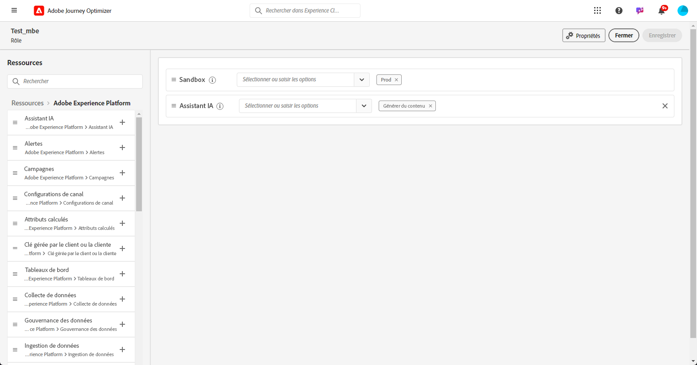

# Commencer avec l’assistant IA {#gs-content-assistant}

>[!CONTEXTUALHELP]
>id="ajo_ai_generation_settings"
>title="Assistant IA dans Journey Optimizer"
>abstract="Une fois que vous avez conçu et personnalisé votre diffusion, vous pouvez utiliser l’assistant IA de Journey Optimizer pour améliorer votre contenu. Cette fonctionnalité simplifie le processus de personnalisation et d’amélioration du contenu en vous permettant d’affiner le contenu à travers la description de ce que vous souhaitez générer."

>[!CONTEXTUALHELP]
>id="ajo_ai_generation_context"
>title="Charger une ressource de marque"
>abstract="Le menu Charger une ressource de marque permet d’ajouter une ressource de marque qui inclut du contenu capable de fournir un contexte supplémentaire à l’assistant IA dans Journey Optimizer. Il permet également de sélectionner une ressource de marque chargée antérieurement. Cette option permet de s’assurer que l’assistant IA a accès à tous les supports nécessaires pour améliorer ses fonctionnalités et sa pertinence."

>[!CONTEXTUALHELP]
>id="ajo_ai_generation_start"
>title="Conditions de l’IA générative d’Adobe"
>abstract="L’accès à cette fonctionnalité est soumis à votre accord des directives d’utilisation de l’IA générative d’Adobe Experience Cloud. Vous devez vérifier la précision des résultats produits par cette fonctionnalité et vous assurer qu’ils sont adaptés à votre cas d’utilisation."
>additional-url="https://www.adobe.com/fr/legal/licenses-terms/adobe-dx-gen-ai-user-guidelines.html" text="Directives d’utilisation de l’IA générative d’Adobe"

>[!INFO]
>
>Plongez dans une expérience pratique avec la [prévisualisation de notre fonctionnalité en direct](https://experienceleague.adobe.com/fr/apps/journey-optimizer/ai-assistant-content-accelerator){target="_blank"}, conçue pour explorer ses capacités en avant-première et comprendre pleinement ses possibilités.

L’Assistant IA dans Adobe Journey Optimizer, optimisé par Microsoft Azure OpenAI et Adobe Firefly, offre des suggestions de variations de contenu proactives pour le texte et les images. Cette nouvelle fonctionnalité permet la **génération de texte et d’images basée sur des prompts**. La génération d’images est gérée avec Adobe Firefly.

L’Assistant IA prend en charge la génération **dans plusieurs langues**, ce qui vous permet d’atteindre diverses audiences internationales et d’interagir avec elles. L’Assistant IA est disponible dans les langues suivantes :

<table style="table-layout:fixed; margin-top: 0px; margin-bottom: 0px;">
  <tbody>
    <tr style="border: 0;background-color: #FFFFFF;">
      <td>
        <ul>
          <li>Français</li>
          <li>Espagnol</li>
          <li>Allemand</li>
          <li>Italien</li>
        </ul>
      </td>
      <td>
        <ul>
          <li>Japonais</li>
          <li>Suédois</li>
          <li>Néerlandais</li>
          <li>Norvégien</li>
        </ul>
      </td>
      <td>
      </td>
    </tr>
  </tbody>
</table>

Utilisez l’assistant IA dans Adobe Journey Optimizer pour optimiser l’impact de vos messages en testant plusieurs images et titres. Générez plusieurs variantes et créez une expérience pour les comparer. L’**expérience de contenu Journey Optimizer** vous permet de définir plusieurs traitements de message afin de mesurer celui qui fonctionne le mieux pour votre audience cible. Vous pouvez choisir de varier le contenu ou l’objet de la diffusion. L’audience du message est attribuée de manière aléatoire à chaque traitement afin de déterminer laquelle fonctionne le mieux avec la mesure spécifiée. En savoir plus sur l’expérience de contenu dans [cette section](../content-management/content-experiment.md).

>[!IMPORTANT]
>
>* Avant de commencer à utiliser cette fonctionnalité, lisez la section connexe [Mécanismes de sécurisation et limitations](#generative-guardrails).
>
>
>* Vous devez accepter un [contrat d’utilisation](https://www.adobe.com/fr/legal/licenses-terms/adobe-dx-gen-ai-user-guidelines.html){target="_blank"} pour pouvoir utiliser l’assistant IA dans Adobe Journey Optimizer. Pour plus d’informations, contactez votre représentant ou représentante Adobe.

## Accéder à l’assistant IA {#generative-access}

Pour accéder à l’assistant IA dans Adobe Journey Optimizer, vous devez disposer de l’autorisation **Générer du contenu**. [En savoir plus](../administration/permissions.md)

+++  Découvrir comment attribuer des autorisations liées à la génération de contenu

1. Dans le produit **Autorisations**, accédez à l’onglet **Rôles** et sélectionnez le **Rôle** de votre choix.

1. Cliquez sur **Modifier** pour modifier les autorisations.

1. Ajoutez la ressource **Assistant IA**, puis sélectionnez **Générer du contenu** dans le menu déroulant.

   {zoomable="yes"}

1. Cliquez sur **Enregistrer** pour appliquer vos modifications.

   Les autorisations des personnes déjà affectées à ce rôle seront automatiquement mises à jour.

1. Pour attribuer ce rôle à de nouvelles personnes, accédez à l’onglet **Utilisateurs et utilisatrices** du tableau de bord **Rôles** et cliquez sur **Ajouter un utilisateur ou une utilisatrice**.

1. Saisissez le nom de la personne, son adresse e-mail ou choisissez dans la liste, puis cliquez sur **Enregistrer**.

1. Si le profil de l’utilisateur ou de l’utilisatrice n’a pas été créé auparavant, consultez cette [documentation](https://experienceleague.adobe.com/fr/docs/experience-platform/access-control/abac/permissions-ui/users).

La personne recevra un e-mail avec des instructions pour accéder à votre instance.

+++

## Mécanismes de sécurisation et limitations {#generative-guardrails}

Vous trouverez ci-dessous des instructions générales concernant l’utilisation de l’assistant IA dans Adobe Journey Optimizer pour la génération d’e-mails :

* La qualité du contenu généré est fortement influencée par l’objectif/le prompt marketing que vous définissez. Utilisez un prompt bien défini pour que le modèle GenAI soit correctement interprété. 
* Chargez les ressources de marque pour disposer de contenu exact sur la marque. Sinon, le contenu est basé sur des informations disponibles publiquement. Le contenu chargé peut se présenter sous les formats suivants : fichiers PDF, JPEG, PNG ou ZIP (avec les formats de fichiers pris en charge).
* La taille maximale des ressources de marque chargées est de 50 Mo. Des fichiers plus volumineux ou un grand nombre d’images peuvent être utilisés, mais le temps de traitement est plus long.
* Utilisez un modèle personnalisé ou spécifique à la marque pour créer votre contenu d’e-mail à l’aide de l’Assistant IA dans Adobe Journey Optimizer. Il est recommandé d’utiliser un modèle d’e-mail contenant jusqu’à 8 à 10 images.
* Veillez à signaler tout résultat problématique à l’aide des icônes de pouce vers le haut, de pouce vers le bas ou de drapeau lors de la sélection de variantes.
* Votre utilisation de l’assistant IA est soumise aux directives d’utilisation de l’IA générative d’Adobe Experience Cloud. [En savoir plus](https://www.adobe.com/fr/legal/licenses-terms/adobe-dx-gen-ai-user-guidelines.html)
* Dans le cadre de l’engagement d’Adobe à promouvoir la transparence dans l’utilisation des outils d’IA générative dans la création de médias, Adobe appliquera Content Credentials lorsque le contenu ou un projet qui incluait une ressource générée par un Firefly est téléchargé ou exporté. [En savoir plus](https://helpx.adobe.com/fr/firefly/using/content-credentials.html)

Les restrictions suivantes s’appliquent à l’Assistant IA dans Adobe Journey Optimizer :

* Uniquement disponible pour les canaux e-mail, notification push et SMS.
* Le contenu GenAI n’est peut-être pas toujours précis : partagez vos commentaires pour que nos ingénieures et ingénieurs puissent affiner les modèles.
* Vous pouvez charger plusieurs ressources de marque, mais vous ne pouvez en utiliser qu’une seule pour une génération spécifique.

## Fonctionnalités de génération de contenu de l’assistant IA {#generative-features}

<table style="table-layout:fixed"><tr style="border: 0;">
<td>

<a href="generative-full-content.md"><strong>Générer le contenu complet</strong></a>

</td>
<td>

<a href="generative-text.md"><strong>Générer du texte</strong>

</td>
<td>

<a href="generative-image.md"><strong>Générer des images</strong></a>

</td>
</tr></table>

## Ressources supplémentaires

* **[Expérimentation générative](generative-experimentation.md)** : découvrez comment combiner du contenu généré par l’IA avec l’expérimentation.
* **[Cas d’utilisation de l’assistant AI](generative-uc.md)** - Découvrez à travers les cas d’utilisation comment utiliser l’assistant AI
* **[Tutoriels sur l’Assistant IA](https://experienceleague.adobe.com/fr/docs/journey-optimizer-learn/tutorials/introduction-to-journey-optimizer/ai-assistant){target="_blank"}** : découvrez des tutoriels vidéo détaillés sur les fonctionnalités et les bonnes pratiques de l’Assistant IA.
