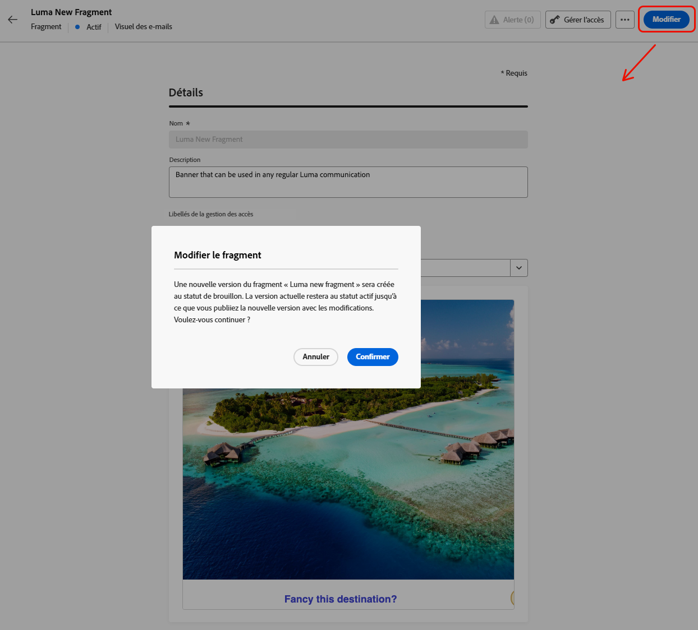

# Ajouter des attributs contextuels aux fragments publiés {#adding-contextual-attributes}

>[!AVAILABILITY]
>
>Cette fonctionnalité n’est disponible que pour certains clients et implique des risques importants. Vérifiez auprès de votre représentant Adobe que cette fonctionnalité est activée pour votre organisation.

Par défaut, l’ajout de nouveaux [attributs de personnalisation](../personalization/personalization-build-expressions.md) à un fragment publié n’est pas pris en charge. Une fois qu’un fragment est publié, l’ensemble des attributs de profil ou contextuels est verrouillé pour toutes les campagnes et tous les parcours.

Cependant, pour certains clients et clientes, il est possible d’ajouter des **attributs contextuels** uniquement aux fragments publiés.

>[!WARNING]
>
>Lors de l’ajout d’attributs de personnalisation à un fragment publié, le processus de validation est moins rigoureux et les erreurs peuvent ne pas être détectées. Cela peut entraîner des ruptures inattendues dans les parcours et les campagnes utilisant ce fragment à grande échelle.

## Mécanismes de sécurisation et limitations {#limitations}

* Assurez-vous que tous les parcours et campagnes qui utilisent actuellement le fragment peuvent gérer les nouveaux attributs contextuels.
* Les attributs de profil ne peuvent pas être ajoutés aux fragments publiés. Seuls les attributs contextuels sont pris en charge.
* Les attributs contextuels doivent être saisis manuellement dans l’éditeur de code ; ils ne peuvent pas être sélectionnés dans l’interface utilisateur de l’éditeur de personnalisation.
* Lors de l’ajout d’attributs personnalisés à des fragments actifs, les validations sont relâchées, ce qui signifie que les erreurs peuvent ne pas être détectées et pourraient entraîner des ruptures involontaires à grande échelle.
* Une fois publiée, toute erreur aura un impact immédiat sur toutes les communications utilisant ce fragment.

## Ajouter des attributs contextuels {#add-contextual-attributes}

Pour ajouter des attributs contextuels à un fragment publié, procédez comme suit.

>[!IMPORTANT]
>
>Ne poursuivez que si vous [comprenez pleinement les impacts](#limitations) sur les parcours et les campagnes référençant le fragment.

1. Accédez à **[!UICONTROL Gestion de contenu]** > **[!UICONTROL Fragments]**.

1. Sélectionnez le fragment publié et cliquez sur **[!UICONTROL Modifier]** pour créer un brouillon.

   {width="70%" align="left"}

1. Cliquez sur **[!UICONTROL Modifier]** pour ouvrir l’éditeur de contenu de fragment.

1. Basculez vers **[!UICONTROL Éditeur de code]** ou **[!UICONTROL Mode avancé]** dans l’éditeur de personnalisation.

1. Saisissez ou copiez-collez manuellement l’attribut contextuel à l’aide de la syntaxe `{{context.attribute_name}}` :

   Exemple pour un attribut `promotionCode` :

   ```
   {{context.promotionCode}}
   ```

   >[!CAUTION]
   >
   >Vérifiez deux fois le chemin d’accès de l’attribut pour plus de précision. Les erreurs peuvent ne pas être détectées et perturber les communications du parcours ou de la campagne à grande échelle.

1. Enregistrez vos modifications.

1. Une fois les modifications confirmées, cliquez sur **[!UICONTROL Publier]** pour les publier.

>[!NOTE]
>Pour éviter des pannes inattendues entre les parcours et les campagnes, vous pouvez tester les chemins d’accès aux attributs contextuels dans un environnement hors production.

## Rubriques connexes {#related-topics}

* [Gérer les fragments](manage-fragments.md)
* [Modifier un fragment](manage-fragments.md#edit-fragments)
* [Campagnes déclenchées par API](../campaigns/api-triggered-campaigns.md)
* [Syntaxe de personnalisation](../personalization/personalization-syntax.md)

