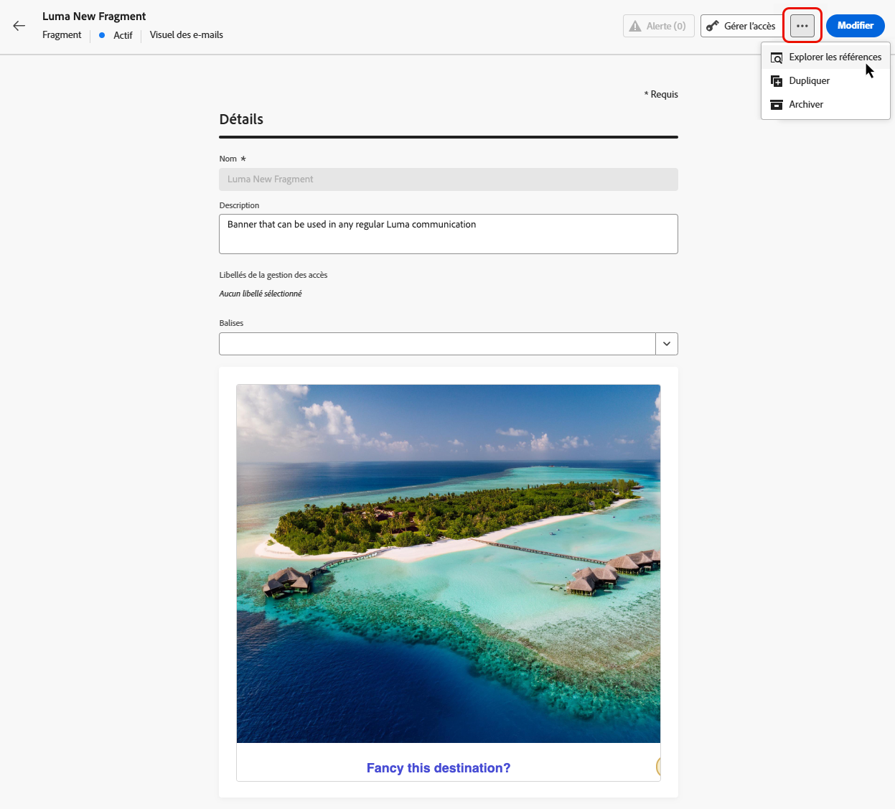
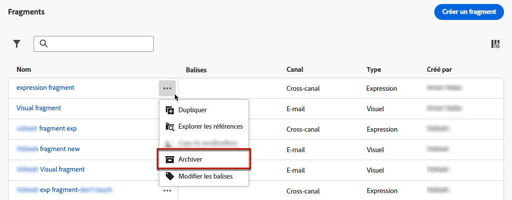

# Gérer les fragments {#manage-fragments}

## Accéder aux fragments {#access-fragments}

Pour gérer vos fragments, accédez à la liste des fragments à partir du menu de gauche **[!UICONTROL Gestion de contenu]** > **[!UICONTROL Fragments]**.

Tous les fragments qui ont été créés sur le sandbox actuel, soit [à partir du menu **[!UICONTROL Fragments]**](create-fragments.md#create-fragments), soit à l’aide de l’option [Enregistrer en tant que fragment](save-fragments.md), s’affichent.

Dans le volet de gauche, vous pouvez organiser les fragments en dossiers. Par défaut, tous les fragments s’affichent. Lorsque vous sélectionnez un dossier, seuls les fragments et les dossiers qu’il contient s’affichent. [En savoir plus](#folders)

Pour trouver un élément spécifique, commencez à saisir un nom dans le champ de recherche. Lorsqu’un [dossier](#folders) est sélectionné, la recherche s’applique à tous les fragments ou dossiers du premier niveau de hiérarchie de ce dossier<!--(not nested items)-->.

Vous pouvez filtrer les fragments en fonction des éléments suivants :

* Statut (Brouillon ou Actif)
* Type (visuel ou d’expression)
* Date de création ou de modification
* État (archivé ou non)
* Balises

{width="90%" align="left"}

Vous pouvez choisir d’afficher tous les fragments ou uniquement les éléments créés ou modifiés par la personne y ayant accès.

Cliquez sur le bouton **[!UICONTROL Plus d’actions]** en regard de chaque fragment pour effectuer les opérations suivantes :

* L’ajouter à un package pour l’export. [En savoir plus](#export)
* Si un fragment actif est en cours de modification, ouvrir le brouillon de ce fragment. [En savoir plus](#edit-fragments)
* Dupliquer le fragment.
* Utilisez l’option **[!UICONTROL Explorer les références]** pour afficher les parcours, les campagnes ou les modèles dans lesquels ils sont utilisés. [En savoir plus](#explore-references)
* Archiver le fragment. [En savoir plus](#archive-fragments)
* Modifier les balises du fragment. [Découvrir comment utiliser les balises unifiées](../start/search-filter-categorize.md#tags)
* Déplacez le fragment vers un dossier. [En savoir plus](#folders)

## Utiliser des dossiers pour gérer les fragments {#folders}

>[!CONTEXTUALHELP]
>id="ajo_fragments_folders"
>title="Organiser les fragments dans des dossiers"
>abstract="Utilisez des dossiers pour classer et gérer vos fragments en fonction des besoins de votre organisation."

Pour naviguer facilement dans vos fragments, vous pouvez utiliser des dossiers pour mieux les organiser dans une hiérarchie structurée. Vous pouvez ainsi classer et gérer les éléments en fonction des besoins de votre organisation.

1. Cliquez sur le bouton **[!UICONTROL Tous les fragments]** pour afficher tous les éléments créés précédemment sans le regroupement de dossiers.

1. Cliquez sur le dossier **[!UICONTROL racine]** pour afficher tous les dossiers créés.

   >[!NOTE]
   >
   >Si vous n’avez pas encore créé de dossier, tous les fragments s’affichent.

1. Cliquez sur n’importe quel dossier à l’intérieur du dossier **[!UICONTROL racine]** pour afficher son contenu.

1. Cliquez sur le dossier **[!UICONTROL racine]** ou sur n’importe quel autre dossier pour afficher le bouton **[!DNL Create folder]**. Sélectionnez-le.

   

1. Saisissez le nom du nouveau dossier, puis cliquez sur **[!UICONTROL Enregistrer]**. Le nouveau dossier s’affiche en haut de la liste des fragments dans le dossier **[!UICONTROL racine]** ou dans le dossier actuellement sélectionné.

1. Vous pouvez cliquer sur le bouton **[!UICONTROL Plus d’actions]** pour renommer ou supprimer le dossier.

   

1. Le bouton **[!UICONTROL Plus d’actions]** vous permet de également déplacer le fragment vers un autre dossier existant.

   <!---->

1. Vous pouvez maintenant accéder au dossier que vous venez de créer. Chaque nouveau fragment que vous [créez](create-fragments.md) ici est enregistré dans le dossier actif.

   

## Statuts des fragments {#fragments-statuses}

>[!CONTEXTUALHELP]
>id="ajo_fragment_statuses"
>title="Nouveaux statuts de fragments"
>abstract="Depuis que les statuts **Brouillon** et **Actif** ont été introduits avec la version de juin de Journey Optimizer, tous les fragments créés avant cette version ont le statut **Brouillon**, même s’ils sont utilisés dans un parcours ou une campagne. Si vous apportez des modifications à ces fragments, vous devez les publier pour les rendre **Actifs** et propager les modifications aux campagnes et parcours associés. Vous devez également créer une version de parcours/campagne et la publier.  La publication requiert l’autorisation utilisateur <a href="https://experienceleague.adobe.com/fr/docs/journey-optimizer/using/access-control/ootb-product-profiles#content-library-manage">Publier un fragment</a>."
>additional-url="https://experienceleague.adobe.com/fr/docs/journey-optimizer/using/access-control/ootb-product-profiles#content-library-manager" text="En savoir plus sur les autorisations des fragments de contenu"

Les fragments peuvent avoir plusieurs statuts :

* **[!UICONTROL Brouillon]** : le fragment est en cours de modification et n’a pas été approuvé.

* **[!UICONTROL Actif]** : le fragment a été approuvé et est actif. [Découvrir comment publier un fragment](../content-management/create-fragments.md#publish)

  Lorsqu’un fragment actif est en cours de modification, une icône spécifique s’affiche à côté de son statut. Cliquez sur cette icône pour ouvrir la version brouillon du fragment.

* **[!UICONTROL Publication]** : le fragment a été approuvé et est en cours de publication.
* **[!UICONTROL Archivé]** : le fragment a été archivé. [Découvrir comment archiver des fragments](#archive-fragments)

>[!CAUTION]
>
>Depuis l’ajout des statuts **Brouillon** et **Actif** dans la version de juin 2024 de Journey Optimizer, tous les fragments créés avant cette version ont le statut **Brouillon**, même s’ils sont utilisés dans un parcours ou une campagne. Si vous apportez des modifications à ces fragments, vous devez les publier pour les rendre **Actifs** et propager les modifications aux campagnes et parcours associés. Vous devez également créer une version de parcours/campagne et la publier. La publication requiert l’autorisation utilisateur [Publier un fragment](../administration/ootb-product-profiles.md#content-library-manager).

## Modifier un fragment {#edit-fragments}

>[!CONTEXTUALHELP]
>id="ajo_fragments_update_campaigns"
>title="Mise à jour des fragments dans les campagnes"
>abstract="Cette campagne ne sera pas mise à jour si vous publiez des modifications dans le fragment. Une nouvelle version doit être publiée afin que la fonctionnalité de mise à jour des fragments puisse être prise en charge."

>[!CONTEXTUALHELP]
>id="ajo_fragments_update_journeys"
>title="Mise à jour des fragments dans les parcours"
>abstract="Ce parcours ne sera pas mis à jour si vous publiez des modifications dans le fragment. Une nouvelle version doit être publiée afin que la fonctionnalité de mise à jour des fragments puisse être prise en charge."

Pour modifier un fragment, procédez comme suit.

1. Cliquez sur le fragment de votre choix dans la liste **[!UICONTROL Fragments]**. L’écran des propriétés du fragment s’ouvre avec un aperçu de son contenu.

1. Vous pouvez vérifier la liste des parcours, campagnes et modèles de contenu dans lesquels le fragment est actuellement utilisé. Pour ce faire, sélectionnez l’option **[!UICONTROL Explorer les références]** à partir du bouton Plus d’actions. [En savoir plus](#explore-references)

1. Si le fragment en cours de modification a le statut **[!UICONTROL Actif]**, cliquez sur le bouton **[!UICONTROL Modifier]** pour créer une version brouillon du fragment. Cliquez sur **[!UICONTROL Confirmer]**.

   {width="70%" align="left"}

   >[!NOTE]
   >
   >La version actuelle du fragment reste active jusqu’à ce que vous publiiez la nouvelle version mise à jour.

1. Apportez les modifications souhaitées aux détails du fragment, si nécessaire.

1. Pour modifier le contenu du fragment, cliquez sur le bouton **[!UICONTROL Modifier]**, puis mettez à jour votre contenu comme vous le feriez lors de la création d’un fragment à partir de zéro. [Découvrir comment créer un fragment](create-fragments.md#content)

   {width="70%" align="left"}

   >[!NOTE]
   >
   >Lors de la modification d’un fragment publié, vous pouvez supprimer n’importe quel champ de personnalisation, mais vous ne pouvez pas en ajouter de nouveaux au contenu du fragment. Si vous souhaitez ajouter des attributs personnalisés, vous devez dupliquer le fragment. [En savoir plus](#adding-new-attributes)

1. Une fois vos modifications prêtes, enregistrez-les et cliquez sur le bouton **[!UICONTROL Publier]** pour rendre vos modifications actives. [En savoir plus](create-fragments.md#publish)

Lorsque vous apportez des modifications à un fragment, celles-ci sont automatiquement répercutées sur tous les contenus utilisant ce fragment, y compris les campagnes et parcours actifs, sauf pour les contenus dont l’héritage du fragment original a été rompu.

>[!NOTE]
>
>Découvrez comment rompre l’héritage dans les sections [Ajouter des fragments visuels à vos e-mails](../email/use-visual-fragments.md#break-inheritance) et [Utiliser des fragments d’expression](../personalization/use-expression-fragments.md#break-inheritance).

### Ajouter de nouveaux attributs à un fragment actif {#adding-new-attributes}

>[!WARNING]
>
>L’ajout de nouveaux [attributs personnalisés](../personalization/personalization-build-expressions.md) à un fragment actif n’est pas pris en charge.

Une fois qu’un fragment est publié, l’ensemble des attributs personnalisés ou contextuels est verrouillé pour toutes les campagnes et tous les parcours qui y font référence.

Pour incorporer des attributs supplémentaires à un fragment actif, procédez comme suit.

1. Dupliquez le fragment existant à l’aide du bouton **[!UICONTROL Autres actions]**.

   {width="70%" align="left"}

1. Sélectionnez le fragment dupliqué pour l’ouvrir et cliquez sur le bouton **[!UICONTROL Modifier]**.

1. [Ajoutez les nouveaux attributs souhaités](../personalization/personalization-build-expressions.md#add) au fragment dupliqué, tels que les champs de personnalisation.

   {width="70%" align="left"}

1. Enregistrez vos modifications et publiez le nouveau fragment. [Voici comment procéder](create-fragments.md#publish)

1. Mettez à jour les campagnes ou les parcours pour référencer le fragment mis à jour dans lequel les nouveaux attributs ont été ajoutés.

   * [Découvrir comment utiliser des fragments visuels](../email/use-visual-fragments.md)
   * [Découvrir comment utiliser des fragments d’expression](../personalization/use-expression-fragments.md)

## Explorer les références {#explore-references}

Vous pouvez afficher la liste des parcours, des campagnes et des modèles de contenu qui utilisent actuellement un fragment. Pour ce faire, sélectionnez **[!UICONTROL Explorer les références]**, soit à partir du menu **[!UICONTROL Autres actions]** dans la liste des fragments, soit dans l’écran des propriétés du fragment.

{width="70%" align="left"}

Sélectionnez un onglet pour basculer entre les parcours, les campagnes, les modèles et les fragments. Vous pouvez voir leur statut et cliquer sur un nom pour le rediriger vers l’élément correspondant où le fragment est référencé.

{width="70%" align="left"}

>[!NOTE]
>
>Si le fragment est utilisé dans un parcours, une campagne ou un modèle dont le libellé vous empêche l’accès, un message d’alerte s’affiche en haut de l’onglet sélectionné. [En savoir plus sur le contrôle d’accès au niveau de l’objet (OLAC)](../administration/object-based-access.md)

## Archiver des fragments {#archive-fragments}

Vous pouvez supprimer de la liste des fragments des éléments qui ne sont plus pertinents pour votre marque.

Pour ce faire, cliquez sur l’icône **[!UICONTROL Plus d’actions]** en regard du fragment souhaité, puis sélectionnez **[!UICONTROL Archiver]**. Il disparaîtra de la liste des fragments, ce qui empêche leur utilisation dans les futurs e-mails ou modèles.

{width="70%" align="left"}

>[!NOTE]
>
>Si vous archivez un fragment utilisé dans un contenu, <!--it will remain in the email or template, but you won't be able to select it from the fragment list to edit it-->ce contenu ne sera pas affecté.

Pour désarchiver un fragment, filtrez sur les éléments **[!UICONTROL archivés]** et sélectionnez **[!UICONTROL Désarchiver]** dans le menu **[!UICONTROL Autres actions]**. Le fragment est à nouveau accessible à partir de la liste des fragments et peut être utilisé dans n’importe quel e-mail ou modèle.

{width="70%" align="left"}

## Exporter des fragments vers un autre sandbox {#export}

Journey Optimizer vous permet de copier un fragment d’un sandbox à un autre. Par exemple, vous pouvez copier un fragment de votre sandbox d’évaluation vers votre sandbox de production.

Le processus de copie est réalisé via un **import et un export de package** entre les sandbox source et cible. Des informations détaillées sur l’export d’objets et leur import dans un sandbox cible sont disponibles dans cette section : [Copier des objets vers un autre sandbox](../configuration/copy-objects-to-sandbox.md).
