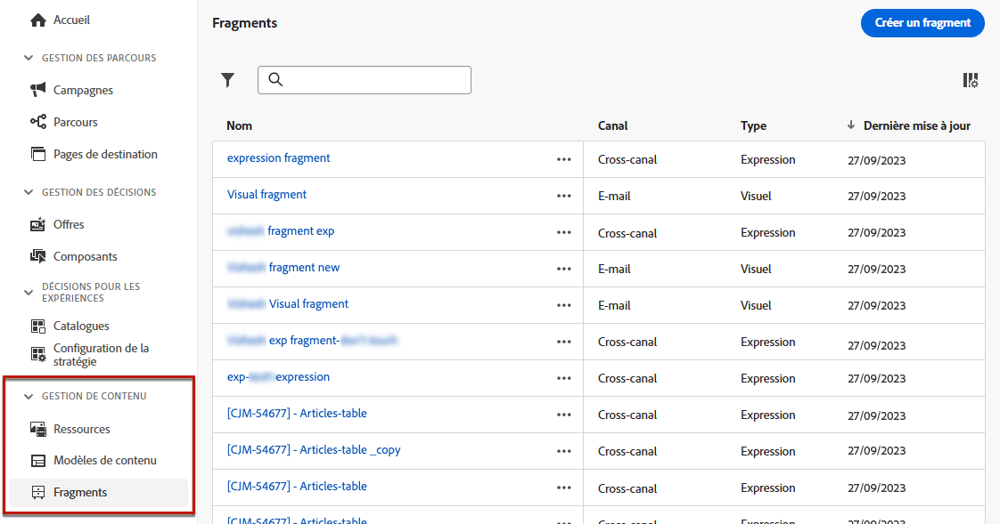
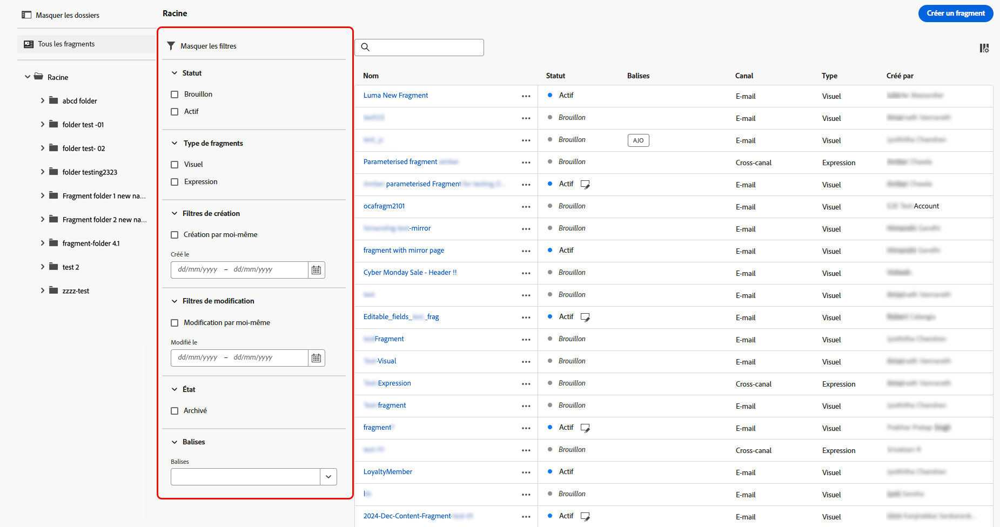

# Gestion des fragments {#manage-fragments}

Pour gérer vos fragments, accédez à la liste des fragments à partir du **[!UICONTROL Gestion de contenu]** > **[!UICONTROL Fragments]** menu de gauche.

Tous les fragments qui ont été créés sur le sandbox actuel, soit [à partir du menu **[!UICONTROL Fragments]**](#create-fragments), soit à l’aide de l’option [Enregistrer en tant que fragment](#save-as-fragment), s’affichent.

Vous pouvez filtrer les fragments selon leur :

* Type : **[!UICONTROL visuel]** ou d’**[!UICONTROL expression]**
* Balises
* Date de création ou de modification

Vous pouvez choisir d’afficher tous les fragments ou uniquement les éléments créés ou modifiés par la personne actuelle.

Vous pouvez également afficher les fragments **[!UICONTROL archivés]**. [En savoir plus](#archive-fragments).

Cliquez sur le bouton **[!UICONTROL Plus d’actions]** en regard de chaque fragment pour effectuer les opérations suivantes :

* Dupliquer un fragment.

* Utilisez l’option **[!UICONTROL Explorer les références]** pour afficher les parcours, les campagnes ou les modèles dans lesquels ils sont utilisés. [En savoir plus](#explore-references).

* Archiver un fragment. [En savoir plus](#archive-fragments).

* Modifier les [balises](../start/search-filter-categorize.md#tags) d’un fragment.

## Modifier des fragments {#edit-fragments}

Pour modifier un fragment, procédez comme suit.

1. Cliquez sur l’élément de votre choix dans la liste **[!UICONTROL Fragments]**.
1. À partir des propriétés du fragment, vous pouvez [explorer les références](#explore-references), [gérer son accès](../administration/object-based-access.md) et mettre à jour les détails du fragment, y compris les [balises](../start/search-filter-categorize.md#tags).

   

1. Sélectionnez le bouton correspondant pour modifier le contenu comme vous le feriez lors de la création d’un fragment à partir de zéro. [En savoir plus](#create-from-scratch).

>[!NOTE]
>
>Lorsque vous modifiez un fragment, les modifications sont automatiquement propagées à tous les contenus à l’aide de ce fragment, à l’exception du contenu utilisé dans les parcours ou campagnes **[!UICONTROL dynamiques]**. Vous pouvez également rompre l’héritage du fragment d’origine. En savoir plus dans les sections [Ajouter des fragments visuels à vos e-mails](../email/use-visual-fragments.md#break-inheritance) et [Utiliser des fragments d’expression](../personalization/use-expression-fragments.md#break-inheritance).

## Explorer les références {#explore-references}

Vous pouvez afficher la liste des parcours, campagnes et modèles de contenu qui utilisent actuellement un fragment.

Pour ce faire, sélectionnez **[!UICONTROL Explorer les références]**, soit à partir du menu **[!UICONTROL Autres actions]** dans la liste des fragments ou dans l’écran des propriétés du fragment.

Sélectionnez un onglet pour basculer entre les parcours, les campagnes, les modèles et les fragments. Vous pouvez voir leur statut et cliquer sur un nom pour le rediriger vers l’élément correspondant où le fragment est référencé.

>[!NOTE]
>
>Si le fragment est utilisé dans un parcours, une campagne ou un modèle dont le libellé vous empêche l’accès, un message d’alerte s’affiche en haut de l’onglet sélectionné. [En savoir plus sur le contrôle d’accès au niveau de l’objet (OLAC)](../administration/object-based-access.md)

## Archiver des fragments {#archive-fragments}

Vous pouvez supprimer de la liste des fragments des éléments qui ne sont plus pertinents pour votre marque.

Pour ce faire, cliquez sur l’icône **[!UICONTROL Plus d’actions]** en regard du fragment souhaité, puis sélectionnez **[!UICONTROL Archiver]**. Il disparaîtra de la liste des fragments, ce qui empêche leur utilisation dans les futurs e-mails ou modèles.

>[!NOTE]
>
>Si vous archivez un fragment utilisé dans un contenu, <!--it will remain in the email or template, but you won't be able to select it from the fragment list to edit it-->ce contenu ne sera pas affecté.

Pour désarchiver un fragment, filtrez sur les éléments **[!UICONTROL archivés]** et sélectionnez **[!UICONTROL Désarchiver]** dans le menu **[!UICONTROL Autres actions]**. Le fragment est à nouveau accessible à partir de la liste des fragments et peut être utilisé dans n’importe quel e-mail ou modèle.

