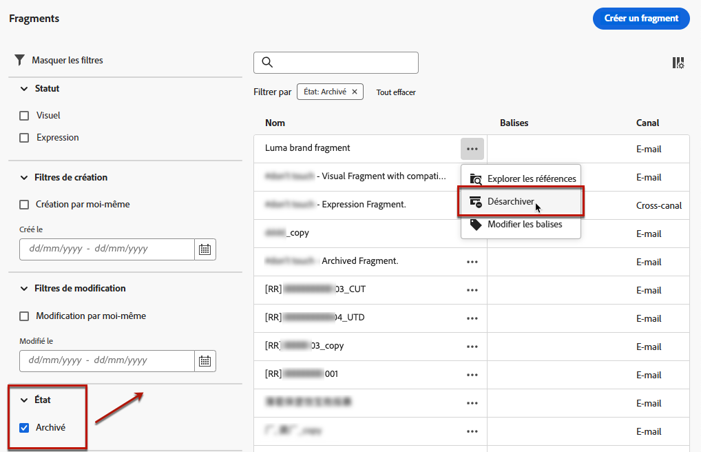

# Gérer les fragments {#manage-fragments}

Pour gérer vos fragments, accédez à la liste des fragments à partir du menu de gauche **[!UICONTROL Gestion de contenu]** > **[!UICONTROL Fragments]**.

Tous les fragments qui ont été créés sur le sandbox actuel, soit [à partir du menu **[!UICONTROL Fragments]**](#create-fragments), soit à l’aide de l’option [Enregistrer en tant que fragment](#save-as-fragment), s’affichent.

Vous pouvez filtrer les fragments selon leur :

* État (brouillon ou actif)
* Type (visuel ou expression)
* Date de création ou de modification
* Etat (archivé ou non)
* Balises

Vous pouvez également choisir d’afficher tous les fragments ou uniquement les éléments créés ou modifiés par l’utilisateur actuel.

Cliquez sur le bouton **[!UICONTROL Plus d’actions]** en regard de chaque fragment pour effectuer les opérations suivantes :

* Dupliquer un fragment.
* Utilisez l’option **[!UICONTROL Explorer les références]** pour afficher les parcours, les campagnes ou les modèles dans lesquels ils sont utilisés. [En savoir plus](#explore-references).
* Archiver un fragment. [En savoir plus](#archive-fragments).
* Modification des balises d’un fragment [Découvrez comment utiliser les balises unifiées](../start/search-filter-categorize.md#tags).

## Statuts des fragments

>[!CONTEXTUALHELP]
>id="ajo_fragment_statuses"
>title="Nouveaux statuts de fragments"
>abstract="Depuis que les status **Brouillon** et **Actif** ont été introduits avec la version de juin de Journey Optimizer, tous les fragments créés avant cette version ont le statut « Brouillon », même s’ils sont utilisés dans un parcours ou une campagne. Si vous apportez des modifications à ces fragments, vous devez les publier pour les rendre « Actif » et propager les modifications aux campagnes et parcours associés. Vous devez également créer une version de parcours/campagne et la publier. La publication nécessite une autorisation de l’utilisateur ou de l’utilisatrice."

>[!AVAILABILITY]
>
> Notez que les statuts des fragments sont déployés progressivement au cours des jours qui suivent la publication de Journey Optimizer en juin. Bien que certains utilisateurs disposent d’un accès immédiat, d’autres peuvent rencontrer un délai avant qu’il ne soit disponible dans leur environnement. Si cette amélioration n’est pas encore disponible dans votre environnement, veuillez noter que le fragment ne doit pas obligatoirement être **En direct** à utiliser dans vos parcours et campagnes.

Les fragments peuvent avoir plusieurs états :

* **[!UICONTROL Version préliminaire]**: le fragment est en édition et n’a pas été approuvé.

* **[!UICONTROL En direct]**: le fragment a été approuvé et est actif. [Découvrez comment publier un fragment](../content-management/create-fragments.md#publish)

  Lorsqu’un fragment actif est en cours de modification, une icône spécifique s’affiche en regard de son état. Cliquez sur cette icône pour ouvrir la version préliminaire du fragment.

* **[!UICONTROL Publication]**: le fragment a été approuvé et est en cours de publication.
* **[!UICONTROL Archivé]**: le fragment a été archivé. [Découvrez comment archiver des fragments](#archive-fragments)

>[!CAUTION]
>
>Depuis que les status **Brouillon** et **Actif** ont été introduits avec la version de juin de Journey Optimizer, tous les fragments créés avant cette version ont le statut « Brouillon », même s’ils sont utilisés dans un parcours ou une campagne. Si vous apportez des modifications à ces fragments, vous devez les publier pour les rendre « Actif » et propager les modifications aux campagnes et parcours associés. Vous devez également créer une version de parcours/campagne et la publier. La publication nécessite une autorisation de l’utilisateur ou de l’utilisatrice.

## Modifier des fragments {#edit-fragments}

Pour modifier un fragment, procédez comme suit.

1. Cliquez sur le fragment de votre choix dans la **[!UICONTROL Fragments]** liste.

1. Les propriétés du fragment s’ouvrent avec un aperçu de son contenu.

1. Si le fragment en cours de modification a la valeur **En direct** , cliquez sur le bouton **Modifier** pour créer une version préliminaire du fragment. La version actuelle du fragment reste active jusqu’à ce que vous publiiez la version préliminaire.

1. Apportez les modifications souhaitées au fragment. Pour modifier son contenu, cliquez sur le bouton **Modifier** puis modifiez votre contenu comme vous le feriez lors de la création d’un fragment à partir de zéro. [Découvrez comment créer un fragment](#create-from-scratch)

   >[!NOTE]
   >
   >Lors de la modification d’un fragment d’expression, vous pouvez supprimer tout champ de personnalisation, mais vous ne pouvez pas en ajouter de nouveaux au contenu du fragment. Si vous souhaitez ajouter des champs de personnalisation, dupliquez le fragment afin d&#39;en créer un nouveau.

   Vous pouvez également vérifier la liste des parcours, campagnes et modèles de contenu dans lesquels le fragment est actuellement utilisé en sélectionnant l’option **Références d’Explorateur** . [En savoir plus](#explore-references)

   

1. Une fois vos modifications prêtes, cliquez sur le bouton **Publier** pour rendre vos modifications actives.

Lorsque vous modifiez un fragment, les modifications sont automatiquement propagées à tout le contenu utilisant ce fragment, y compris les parcours actifs et les campagnes, à l’exception des contenus dont l’héritage du fragment d’origine a été rompu. Découvrez comment rompre l’héritage dans le [Ajout de fragments visuels à vos emails](../email/use-visual-fragments.md#break-inheritance) et [Utilisation des fragments d’expression](../personalization/use-expression-fragments.md#break-inheritance) sections.

>[!AVAILABILITY]
>
>Notez que la propagation des modifications de fragments dans les parcours en direct et les campagnes est en cours de déploiement graduel au cours des quelques jours suivant la publication de Journey Optimizer en juin. Bien que certains utilisateurs disposent d’un accès immédiat, d’autres peuvent rencontrer un délai avant qu’il ne soit disponible dans leur environnement. Si cette amélioration n’est pas encore disponible dans votre environnement, vos modifications ne seront pas propagées au contenu utilisé dans les parcours ou campagnes actifs.

## Explorer les références {#explore-references}

Vous pouvez afficher la liste des parcours, campagnes et modèles de contenu qui utilisent actuellement un fragment. Pour ce faire, sélectionnez **[!UICONTROL Explorer les références]**, soit à partir du menu **[!UICONTROL Autres actions]** dans la liste des fragments ou dans l’écran des propriétés du fragment.

Sélectionnez un onglet pour basculer entre les parcours, les campagnes, les modèles et les fragments. Vous pouvez voir leur statut et cliquer sur un nom pour le rediriger vers l’élément correspondant où le fragment est référencé.

>[!NOTE]
>
>Si le fragment est utilisé dans un parcours, une campagne ou un modèle dont le libellé vous empêche l’accès, un message d’alerte s’affiche en haut de l’onglet sélectionné. [En savoir plus sur le contrôle d’accès au niveau de l’objet (OLAC)](../administration/object-based-access.md)

## Archiver des fragments {#archive-fragments}

Vous pouvez supprimer de la liste des fragments des éléments qui ne sont plus pertinents pour votre marque.

Pour ce faire, cliquez sur l’icône **[!UICONTROL Plus d’actions]** en regard du fragment souhaité, puis sélectionnez **[!UICONTROL Archiver]**. Il disparaîtra de la liste des fragments, ce qui empêche leur utilisation dans les futurs e-mails ou modèles.

>[!NOTE]
>
>Si vous archivez un fragment utilisé dans un contenu, <!--it will remain in the email or template, but you won't be able to select it from the fragment list to edit it-->ce contenu ne sera pas affecté.

Pour désarchiver un fragment, filtrez sur les éléments **[!UICONTROL archivés]** et sélectionnez **[!UICONTROL Désarchiver]** dans le menu **[!UICONTROL Autres actions]**. Le fragment est à nouveau accessible à partir de la liste des fragments et peut être utilisé dans n’importe quel e-mail ou modèle.

