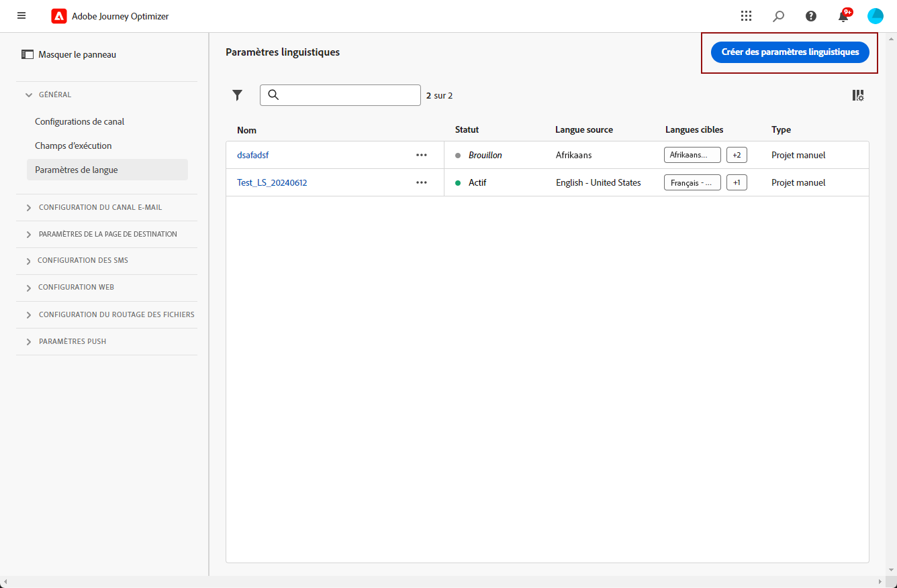
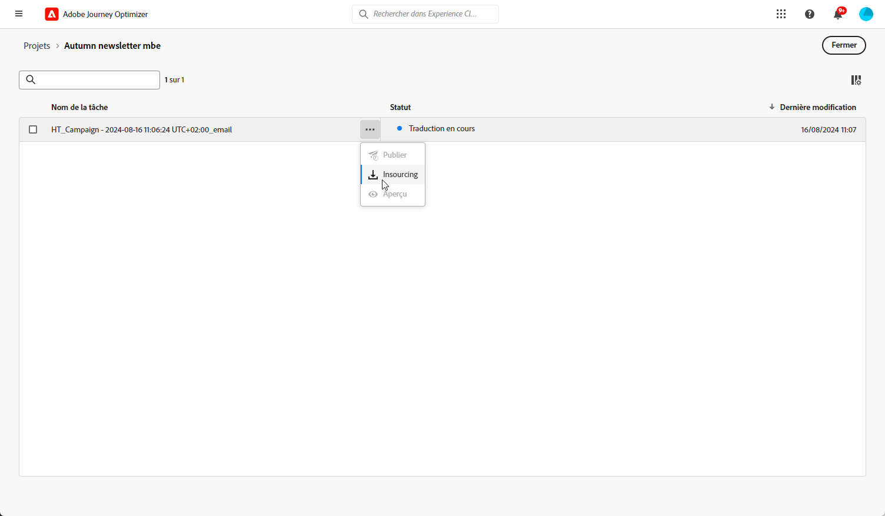

# Créer du contenu multilingue avec traduction automatisée {#multilingual-automated}

>[!CONTEXTUALHELP]
>id="ajo_multi_add_provider"
>title="Ajouter un fournisseur"
>abstract="Ajoutez des fournisseurs de traduction et des paramètres régionaux si nécessaire. Vous pouvez ainsi gérer les fournisseurs et paramètres régionaux actifs pour votre projet, ce qui vous donne la possibilité d’ajuster les ressources et de cibler les audiences en fonction de vos besoins actuels et de la portée de votre projet."

>[!CONTEXTUALHELP]
>id="ajo_multi_edit_provider"
>title="Modifier un fournisseur"
>abstract="Modifiez les fournisseurs de traduction existants et ajoutez des paramètres régionaux selon les besoins. Cette fonctionnalité vous permet de contrôler les fournisseurs et paramètres régionaux actifs pour votre projet, ce qui vous offre la possibilité d’ajuster les ressources et de cibler des audiences spécifiques en fonction de vos besoins actuels et des objectifs du projet."

>[!IMPORTANT]
>
>Pour le flux automatisé, les utilisateurs et les utilisatrices ont besoin d’autorisations liées à la fonctionnalité **[!UICONTROL Service de traduction]**. [En savoir plus sur les autorisations](../administration/permissions.md)

Avec le flux automatisé, vous pouvez simplement sélectionner la langue cible et le fournisseur de langues. Votre contenu est alors directement envoyé pour être traduit, prêt à être révisé une fois terminé.

Pour créer du contenu multilingue à l’aide de la traduction automatisée, procédez comme suit :

1. [Ajouter votre fournisseur](multilingual-provider.md)

1. [Ajouter des paramètres régionaux (facultatif)](multilingual-locale.md)

1. [Créer un projet de langue](#create-translation-project)

1. [Créer des paramètres de langue](#create-language-settings)

1. [Créer un contenu multilingue](#create-a-multilingual-campaign)

1. [Réviser votre tâche de traduction (facultatif)](#review-translation-project)

## Créer un projet de traduction {#translation-project}

>[!CONTEXTUALHELP]
>id="ajo_multi_create_project"
>title="Créer un projet"
>abstract="Pour commencer à créer du contenu multilingue, démarrez votre projet de traduction en identifiant les paramètres régionaux cible, en sélectionnant la langue appropriée ou le dialecte régional pour votre audience. Ensuite, choisissez un fournisseur de traduction qui s’aligne sur les besoins de votre projet."

>[!CONTEXTUALHELP]
>id="ajo_multi_edit_project"
>title="Modifier un projet"
>abstract="Mettez à jour votre projet de traduction pour incorporer d’autres paramètres régionaux, ce qui vous permet de développer votre contenu pour atteindre une audience plus large."

Démarrez votre projet de traduction en spécifiant les paramètres régionaux cibles, en indiquant la langue ou la région spécifique pour votre contenu. Vous pouvez ensuite choisir votre fournisseur de traduction.

1. Dans le menu **[!UICONTROL Traduction]**, sous **[!UICONTROL Gestion de contenu]**, cliquez sur **[!UICONTROL Créer un projet]** dans l’onglet **[!UICONTROL Projets]**.

   

1. Saisissez un **[!UICONTROL nom]** et une **[!UICONTROL description]**.

1. Sélectionnez les **[!UICONTROL paramètres régionaux sources]**.

   

1. Choisissez si vous souhaitez activer les options suivantes :

   * **[!UICONTROL Publier automatiquement les traductions approuvées]** : une fois les traductions approuvées, elles sont automatiquement intégrées dans la campagne sans intervention manuelle.
   * **[!UICONTROL Activer le processus de révision]** : applicable uniquement aux paramètres régionaux avec traduction humaine. Cela permet à un réviseur ou à une réviseuse interne d’évaluer et d’approuver ou de rejeter efficacement le contenu traduit. [En savoir plus](#review-translation-project)

1. Cliquez sur **[!UICONTROL Ajouter des paramètres régionaux]** pour accéder au menu et définir les langues de votre projet de traduction.

   S’il manque des **[!UICONTROL paramètres régionaux]**, vous pouvez le créer manuellement au préalable à partir du menu **[!UICONTROL Traduction]** ou par API. Voir [Créer des paramètres régionaux](#create-locale).

   

1. Sélectionnez dans la liste vos **[!UICONTROL paramètres régionaux cibles]** et choisissez le **[!UICONTROL prestataire de services de traduction]** que vous souhaitez utiliser pour chaque paramètre régional.

   Les paramètres du **[!UICONTROL prestataire de services de traduction]** sont accessibles à partir du menu **[!UICONTROL Traduction]** dans la section du menu **[!UICONTROL Administration]**.

   >[!NOTE]
   >
   >La gestion des contrats avec le prestataire de services de traduction n’entre pas dans le cadre de cette fonctionnalité. Assurez-vous que vous disposez d’un contrat valide et actif avec le partenaire de services de traduction désigné.
   >
   ></br>Le prestataire de services de traduction détient la propriété de la qualité du contenu traduit.

1. Cliquez sur **[!UICONTROL Ajouter des paramètres régionaux]** lorsque vous avez terminé de lier vos paramètres régionaux cibles au prestataire de services de traduction approprié. Cliquez ensuite sur **[!UICONTROL Enregistrer]**.

   Notez que si un fournisseur est grisé pour des paramètres régionaux cibles, cela indique que le fournisseur ne prend pas en charge ces paramètres régionaux spécifiques.

   

1. Cliquez sur **[!UICONTROL Enregistrer]** lorsque votre projet de traduction est configuré.

Votre projet de traduction est maintenant créé et peut être utilisé dans une campagne multilingue.

## Créer des paramètres de langue {#language-settings}

>[!CONTEXTUALHELP]
>id="ajo_multi_custom_conditional"
>title="Paramètres conditionnels personnalisés"
>abstract="Les paramètres conditionnels personnalisés sont des ensembles de règles qui déterminent dans quels paramètres régionaux votre contenu sera affiché, selon des critères spécifiques. Ces paramètres vous permettent de contrôler l’affichage du contenu en fonction de facteurs tels que l’emplacement de la personne, les préférences linguistiques ou d’autres éléments contextuels."

>[!CONTEXTUALHELP]
>id="ajo_multi_fallback"
>title="Préférences de secours"
>abstract="Le choix d’une préférence de secours est essentiel pour améliorer l’expérience d’utilisation. Si aucune solution secours n’est sélectionnée et qu’un profil ne répond pas aux exigences, le contenu n’est pas diffusé. En sélectionnant une solution de secours appropriée, vous garantissez une diffusion de contenu cohérente, même si les profils ne correspondent pas aux critères initiaux."

Dans cette section, vous pouvez définir vos différents paramètres régionaux pour gérer votre contenu multilingue. Vous pouvez également choisir l’attribut que vous souhaitez utiliser pour rechercher des informations relatives à la langue du profil.

1. Dans le menu **[!UICONTROL Administration]**, accédez à **[!UICONTROL Canal]** > **[!UICONTROL Paramètres généraux]**.

1. Dans le menu **[!UICONTROL Paramètres de langue]**, cliquez sur **[!UICONTROL Créer des paramètre de langue]**.

   

1. Saisissez le nom de vos **[!UICONTROL paramètres de langue]** et choisissez **[!UICONTROL Projet de traduction]**.

1. Dans le champ **[!UICONTROL Projet de traduction]**, cliquez sur **[!UICONTROL Modifier]** et sélectionnez le **[!UICONTROL projet de traduction]** créé précédemment.

   Les **[!UICONTROL paramètres régionaux]** précédemment configurés sont automatiquement importés.

1. Sélectionnez **[!UICONTROL Préférences de secours]** pour définir une option de sauvegarde au cas où un profil ne répondrait pas aux critères nécessaires pour la diffusion de contenu.

   Notez que si aucune option de secours n’est sélectionnée, l’envoi de la campagne ou du parcours ne sera pas effectué.

   

1. Choisissez votre préférence d’envoi parmi les options suivantes :

   * **[!UICONTROL Sélectionner les attributs de préférence de langue du profil]**
   * **[!UICONTROL Créer des règles conditionnelles personnalisées]**

1. Si vous sélectionnez **[!UICONTROL Sélectionner les attributs de préférence de langue de profil]**, choisissez l’attribut approprié dans le menu **[!UICONTROL Attributs de préférence de langue de profil]** pour rechercher les informations de langue d’un profil.

   

1. Si vous sélectionnez **[!UICONTROL Créer des règles conditionnelles personnalisées]**, sélectionnez les paramètres régionaux pour lesquels vous souhaitez créer des conditions. Créez ensuite des règles basées sur des facteurs tels que l’emplacement de l’utilisateur ou de l’utilisatrice, les préférences linguistiques ou d’autres éléments contextuels.

   

1. Commencez à créer des conditions en ajoutant un attribut, un événement ou une audience pour définir votre population cible.

   >[!IMPORTANT]
   >
   >Les données contextuelles sont disponibles exclusivement pour les canaux web, in-app, d’expérience basée sur du code et de cartes de contenu. Si celles-ci sont utilisées pour des canaux E-mail, SMS, Notification Push ou Courrier, sans attributs supplémentaires, l’envoi de la campagne ou du parcours sera effectué dans la langue de la première option de la liste.

   

   +++Conditions préalables pour utiliser des événements contextuels dans vos conditions

   Lorsque des utilisateurs et des utilisatrices affichent votre contenu, une demande de personnalisation est envoyée avec l’événement d’expérience. Pour exploiter les données contextuelles dans vos conditions, vous devez joindre des données supplémentaires au payload de la demande de personnalisation. Pour ce faire, vous devez créer une règle dans la collecte de données Adobe Experience Platform pour spécifier : IF (si) une demande de personnalisation est envoyée, THEN (alors) joindre des données supplémentaires à la demande, définissant ainsi l’attribut à associer au champ de langue de votre schéma.

   >[!NOTE]
   >
   >Ces conditions préalables sont requises uniquement pour les canaux Cartes de contenu et In-app.

   1. Dans la collecte de données Adobe Experience Platform, accédez à vos propriétés de balise.

   1. Accédez au menu **[!UICONTROL Règles]** et créez une règle. Vous trouverez des informations détaillées sur la création de règles dans [!DNL Adobe Experience Platform] documentation [Collecte de données](https://experienceleague.adobe.com/fr/docs/experience-platform/collection/e2e#create-a-rule){target="_blank"}

   1. Dans la section **[!UICONTROL SI]** de la règle, ajoutez un événement configuré comme ci-dessous :

      

      * Sélectionnez l’**[!UICONTROL extension]** que vous utilisez.
      * Dans le champ **[!UICONTROL Type d’événement]**, sélectionnez « Événement de demande AEP ».
      * Dans le volet de droite, sélectionnez « Le type d’événement XDM est égal à personalization.request ».
      * Cliquez sur le bouton **[!UICONTROL Conserver les modifications]** pour confirmer.

   1. Dans la section **[!UICONTROL ALORS]** de la règle, ajoutez une action configurée comme ci-dessous :

      

      * Sélectionnez l’**[!UICONTROL extension]** que vous utilisez.
      * Dans le champ **[!UICONTROL Type d’action]**, sélectionnez « Joindre des données ».
      * Dans la section du payload JSON, assurez-vous que l’attribut utilisé pour récupérer la langue à utiliser (dans l’exemple ci-dessous « langue ») correspond au nom de l’attribut spécifié dans le schéma dans lequel votre train de données de collecte de données est en cours d’exécution.

        ```JSON
        {
            "xdm":{
                "application":{
                    "_dc":{
                        "language":"{%%Language%%}"
                    }
                }
            }
        }
        ```

      * Cliquez sur le bouton **[!UICONTROL Conserver les modifications]** pour confirmer et enregistrer votre règle.

   +++

1. Faites glisser les paramètres régionaux pour les réorganiser et gérer leur priorité dans la liste.

1. Cliquez sur **[!UICONTROL Envoyer]** pour créer vos **[!UICONTROL paramètres de langue]**.

Notez qu’une fois vos préférences linguistiques configurées, vous n’aurez plus la possibilité de les modifier.

<!--
1. Access the **[!UICONTROL channel configurations]** menu and create a new channel configuration or select an existing one.

1. In the **[!UICONTROL Header parameters]** section, select the **[!UICONTROL Enable multilingual]** option.


1. Select your **[!UICONTROL Locales dictionary]** and add as many as needed.
-->

## Créer un contenu multilingue {#create-multilingual-campaign}

>[!AVAILABILITY]
>
> La prévisualisation des expériences basées sur le code et le contenu des cartes de contenu ne sont actuellement pas disponibles avec le flux automatisé.

Une fois que vous avez configuré votre projet de traduction et les paramètres de langue, vous pouvez créer votre campagne ou votre parcours et personnaliser votre contenu pour vos différents paramètres régionaux.

1. Commencez par créer et configurer votre [campagne](../campaigns/create-campaign.md) par e-mail, SMS ou notification push ou votre [parcours](../building-journeys/journey-action.md), selon vos besoins.

1. Une fois votre contenu principal créé, cliquez sur **[!UICONTROL Enregistrer]** et revenez à l’écran de configuration de la campagne

1. Cliquez sur **[!UICONTROL Ajouter des langues]**.  [En savoir plus](#create-language-settings)

   

1. Sélectionnez les **[!UICONTROL Paramètres de langue]** précédemment créés.

   

1. Maintenant que vos Paramètres régionaux sont importés, cliquez sur **[!UICONTROL Envoyer pour traduction]** pour transférer votre contenu au fournisseur de traduction sélectionné précédemment.

   

1. Une fois que votre contenu est envoyé pour traduction, il n’est plus modifiable. Pour apporter des modifications au contenu d’origine, cliquez sur l’icône de verrouillage.

   Notez que si vous souhaitez apporter des modifications à ce contenu, vous devez créer un projet de traduction et le renvoyer pour traduction.

   

1. Cliquez sur **[!UICONTROL Ouvrir la traduction]** pour accéder à votre projet de traduction et le réviser.

   

1. Dans cette page, suivez le statut de votre projet de traduction :

   * **[!UICONTROL Traduction en cours]** : votre fournisseur travaille activement sur la traduction.

     Si vous avez sélectionné **Approvisionnement** lors de la configuration des **paramètres de langue**, vous pouvez traduire votre contenu directement dans votre projet de traduction. [En savoir plus](#manage-ht-project)

   * **[!UICONTROL Prêt pour la révision]** : le processus de révision est prêt à commencer, ce qui vous permet d’accéder à la traduction et de la rejeter ou de l’approuver.

     Si vous avez sélectionné l’option **[!UICONTROL Activer le workflow de révision]** dans votre **[!UICONTROL projet de traduction]**, vous pouvez réviser la traduction directement dans Journey Optimizer une fois la traduction effectuée par le prestataire de services de traduction sélectionné. [En savoir plus](#review-translation-project)

   * **[!UICONTROL Révisé]** : la traduction a été approuvée et peut être publiée et envoyée à la campagne.

   * **[!UICONTROL Prêt à publier]** : la traduction automatique est terminée et peut désormais être envoyée à votre campagne.

   * **[!UICONTROL Terminé]** : la traduction est désormais disponible dans votre campagne.

   

1. Une fois votre traduction terminée, votre contenu multilingue est prêt à être envoyé.

   

1. Cliquez sur **[!UICONTROL Examiner pour activer]** pour afficher un résumé de la campagne.

   Le résumé vous permet de modifier votre campagne si nécessaire et de vérifier si un paramètre est incorrect ou manquant.

1. Parcourez votre contenu multilingue pour afficher le rendu dans chaque langue.

   

1. Vérifiez que votre campagne est correctement configurée, puis cliquez sur **[!UICONTROL Activer]**.

   >[!IMPORTANT]
   >
   > Si votre campagne est soumise à une politique d’approbation, vous devrez effectuer une demande d’approbation afin de pouvoir envoyer votre parcours multilingue. [En savoir plus](../test-approve/gs-approval.md)

Vous pouvez maintenant activer votre campagne ou votre parcours. Après l’envoi, vous pouvez mesurer l’impact de votre parcours ou de votre campagne multilingue dans les rapports.

## Gérer un projet de traduction d’approvisionnement {#manage-ht-project}

>[!CONTEXTUALHELP]
>id="ajo_multi_insourcing_project"
>title="Approvisionner un projet de traduction"
>abstract="L’approvisionnement d’un projet de traduction vous permet de gérer et d’exécuter des traductions directement dans votre projet de traduction, en rationalisant le processus et en maintenant un meilleur contrôle sur la qualité et la cohérence de la traduction."

Si vous avez sélectionné Approvisionnement lors de la configuration des paramètres de langue, vous pouvez traduire votre contenu directement dans votre projet de traduction.

1. Dans votre **[!UICONTROL Projet de traduction]**, accédez au menu **[!UICONTROL Plus d’actions]** et sélectionnez **[!UICONTROL Approvisionnement]**.

   

1. Vous pouvez exporter votre fichier CSV pour la traduction à l’aide de logiciels de traduction externes. Vous pouvez également réimporter le fichier CSV dans votre projet de traduction en cliquant sur le bouton **[!UICONTROL Importer le CSV]**.

   

1. Cliquez sur **[!UICONTROL Modifier]** pour ajouter le contenu de votre traduction.

   

1. Si vous souhaitez publier le texte traduit, cliquez sur **[!UICONTROL Finaliser]**.

## Réviser votre projet de traduction {#review-translation-project}

>[!CONTEXTUALHELP]
>id="ajo_multi_review_project"
>title="Réviser votre projet de traduction"
>abstract="Une fois la traduction terminée par votre fournisseur, vous pouvez consulter les résultats directement dans Journey Optimizer. Vous pouvez ainsi évaluer l’exactitude et la qualité de la traduction, en vous assurant qu’elle s’aligne sur vos attentes et les exigences du projet avant de la finaliser."

>[!CONTEXTUALHELP]
>id="ajo_multi_preview_project"
>title="Prévisualiser votre projet de traduction"
>abstract="La fenêtre Prévisualisation vous permet de visualiser l’affichage du contenu traduit dans chaque langue. Cette fonctionnalité vous permet d’examiner le rendu et de vous assurer que le contenu s’affiche correctement et efficacement dans toutes les langues sélectionnées."

Si vous avez sélectionné l’option **[!UICONTROL Activer le workflow de révision]** dans votre **[!UICONTROL projet de traduction]**, vous pouvez réviser la traduction directement dans Journey Optimizer une fois la traduction effectuée par le fournisseur de traduction sélectionné.

Notez que si cette option est désactivée, une fois la traduction effectuée par votre fournisseur, le statut de la tâche de traduction est automatiquement défini sur **[!UICONTROL Révisé]**, ce qui vous permet de poursuivre rapidement en cliquant sur **[!UICONTROL Publier]**.

1. Une fois votre traduction effectuée par votre fournisseur, vous pouvez accéder à la traduction pour révision à partir de votre **[!UICONTROL projet de traduction]** ou directement depuis votre **[!UICONTROL campagne]**.

   Dans le menu **[!UICONTROL Plus d’actions]**, cliquez sur **[!UICONTROL Réviser]**.

   

1. Dans la fenêtre Réviser, parcourez votre contenu traduit et acceptez ou rejetez chaque chaîne de traduction.

   

1. Cliquez sur **[!UICONTROL Modifier]** pour modifier le contenu de votre chaîne de traduction.

   

1. Saisissez votre traduction mise à jour et cliquez sur **[!UICONTROL Confirmer]** lorsque vous avez terminé.

   

1. Vous pouvez également choisir **[!UICONTROL Tout rejeter]** ou **[!UICONTROL Tout approuver]** directement.

   Lorsque vous sélectionnez **[!UICONTROL Tout rejeter]**, ajoutez un commentaire, puis cliquez sur **[!UICONTROL Rejeter]**.

1. Cliquez sur **[!UICONTROL Aperçu]** pour vérifier le rendu de votre contenu traduit dans chaque langue.

1. Si vous souhaitez publier le texte traduit, cliquez sur **[!UICONTROL Finaliser]**.

   

1. Dans votre **[!UICONTROL projet de traduction]**, sélectionnez l’un de vos projets pour accéder à plus de détails. Si vous avez rejeté la traduction, vous pouvez choisir de la renvoyer pour traduction.

   

1. Une fois que le statut de votre **[!UICONTROL projet de traduction]** est défini sur Révisé, vous pouvez l’envoyer à votre campagne.

   Dans le menu **[!UICONTROL Plus d’actions]**, cliquez sur **[!UICONTROL Publier]**.

   

1. Dans votre campagne, vérifiez que le statut de votre traduction est passé à **[!UICONTROL Traduction terminée]**. Vous pouvez maintenant envoyer votre contenu multilingue, reportez-vous à l’étape 10 de [cette section](#create-multilingual-campaign).

   

<!--
# Create a multilingual journey {#create-multilingual-journey}

1. Create your journey with a Delivery and personalize your content as needed.
1. From your delivery action, click Edit content.
1. Click Add languages.


-->
