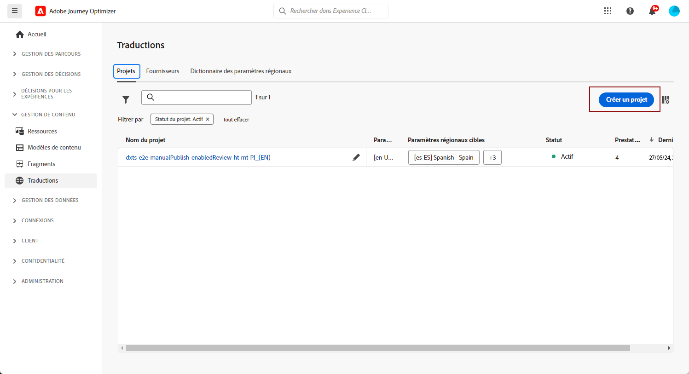
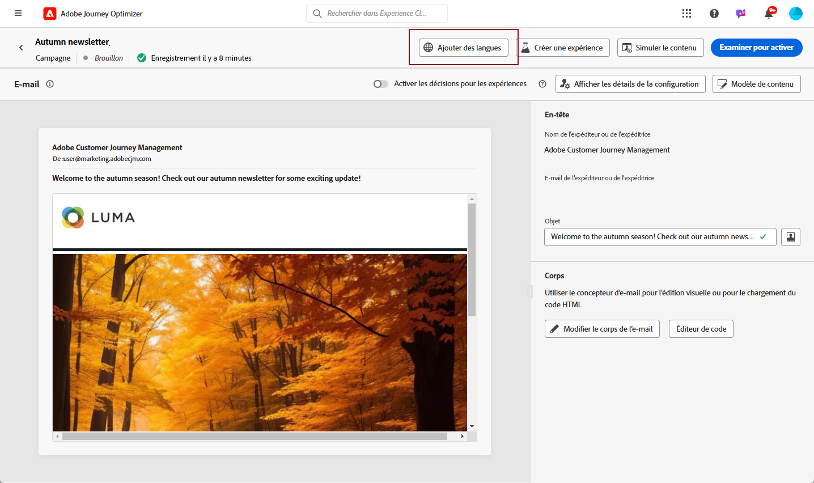
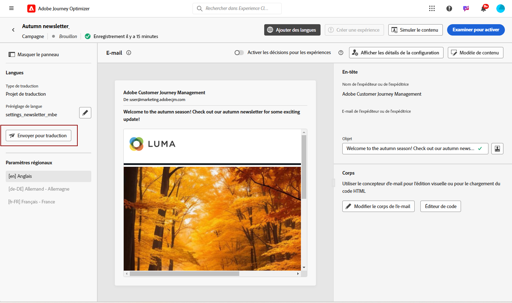
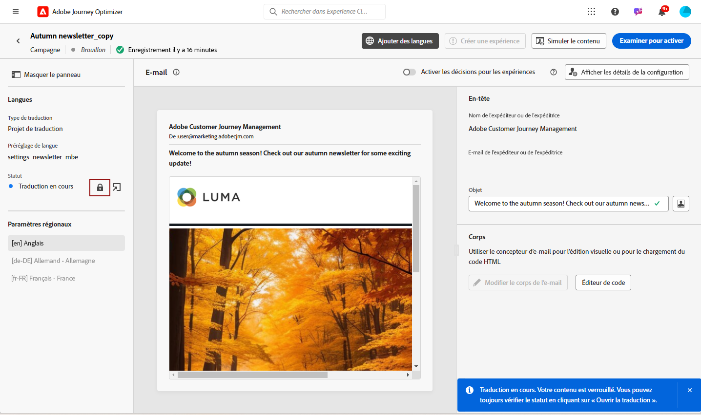
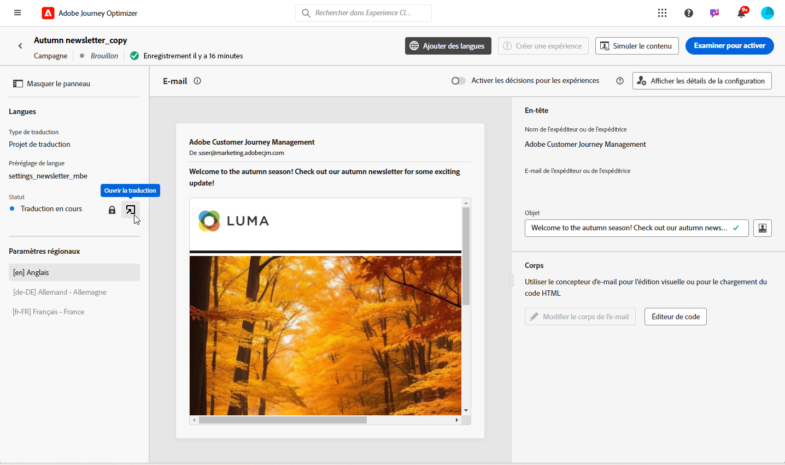

# Créer du contenu multilingue avec traduction automatisée {#multilingual-automated}

>[!BEGINSHADEBOX]

**Table des matières**

* [Prise en main du contenu multilingue](multilingual-gs.md)
* [Créer du contenu multilingue avec traduction manuelle](multilingual-manual.md)
* **[Créer du contenu multilingue avec traduction automatisée](multilingual-automated.md)**
* [Rapport de campagne multilingue](multilingual-report.md)

>[!ENDSHADEBOX]

Avec le flux automatisé, vous pouvez simplement sélectionner la langue cible et le fournisseur de langues. Votre contenu est alors directement envoyé à la traduction, prêt à être révisé une fois terminé.

Pour créer du contenu multilingue à l’aide de la traduction automatisée, procédez comme suit :

1. [Créer vos paramètres régionaux](#create-locale).

1. [Créer un projet de langue](#create-translation-project).

1. [Création de paramètres de langue](#create-language-settings).

1. [Créer une campagne multilingue](#create-a-multilingual-campaign).

1. [Vérifier votre tâche de traduction (facultatif)](#review-translation-project).

## Créer un paramètre régional {#create-locale}

Lors de la configuration des paramètres de langue, comme décrit dans la section [Créer vos paramètres de langue](#language-settings) , si un paramètre régional spécifique n’est pas disponible pour votre contenu multilingue, vous avez la possibilité de créer autant de paramètres régionaux que nécessaire à l’aide de la fonction **[!UICONTROL Traduction]** .

1. Dans la **[!UICONTROL Administration]** menu, accès **[!UICONTROL Canal]**.

   Le menu Traductions permet d&#39;accéder à la liste des paramètres régionaux activés.

1. Dans la **[!UICONTROL Dictionnaire des paramètres régionaux]** , cliquez sur **[!UICONTROL Ajouter un paramètre régional]**.

   

1. Sélectionnez votre code de langue dans la **[!UICONTROL Langue]** et la liste associée **[!UICONTROL Région]**.

1. Cliquez sur **[!UICONTROL Enregistrer]** pour créer votre paramètre régional.

   

## Créer un projet de traduction {#translation-project}

Démarrez votre projet de traduction en spécifiant les paramètres régionaux de Target, en indiquant la langue ou la région spécifique pour votre contenu. Vous pouvez ensuite choisir votre fournisseur de traduction.

1. Dans la **[!UICONTROL Projets de traduction]** sous **[!UICONTROL Gestion de contenu]**, cliquez sur **[!UICONTROL Créer un projet]**.

   

1. Saisissez un **[!UICONTROL Nom]** et **[!UICONTROL Description]**.

1. Sélectionnez la variable **[!UICONTROL Paramètre source]**.

   

1. Choisissez si vos traductions sont automatiquement publiées après approbation et si vous souhaitez activer le workflow de révision.

1. Cliquez sur **[!UICONTROL Ajouter un paramètre régional]** pour accéder au menu et définir les langues de votre projet de traduction.

   Si une **[!UICONTROL Paramètres régionaux]** est manquante, vous pouvez le créer manuellement au préalable à partir de la fonction **[!UICONTROL Traduction]** ou par API. Voir [Création d’un paramètre régional](#create-locale).

   

1. Sélectionnez dans la liste votre **[!UICONTROL Paramètre(s) cible(s)]** et choisissez laquelle **[!UICONTROL Fournisseur de traduction]** vous souhaitez utiliser pour chaque paramètre régional.

1. Cliquez sur **[!UICONTROL Ajouter un paramètre régional]** lorsque vous avez terminé de lier vos paramètres régionaux Target au fournisseur de traduction approprié. Cliquez ensuite sur **[!UICONTROL Enregistrer]**.

   

1. Cliquez sur **[!UICONTROL Enregistrer]** lorsque votre projet de traduction est configuré.

Votre projet de traduction est maintenant créé et peut être utilisé dans une campagne multilingue.

## Création de paramètres de langue {#language-settings}

Dans cette section, vous pouvez définir votre langue principale et les paramètres régionaux associés pour gérer votre contenu multilingue. Vous pouvez également choisir l’attribut que vous souhaitez utiliser pour rechercher des informations relatives à la langue du profil.

1. Dans la **[!UICONTROL Administration]** menu, accès **[!UICONTROL Canal]**.

1. Dans le **[!UICONTROL Paramètres de langue]** , cliquez sur **[!UICONTROL Création de paramètres de langue]**.

   

1. Saisissez le nom de votre **[!UICONTROL Paramètres de langue]**.

1. Choisissez la **[!UICONTROL Projet de traduction]** .

1. Dans la **[!UICONTROL Projet de traduction]** champ, cliquez sur **[!UICONTROL Modifier]** et sélectionnez les **[!UICONTROL Projet de traduction]**.

   Les paramètres régionaux précédemment configurés sont automatiquement importés.

   

1. Dans la **[!UICONTROL Préférence d’envoi]** sélectionnez l’attribut à rechercher pour trouver des informations sur les langues de profil.

1. Cliquez sur **[!UICONTROL Modifier]** en regard de votre **[!UICONTROL Paramètres régionaux]** pour la personnaliser davantage et ajouter **[!UICONTROL Préférences de profil]**.

   

1. Si votre **[!UICONTROL Projet de traduction]** est mis à jour, cliquez sur **[!UICONTROL Actualiser]** pour refléter ces modifications dans votre **[!UICONTROL Paramètres de langue]**.

   

1. Cliquez sur **[!UICONTROL Envoyer]** pour créer votre **[!UICONTROL Paramètres de langue]**.

<!--
1. Access the **[!UICONTROL Channel surfaces]** menu and create a new channel surface or select an existing one.

1. In the **[!UICONTROL Header parameters]** section, select the **[!UICONTROL Enable multilingual]** option.

1. Select your **[!UICONTROL Locales dictionary]** and add as many as needed.
-->

## Créer une campagne multilingue {#create-multilingual-campaign}

Une fois que vous avez configuré le projet de traduction et les paramètres de langue, vous êtes prêt à créer votre campagne et à personnaliser votre contenu pour vos différents paramètres régionaux.

1. Commencez par créer et configurer votre campagne Email, SMS ou Notification push selon vos besoins. [En savoir plus](../campaigns/create-campaign.md)

1. Une fois votre contenu principal créé, cliquez sur **[!UICONTROL Enregistrer]** et revenez à l&#39;écran de configuration de campaign.

1. Cliquez sur **[!UICONTROL Ajouter des langues]**.  [En savoir plus](#create-language-settings)

   

1. Sélectionnez les **[!UICONTROL Paramètres de langue]**.

   

1. Maintenant que vos Paramètres régionaux sont importés, cliquez sur **[!UICONTROL Envoyer à traduire]** pour transférer votre contenu au fournisseur de traduction sélectionné précédemment.

   

1. Une fois que votre contenu est envoyé pour traduction, il n’est plus modifiable. Pour apporter des modifications au contenu d’origine, cliquez sur l’icône de verrouillage.

   Notez que si vous souhaitez apporter des modifications à ce contenu, vous devez créer un projet de traduction et le renvoyer pour traduction.

   

1. Cliquez sur **[!UICONTROL Traduction libre]** pour accéder à votre projet de traduction et le revoir.

   

1. Dans cette page, suivez l’état de votre projet de traduction :

   * **[!UICONTROL Traduction en cours]**: votre fournisseur de services travaille activement sur la traduction.
   * **[!UICONTROL Prêt pour la révision]**: le processus de révision est prêt à commencer, ce qui vous permet d’accéder à la traduction et de la rejeter ou de l’approuver.
   * **[!UICONTROL Révisé]**: la traduction a été validée et prête à être envoyée à la campagne.
   * **[!UICONTROL Prêt à publier]**: la traduction automatique est terminée et peut désormais être envoyée à votre campagne.
   * **[!UICONTROL Terminé]**: la traduction est désormais disponible dans votre campagne.

   

1. Une fois votre traduction terminée, votre contenu multilingue est prêt à être envoyé.

   

1. Cliquez sur **[!UICONTROL Réviser pour activer]** pour afficher un résumé de l&#39;opération.

   Le résumé vous permet de modifier votre campagne si nécessaire et de vérifier si un paramètre est incorrect ou manquant.

1. Parcourez votre contenu multilingue pour afficher le rendu dans chaque langue.

   

1. Vérifiez que votre campagne est correctement configurée, puis cliquez sur **[!UICONTROL Activer]**.

Votre campagne est maintenant activée. Le message paramétré dans la campagne est envoyé immédiatement ou à la date indiquée. Notez que dès que votre campagne est active, elle ne peut pas être modifiée. Pour réutiliser du contenu, vous pouvez dupliquer votre campagne.

Une fois envoyé, vous pouvez mesurer l’impact de vos campagnes dans les rapports de campagne.

## Révision de votre projet de traduction {#review-translation-project}

Si vous avez sélectionné la variable **[!UICONTROL Activation du processus de révision]** dans votre **[!UICONTROL Projet de traduction]**, vous pouvez passer en revue la traduction directement dans Journey Optimizer une fois la traduction terminée par le fournisseur de traduction sélectionné.
Notez que si cette option est désactivée, une fois la traduction terminée par votre fournisseur, l’état de la tâche de traduction est automatiquement défini sur **[!UICONTROL Révisé]**, ce qui vous permet de procéder rapidement en cliquant sur **[!UICONTROL Envoyer au produit]**.

1. Une fois votre traduction terminée depuis votre fournisseur de services, vous pouvez accéder à la traduction pour révision à partir de votre **[!UICONTROL Projet de traduction]** ou directement depuis votre **[!UICONTROL Campagne]**.

   

1. Dans la fenêtre Réviser , parcourez votre contenu traduit et acceptez ou rejetez chaque chaîne de traduction.

   

1. Cliquez sur **[!UICONTROL Modifier]** pour modifier le contenu de votre chaîne de traduction.

   

1. Saisissez votre traduction mise à jour et cliquez sur **[!UICONTROL Confirmer]** lorsque vous avez terminé.

   

1. Vous pouvez également choisir **[!UICONTROL Rejeter tout]** ou **[!UICONTROL Tout approuver]** directement.

   Lorsque vous sélectionnez **[!UICONTROL Rejeter tout]**, ajoutez un commentaire, puis cliquez sur **[!UICONTROL Rejeter]**.

1. Cliquez sur **[!UICONTROL Aperçu]** pour vérifier le rendu de votre contenu traduit dans chaque langue.

1. Une fois la traduction effectuée, cliquez sur **[!UICONTROL Finaliser]**.

   

1. Dans **[!UICONTROL Projet de traduction]**, sélectionnez l’un de vos projets pour accéder à plus de détails. Si vous avez rejeté la traduction, vous pouvez choisir de la renvoyer à la traduction.

   

1. Une fois votre **[!UICONTROL Projet de traduction]** est défini sur Révisé, vous pouvez l’envoyer à votre campagne.

   Dans le menu avancé, cliquez sur **[!UICONTROL Publier]**.

   

1. Dans votre campagne, vérifiez que votre état de traduction a changé en **[!UICONTROL Traduction terminée]**. Vous pouvez maintenant envoyer votre contenu multilingue, reportez-vous à l’étape 10 de la section [cette section](#create-multilingual-campaign).

   

<!--
# Create a multilingual journey {#create-multilingual-journey}

1. Create your journey with a Delivery and personalize your content as needed.
1. From your delivery action, click Edit content.
1. Click Add languages.

-->
