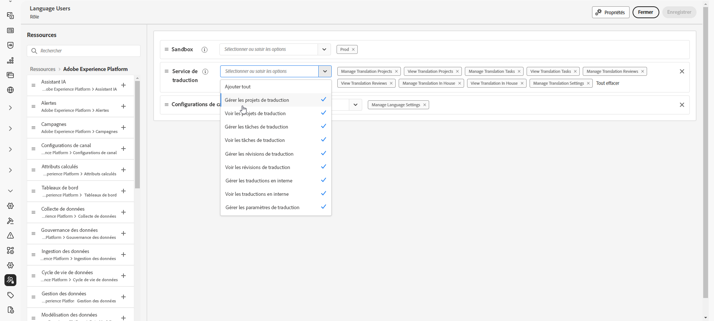

# Commencer avec le contenu multilingue {#multilingual-gs}

>[!CONTEXTUALHELP]
>id="ajo_multi_translation_homepage"
>title="Traductions"
>abstract="La fonctionnalité multilingue vous permet de créer facilement du contenu dans plusieurs langues au sein d’une campagne ou d’un parcours. La page Traductions vous permet de configurer des projets, de sélectionner des fournisseurs de traduction ou de gérer des dictionnaires spécifiques aux paramètres régionaux."

La fonctionnalité multilingue vous permet de créer facilement du contenu dans plusieurs langues au sein d’une campagne ou d’un parcours. Grâce à cette fonctionnalité, vous pouvez passer d’une langue à une autre lors de la modification de votre campagne, ce qui optimise l’ensemble du processus de modification et améliore votre capacité à gérer efficacement du contenu multilingue.

Avec Journey Optimizer, vous avez la possibilité de créer du contenu multilingue par le biais de deux méthodes distinctes :

* **Traduction manuelle** : traduisez votre contenu directement dans le Concepteur d’e-mail ou importez du contenu multilingue existant. [En savoir plus](multilingual-manual.md)

* **Traduction automatisée** : envoyez du contenu à votre fournisseur de services linguistiques préféré pour une traduction automatisée. [En savoir plus](multilingual-automated.md)

 

## Prérequis {#prerequisites}

>[!CONTEXTUALHELP]
>id="ajo_multi_translation_error"
>title="Erreur de traduction"
>abstract="Si vous ne parvenez pas à accéder à la page Traduction, cela est probablement dû au fait que la fonctionnalité « Traduction » n’est pas activée. Pour résoudre ce problème, vous devez vous assurer que la fonctionnalité « Traduction » est activée par votre administrateur ou administratrice d’organisation et de sandbox."

Adobe Journey Optimizer s’intègre actuellement aux fournisseurs de traduction, qui offrent des services de traduction tiers (traduction automatique ou humaine), indépendants d’Adobe Journey Optimizer.

Avant d’ajouter votre fournisseur de traduction sélectionné, vous devez créer un compte auprès de ce fournisseur.

Votre utilisation des services de traduction d’un fournisseur de traduction sera soumise aux conditions générales supplémentaires de ce fournisseur. En tant que solutions tierces, les services de traduction sont disponibles pour les utilisateurs et utilisatrices d’Adobe Journey Optimizer via une intégration. Adobe ne contrôle pas les produits tiers et n’en est pas responsable.

Pour tout problème ou toute demande d’aide relative à vos traductions, contactez le fournisseur de traduction concerné.

Pour le contenu multilingue, les paramètres suivants doivent être définis :

* Pour utiliser la fonctionnalité Traduction dans Journey Optimizer, vous devez affecter l’API au rôle correspondant. [En savoir plus](https://experienceleague.adobe.com/fr/docs/experience-platform/landing/platform-apis/api-authentication#assign-api-to-a-role)

* Pour commencer à créer du contenu multilingue, les utilisateurs et les utilisatrices doivent obtenir l’autorisation **[!UICONTROL Gérer les paramètres de langue]**. Pour un flux automatisé, les utilisateurs et les utilisatrices auront également besoin d’autorisations liées aux fonctionnalités du **[!UICONTROL service de traduction]**. [En savoir plus sur les autorisations](../administration/permissions.md)

  +++ Découvrez comment attribuer des autorisations multilingues.

   1. Dans le produit **Autorisations**, accédez à l’onglet **Rôles** et sélectionnez le **Rôle** de votre choix.

   1. Cliquez sur **Modifier** pour modifier les autorisations.

   1. Ajoutez la ressource **Service de traduction**, puis sélectionnez les autorisations multilingues appropriées dans le menu déroulant.

      {zoomable="yes"}

   1. Cliquez sur **Enregistrer** pour appliquer vos modifications.

      Les autorisations des personnes déjà affectées à ce rôle seront automatiquement mises à jour.

   1. Pour attribuer ce rôle à de nouvelles personnes, accédez à l’onglet **Utilisateurs et utilisatrices** du tableau de bord **Rôles** et cliquez sur **Ajouter un utilisateur ou une utilisatrice**.

   1. Saisissez le nom de la personne, son adresse e-mail ou choisissez dans la liste, puis cliquez sur **Enregistrer**.

   1. Si le profil de l’utilisateur ou de l’utilisatrice n’a pas été créé auparavant, consultez cette [documentation](https://experienceleague.adobe.com/fr/docs/experience-platform/access-control/abac/permissions-ui/users).

  +++

* Si vous ne parvenez pas à accéder à la page Traduction, vous devez activer la fonctionnalité Traduction et obtenir les autorisations associées au **[!UICONTROL service de traduction]**. [En savoir plus](../administration/ootb-permissions.md)

  +++ Découvrez comment activer la fonctionnalité « Traduction ».

   1. Si la page d’erreur suivante s’affiche, cela indique que la fonctionnalité **[!UICONTROL Traduction]** n’a pas encore été activée. Contactez votre organisation et l’administration Sandbox pour demander l’accès.

  

   1. Votre administrateur ou administratrice devra accéder au menu **[!UICONTROL Traduction]** dans la barre latérale gauche.

      Le système activera automatiquement la fonctionnalité « Traduction ».

   1. Une fois la fonctionnalité activée, vous pourrez accéder à la page **[!UICONTROL Traduction]**, ainsi qu’aux onglets **[!UICONTROL Projets]**, **[!UICONTROL Fournisseurs]** et **[!UICONTROL Paramètres régionaux]**.

   1. Si cette procédure a échoué, la même page d’erreur s’affiche toujours. Dans ce cas, contactez votre représentant ou représentante Adobe pour obtenir de l’aide.

  +++

## Vidéo pratique {#video}

Découvrez comment créer du contenu dans plusieurs langues au sein d’une campagne ou d’un parcours.

>[!VIDEO](https://video.tv.adobe.com/v/3430921/)
