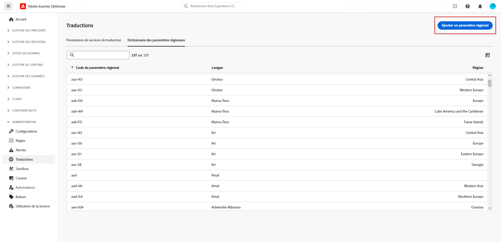
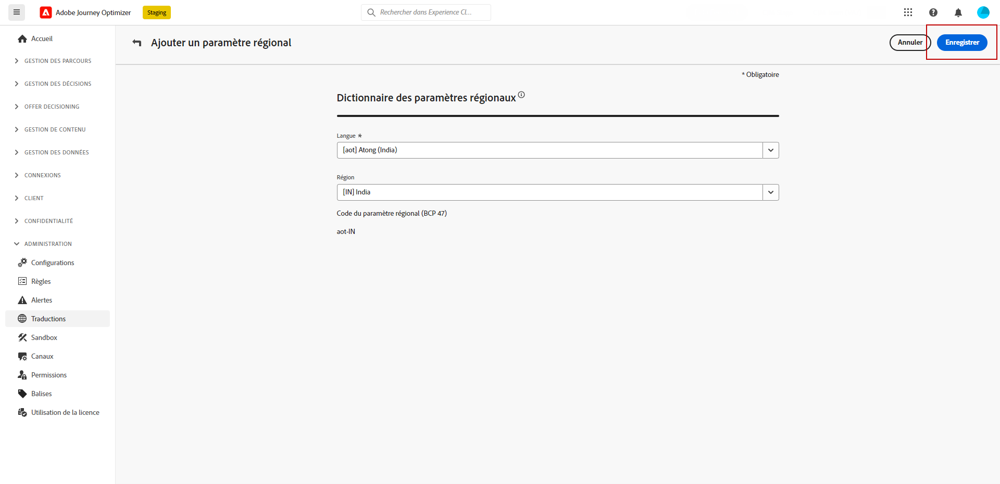

# Créer des paramètres régionaux {#multilingual-locale}

>[!BEGINSHADEBOX]

**Sur cette page :** découvrez comment créer de nouveaux paramètres régionaux à partir du menu Traduction lorsqu’une langue ou une région nécessaire n’est pas disponible pour votre contenu multilingue.

>[!ENDSHADEBOX]

>[!CONTEXTUALHELP]
>id="ajo_multi_add_locale"
>title="Ajouter des paramètres régionaux"
>abstract="Lors de la configuration de vos préférences linguistiques, vous avez la possibilité de créer des paramètres régionaux supplémentaires si ceux qui vous sont demandés ne sont pas disponibles pour votre contenu multilingue."

Lors de la configuration des paramètres de langue, comme décrit dans la section [Créer vos paramètres de langue](multilingual-manual.md#language-settings), si un paramètre régional spécifique n’est pas disponible pour votre contenu multilingue, vous avez la possibilité de créer autant de paramètres régionaux que nécessaire à l’aide du menu **[!UICONTROL Traduction]**.

1. Dans le menu **[!UICONTROL Gestion de contenu]**, accédez à **[!UICONTROL Traduction]**.

1. Dans l’onglet **[!UICONTROL Dictionnaire des paramètres régionaux]**, cliquez sur **[!UICONTROL Ajouter un paramètre régional]**.

   

1. Sélectionnez votre code de paramètres régionaux dans la liste **[!UICONTROL Langue]** et la **[!UICONTROL Zone géographique]** associée.

1. Cliquez sur **[!UICONTROL Enregistrer]** pour créer vos paramètres régionaux.

   
