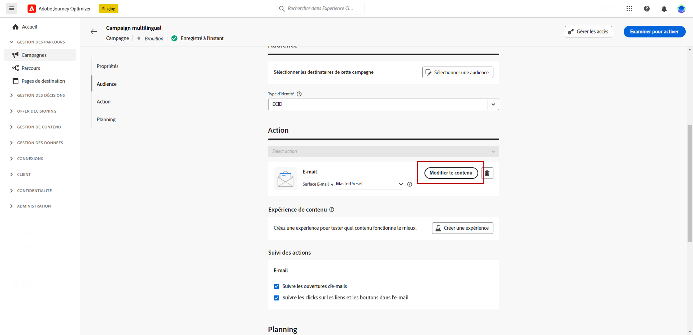

# Créer du contenu multilingue {#multilingual}

La fonctionnalité multilingue vous permet de créer facilement du contenu dans plusieurs langues au sein d’une seule campagne. Grâce à cette fonctionnalité, vous pouvez basculer entre les langues lors de la modification de votre campagne, ce qui rationalise l’ensemble du processus de modification et améliore votre capacité à gérer efficacement le contenu multilingue.

## Créer un paramètre régional {#create-locale}

Lors de la configuration des paramètres de langue, comme décrit dans la section [Créer vos paramètres de langue](#language-settings) , si un paramètre régional spécifique n’est pas disponible pour votre contenu multilingue, vous avez la possibilité de créer autant de paramètres régionaux que nécessaire à l’aide de la fonction **[!UICONTROL Traduction]** .

1. Dans la **[!UICONTROL Administration]** menu, accès **[!UICONTROL Canal]**.

   Le menu Traductions permet d&#39;accéder à la liste des paramètres régionaux activés.

1. Dans la **[!UICONTROL Dictionnaire des paramètres régionaux]** , cliquez sur **[!UICONTROL Ajouter un paramètre régional]**.

   

1. Sélectionnez votre code de langue dans la **[!UICONTROL Langue]** et la liste associée **[!UICONTROL Région]**.

1. Cliquez sur **[!UICONTROL Enregistrer]** pour créer votre paramètre régional.

   

## Création de paramètres de langue {#language-settings}

Dans cette section, vous pouvez définir votre langue principale et les paramètres régionaux associés pour gérer votre contenu multilingue. Vous pouvez également choisir l’attribut que vous souhaitez utiliser pour rechercher des informations relatives à la langue du profil.

1. Dans la **[!UICONTROL Administration]** menu, accès **[!UICONTROL Canal]**.

1. Dans le **[!UICONTROL Paramètres de langue]** , cliquez sur **[!UICONTROL Création de paramètres de langue]**.

   

1. Saisissez le nom de votre **[!UICONTROL Paramètres de langue]**.

1. Sélectionnez la variable **[!UICONTROL Paramètres régionaux]** associés à ces paramètres. Vous pouvez ajouter un maximum de 50 paramètres régionaux.

   Si une **[!UICONTROL Paramètres régionaux]** est manquante, vous pouvez le créer manuellement au préalable à partir de la fonction **[!UICONTROL Traduction]** ou par API. Voir [Création d’un paramètre régional](#create-locale).

   

1. Dans la **[!UICONTROL Préférence d’envoi]** sélectionnez l’attribut à rechercher pour trouver des informations sur les langues de profil.

   

1. Cliquez sur **[!UICONTROL Modifier]** en regard de votre **[!UICONTROL Paramètres régionaux]** pour la personnaliser davantage et ajouter **[!UICONTROL Préférences de profil]**.

   

1. Sélectionner une autre **[!UICONTROL Paramètres régionaux]** dans la liste déroulante Préférences de profil , puis cliquez sur **[!UICONTROL Ajout de profils]**.

1. Accédez au menu avancé de votre **[!UICONTROL Paramètres régionaux]** pour définir votre **[!UICONTROL Paramètres régionaux du Principal]**, c’est-à-dire la langue par défaut si l’attribut de profil n’est pas spécifié.

   Vous pouvez également supprimer les paramètres régionaux de ce menu avancé.

   

1. Cliquez sur **[!UICONTROL Envoyer]** pour créer votre **[!UICONTROL Paramètres de langue]**.

<!--
1. Access the **[!UICONTROL Channel surfaces]** menu and create a new channel surface or select an existing one.

1. In the **[!UICONTROL Header parameters]** section, select the **[!UICONTROL Enable multilingual]** option.

1. Select your **[!UICONTROL Locales dictionary]** and add as many as needed.
-->

## Créer une campagne multilingue {#create-multilingual-campaign}

1. Commencez par créer et configurer votre campagne en fonction de vos besoins. [En savoir plus](../campaigns/create-campaign.md)

1. Accédez au **[!UICONTROL Actions]** et sélectionnez **[!UICONTROL Modifier le contenu]**.

   

1. Créez ou importez votre contenu d’origine et personnalisez-le selon vos besoins.

1. Une fois votre contenu principal créé, cliquez sur **[!UICONTROL Enregistrer]** et revenez à l&#39;écran de configuration de campaign.

   

1. Cliquez sur **[!UICONTROL Ajouter des langues]** et sélectionnez les **[!UICONTROL Paramètres de langue]**. [En savoir plus](#create-language-settings)

   

1. Accédez aux paramètres avancés de la fonction **[!UICONTROL Paramètres régionaux]** et sélectionnez **[!UICONTROL Copier principal vers tous les paramètres régionaux]**.

   

1. Maintenant que votre contenu principal est dupliqué dans l’ensemble de vos  **[!UICONTROL Paramètres régionaux]**, accédez à chaque paramètre régional et cliquez sur **[!UICONTROL Modifier le corps de l’email]** pour traduire votre contenu.

   

1. Vous pouvez choisir de désactiver ou d’activer les paramètres régionaux avec le paramètre **[!UICONTROL Plus d&#39;action]** du menu Paramètres régionaux sélectionné.

   

1. Pour désactiver la configuration multilingue, cliquez sur **[!UICONTROL Ajouter des langues]** et sélectionnez la langue que vous souhaitez conserver comme langue locale.

   

1. Cliquez sur **[!UICONTROL Réviser pour activer]** pour afficher un résumé de l&#39;opération.

   Le résumé vous permet de modifier votre campagne si nécessaire et de vérifier si un paramètre est incorrect ou manquant.

1. Parcourez votre contenu multilingue pour afficher le rendu dans chaque langue.

   

1. Vérifiez que votre campagne est correctement configurée, puis cliquez sur **[!UICONTROL Activer]**.

Votre campagne est maintenant activée. Le message paramétré dans la campagne est envoyé immédiatement ou à la date indiquée. Notez que dès que votre campagne est active, elle ne peut pas être modifiée. Pour réutiliser du contenu, vous pouvez dupliquer votre campagne.

Une fois envoyé, vous pouvez mesurer l’impact de vos campagnes dans les rapports de campagne.

## Rapport de campagne multilingue {#multilingual-campaign-report}

Rapports globaux, accessibles à partir de **Tout le temps** , affichez les événements qui se sont produits il y a au moins deux heures et couvrez les événements sur une période sélectionnée. Pour accéder directement au rapport global de campagne à partir de votre campagne, cliquez sur le bouton **[!UICONTROL Afficher le rapport]**.

Pour plus d’informations sur les données disponibles dans le rapport Campaign, reportez-vous à la section [cette page](../reports/campaign-global-report.md).

+++En savoir plus sur les différents widgets et mesures disponibles pour votre contenu multilingue.

La variable **[!UICONTROL Statistiques d&#39;envoi d&#39;emails par langue]** Le widget détaille le succès de votre diffusion en fonction de votre **[!UICONTROL Paramètres régionaux]**:

* **[!UICONTROL Délivrés]** : nombre de messages envoyés avec succès, par rapport au nombre total de messages envoyés.

* **[!UICONTROL Bounces]** : nombre total d&#39;erreurs cumulées lors des diffusions et du traitement automatique des retours par rapport au nombre total de messages envoyés.

* **[!UICONTROL Erreurs]** : nombre total d’erreurs survenues au cours d&#39;une diffusion, l’empêchant d&#39;être envoyée à des profils.

La variable **[!UICONTROL Statistiques de tracking des emails par langue]** Le widget contient les données disponibles pour l’activité des destinataires pour votre diffusion, selon votre **[!UICONTROL Paramètres régionaux]**:

* **[!UICONTROL Désabonne]**: nombre de clics sur le lien de désinscription.

* **[!UICONTROL Ouvertures]** : nombre de fois que le message a été ouvert.

* **[!UICONTROL Clics]**: nombre de clics sur un contenu.
+++

<!--
# Create a multilingual journey {#create-multilingual-journey}

1. Create your journey with a Delivery and personalize your content as needed.
1. From your delivery action, click Edit content.
1. Click Add languages.

# Translation project/ Create translation project:

1. From the Translation projects menu, click Create project.
1. Type-in a Name and Description.
1. Select the Source locale.
1. Click Add language to access the menu and define the languages for your translation project.
1. Select from the list your Target locale(s) and choose which Translation provider you want to use.
1. Click Add language when you finished linking your Target locale with the correct Translation provider.
1. Click Save.
1. From the Advanced menu of your Translation project, you can choose to Edit, deactive or delete it.
-->
