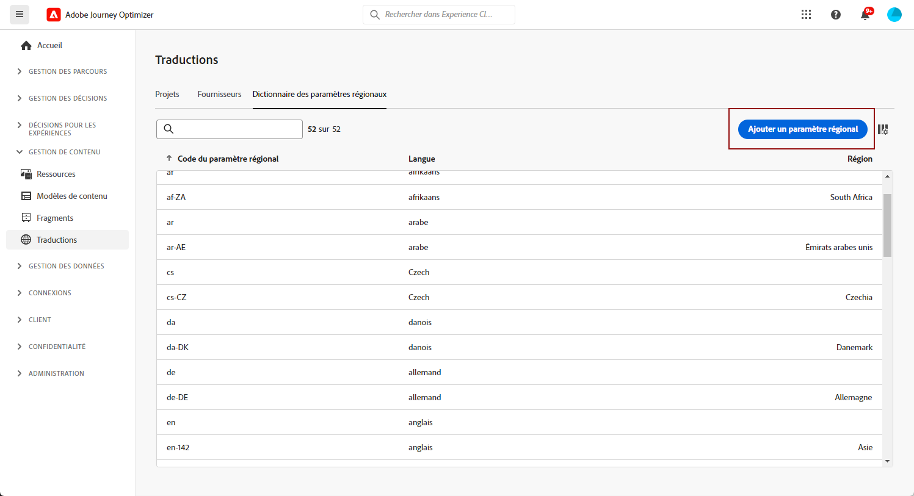
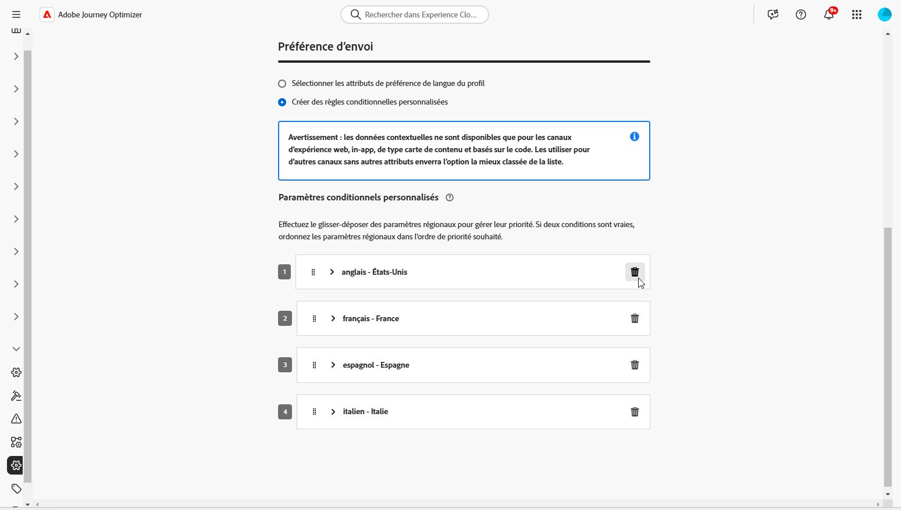
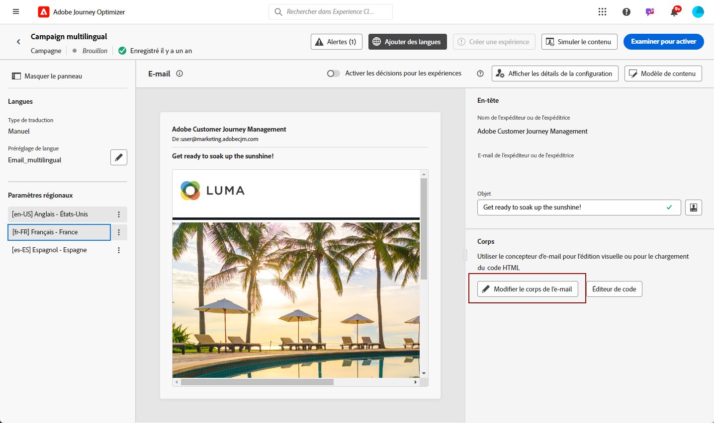
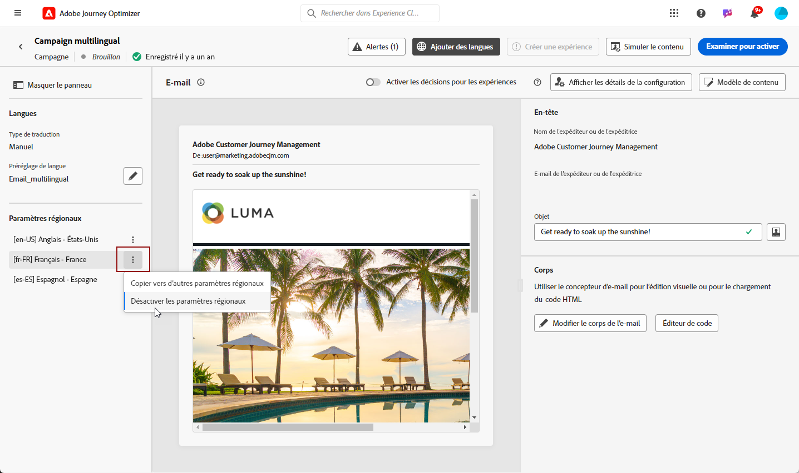

# Créer du contenu multilingue avec traduction manuelle {#multilingual-manual}

>[!AVAILABILITY]
>
>Le contenu multilingue est actuellement disponible uniquement pour un ensemble d’organisations (disponibilité limitée). Pour en bénéficier, contactez votre représentant ou représentante Adobe.

Grâce au flux manuel, vous pouvez traduire facilement votre contenu directement dans votre campagne et parcours par email, notification push ou SMS, ce qui vous permet de disposer d’options de contrôle et de personnalisation précises pour vos messages multilingues. De plus, vous pouvez facilement importer du contenu multilingue préexistant à l’aide de l’option Importer un HTML.

Pour créer du contenu multilingue à l’aide de la traduction manuelle, procédez comme suit :

1. [Créer vos paramètres régionaux](#create-locale).

1. [Créez des paramètres de langue](#create-language-settings).

1. [Créer un contenu multilingue](#create-a-multilingual-campaign).

## Créer un paramètre régional {#create-locale}

Lors de la configuration des paramètres de langue, comme décrit dans la section [Créer vos paramètres de langue](#language-settings), si un paramètre régional spécifique n’est pas disponible pour votre contenu multilingue, vous avez la possibilité de créer autant de paramètres régionaux que nécessaire à l’aide du menu **[!UICONTROL Traduction]**.

1. Dans la **[!UICONTROL Gestion de contenu]** menu, accès **[!UICONTROL Traduction]**.

1. Dans l’onglet **[!UICONTROL Dictionnaire des paramètres régionaux]**, cliquez sur **[!UICONTROL Ajouter un paramètre régional]**.

   

1. Sélectionnez votre code de paramètre régional dans la liste **[!UICONTROL Langue]** et la **[!UICONTROL Région]** associée.

1. Cliquez sur **[!UICONTROL Enregistrer]** pour créer votre paramètre régional.

   

## Créer des paramètres de langue {#language-settings}

Dans cette section, vous pouvez définir votre langue principale et les paramètres régionaux associés pour gérer votre contenu multilingue. Vous pouvez également choisir l’attribut que vous souhaitez utiliser pour rechercher des informations relatives à la langue du profil.

1. Dans le menu **[!UICONTROL Administration]**, accédez à **[!UICONTROL Canal]**.

1. Dans le menu **[!UICONTROL Paramètres de langue]**, cliquez sur **[!UICONTROL Créer des paramètre de langue]**.

   

1. Saisissez le nom de vos **[!UICONTROL Paramètres de langue]**.

1. Sélectionnez les **[!UICONTROL Paramètres régionaux]** associés à ces paramètres. Vous pouvez ajouter 50 paramètres régionaux au maximum.

   Si un **[!UICONTROL paramètre régional]** est manquant, vous pouvez le créer manuellement au préalable à partir du menu **[!UICONTROL Traduction]** ou par API. Voir [Créer un paramètre régional](#create-locale).

   

1. Dans le menu **[!UICONTROL Préférence d’envoi]**, sélectionnez l’attribut à rechercher pour trouver des informations sur les langues de profil.

   

1. Cliquez sur **[!UICONTROL Modifier]** en regard de votre **[!UICONTROL Paramètre régional]** pour le personnaliser davantage et ajouter des **[!UICONTROL Préférences de profil]**.

   

1. Sélectionnez d’autres **[!UICONTROL paramètres régionaux]** dans la liste déroulante Préférences de profil, puis cliquez sur **[!UICONTROL Ajouter des profils]**.

1. Accédez au menu avancé de votre **[!UICONTROL paramètre régional]** pour définir votre **[!UICONTROL paramètre régional principal]**, c’est-à-dire la langue par défaut si l’attribut de profil n’est pas spécifié.

   Vous pouvez également supprimer votre paramètre régional de ce menu avancé.

   

1. Cliquez sur **[!UICONTROL Envoyer]** pour créer vos **[!UICONTROL paramètres de langue]**.

<!--
1. Access the **[!UICONTROL Channel surfaces]** menu and create a new channel surface or select an existing one.

1. In the **[!UICONTROL Header parameters]** section, select the **[!UICONTROL Enable multilingual]** option.

1. Select your **[!UICONTROL Locales dictionary]** and add as many as needed.
-->

## Créer un contenu multilingue {#create-multilingual-campaign}

Après avoir configuré votre contenu multilingue, vous êtes prêt à concevoir votre campagne ou votre parcours et à personnaliser le contenu pour chacun des paramètres régionaux sélectionnés.

1. Commencez par créer et configurer votre email, SMS ou notification push [campaign](../campaigns/create-campaign.md) ou [parcours](../building-journeys/journeys-message.md) selon vos besoins.

   >[!AVAILABILITY]
   >
   >Nous vous recommandons d’inclure un seul projet de traduction par parcours.

1. Créez ou importez votre contenu d’origine et personnalisez-le selon vos besoins.

1. Une fois votre contenu principal créé, cliquez sur **[!UICONTROL Enregistrer]** et revenez à l’écran de configuration de la campagne

   

1. Cliquez sur **[!UICONTROL Ajouter des langues]** et sélectionnez les **[!UICONTROL paramètres de langue]** créés précédemment. [En savoir plus](#create-language-settings)

   

1. Accédez aux paramètres avancés du menu **[!UICONTROL Paramètres régionaux]** et sélectionnez **[!UICONTROL Copier la variante principale dans tous les paramètres régionaux]**.

   

1. Maintenant que votre contenu principal est dupliqué dans l’ensemble des **[!UICONTROL paramètres régionaux]** sélectionnés, accédez à chaque paramètre régional et cliquez sur **[!UICONTROL Modifier le corps de l’e-mail]** pour traduire votre contenu.

   

1. Vous pouvez choisir de désactiver ou d’activer les paramètres régionaux avec le menu **[!UICONTROL Plus d’actions]** du paramètre régional sélectionné.

   

1. Pour désactiver la configuration multilingue, cliquez sur **[!UICONTROL Ajouter des langues]** et sélectionnez la langue que vous souhaitez conserver comme langue de paramètre régional.

   

1. Cliquez sur **[!UICONTROL Examiner pour activer]** pour afficher un résumé de la campagne.

   Le résumé vous permet de modifier votre campagne si nécessaire et de vérifier si un paramètre est incorrect ou manquant.

1. Parcourez votre contenu multilingue pour afficher le rendu dans chaque langue.

   

Vous pouvez maintenant activer votre campagne ou votre parcours. Une fois envoyé, vous pouvez mesurer l’impact de votre parcours ou campagne multilingue dans les rapports.

<!--
# Create a multilingual journey {#create-multilingual-journey}

1. Create your journey with a Delivery and personalize your content as needed.
1. From your delivery action, click Edit content.
1. Click Add languages.

-->
