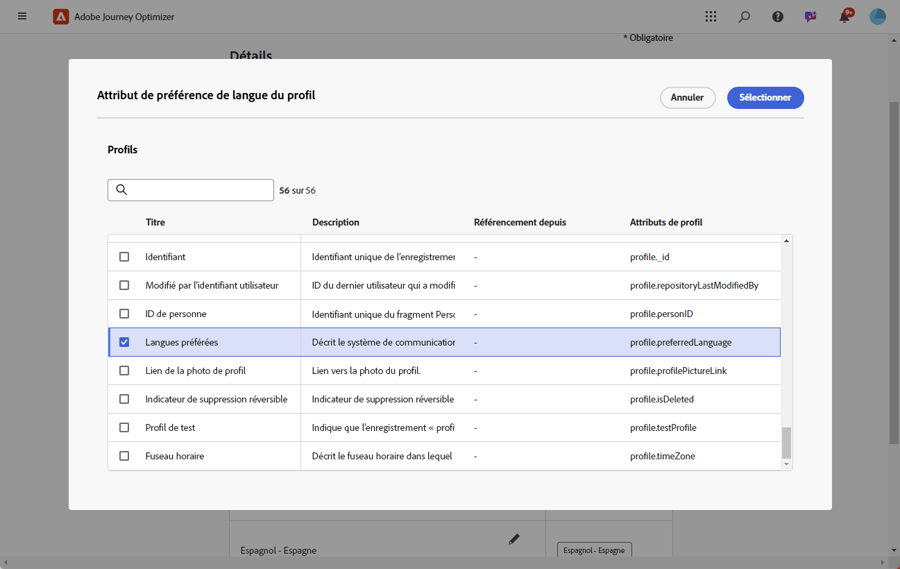
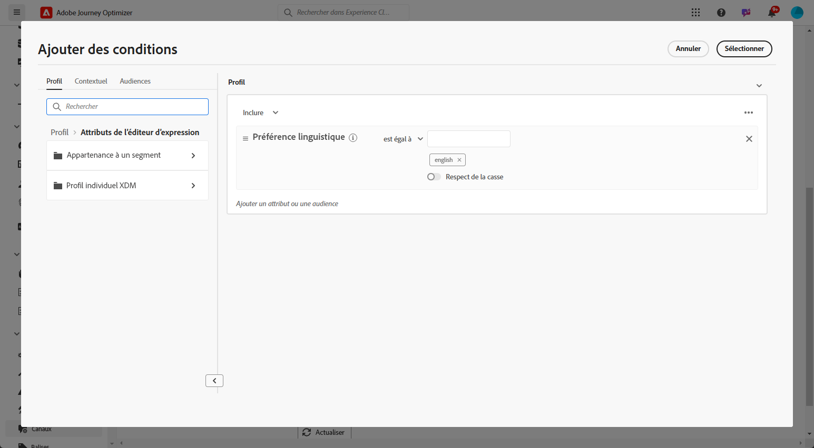
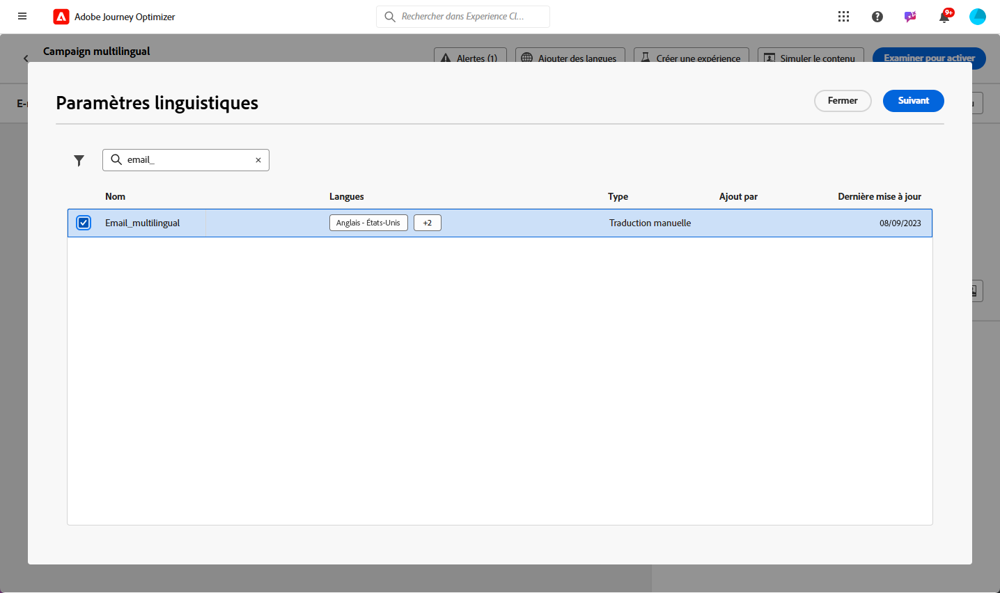
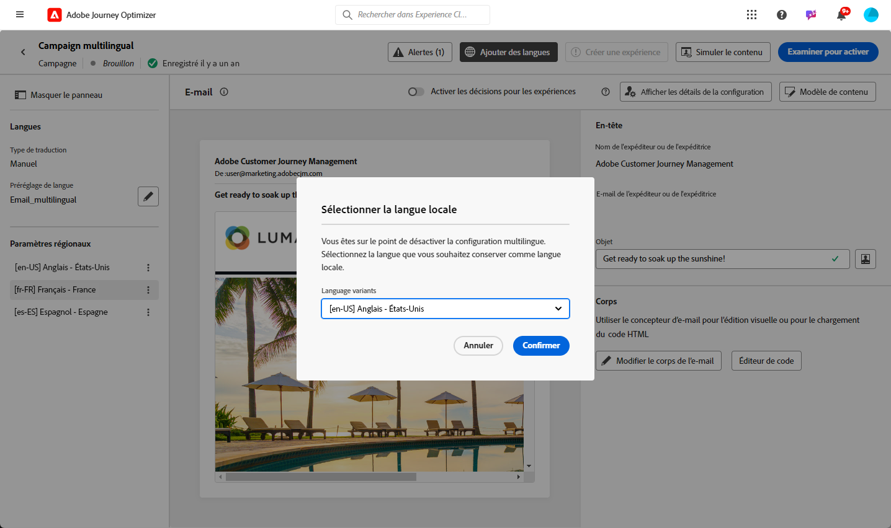

# Créer du contenu multilingue avec traduction manuelle {#multilingual-manual}

>[!IMPORTANT]
>
>Pour le flux manuel, les utilisateurs et les utilisatrices doivent obtenir l’autorisation **[!UICONTROL Gérer les paramètres de langue]**.

Grâce au flux manuel, vous pouvez traduire facilement votre contenu directement dans vos campagnes et vos parcours, ce qui vous permet de disposer d’options de contrôle et de personnalisation précises pour vos messages multilingues. De plus, vous pouvez facilement importer du contenu multilingue préexistant à l’aide de l’option Importer un HTML.

Pour créer du contenu multilingue à l’aide de la traduction manuelle, procédez comme suit :

1. [Ajouter votre fournisseur (facultatif)](multilingual-provider.md)

1. [Ajouter des paramètres régionaux (facultatif)](multilingual-locale.md)

1. [Créer des paramètres de langue](#language-settings)

1. [Créer un contenu multilingue](#create-multilingual-campaign)

## Créer des paramètres de langue {#language-settings}

Dans cette section, vous pouvez définir vos différents paramètres régionaux pour gérer votre contenu multilingue. Vous pouvez également choisir l’attribut que vous souhaitez utiliser pour rechercher des informations relatives à la langue du profil.

1. Dans le menu **[!UICONTROL Administration]**, accédez à **[!UICONTROL Canal]** > **[!UICONTROL Paramètres généraux]**.

1. Dans le menu **[!UICONTROL Paramètres de langue]**, cliquez sur **[!UICONTROL Créer des paramètre de langue]**.

   

1. Saisissez le nom de vos **[!UICONTROL Paramètres de langue]** et choisissez **[!UICONTROL Traduction manuelle]**.

1. Sélectionnez les **[!UICONTROL Paramètres régionaux]** associés à ces paramètres. Vous pouvez ajouter 50 paramètres régionaux au maximum.

   S’il manque des **[!UICONTROL paramètres régionaux]**, vous pouvez le créer manuellement au préalable à partir du menu **[!UICONTROL Traduction]** ou par API. Voir [Créer des paramètres régionaux](multilingual-locale.md).

   

1. Sélectionnez **[!UICONTROL Préférences de secours]** pour définir une option de sauvegarde au cas où un profil ne répondrait pas aux critères nécessaires pour la diffusion de contenu.

   Notez que si aucune option de secours n’est sélectionnée, l’envoi de la campagne ou du parcours ne sera pas effectué.

1. Choisissez votre préférence d’envoi parmi les options suivantes :

   * **[!UICONTROL Sélectionner les attributs de préférence de langue du profil]**
   * **[!UICONTROL Créer des règles conditionnelles personnalisées]**

1. Si vous sélectionnez **[!UICONTROL Sélectionner les attributs de préférence de langue de profil]**, choisissez l’attribut approprié dans le menu **[!UICONTROL Attributs de préférence de langue de profil]** pour rechercher les informations de langue d’un profil.

   

1. Si vous sélectionnez **[!UICONTROL Créer des règles conditionnelles personnalisées]**, sélectionnez les paramètres régionaux pour lesquels vous souhaitez créer des conditions. Créez ensuite des règles basées sur des facteurs tels que l’emplacement de l’utilisateur ou de l’utilisatrice, les préférences linguistiques ou d’autres éléments contextuels.

   

1. Commencez à créer des conditions en ajoutant un attribut, un événement ou une audience pour définir votre population cible.

   >[!IMPORTANT]
   >
   >Les données contextuelles sont disponibles exclusivement pour les canaux web, in-app, d’expérience basée sur du code et de cartes de contenu. Si celles-ci sont utilisées pour des canaux E-mail, SMS, Notification Push ou Courrier, sans attributs supplémentaires, l’envoi de la campagne ou du parcours sera effectué dans la langue de la première option de la liste.

   

   +++Conditions préalables pour utiliser des événements contextuels dans vos conditions

   Lorsque des utilisateurs et des utilisatrices affichent votre contenu, une demande de personnalisation est envoyée avec l’événement d’expérience. Pour exploiter les données contextuelles dans vos conditions, vous devez joindre des données supplémentaires au payload de la demande de personnalisation. Pour ce faire, vous devez créer une règle dans la collecte de données Adobe Experience Platform pour spécifier : IF (si) une demande de personnalisation est envoyée, THEN (alors) joindre des données supplémentaires à la demande, définissant ainsi l’attribut à associer au champ de langue de votre schéma.

   >[!NOTE]
   >
   >Ces conditions préalables sont requises uniquement pour les canaux Cartes de contenu et In-app.

   1. Dans la collecte de données Adobe Experience Platform, accédez au menu **[!UICONTROL Règles]** et créez une règle. Vous trouverez des informations détaillées sur la création de règles dans [!DNL Adobe Experience Platform] documentation [Collecte de données](https://experienceleague.adobe.com/fr/docs/experience-platform/collection/e2e#create-a-rule){target="_blank"}

   2. Dans la section **[!UICONTROL SI]** de la règle, ajoutez un événement configuré comme ci-dessous :

      

      * Sélectionnez l’**[!UICONTROL extension]** que vous utilisez.
      * Dans le champ **[!UICONTROL Type d’événement]**, sélectionnez « Événement de demande AEP ».
      * Dans le volet de droite, sélectionnez « Le type d’événement XDM est égal à personalization.request ».
      * Cliquez sur le bouton **[!UICONTROL Conserver les modifications]** pour confirmer.

   3. Dans la section **[!UICONTROL ALORS]** de la règle, ajoutez une action configurée comme ci-dessous :

      

      * Sélectionnez l’**[!UICONTROL extension]** que vous utilisez.
      * Dans le champ **[!UICONTROL Type d’action]**, sélectionnez « Joindre des données ».
      * Dans la section du payload JSON, assurez-vous que l’attribut utilisé pour récupérer la langue à utiliser (dans l’exemple ci-dessous « langue ») correspond au nom de l’attribut spécifié dans le schéma dans lequel votre train de données de collecte de données est en cours d’exécution.

        ```JSON
        {
            "xdm":{
                "application":{
                    "_dc":{
                        "language":"{%%Language%%}"
                    }
                }
            }
        }
        ```

      * Cliquez sur le bouton **[!UICONTROL Conserver les modifications]** pour confirmer et enregistrer votre règle.

   +++

1. Faites glisser les paramètres régionaux pour les réorganiser et gérer leur priorité dans la liste.

1. Pour supprimer des paramètres régionaux, cliquez sur l’icône de la corbeille.

   

1. Cliquez sur **[!UICONTROL Envoyer]** pour créer vos **[!UICONTROL paramètres de langue]**.

Notez qu’une fois vos préférences linguistiques configurées, vous n’aurez plus la possibilité de les modifier.

<!--
1. Access the **[!UICONTROL channel configurations]** menu and create a new channel configuration or select an existing one.


1. In the **[!UICONTROL Header parameters]** section, select the **[!UICONTROL Enable multilingual]** option.

1. Select your **[!UICONTROL Locales dictionary]** and add as many as needed.
-->

## Créer un contenu multilingue {#create-multilingual-campaign}

Après avoir configuré votre contenu multilingue, vous pouvez concevoir votre campagne ou votre parcours et personnaliser le contenu de chacun des paramètres régionaux sélectionnés.

1. Commencez par créer et configurer votre [parcours](../building-journeys/journey-action.md) ou [campagne](../campaigns/create-campaign.md) d’e-mails, de SMS ou de notifications push selon vos besoins.

   >[!IMPORTANT]
   >
   >Nous vous recommandons d’inclure un seul projet de traduction par parcours.

1. Créez ou importez votre contenu d’origine et personnalisez-le selon vos besoins.

1. Une fois votre contenu créé, cliquez sur **[!UICONTROL Enregistrer]** et revenez à l’écran de configuration de la campagne.

   

1. Cliquez sur **[!UICONTROL Ajouter des langues]** et sélectionnez les **[!UICONTROL paramètres de langue]** créés précédemment. [En savoir plus](#language-settings)

   

1. Choisissez les paramètres régionaux souhaités dans le menu déroulant à appliquer au contenu créé existant.

1. Accédez aux paramètres avancés du menu **[!UICONTROL Paramètres régionaux]** et sélectionnez **[!UICONTROL Copier vers tous les paramètres régionaux]**.

   

1. Maintenant que votre contenu principal est dupliqué dans l’ensemble des **[!UICONTROL paramètres régionaux]** sélectionnés, accédez à chaque paramètre régional et cliquez sur **[!UICONTROL Modifier le corps de l’e-mail]** pour traduire votre contenu.

   

1. Vous pouvez choisir de désactiver ou d’activer les paramètres régionaux avec le menu **[!UICONTROL Plus d’actions]** du paramètre régional sélectionné.

   

1. Pour désactiver la configuration multilingue, cliquez sur **[!UICONTROL Ajouter des langues]** et sélectionnez la langue que vous souhaitez conserver comme langue de paramètre régional.

   

1. Cliquez sur **[!UICONTROL Examiner pour activer]** pour afficher un résumé de la campagne.

   Le résumé vous permet de modifier votre campagne si nécessaire et de vérifier si un paramètre est incorrect ou manquant.

1. Parcourez votre contenu multilingue pour afficher le rendu dans chaque langue.

   

Vous pouvez maintenant activer votre campagne ou votre parcours. Après l’envoi, vous pouvez mesurer l’impact de votre parcours ou de votre campagne multilingue dans les rapports.

>[!IMPORTANT]
>
> Si votre campagne est soumise à une politique d’approbation, vous devrez effectuer une demande d’approbation afin de pouvoir envoyer votre campagne ou votre parcours multilingue. [En savoir plus](../test-approve/gs-approval.md)

<!--
# Create a multilingual journey {#create-multilingual-journey}

1. Create your journey with a Delivery and personalize your content as needed.
1. From your delivery action, click Edit content.
1. Click Add languages.

-->
