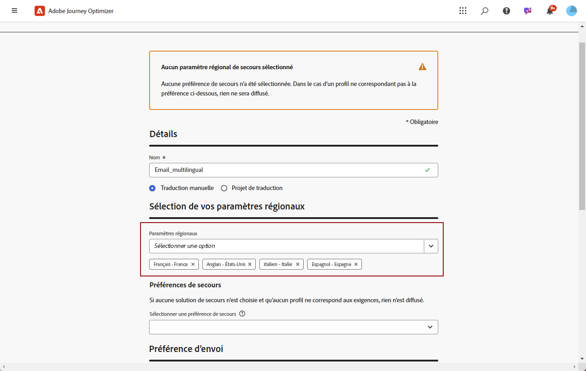
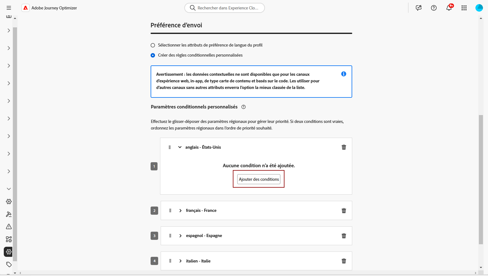
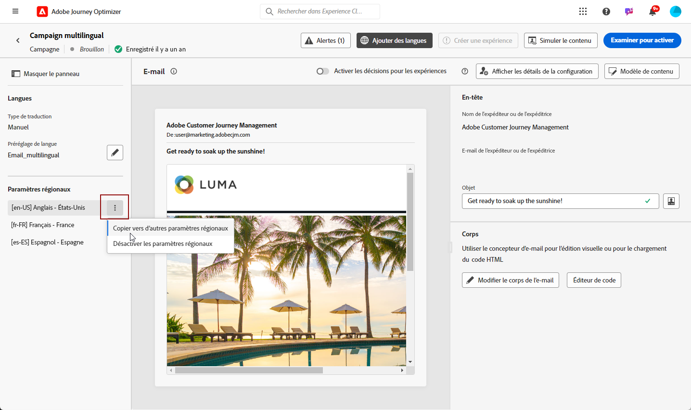

# Créer du contenu multilingue avec traduction manuelle {#multilingual-manual}

>[!BEGINSHADEBOX]

**Table des matières**

* [Prise en main du contenu multilingue](multilingual-gs.md)
* **[Créer du contenu multilingue avec traduction manuelle](multilingual-manual.md)**
* [Créer du contenu multilingue avec traduction automatisée](multilingual-automated.md)
* [Rapport de campagne multilingue](multilingual-report.md)

>[!ENDSHADEBOX]

Grâce au flux manuel, vous pouvez traduire facilement votre contenu directement dans votre campagne par email, notification push ou SMS, ce qui vous permet de disposer d’options de contrôle et de personnalisation précises pour vos messages multilingues. De plus, vous pouvez facilement importer du contenu multilingue préexistant à l’aide de l’option Importer un HTML .

Pour créer du contenu multilingue à l’aide de la traduction manuelle, procédez comme suit :

1. [Créer vos paramètres régionaux](#create-locale).

1. [Création de paramètres de langue](#create-language-settings).

1. [Créer une campagne multilingue](#create-a-multilingual-campaign).

## Créer un paramètre régional {#create-locale}

Lors de la configuration des paramètres de langue, comme décrit dans la section [Créer vos paramètres de langue](#language-settings) , si un paramètre régional spécifique n’est pas disponible pour votre contenu multilingue, vous avez la possibilité de créer autant de paramètres régionaux que nécessaire à l’aide de la fonction **[!UICONTROL Traduction]** .

1. Dans la **[!UICONTROL Administration]** menu, accès **[!UICONTROL Canal]**.

   Le menu Traductions permet d&#39;accéder à la liste des paramètres régionaux activés.

1. Dans la **[!UICONTROL Dictionnaire des paramètres régionaux]** , cliquez sur **[!UICONTROL Ajouter un paramètre régional]**.

   

1. Sélectionnez votre code de langue dans la **[!UICONTROL Langue]** et la liste associée **[!UICONTROL Région]**.

1. Cliquez sur **[!UICONTROL Enregistrer]** pour créer votre paramètre régional.

   

## Création de paramètres de langue {#language-settings}

Dans cette section, vous pouvez définir votre langue principale et les paramètres régionaux associés pour gérer votre contenu multilingue. Vous pouvez également choisir l’attribut que vous souhaitez utiliser pour rechercher des informations relatives à la langue du profil.

1. Dans la **[!UICONTROL Administration]** menu, accès **[!UICONTROL Canal]**.

1. Dans le **[!UICONTROL Paramètres de langue]** , cliquez sur **[!UICONTROL Création de paramètres de langue]**.

   

1. Saisissez le nom de votre **[!UICONTROL Paramètres de langue]**.

1. Sélectionnez la variable **[!UICONTROL Paramètres régionaux]** associés à ces paramètres. Vous pouvez ajouter un maximum de 50 paramètres régionaux.

   Si une **[!UICONTROL Paramètres régionaux]** est manquante, vous pouvez le créer manuellement au préalable à partir de la fonction **[!UICONTROL Traduction]** ou par API. Voir [Création d’un paramètre régional](#create-locale).

   

1. Dans la **[!UICONTROL Préférence d’envoi]** sélectionnez l’attribut à rechercher pour trouver des informations sur les langues de profil.

   

1. Cliquez sur **[!UICONTROL Modifier]** en regard de votre **[!UICONTROL Paramètres régionaux]** pour la personnaliser davantage et ajouter **[!UICONTROL Préférences de profil]**.

   

1. Sélectionner une autre **[!UICONTROL Paramètres régionaux]** dans la liste déroulante Préférences de profil , puis cliquez sur **[!UICONTROL Ajout de profils]**.

1. Accédez au menu avancé de votre **[!UICONTROL Paramètres régionaux]** pour définir votre **[!UICONTROL Paramètres régionaux du Principal]**, c’est-à-dire la langue par défaut si l’attribut de profil n’est pas spécifié.

   Vous pouvez également supprimer les paramètres régionaux de ce menu avancé.

   

1. Cliquez sur **[!UICONTROL Envoyer]** pour créer votre **[!UICONTROL Paramètres de langue]**.

<!--
1. Access the **[!UICONTROL Channel surfaces]** menu and create a new channel surface or select an existing one.

1. In the **[!UICONTROL Header parameters]** section, select the **[!UICONTROL Enable multilingual]** option.

1. Select your **[!UICONTROL Locales dictionary]** and add as many as needed.
-->

## Créer une campagne multilingue {#create-multilingual-campaign}

Après avoir configuré votre contenu multilingue, vous êtes prêt à concevoir votre campagne et à personnaliser le contenu pour chacun des paramètres régionaux sélectionnés.

1. Commencez par créer et configurer votre campagne Email, SMS ou Notification push selon vos besoins. [En savoir plus](../campaigns/create-campaign.md)

1. Accédez au **[!UICONTROL Actions]** et sélectionnez **[!UICONTROL Modifier le contenu]**.

   

1. Créez ou importez votre contenu d’origine et personnalisez-le selon vos besoins.

1. Une fois votre contenu principal créé, cliquez sur **[!UICONTROL Enregistrer]** et revenez à l&#39;écran de configuration de campaign.

   

1. Cliquez sur **[!UICONTROL Ajouter des langues]** et sélectionnez les **[!UICONTROL Paramètres de langue]**. [En savoir plus](#create-language-settings)

   

1. Accédez aux paramètres avancés de la fonction **[!UICONTROL Paramètres régionaux]** et sélectionnez **[!UICONTROL Copier principal vers tous les paramètres régionaux]**.

   

1. Maintenant que votre contenu principal est dupliqué dans l’ensemble de vos  **[!UICONTROL Paramètres régionaux]**, accédez à chaque paramètre régional et cliquez sur **[!UICONTROL Modifier le corps de l’email]** pour traduire votre contenu.

   

1. Vous pouvez choisir de désactiver ou d’activer les paramètres régionaux avec le paramètre **[!UICONTROL Plus d&#39;action]** du menu Paramètres régionaux sélectionné.

   

1. Pour désactiver la configuration multilingue, cliquez sur **[!UICONTROL Ajouter des langues]** et sélectionnez la langue que vous souhaitez conserver comme langue locale.

   

1. Cliquez sur **[!UICONTROL Réviser pour activer]** pour afficher un résumé de l&#39;opération.

   Le résumé vous permet de modifier votre campagne si nécessaire et de vérifier si un paramètre est incorrect ou manquant.

1. Parcourez votre contenu multilingue pour afficher le rendu dans chaque langue.

   

1. Vérifiez que votre campagne est correctement configurée, puis cliquez sur **[!UICONTROL Activer]**.

Votre campagne est maintenant activée. Le message paramétré dans la campagne est envoyé immédiatement ou à la date indiquée. Notez que dès que votre campagne est active, elle ne peut pas être modifiée. Pour réutiliser du contenu, vous pouvez dupliquer votre campagne.

Une fois envoyé, vous pouvez mesurer l’impact de vos campagnes dans les rapports de campagne.

<!--
# Create a multilingual journey {#create-multilingual-journey}

1. Create your journey with a Delivery and personalize your content as needed.
1. From your delivery action, click Edit content.
1. Click Add languages.

-->
