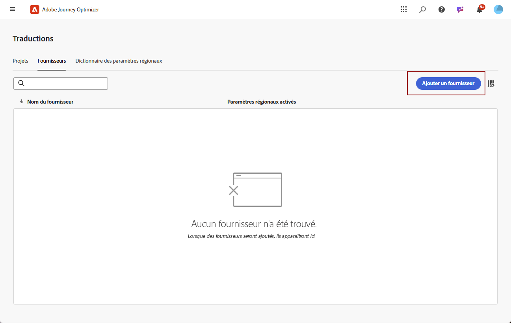
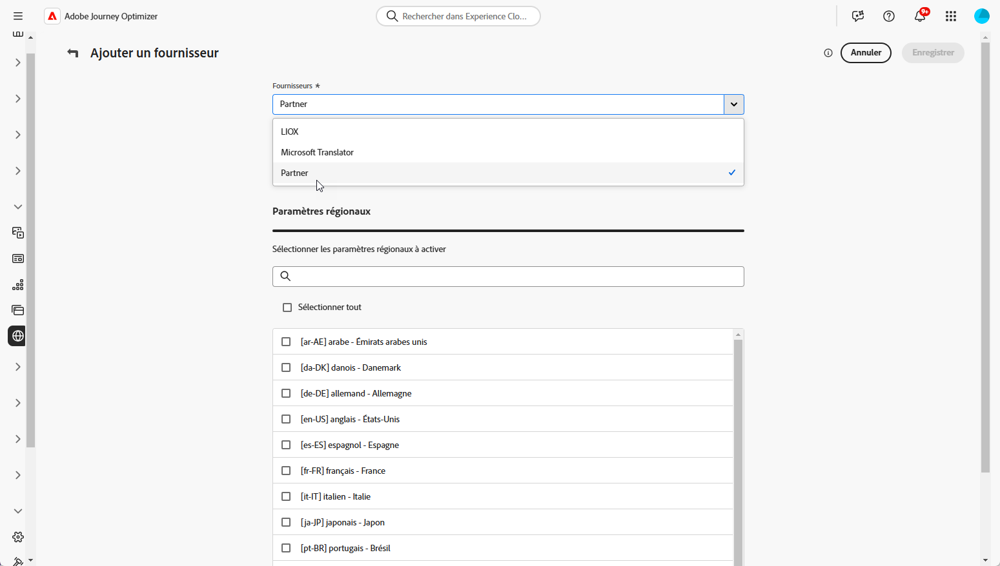
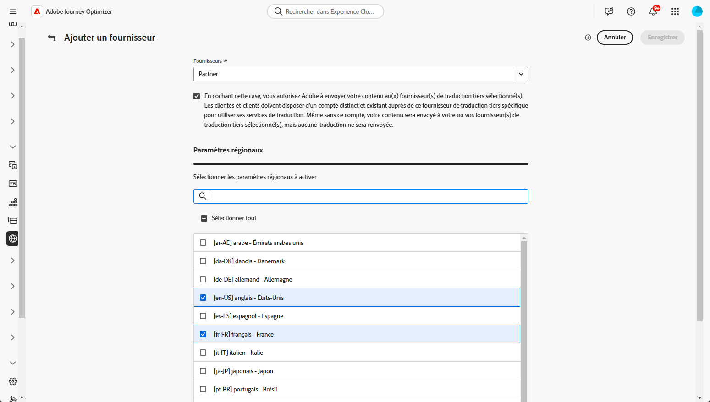

# Ajouter des fournisseurs de langue {#multilingual-provider}

>[!IMPORTANT]
>
> Votre utilisation des services de traduction d’un fournisseur de traduction sera soumise aux conditions générales supplémentaires de ce fournisseur. En tant que solutions tierces, les services de traduction sont disponibles pour les utilisateurs et utilisatrices d’Adobe Journey Optimizer via une intégration. Adobe ne contrôle pas les produits tiers et n’en n’est pas responsable.

Adobe Journey Optimizer s’intègre à des fournisseurs de traduction tiers qui offrent des services de traduction automatique et humaine, indépendamment d’Adobe Journey Optimizer.

Avant d’ajouter le fournisseur de traduction que vous avez choisi, assurez-vous de disposer d’un compte auprès du fournisseur correspondant.

1. Dans le menu **[!UICONTROL Gestion de contenu]**, accédez à **[!UICONTROL Traduction]**.

1. Sélectionnez l’onglet **[!UICONTROL Fournisseurs]** et cliquez sur **[!UICONTROL Ajouter un fournisseur]**.

   

1. Dans la liste déroulante **[!UICONTROL Fournisseurs]**, sélectionnez le fournisseur de votre choix.

   

1. Si vous utilisez Microsoft Translator comme fournisseur, saisissez votre **[!UICONTROL clé d’abonnement]** et votre **[!UICONTROL URL de point d’entrée]**.

   

1. Sélectionnez les **paramètres régionaux pris en charge** appropriés.

   

1. Une fois la configuration terminée, cliquez sur **[!UICONTROL Enregistrer]** pour finaliser la configuration.
