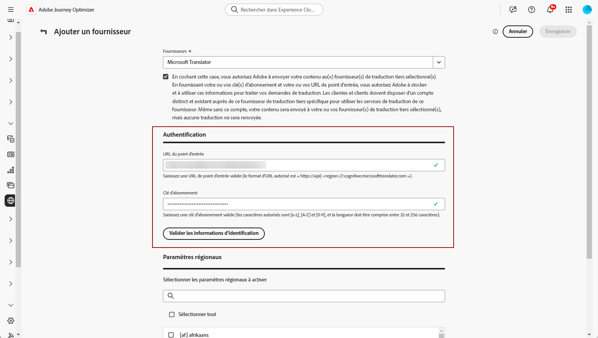

# Ajout de fournisseurs de langue {#multilingual-provider}

>[!IMPORTANT]
>
> Votre utilisation des services de traduction d’un fournisseur de traduction sera soumise aux conditions générales supplémentaires de ce fournisseur. En tant que solutions tierces, les services de traduction sont disponibles pour les utilisateurs de Adobe Journey Optimizer via une intégration. Adobe ne contrôle pas et n’est pas responsable des produits tiers.

Adobe Journey Optimizer s’intègre à des fournisseurs de traduction tiers qui offrent des services de traduction automatique et humaine, indépendamment de Adobe Journey Optimizer.

Avant d’ajouter le fournisseur de traduction choisi, veillez à créer un compte auprès du fournisseur correspondant.

1. Dans le menu **[!UICONTROL Gestion de contenu]**, accédez à **[!UICONTROL Traduction]**.

1. Accédez à l’onglet **[!UICONTROL Providers]** et cliquez sur **[!UICONTROL Ajouter un fournisseur]**.

   

1. Dans la liste déroulante **[!UICONTROL Providers]** , sélectionnez le fournisseur de votre choix.

   

1. Si vous utilisez Microsoft Translator comme fournisseur, saisissez votre **[!UICONTROL clé d’abonnement]** et **[!UICONTROL URL de point d’entrée]**.

   

1. Sélectionnez les **paramètres régionaux pris en charge** appropriés.

   

1. Une fois la configuration terminée, cliquez sur **[!UICONTROL Enregistrer]** pour finaliser la configuration.

