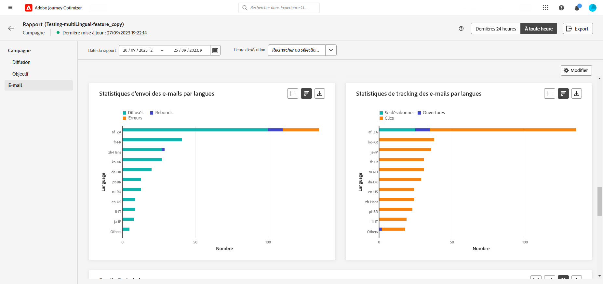

# Rapport de campagne multilingue {#multilingual-campaign-report}

Les rapports globaux, accessibles à partir de l’onglet **À toute heure**, affichent les événements qui se sont produits il y a au moins deux heures et couvrent les événements sur une période sélectionnée. Pour accéder directement au rapport global de campagne à partir de votre campagne, cliquez sur le bouton **[!UICONTROL Afficher le rapport]**.

Pour plus d’informations sur les données disponibles dans le rapport de campagne, reportez-vous à [cette page](../reports/campaign-global-report.md).

Le widget **[!UICONTROL Statistiques d’envoi d’e-mails par langue]** détaille le succès de votre diffusion en fonction de vos **[!UICONTROL paramètres régionaux]** :

* **[!UICONTROL Délivrés]** : nombre de messages envoyés avec succès, par rapport au nombre total de messages envoyés.

* **[!UICONTROL Rebonds]** : nombre total d’erreurs cumulées lors des diffusions et du traitement automatique des retours par rapport au nombre total de messages envoyés.

* **[!UICONTROL Erreurs]** : nombre total d’erreurs survenues au cours d&#39;une diffusion, l’empêchant d&#39;être envoyée à des profils.

Le widget **[!UICONTROL Statistiques de tracking des e-mails par langue]** contient les données disponibles de l’activité des personnes destinataires pour votre diffusion, selon vos **[!UICONTROL paramètres régionaux]** :

* **[!UICONTROL Désabonnements]** : nombre de clics sur le lien de désabonnement.

* **[!UICONTROL Ouvertures]** : nombre d’ouvertures du message.

* **[!UICONTROL Clics]** : nombre de clics sur un contenu.
