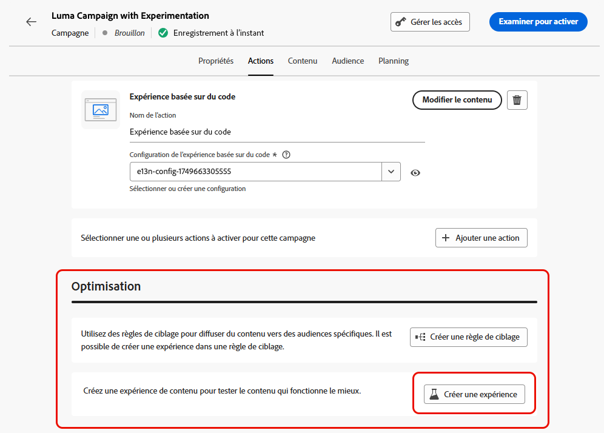
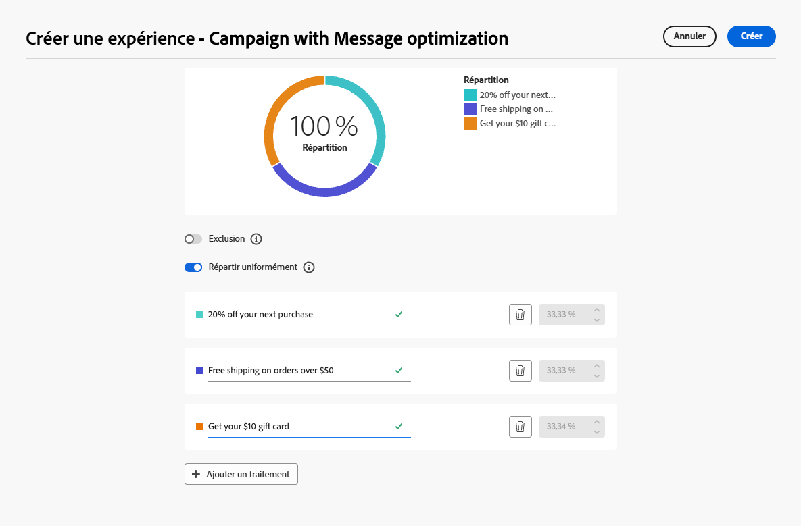

# Utiliser l’expérimentation {#experimentation}

>[!NOTE]
>
>Cette page présente un aperçu de l’utilisation de l’expérimentation dans le cadre de l’optimisation du contenu. Pour plus d’informations sur les expériences de contenu, y compris les options de configuration, les mesures et l’analyse, consultez la [documentation sur les expériences de contenu](../content-management/get-started-experiment.md).

L’expérimentation permet de tester plusieurs versions d’un contenu afin de déterminer celle qui offre les meilleures performances en fonction de mesures de succès prédéfinies.

Pour configurer l’expérimentation, suivez les étapes ci-dessous.

Supposons que vous vouliez tester les messages promotionnels suivants dans une campagne :

* **Traitement A** : « 20 % de réduction sur votre prochain achat »
* **Traitement B** : « Livraison gratuite sur les commandes de plus de 50 $ »
* **Traitement C** : « Obtenez votre carte-cadeau de 10 $ »

Pour configurer l’expérimentation et déterminer le message qui génère le plus d’achats, procédez comme suit.

1. Créez un [parcours](../building-journeys/journey-gs.md#jo-build) ou une [campagne](../campaigns/create-campaign.md).

   >[!NOTE]
   >
   >Si vous vous trouvez dans un parcours, ajoutez une activité **[!UICONTROL Action]**, choisissez une activité de canal et sélectionnez **[!UICONTROL Configurer l’action]**. [En savoir plus](../building-journeys/journey-action.md#add-action)

1. Dans l’onglet **[!UICONTROL Actions]**, sélectionnez au moins deux actions entrantes, par exemple [expérience basée sur du code](../code-based/get-started-code-based.md) et [in-app](../../rp_landing_pages/in-app-landing-page.md).

1. Dans la section **[!UICONTROL Optimisation]**, sélectionnez **[!UICONTROL Créer une expérience]**.

   {width=85%}

1. Concevez et configurez votre expérience de contenu selon vos besoins. [Voici comment procéder](../content-management/content-experiment.md)

   {width=85%}

   Une fois l’expérience définie, elle s’applique à toutes les actions insérées dans la campagne ou par le biais de l’activité **[!UICONTROL Action]** du parcours, ce qui signifie que les mêmes clients et clientes voient les mêmes offres sur l’ensemble des surfaces.

   >[!NOTE]
   >
   >Vous pouvez sélectionner d’autres actions : l’expérimentation s’applique à toutes les actions ajoutées à la campagne ou au parcours [Activité d’action](../building-journeys/journey-action.md).

1. [Activez](../campaigns/review-activate-campaign.md) votre parcours ou campagne.

Une fois la campagne ou le parcours actif, les utilisateurs et utilisatrices se voient attribuer aléatoirement les différentes variations de contenu. [!DNL Journey Optimizer] suit la variation qui génère le plus d’achats et fournit des informations exploitables.

Suivez le succès de votre campagne avec les rapports de [parcours](../reports/journey-global-report-cja.md) et de [campagne](../reports/campaign-global-report-cja-experimentation.md). <!--Link to Experimentation journey reportis missing-->

