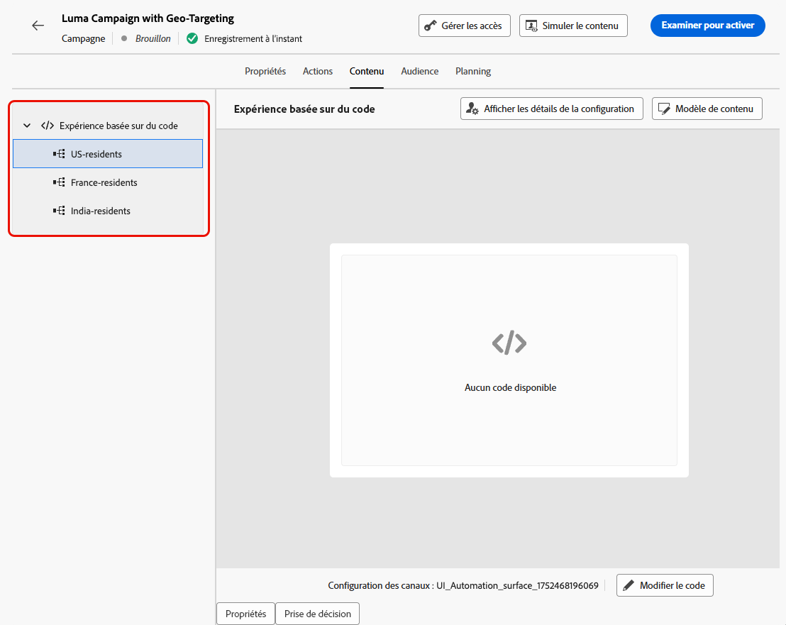

# Utiliser le ciblage {#targeting}

>[!CONTEXTUALHELP]
>id="ajo_content_targeting_fallback"
>title="Qu’est-ce que le contenu de secours ?"
>abstract="Le contenu de secours permet à votre audience de recevoir un contenu par défaut lorsqu’aucune règle de ciblage n’est applicable. Si cette option n’est pas sélectionnée, toute audience qui ne correspond pas à une règle de ciblage définie ci-dessus ne recevra aucun contenu."

Le ciblage diffuse du contenu personnalisé vers des segments d’audience spécifiques en fonction d’attributs de profil utilisateur ou utilisatrice, ou d’attributs contextuels.

Contrairement à l’expérimentation, qui correspond à une attribution aléatoire du contenu d’un message, le ciblage est déterministe en matière de diffusion du contenu à la bonne audience.

Avec le ciblage, des règles spécifiques peuvent être définies en fonction des éléments suivants :

* **Attributs du profil utilisateur**, tels que la localisation (par ex. le géociblage), l’âge ou les préférences. Par exemple, les utilisateurs ou utilisatrices aux États-Unis voient une promotion « Golden Gate », tandis que les utilisateurs ou utilisatrices en France voient une promotion « Tour Eiffel ».

* **Données contextuelles**, telles que le type d’appareil (par ex. ciblage de l’appareil), l’heure de la journée ou les détails de la session. Par exemple, les utilisateurs ou utilisatrices sur ordinateur reçoivent du contenu optimisé pour poste de travail, tandis que les utilisateurs ou utilisatrices sur mobile reçoivent du contenu optimisé pour mobile.

* **Audiences**, qui peuvent être utilisées pour inclure ou exclure des profils ayant une appartenance spécifique à une audience.

Pour configurer le ciblage, suivez les étapes ci-dessous.

1. Créez un [parcours](../building-journeys/journey-gs.md#jo-build) ou une [campagne](../campaigns/create-campaign.md).

   >[!NOTE]
   >
   >Si vous vous trouvez dans un parcours, ajoutez une activité **[!UICONTROL Action]**, choisissez une activité de canal et sélectionnez **[!UICONTROL Configurer l’action]**. [En savoir plus](../building-journeys/journey-action.md#add-action)

1. Dans l’onglet **[!UICONTROL Actions]**, sélectionnez au moins une action.

1. Dans la section **[!UICONTROL Optimisation]**, sélectionnez **[!UICONTROL Créer une règle de ciblage]**.

   {width=85%}

1. Cliquez sur **[!UICONTROL Créer une règle]** > **[!UICONTROL Créer]** et utilisez le créateur de règles pour définir directement vos critères.

   {width=100%}

   Par exemple, définissez une règle pour les personnes vivant aux États-Unis, une règle pour les personnes vivant en France et une règle pour les personnes vivant en Inde.

   {width=85%}

1. Vous pouvez également cliquer sur **[!UICONTROL Créer une règle]** > **[!UICONTROL Sélectionner une règle]** pour sélectionner une règle de ciblage existante créée à partir du menu **[!UICONTROL Règles]**. [En savoir plus](../experience-decisioning/rules.md)

   {width=70%}

   Dans ce cas, la formule qui constitue la règle est simplement copiée dans le parcours ou la campagne. Les modifications ultérieures apportées à cette règle à partir du menu **[!UICONTROL Règles]** n’auront aucune incidence sur la copie du parcours ou de la campagne.

   >[!AVAILABILITY]
   >
   >La fonction [Création de règles de ciblage](../experience-decisioning/rules.md#create) à partir du menu [!DNL Journey Optimizer] dédié est actuellement disponible pour les organisations qui ont acheté le module complémentaire Decisioning. Elle est disponible à la demande pour les autres organisations (disponibilité limitée).
   >
   >Cette fonctionnalité sera progressivement déployée pour l’ensemble de la clientèle. En attendant, contactez votre représentant ou votre représentante Adobe pour obtenir l’accès.

1. Après avoir ajouté une règle, vous pouvez toujours la modifier. Choisissez **[!UICONTROL Modifier directement]** pour effectuer la mise à jour directement à l’aide du créateur de règles, ou **[!UICONTROL Sélectionner une règle]** pour sélectionner une autre règle.

   {width=100%}

   >[!NOTE]
   >
   >La modification directe d’une règle n’a aucune incidence sur la règle d’où elle provient.

1. Sélectionnez l’option **[!UICONTROL Activer le contenu de secours]** si nécessaire. Le contenu de secours permet à l’audience de recevoir un contenu par défaut lorsqu’aucune règle de ciblage n’est applicable.

   >[!NOTE]
   >
   >Si cette option n’est pas sélectionnée, toute audience qui ne correspond pas à une règle de ciblage définie ci-dessus ne recevra aucun contenu.

1. Enregistrez les paramètres de votre règle de ciblage.

1. De retour dans l’onglet **[!UICONTROL Actions]**, sélectionnez **[!UICONTROL Modifier le contenu]**.

1. Concevoir un contenu adapté pour chaque groupe défini par les paramètres de règle de ciblage

   {width=85%}

   Dans cet exemple, concevez un contenu spécifique pour les personnes vivant aux États-Unis, un contenu différent pour les personnes vivant en France et encore un autre pour les personnes vivant en Inde.

1. [Activez](../campaigns/review-activate-campaign.md) votre parcours ou campagne.

Une fois la campagne ou le parcours actif, le contenu adapté à chaque cible est envoyé : les personnes vivant aux États-Unis reçoivent un message spécifique, les personnes vivant en France un message différent, et ainsi de suite.

<!--Default content:

* If no targeting rules match, default content can be delivered.

* If default content is not enabled, passthrough behavior ensures lower-priority campaigns are evaluated.-->

