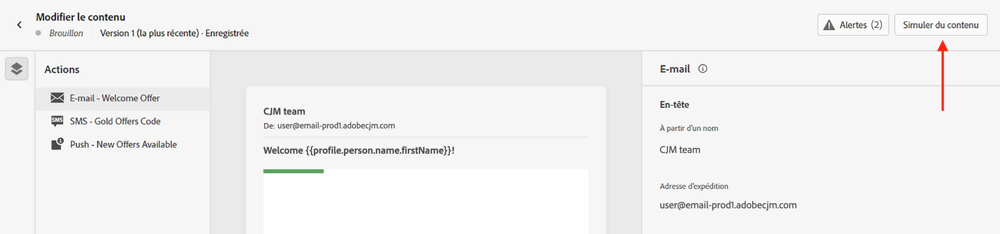

# Prévisualiser et tester votre contenu {#preview-test}

>[!CONTEXTUALHELP]
>id="ac_preview_testprofiles"
>title="Vérifier le rendu de votre contenu"
>abstract="Une fois votre contenu défini, vous pouvez utiliser des profils de test pour le prévisualiser et vérifier si le rendu est correct en fonction du canal que vous utilisez."

>[!CONTEXTUALHELP]
>id="ajo_preview_simulate"
>title="Vérifier le rendu de votre contenu"
>abstract="Une fois votre contenu défini, vous pouvez le prévisualiser et vérifier si le rendu est correct en fonction du canal que vous utilisez."

Une fois votre contenu défini, vous pouvez le prévisualiser avant d’envoyer le message. Il s’agit d’une étape cruciale pour vous assurer qu’il est exact, mais également exempt d’erreurs au niveau du contenu et des paramètres de personnalisation.

Vous pouvez également envoyer des diffusions test de vos e-mails à des destinataires ou des abonnés et abonnées spécifiques à des fins de test et de validation, et vérifier leur rendu dans les clients de bureau, mobiles et web les plus courants. Vous pouvez également évaluer les aspects généraux de la qualité du contenu, tels que la lisibilité et l’efficacité. [En savoir plus sur la validation de la qualité du contenu](brands-score.md#validate-quality)

Toutes ces actions peuvent être effectuées à l’aide du bouton **[!UICONTROL Simuler du contenu]** accessible à partir de l’écran d’édition du contenu de votre message ou à partir des concepteurs d’e-mail et web pour les canaux e-mail et web.

## Test à l’aide de données de profils de test ou de données d’exemples d’entrée {#methods}

Journey Optimizer propose deux expériences pour tester votre contenu :

* **Test du contenu à l’aide des données de profil de test**

  Vous pouvez utiliser des profils de test pour prévisualiser votre contenu, envoyer des BAT par e-mail et vérifier le rendu des e-mails. Si vous avez ajouté des champs personnalisés, vous pouvez vérifier leur affichage à l’aide des données de profil de test. Pour plus d’informations, consultez les sections suivantes :

  ➡️ [Sélectionner des profils de test](test-profiles.md)
➡️ [Aperçu à l’aide de profils de test](preview.md)
➡️ [Envoi de BAT par e-mail](proofs.md)
➡️ [Vérifier le rendu des e-mails](rendering.md)
➡️ [Prévisualiser et corriger votre e-mail (vidéo)](#video-preview)

* **Test des variations de contenu à l’aide de données d’entrée d’exemple**

  [!DNL Journey optimizer] vous permet de prévisualiser et d’envoyer des BAT pour différentes variations de votre contenu à l’aide d’exemples de données d’entrée chargées à partir d’un fichier CSV/JSON ou ajoutées manuellement.

  Tous les attributs de profil utilisés dans votre contenu pour la personnalisation sont automatiquement détectés par le système et peuvent être utilisés pour vos tests afin de créer plusieurs variantes.

  ➡️ [Simuler les variations de contenu](../test-approve/simulate-sample-input.md)

## À lire absolument

* **Autorisations requises** : vous devez disposer de l’autorisation **[!DNL Manage Simulate Content]** incluse dans le profil de produit **[!DNL Content Library Manager]**. [En savoir plus](../administration/ootb-product-profiles.md#content-library-manager).

  Pour envoyer des BAT, il est nécessaire de disposer des autorisations **Approuver et publier** pour la ressource (campagne ou parcours) spécifique associée à l’e-mail. En outre, pour envoyer des BAT dans un parcours, l’autorisation **Publier le parcours** est également requise. [En savoir plus sur les autorisations](../administration/ootb-permissions.md).

* **Personnalisation grâce aux données contextuelles** : lors de la prévisualisation d’un message ou de l’envoi de BAT, seules les données de personnalisation de profil s’affichent. La personnalisation basée sur les données contextuelles, telles que les informations d’événement, ne peut être testée que dans le contexte d’un parcours. En savoir plus sur [ce cas d’utilisation](../personalization/personalization-use-case.md).

* **Prévisualiser le contenu avec plusieurs variantes conditionnelles** : lors de la simulation ou du rendu de BAT pour les e-mails contenant plusieurs variantes conditionnelles, Journey Optimizer peut nécessiter davantage de temps de traitement. Si vous rencontrez des délais d’expiration ou des messages d’erreur, pensez à réduire le nombre total de variantes ou à simplifier les règles conditionnelles. En savoir plus sur le contenu conditionnel sur [cette page](../personalization/dynamic-content.md).

## Vidéo pratique {#video-preview}

Découvrez comment utiliser des profils de test pour tester le rendu des e-mails dans différentes boîtes de réception, prévisualiser vos e-mails personnalisés avec des profils de test et envoyer des BAT.

>[!VIDEO](https://video.tv.adobe.com/v/3430344?captions=fre_fr&quality=12)
