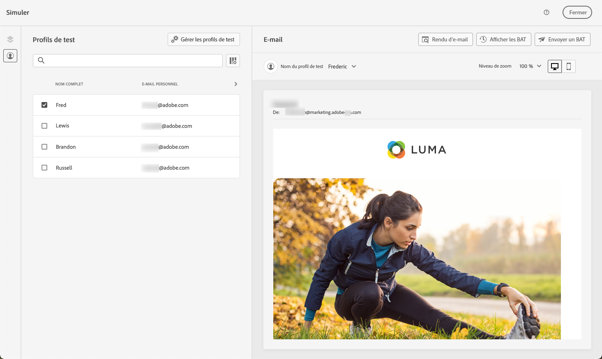
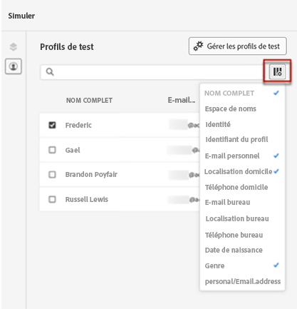
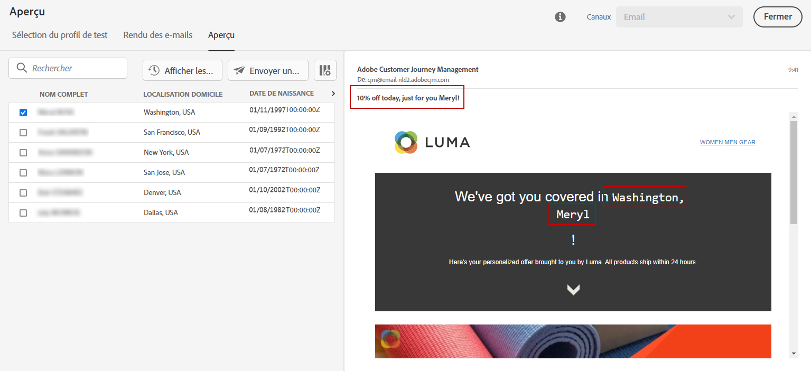

# Prévisualiser votre contenu à l’aide de profils de test {#preview}

Une fois les [profils de test](test-profiles.md) sélectionnés, vous pouvez prévisualiser votre contenu à l’aide de leurs données. Procédez comme suit :

1. Dans l’écran de modification du contenu de votre message ou dans le Concepteur d’e-mail, cliquez sur le bouton **[!UICONTROL Simuler le contenu]** et sélectionnez **[!UICONTROL Simuler le contenu]**.

1. Sélectionnez un profil de test. Vous pouvez vérifier les valeurs disponibles dans les colonnes. Utilisez les flèches droite/gauche pour parcourir les données.

   

   >[!NOTE]
   >
   >Pour ajouter d’autres profils de test, sélectionnez **[!UICONTROL Gérer les profils de test]**. [En savoir plus](test-profiles.md)

1. Cliquez sur l&#39;icône **[!UICONTROL Sélectionner les données]** au-dessus de la liste pour ajouter ou supprimer des colonnes.

   Vous pouvez voir les champs de personnalisation spécifiques au message actuel à la fin de la liste. Dans cet exemple, la ville, le prénom et le nom de famille du profil. Sélectionnez ces champs et assurez-vous que ces valeurs sont renseignées dans vos profils de test.

   

1. Dans la prévisualisation du message, les éléments personnalisés sont remplacés par les données de profil de test sélectionnées. Par exemple, pour ce message, le contenu de l&#39;e-mail et l&#39;objet de l&#39;e-mail sont personnalisés :

   

1. Sélectionnez d’autres profils de test pour prévisualiser votre e-mail pour chaque variante de votre message.

   >[!NOTE]
   >
   >Si les détails de configuration contiennent une erreur, cliquez sur le bouton **[!UICONTROL Afficher les détails de configuration]**. [En savoir plus](../email/surface-personalization.md#check-configuration)

Lors de la création d’expériences basées sur du code, vous pouvez prévisualiser votre contenu personnalisé directement dans votre navigateur ou sur vos appareils mobiles pour une simulation réelle. [En savoir plus](../code-based/test-code-based.md#preview-on-device)

>[!NOTE]
>
>[!DNL Journey optimizer] vous permet également de tester différentes variantes de votre contenu en le prévisualisant et en envoyant des BAT à l’aide d’exemples de données d’entrée chargés à partir d’un fichier CSV/JSON ou ajoutés manuellement. [Découvrez comment simuler des variations de contenu.](../test-approve/simulate-sample-input.md)
