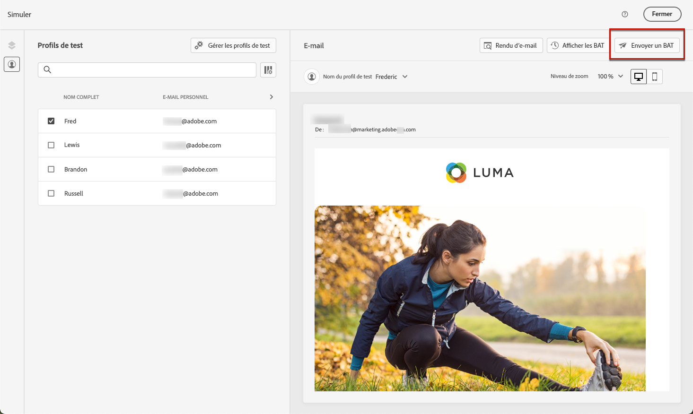
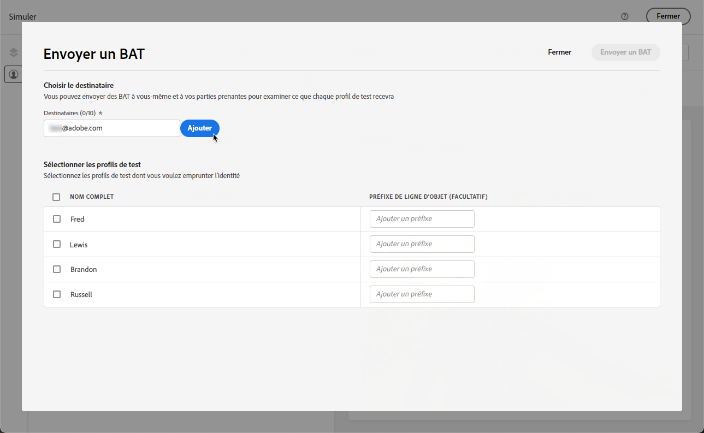
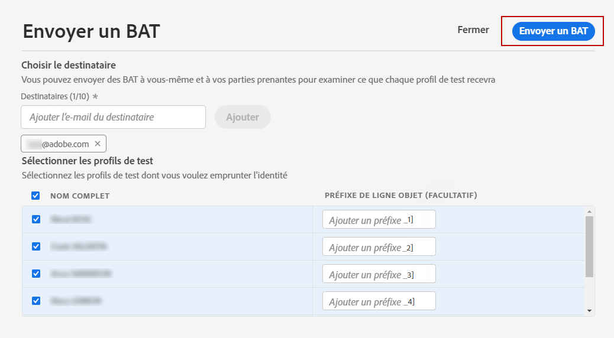
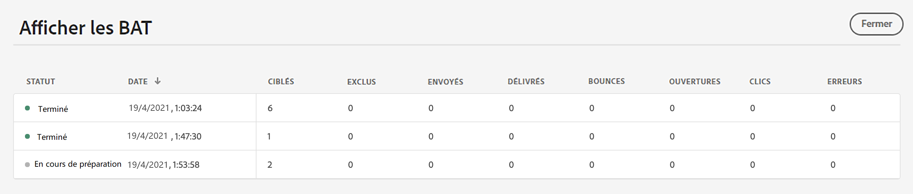

# Envoi de BAT à l’aide des données de profil de test {#send-proofs}

Un BAT est un message spécifique qui permet de tester un message avant son envoi à l&#39;audience principale. Les destinataires du BAT sont chargés d&#39;approuver le message : rendu, contenu, paramètres de personnalisation, configuration.

>[!NOTE]
>
>[!DNL Journey optimizer] vous permet également de tester différentes variantes de votre contenu en le prévisualisant et en envoyant des BAT à l’aide d’exemples de données d’entrée chargées à partir d’un fichier CSV/JSON ou ajoutées manuellement. [Découvrez comment simuler des variations de contenu](../test-approve/simulate-sample-input.md)

Pour envoyer des BAT par e-mail à l’aide des données de profil de test, vous devez d’abord sélectionner [profils de test](test-profiles.md). Suivez ensuite les étapes suivantes :

1. Dans l’écran **[!UICONTROL Simuler]**, cliquez sur le bouton **[!UICONTROL Envoyer le BAT]**.

   

1. Dans la fenêtre **[!UICONTROL Envoyer un BAT]**, saisissez l’e-mail du destinataire et cliquez sur **[!UICONTROL Ajouter]** pour envoyer le BAT à vous-même ou aux membres de votre organisation.

   Vous pouvez ajouter jusqu’à dix destinataires pour la diffusion de votre BAT.

   

1. Sélectionnez les **profils de test** à utiliser pour personnaliser le contenu du message.

   Chaque destinataire du BAT recevra autant de messages que le nombre de profils de test sélectionnés. Par exemple, si vous avez ajouté cinq e-mails de destinataires et sélectionné dix profils de test, vous enverrez alors cinquante messages de BAT et chaque destinataire en recevra dix.

1. Si nécessaire, vous pouvez ajouter un préfixe à l&#39;objet du BAT. Seuls les caractères alphanumériques et les caractères spéciaux, comme . - _ ( ) [ Les ] sont autorisées comme préfixe à l’objet.

1. Cliquez sur **[!UICONTROL Envoyer un BAT]**.

   

1. De retour dans l’écran **[!UICONTROL Simuler]**, cliquez sur le bouton **[!UICONTROL Afficher les BAT]** pour vérifier le statut.

   

Il est recommandé d’envoyer des BAT après chaque modification du contenu du message.

>[!NOTE]
>
>Dans le BAT envoyé, le lien vers la page miroir n’est pas actif. Il n’est activé que dans les messages finaux.
