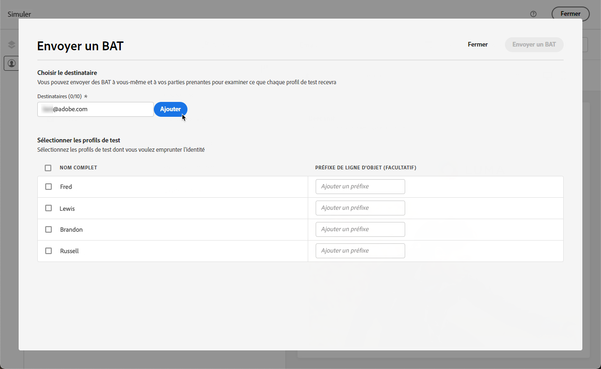
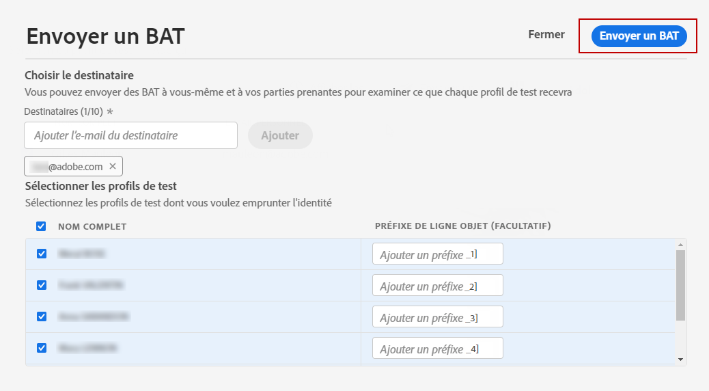
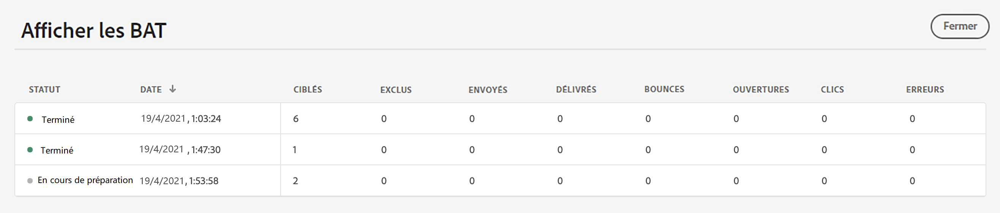

# Envoyer des BAT en utilisant des données de profil de test {#send-proofs}

>[!BEGINSHADEBOX]

**Sur cette page :** découvrez comment envoyer des BAT par e-mail à l’aide des données de profil de test afin que les destinataires puissent consulter le rendu, le contenu et la personnalisation avant que le message ne soit envoyé à votre audience principale.

>[!ENDSHADEBOX]

Un BAT est un message spécifique qui permet de tester un message avant son envoi à l&#39;audience principale. Les destinataires du BAT sont chargés d&#39;approuver le message : rendu, contenu, paramètres de personnalisation, configuration.

Vous pouvez envoyer des BAT à l’aide de l’une des méthodes de simulation :

* Cliquez sur **[!UICONTROL Simuler du contenu]** puis sélectionnez **[!UICONTROL Simuler du contenu (profils AEP)]** dans la liste déroulante pour envoyer des BAT avec des profils de test.
* Cliquez sur **[!UICONTROL Simuler du contenu]** pour envoyer des BAT pour les variations de contenu créées avec des exemples de données d’entrée ou la génération automatique d’IA. [Découvrez comment simuler des variations de contenu.](../test-approve/simulate-sample-input.md#proofs)

## À lire impérativement {#must-read}

**Règles de capping de la fréquence** : toutes les règles de capping de la fréquence existantes s’appliquent aux BAT. Si vous avez défini des [règles de capping de la fréquence](../conflict-prioritization/channel-capping.md) (par exemple, le nombre maximal d’envois par profil), ces limites s’appliquent également lors de l’envoi de BAT. Si un profil de test a déjà atteint la limite de capping de la fréquence, les BAT s’affichent comme terminés, mais aucun e-mail ne sera diffusé. Pour des tests répétés, pensez à utiliser des profils de test uniques ou à ajuster les capping de la fréquence pour les scénarios de relecture, si nécessaire.

**Page miroir** : dans le BAT envoyé, le lien vers la page miroir est inactif. Il n’est activé que dans les messages finaux.

**Ressources** : les ressources et les images ont des règles d’accessibilité spécifiques :

* Les ressources et les images sont accessibles dans le contenu diffusé ou le contenu du BAT pendant un maximum de 2 ans (730 jours) depuis leur première publication dans un fragment ou un message intégré.
* Une nouvelle publication est nécessaire après cette période d’expiration (à tout moment après 730 jours) pour prolonger leur accessibilité pendant 2 ans supplémentaires.
* Toute nouvelle publication effectuée dans les 730 jours suivant la première publication ne prolongera pas la validité des ressources/images aux 730 jours suivants.

## Envoyer des BAT {#send-proofs-steps}

Pour envoyer des BAT d’e-mail en utilisant des données de profil de test, vous devez d’abord sélectionner des [profils de test](test-profiles.md). Suivez ensuite les étapes suivantes :

1. Dans l’écran **[!UICONTROL Simuler]**, cliquez sur le bouton **[!UICONTROL Envoyer un BAT]**.

   

1. Dans la fenêtre **[!UICONTROL Envoyer un BAT]**, saisissez l’e-mail du ou de la destinataire et cliquez sur **[!UICONTROL Ajouter]** pour envoyer le BAT à vous-même ou aux membres de votre organisation.

   Vous pouvez ajouter jusqu’à dix destinataires pour la diffusion de votre BAT.

   

1. Sélectionnez les **profils de test** à utiliser pour personnaliser le contenu du message.

   Chaque destinataire du BAT recevra autant de messages que le nombre de profils de test sélectionnés. Par exemple, si vous avez ajouté cinq e-mails de destinataires et sélectionné dix profils de test, vous enverrez cinquante messages de BAT. Chaque destinataire en recevra dix.

1. Si nécessaire, vous pouvez ajouter un préfixe à l&#39;objet du BAT. Seuls les caractères alphanumériques et les caractères spéciaux, tels que . - _ ( ) [ Les ] sont autorisées comme préfixe à l’objet.

1. Cliquez sur **[!UICONTROL Envoyer un BAT]**.

   

1. De retour dans l’écran **[!UICONTROL Simuler]**, cliquez sur le bouton **[!UICONTROL Afficher les BAT]** pour vérifier le statut.

   

Il est recommandé d’envoyer des BAT après chaque modification du contenu du message.
