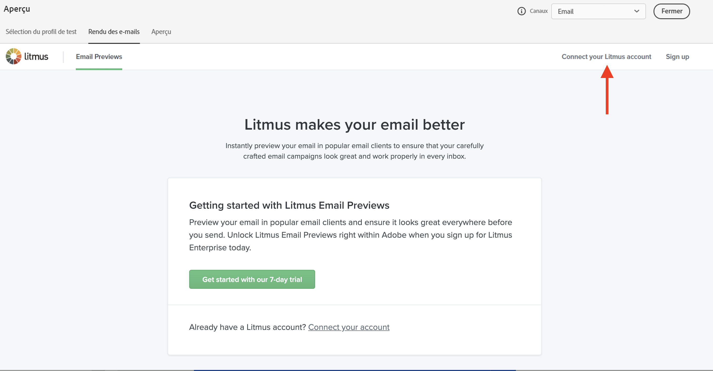

# Tester le rendu des e-mails {#email-rendering}

Vous pouvez exploiter votre compte **Litmus** dans [!DNL Journey Optimizer] pour prévisualiser instantanément votre **rendu d&#39;e-mail** dans les clients de messagerie populaires. Vous pouvez ensuite vous assurer que le contenu de votre e-mail s&#39;affiche correctement et fonctionne correctement dans chaque boîte de réception.

Pour vérifier le rendu des emails, procédez comme suit :

1. Dans l&#39;écran d&#39;édition du contenu de votre message ou dans le Concepteur d&#39;email, cliquez sur le bouton **[!UICONTROL Simulation du contenu]** bouton .

1. Sélectionnez le bouton **[!UICONTROL Rendu d’e-mail]**.

   

1. Cliquez sur **Connecter votre compte Litmus** dans la section supérieure droite.

   

1. Saisissez vos informations d&#39;identification et connectez-vous.

   

1. Cliquez sur le bouton **Exécuter le test** pour générer des prévisualisations d&#39;e-mail.

1. Vérifiez le contenu de vos e-mails sur les clients courants de bureau, mobiles et Web.

   

>[!CAUTION]
>
>Lorsque vous connectez votre compte **Litmus** à [!DNL Journey Optimizer], vous acceptez que les messages de test soient envoyés à Litmus : une fois envoyés, ces e-mail ne sont plus gérés par Adobe. En conséquence, la politique e-mail de rétention des données de Litmus s&#39;applique à ces e-mails, y compris les données de personnalisation qui peuvent être incluses dans ces messages de test.
